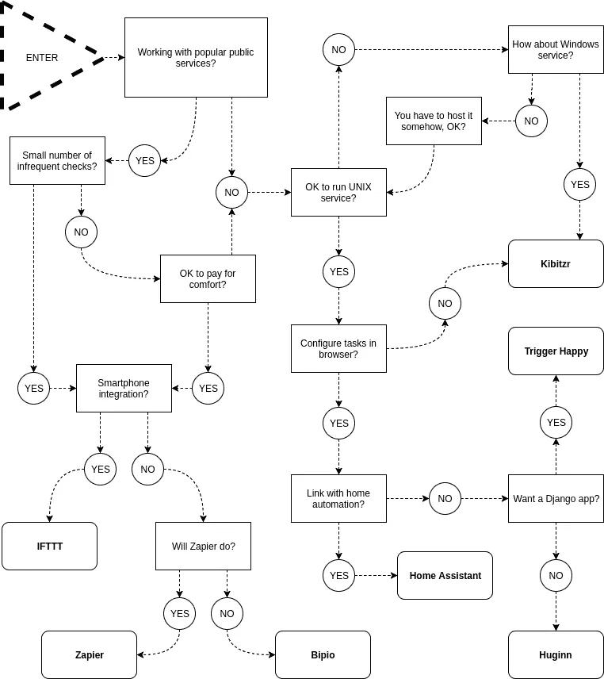

# 网络自动化指南

> 原文：<https://medium.com/hackernoon/guide-to-web-automation-889557804453>

# 介绍

本指南涵盖了现有的 web 自动化产品。它面向那些开始自动化或者想从一堆 shell 脚本转换到一个更坚实的基础的人。

Web automation 用软件代替人来完成重复性和繁琐的任务，例如:

*   表格填写
*   屏幕抓取
*   应用程序之间的数据提取和传输
*   网站测试
*   定期报告生成

小型企业和大型企业都受益于 web 自动化解决方案。这里有几个公司做的例子。

当客户关系管理系统注册新客户时，在票证跟踪系统中创建一个新队列。对于客户在 CRM 中请求的每项服务，在适当的队列中创建一个新的票据。Web automation 结合了两种专注的产品来提供完整的客户满意工作流程。

再比如。Typeform 为复杂的表单提交提供了一个令人惊叹的界面。但是不能处理收集的数据。WebMerge 填充 Excel 电子表格并运行计算。但是对于没有准备好顾客来说具有威慑性的外观。Web automation 将数据从 Typeform 连接到 WebMerge 电子表格。结果—即时项目成本估算。

web 自动化的个人应用包括:

*   在预定时间通知天气情况
*   社交网络更新汇总摘要
*   业余项目中的部署自动化
*   密切关注在线资源
*   构建复杂的提醒

长期以来，系统管理员在 bash 中编写简单的 web 自动化脚本。例如，crontab 作业:

*   运行`curl`
*   用 grep 过滤它的输出
*   并在匹配(或不匹配)的情况下发送电子邮件。

这是一个简单的场景，但即使这样也有一些问题:

*   意外的 HTTP 错误在报告中的格式很差甚至没有。
*   复杂的 grep 表达式是不可维护的。
*   从 bash 发送电子邮件是不可靠的，并且需要系统设置。

如果您希望通过即时消息或短信获得通知，该怎么办？将所有东西都放在一个 bash 脚本中会给你留下一个杂乱的工具。

许多解决方案试图通过提供以下功能来消除 web 自动化任务中的样板文件:

*   提出网络请求并将其连接到操作的基础。
*   建立在基础之上的解决常见问题的方法集。

web 自动化的很大一部分是浏览器自动化。它的目的是模仿人们如何使用网络浏览器来自动化重复的场景。由于这通常发生在试图成为人类的计算机身上，这个过程变得复杂而脆弱。这种复杂性是以下任务固有属性的结果:

*   浏览器交互是基于 HTML 标记的，很少考虑到这一点。
*   HTML 结构僵化，经常变化。
*   浏览器通过网络通信，继承了它所有的失败和不可靠性。

但有时这是从远程系统提取内容的唯一选择。许多付费解决方案以及免费图书馆都试图简化网络搜集。

# 制品

2011 年[扎皮尔](https://zapier.com/)在[创业周末](http://startupweekend.org/)推出。这是同类解决方案中的第一个。两年后，出现了一些开源替代方案:

*   [Huginn](https://github.com/huginn/huginn) —用 Ruby 写的多租户网站。
*   类似的解决方案，被写成一个可重用的 Django 应用程序。但是食谱要少得多。

其他服务以不同的目标将 web 自动化实现为服务:

*   [如果这个那么那个](https://ifttt.com/) —针对物联网和移动设备。
*   [Bip.io](https://github.com/bipio-server/bipio) —开源和付费托管解决方案。

专案那头不跟着 SaaS 道:

*   [家庭助手](https://home-assistant.io/) —具有网络自动化功能的家庭自动化平台。
*   [Kibitzr](https://kibitzr.github.io/) —可通过 Python 和 Bash 脚本扩展的命令行实用程序。

试图实现浏览器自动化的项目:

*   [Import.io](https://import.io/) 把网站变成结构化的 API。
*   Portia 不需要任何编程知识就能抓取网站。
*   [和服](https://www.kimonolabs.com/) —人工网页数据抽取工具。

用于解析和抓取网站的开源库:

*   [Selenium](https://selenium-python.readthedocs.io/) —浏览器自动化的最先进的库。它支持大多数流行的平台和浏览器。它的主要用例是 web 应用程序测试。配置繁琐，准入门槛高。
*   [BeautifulSoup](https://www.crummy.com/software/BeautifulSoup/) 解析格式错误的 HTML。
*   [Scrapy](https://scrapy.org/) —快速强大的抓取和网页抓取框架。

# 扎皮尔

Zapier 是最受欢迎的网络自动化应用。扎皮尔经营 Zaps。Zap 是你想要反复做的任务的蓝图。换句话说，一个 Zap 看起来是这样的:“当我在 A 中得到一个新东西时，在 b 中做这个另一个东西”第一部分是触发器，第二部分是动作。

Zapier 支持数百个应用程序。您可以混合搭配触发器和动作来实现任何事情的自动化。

例如，“当我从 Wufoo 表单中获得一个新条目时，在 Salesforce 中创建新的销售线索。”Zapier 因粒度而繁荣。用户可以从触发器服务中选择哪些字段应该转到操作服务。例如，Wufoo 表单中的电话号码应该是新的 Salesforce 销售线索的工作电话。

# 胡金

[休金](https://github.com/huginn/huginn)是扎皮尔最接近的免费替代品。这是一个多租户系统，用于构建执行自动化在线任务的代理。

Huginn 始于 2013 年。它建立了一个拥有数百名贡献者的广泛社区。

Huginn 组织了在不同类型的代理之间传递的事件的有向图。有 50 多种类型的代理。用户在浏览器中构建预定义代理类型的管道。Huginn 将 Ruby 代理存储在其子目录中。

操作 Huginn 需要 MySQL 或 PostgreSQL 数据库和 Nginx 服务器。安装非常复杂，但是有很好的文档记录。此外，该项目维护 Docker 映像，这大大简化了安装。

# 触发快乐

[喜欢扣扳机的](https://trigger-happy.eu/)就像设计中的休金。而是一个可重用的 Django 应用程序。社区变小了，这个项目现在也没什么人关注了。项目的生命缓慢但稳定。它在 GitHub 上有 900 颗星，在网站上有 200 个用户配置的 1000 个触发器。

# 比皮奥

Bipio 从一个稍微不同的角度研究 web 自动化。它不像 Zapier 那样为流行的在线服务提供 API 包装器，而是基于组织在图形管道中的 web 钩子。

Bipio 是一个图形流水线 API，即 RESTful JSON，其中图形中的每个节点处理一个离散的工作单元。例如转换消息、集成“云”API 或许多其他类型的基于 web 的 RPC。

用户通过定义跨节点(通道)的图(集线器)来配置 bip。通道执行离散的工作单元，并发出可预测的结果。相似频道的集合存在于被称为 pod 的共享资源容器中。

# IFTTT

IFTTT 将网络自动化的理念推向了可穿戴设备和智能家电。IFTTT 为与平台挂钩的移动设备提供小程序。

# 家庭助理

[家庭助手](https://home-assistant.io/)是一个开源的家庭自动化平台。它能够跟踪、控制和自动化家中的灯、媒体播放器和其他“智能”设备。家庭助手可以部署在任何运行 Python 3 的机器上——从 Raspberry Pi 到 NAS 设备。它集成了许多开源和商业产品，如 IFTTT 和 Amazon Echo。RESTful 服务的传感器和高级 HTTP 处理程序适合 web 自动化需求。

# Kibitzr

[Kibitzr](https://kibitzr.github.io/) 提供了一个 YAML 文件中定义的检查列表。每次检查都是以下步骤的流水线:

1.  获取内容；
2.  通过一系列转换传递它；
3.  运行一组通知程序。

每一步都可以包含任意的 Bash 或 Python 代码片段。

Kibitzr 可以在任何 Python 可用的地方运行(版本 2 和 3)。它没有用户界面，也不需要数据库。

由于迟到了，Kibitzr 并没有试图将所有可能的集成都内置进去。取而代之的是，它与其他 web 自动化提供商挂钩，寻找缺失的部分。

它对浏览器自动化有一流的支持。

# 如何选择合适的解决方案？

没有灵丹妙药，每个解决方案都有其利弊。

试试这个图表

# 请参见

*   [太棒了——自主持的](https://github.com/Kickball/awesome-selfhosted#automation)有一个关于自动化的部分。
*   [Node-RED](https://nodered.org/) —一种编程工具，用于以新颖有趣的方式将硬件设备、API 和在线服务连接在一起。
*   [AWS Lambda](https://aws.amazon.com/lambda/) —适合 web 自动化任务的无服务器计算平台。
*   [Kubernetes Jobs](https://kubernetes.io/docs/concepts/workloads/controllers/jobs-run-to-completion/) —谷歌的无服务器平台。
*   [OpenWhisk](https://github.com/apache/incubator-openwhisk) —云优先的分布式基于事件的编程服务。
*   [维基百科上的服务功能](https://en.wikipedia.org/wiki/Function_as_a_Service)
*   FAAS——Docker 的无服务器框架

> [黑客中午](http://bit.ly/Hackernoon)是黑客如何开始他们的下午。我们是 [@AMI](http://bit.ly/atAMIatAMI) 家庭的一员。我们现在[接受投稿](http://bit.ly/hackernoonsubmission)，并乐意[讨论广告&赞助](mailto:partners@amipublications.com)机会。
> 
> 如果你喜欢这个故事，我们推荐你阅读我们的[最新科技故事](http://bit.ly/hackernoonlatestt)和[趋势科技故事](https://hackernoon.com/trending)。直到下一次，不要把世界的现实想当然！

