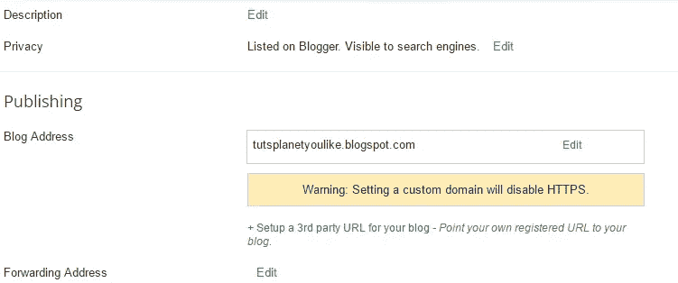
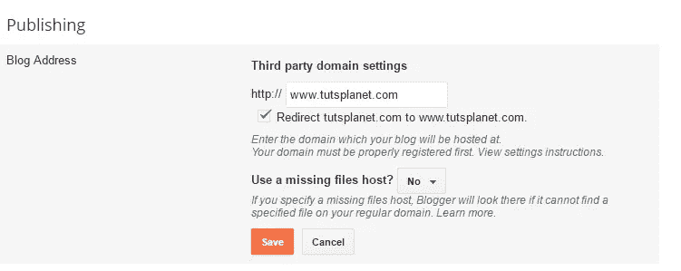
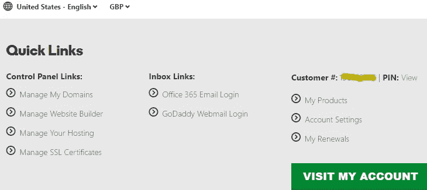
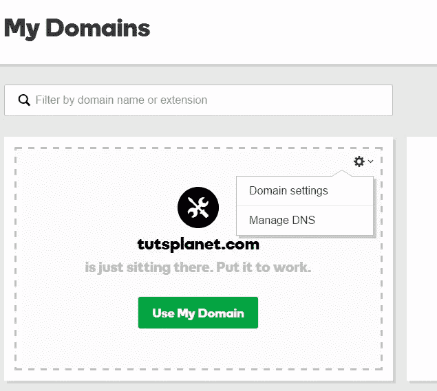
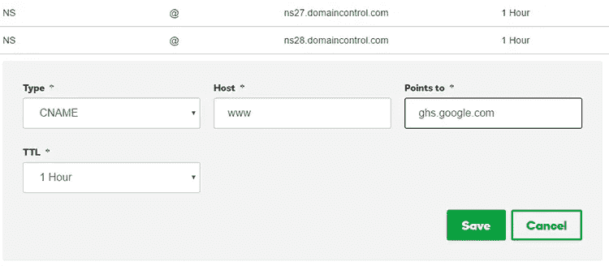
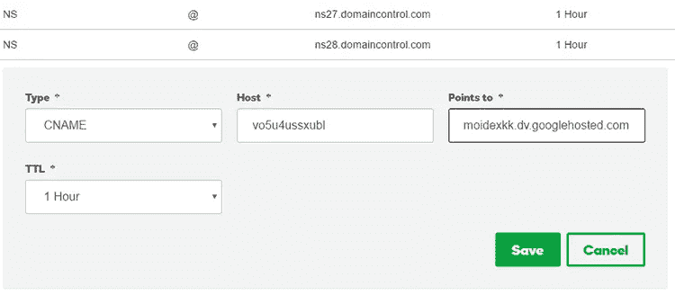
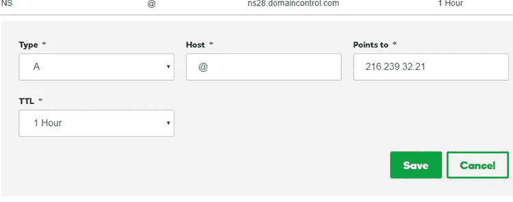
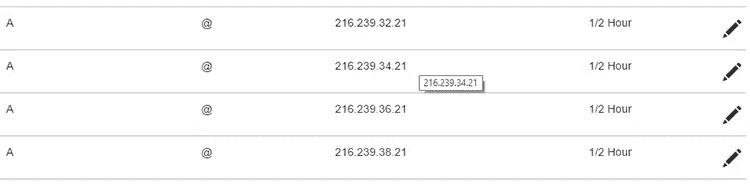
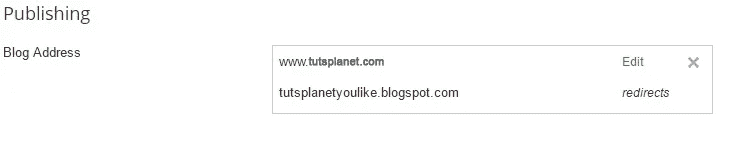

# 指南您需要设置 BlogSpot 自定义域

> 原文：<https://medium.com/hackernoon/guide-you-need-to-setup-blogspot-custom-domain-f6734335fdc1>

大多数人会从免费的博客/网站开始。此外，你可以为你的网站获得无限的存储空间和带宽。从技术上讲，存储并不是完全无限的，但我们有其他选择来克服这种存储。

Blogspot 将拥有像 yourblog.blogspot.com 一样的域名。那么，为什么我们需要有一个自定义域呢？。通常，Blogspot 经常会被垃圾邮件发送者淹没。

*   通常，Blogspot 经常会被垃圾邮件发送者淹没。
*   当你在社交媒体上展示你的域名时，最好有一个域名。
*   说到可信度，大多数网站都不喜欢 Blogspot 的反向链接。

# 在 Godaddy 上使用您的自定义域名设置 BlogSpot 的完整指南

首先，我们应该有一个指向 blogspot.com 的域名。如果你没有域名，你可以选择从 GoDaddy(任何提供商)那里购买域名，年费为 11-15 美元。我建议购买。而不是. com 域。你可以点击这里的链接去 GoDaddy 和购买该域名。

我想现在你已经准备好了以下两件事。

*   Blogspot 网站启动并运行
*   访问您的域详细信息

**将自定义域名添加到 BlogSpot**

登录 blogger.com，从那里选择你的 Blogspot 博客。进入**设置- >基本**屏幕。在**发布**部分，点击 **+为你的博客设置第三方 URL**链接。

在这里，您必须添加您购买的域名。添加带有 **www** 地址的域名，见下图截图。我已经添加了类似[www.tutsplanet.com 的域名。](http://www.tutsplanet.com.)按下**保存**按钮

当您按下**保存**按钮时，您会看到如下图所示的错误页面。错误信息显示“我们无法验证您对此域的权限。错误 12”。这意味着你必须在自定义域的控制面板中配置域。best thing Blogspot 显示了您想要在域控制面板中更新的 [CNAME](https://hackernoon.com/tagged/cname) 。有 2 个，如下图所示。

所以你得到了 CNAME 记录，去你的域控制面板进行修改。你可以按照下面的步骤来做。

# 为 BlogSpot 的自定义域名设置 CNAME 和 A 记录。

登录你的 Godaddy 帐户仪表板，点击管理域名。您将看到这样一个屏幕:

您将看到所有域名的列表，单击齿轮图标，弹出窗口打开。选择**管理 DNS** 链接。

添加您从 BlogSpot 设置页面获得的 CNAME。像下面的图片一样填写细节

点击添加另一个&从你的博客页面复制第二个 CNAME 记录:

# 为 BlogSpot 的自定义域名添加记录。

这是设置的最后一步。在这一步，你必须添加 4 个 IP 地址到你的 A 记录中。这是一样的 CNAME 记录，而不是 CNAME 你必须添加一个记录。我已经添加了一个记录，你也可以为其他人做同样的事情。

谷歌博客的四个 IP 地址

**216.239.32.21
216.239.34.21
216.239.36.21
216.239.38.21**

只需添加其余 3 个重复相同的步骤。在你添加了所有的 4 条记录后，这将看起来像下面的图片。

通常这将需要 30 分钟到 24 小时来全局更改此设置。但与此同时，你可以去 Blogspot 仪表板，并按下保存按钮。现在，错误将会消失，它将被正确添加。所以你会看到这样的屏幕。

一旦你完成了，那么谷歌将负责重定向部分。所有链接正常工作，你不要担心链接果汁。

你可以做一件事，把没有 www 域名的重定向勾选到有 www。您已经完成了 Google Blogspot 自定义域的设置。

原发于[http://www . tutsplanet . com/guide-need-setup-blogspot-custom-domain-833/](http://www.tutsplanet.com/guide-need-setup-blogspot-custom-domain-833/)

> [黑客中午](http://bit.ly/Hackernoon)是黑客如何开始他们的下午。我们是 [@AMI](http://bit.ly/atAMIatAMI) 家庭的一员。我们现在[接受投稿](http://bit.ly/hackernoonsubmission)并乐意[讨论广告&赞助](mailto:partners@amipublications.com)机会。
> 
> 如果你喜欢这个故事，我们推荐你阅读我们的[最新科技故事](http://bit.ly/hackernoonlatestt)和[趋势科技故事](https://hackernoon.com/trending)。直到下一次，不要把世界的现实想当然！

