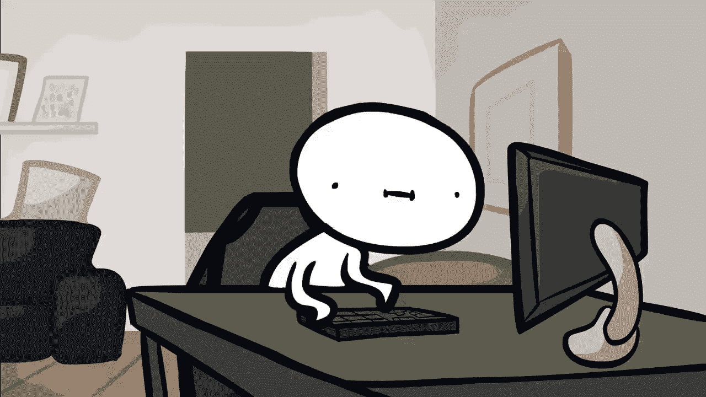
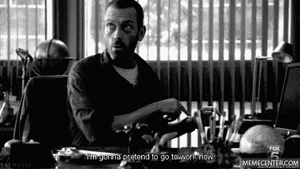
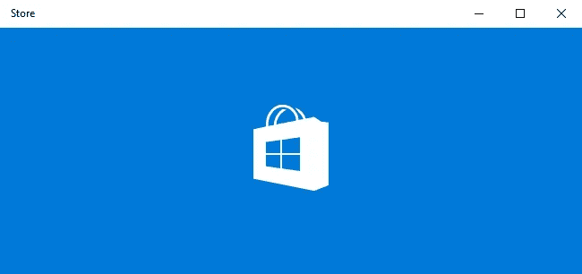

# 构建让人们讨厌你的软件的指导方针

> 原文：<https://medium.com/hackernoon/guidelines-for-building-software-that-will-make-people-hate-you-23049d7209af>

## 构建不良软件的实用方法

Source: [https://fat.gfycat.com/OrangeVastAntarcticgiantpetrel.gif](https://fat.gfycat.com/OrangeVastAntarcticgiantpetrel.gif)

作为一名软件工程师，我已经开发了 5 年多的商业软件应用程序，并开始注意到设计糟糕的应用程序会产生多少仇恨。

归根结底，从技术角度来看，你的架构有多棒并不重要。如果你不制造人们需要的东西并帮助他们，就会有仇恨。

对于那些享受痛苦和折磨的人*(或者只是笑)*，这里有一些指导方针。*这里的最终目标是建立对软件的常见错误和重要部分的认识，没有必要太过分。*

## 1.慢慢来

该应用程序无法在不到 5 秒的时间内加载任何内容。理想情况下，至少需要 15 秒钟。

确保你也不使用后台工作，你真的希望人们在看着空白屏幕时诅咒你，因为他们不知道发生了什么。

## 2.我不知道那是什么。但我肯定这是不可能的

每当用户问你要一个新功能，告诉他不管多简单都不可能。甚至不用和你的同事讨论，只要对用户大喊大叫，问题就解决了！

或者，你可以说“这不在范围内”或“这是别人的工作”。

## 3.正常运行时间并不重要

不要担心正常运行时间(SLA)。让系统每 5 分钟停机一次完全没问题。如果应用程序用于客户服务，那就更好了，这样你的用户就可以在其他人面前抱怨系统瘫痪了，:D

## 4.都在炒作列车上

把所有的会议时间都花在谈论你正在使用的最新的 XYZ 框架是多么的神奇。非常重要的一点是，你不能给你的客户说话的时间，这样他们就不会开始说一些关于他们如何需要新报告的废话。6 个月后，出于一些随机的原因抱怨相同的框架，并抱怨选择它是一个错误。还是那句话，这部分很关键，做**不做**让他们说话；他们会开始询问你已经忽略了一年的那份报告。

~ *如果你一直在关注 Javascript，你就知道我在说什么~*

## 5.让它完全同步

从字面上看，用户做的每一件事都应该刷新页面并转到顶部，这样他/她就有机会一直向下滚动并找到发生了什么。

## 6.假装你的软件很简单，每个人都会懂

“Pff。谁需要登机提示和帮助文章？我是说，会有什么问题呢？”

## 7.没有必要验证表单

假装一切都很好，用空白字段重新加载页面。如果字段被猜错了，这不是你的错。说真的不是\o/

## 8.你的意见是唯一重要的

从来没有。我说**永远不要问你的用户他们在想什么。你是上帝给地球的礼物，知道如何做一个*你好世界。你所需要的就是你的意见。***

## 8.越混乱越好

确保您的表单输入中没有占位符，并且您不确定哪个字段是什么意思。稍后，你可以非常专业地和你的朋友谈论你的用户有多蠢，并对此一笑置之。

## 9.你想要吗？过来拿吧！

永远不要帮助你的用户记住任何重要的事情。相反，让他们每 5 分钟检查一次站台。

邮件、短信或移动推送通知是给懒人用的。

## 11.使用别人不理解的词语

假装你是一名律师，添加一些没有意义的术语。一些技巧是:“通过代理浏览器的异步请求”和“加密盐”。

## 12.忽略所有启示

在界面上随心所欲。例如，您可以使用软盘图标来删除记录，使用星号图标来注销。

*确保你使用类似* [*HotJar*](https://www.hotjar.com) *的东西来录制屏幕，并在稍后制作一些 gif。*

## 13.添加不必要的加载屏幕

即使你正在打开一个 godammn 计算器，显示一个很长的加载屏幕来建立期望。

*~这是给你的微软~*

## 14.在此添加您的小费…

对于构建人们讨厌的应用程序，你有什么建议？我在评论里等你的回答:)

如果你对仇恨不感兴趣，更喜欢用爱制作的软件，那就去看看 [GitShowcase](http://gitshowcase.com/) 吧，买你自己的摇滚明星作品集。维克多·f·桑托斯和我非常努力地为您提供无缝体验。

 [## GitShowcase

### 开发人员，在即插即用产品组合中展示您的最佳项目。最棒的是，免费的。

www.gitshowcase.com](https://www.gitshowcase.com/) 

# ❤️喜欢，分享，留下你的评论

如果你喜欢这个帖子，别忘了喜欢，分享给你的朋友和同事，并在下面留下你的评论。

> 黑客中午是黑客如何开始他们的下午。我们是这个家庭的一员。我们现在[接受投稿](http://bit.ly/hackernoonsubmission)并乐意[讨论广告&赞助](mailto:partners@amipublications.com)机会。
> 
> 如果你喜欢这个故事，我们推荐你阅读我们的[最新科技故事](http://bit.ly/hackernoonlatestt)和[趋势科技故事](https://hackernoon.com/trending)。直到下一次，不要把世界的现实想当然！

