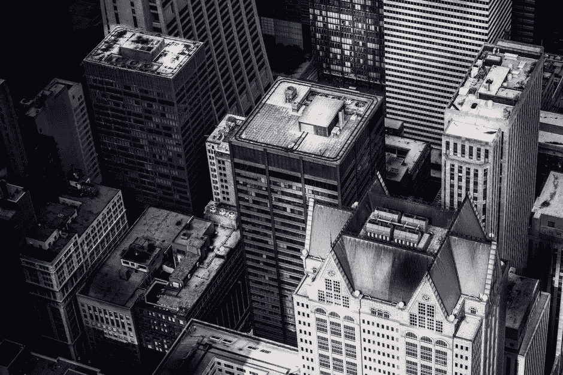
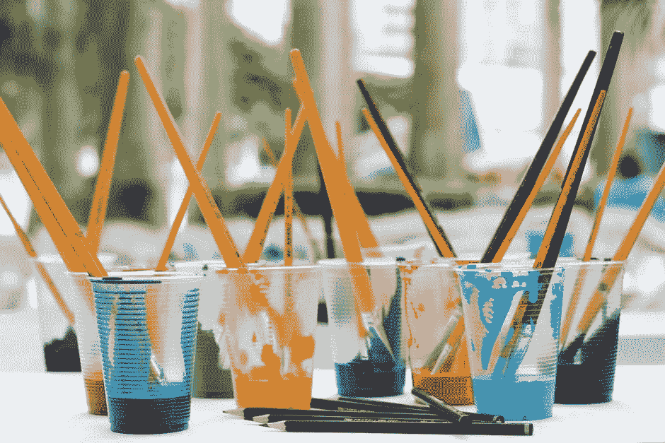

# 使用这些技巧来激发你的创造力，产生黑客马拉松的想法

> 原文：<https://medium.com/hackernoon/hack-your-creativity-ad3910ca7666>

如何在黑客马拉松前激发你的创造力和产生想法？

在你开始黑客马拉松之前，通常会有很多问题萦绕在你的脑海里:

*   什么是可以影响我的社区的伟大项目？
*   有哪些社区痛点？
*   一个项目如何产生影响？
*   人们会认为我的想法很烂还是有价值？
*   如果没有人喜欢我的想法会怎么样？
*   项目影响是可扩展的吗？
*   如果我的想法碰壁了怎么办？

当你参加黑客马拉松时，有很多事情要考虑，无论你是在运行一个项目还是计划应对一个挑战。

你如何引导你的能量来激发你的创造力？当我想到激发我的能量时，我想到的第一句话是，“今天就创造一些东西，即使它很糟糕。”无论你是堵车、坐在公交车上、在会议中做白日梦，还是在一天结束时难以入睡，重要的是你要有所创造。

让我们一起做吧。首先，让你的思想开小差。人类的思维被训练成首先发现我们不喜欢的模式和事物…

**那么你不喜欢什么？**

当我坐在这里打字的时候，我看着奥斯汀市区的地平线。现在是清晨，我正忙着喝咖啡。

Some rooftops (that are not actually Austin, but same deal) | Photo Credit: Vladimir Kudinov

我的第一个想法是，我不喜欢众多建筑的屋顶是如此的灰暗和乏味…我开始考虑能源以及如何在这些屋顶上安装太阳能电池板…

或者…如果这些屋顶被改造成公共空间会怎么样？当你在外面闲逛的时候，向其他大楼里的人挥手致意，这有多酷？这可能会创造一种互动透明、开放、有趣和令人兴奋的互联社区的感觉。

然后，我思考技术如何在讲述这座城市的历史中发挥作用，也许是通过互动板显示土地在十年甚至一年内的发展的了望台。

接下来，我考虑颜色。我内心的孩子建议我买一些颜色鲜艳的颜料，然后“不小心”把它洒在屋顶上，看看我看着它会有什么感觉。

Paint it | Photo Credit: [J](https://www.pexels.com/u/jadson-thomas-164235/)adson Thomas

即使我只流了几分钟，我的思想已经开始漫游到一些有趣的地方。

让我们回顾一下:

你在哪里，哟？

我感觉休息得很好(我昨晚睡得像石头一样)，我已经吃了一些食物，并且我已经喝了我早上喝的混合椰子油的浓咖啡。当你尝试创新时，你的典型状态是什么？你在高峰时间拥挤的地铁里流汗吗？还是你舒适地躺在沙发上，盖着一堆毯子？

**激光束聚焦**

仔细想想在你目前的环境中，是什么困扰着你。问自己那些“如果”的问题。"如果屋顶都是明亮的颜色，我会有什么感觉？"“如果交通灯不是手动的，我不坐在方向盘后面的时间会增加多少？”"如果我们有更好的街道排水系统，我会踩到那个大水坑吗？"

**让想法继续下去**

值得指出的是，现在不是考虑你的想法是否糟糕的时候。这是你应该简单地扔掉任何可能改善困扰你的事情的时刻。“它看起来是灰色的。什么会激励我？让我们在上面涂些颜料。”

有 1000 个坏主意总比一个都没有好。一旦你承认你的大多数想法不是最好的，或者其他人可能不喜欢它们，你基本上就可以随心所欲地发挥创造力了。

**参与移情以评估影响**

思考困扰你的事情很好，但是公民行动要求你更进一步，看看你周围的人。试着进入他们的处境，想象那些可能让他们沮丧或担心的事情。

也许你左边的一位母亲正在努力让她的孩子在高峰时间跟在她身边——如果地铁里有和孩子一样高、更容易抓握的把手就好了。

也许你右边的一位初创公司创始人刚搬到奥斯汀，但对这座城市的历史或背景中的首都建筑一无所知。要是有一种简单的互动方式让他了解更多就好了。

黑客马拉松是一个让你的世界变得更好的机会。走出去，让你的贡献发挥作用！你可以有所作为。

**现在，我希望你的果汁在流动。如果没有，请联系我，让我们进一步集思广益，我随时可以提供帮助:**[**experimental civics . io**](https://www.experimentalcivics.io/)