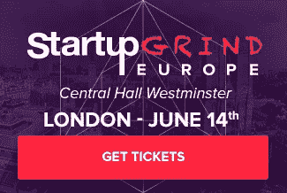

# 通过首次发行硬币来获得资金

> 原文：<https://medium.com/hackernoon/hack-your-funding-with-an-initial-coin-offering-2a2a0614bddf>

## ico 可能会改变创业公司的融资方式

作为一名创始人，我学到的最重要的一课是，保持对公司和愿景的控制是多么具有挑战性——尤其是在一个实现短期目标往往比实现长期成功更受重视的环境中。

根据我在过去几个月里学到的一切，首次公开募股(ico)可以帮助你实现这个目标。

ico 是一个开放的、不受监管的空间，为从资金到所有权的一切创新提供了可能性。这是一种新的投资机制，其中价值的分配和交换具有很大的灵活性。它可以为新经济的开始奠定基础，同时为创业者提供更多自由。

# 那么，什么是 ICO 呢？

首次发行硬币( [ICO](https://hackernoon.com/tagged/ico) )能够通过出售代币或加密硬币为项目提供资金，这类似于一家公司的股份，**T5，尽管通常没有股权交换。**

该项目的投资者和支持者可以通过与菲亚特(比如美元或欧元)或加密货币(比如以太坊)的首次公开发行(IPO)交易来购买它们。ICO 通常会为筹资设定一个最低目标，并设定一段时间来达到这个目标——这与 Kickstarter 没有什么不同。

如果资金要求在指定的时间范围内得到满足，筹集的资金将用于资助项目，公司可以向投资者分发代币，这些代币可以在公共加密货币交易所交易，如 Poloniex 或 Gemini。

区块链社区的许多人认为 ico 是非营利基金会筹集资金的一个期待已久的解决方案，尤其是如果他们想构建开源软件的话。以太坊 ICO 就是这样一个例子，它是一个基于区块链技术的分散式应用平台。以太坊在最初的 2014 年众筹中筹集了 1800 万美元，这是当时有史以来最大的一次，以太坊(简称 ETH)的持有者已经实现了他们所持有的股票的大幅升值，因为在撰写本文时，硬币的价值已经从不到 4 美元增加到超过 250 美元。

通常，制作 ICO 的团队会为令牌销售设定一个日期。然后，在大多数情况下，一部分——比如说总令牌的 5%到 10%—被留出供开发团队出售，作为继续工程项目的手段。
根据 ICO 支持的项目类型和 ICO 所用车辆的用途，结构可能会发生变化。

# 如何设置和创建自己的 ICO？

## 现有解决方案

一些服务正在提供必要的后端基础设施来创建 ICO，然后管理可能在不同交易所自由发生的未来交易。

一开始花时间在你的 ICO 的法律方面，白皮书和财务细节是最重要的。如果你从美国投资者那里募集资金，你必须确保他们是合格的投资者。

> 听起来很奇怪，你不需要区块链来发行或交易你的硬币。很多人只是建立了一个网站，放上自己的比特币或以太坊地址，开始募集资金。
> 
> ——[帕维尔·克拉夫琴科](https://medium.com/u/8f6f7c03f43a?source=post_page-----2a2a0614bddf--------------------------------)，*一位专家密码专家*

## 在我采访过或今天能够列举的服务中:

*   [Argon Group](https://argongroup.com/) ，一家战略投资银行和金融咨询服务公司，负责区块链资本的 ICO。他们负责合规和募集资金的 KYC(了解你的客户)。
*   [Tokenmarket.net](https://tokenmarket.net/ico-professional-services)似乎为 ico 提供了打包产品，他们是新上市的产品，但在为 KYC 提供解决方案和营销您的令牌时，他们似乎对挑战有很好的理解。
*   Otonomos.com 也为 ico 设立了一个特别项目。他们可以提供一个类似于瑞士以太公司的非盈利工具，但这次是在新加坡。
*   总部设在温哥华的 Vanbex 集团是另一个选择。他们在 ico 领域拥有丰富的经验，提供从 KYC 整合、代币开发、活动营销和战略、技术审计和文档、法律指导到投资者关系的全方位服务。他们为 FirstBlood 和 Factom 制作了 ico。
*   [转型集团](http://transform.pr/)，是一家公共关系和咨询公司。自 2013 年以来，该公司已代理了该领域的多家区块链公司、组织和项目，包括 30 多个象征性众筹销售。客户成功案例包括 Aeternity、Augur、Bancor、Bittrex、counter partner、Dash、Ethereum、Factom、Gem、GoCoin、假人网络、Gnosis、Gyft、Humaniq、KnCMiner、北海巨妖、Humaniq、MaidSafe、Ripple、ShapeShift、Storj、Syscoin 和 Tether。

通常，组织控制冷藏的硬币，这意味着你有一个登录和密码来查看和控制余额，但它实际上不是区块链中的硬币。在这种情况下，交易大多发生在集中交易所，因此硬币根本不会移动。

他们通常会提供 KYC，用于收集最初发行硬币的资金，但一旦硬币在公共交易所进行兑换，他们就不能提供 KYC。

*   一旦你需要交易你的硬币，Ethereum.org 可能是迄今为止最受欢迎和最可靠的解决方案。为了创建智能合同，[以太坊](https://medium.com/u/d626b3859bc9?source=post_page-----2a2a0614bddf--------------------------------)有一个完整的解决方案来组织一次集体销售，在区块链的一个组织中出售代币。
*   [闪电网络](http://lightning.network)是另一个可以在未来考虑的代币交易选择，但目前还不可用。虽然交易可以发生在顶层，但结算可以记录在比特币区块链上。

如果您不希望您的交易成本依赖于公共区块链，那么您将必须实现自己的区块链。

## 是什么决定了你的硬币的价格？

你可以决定你希望筹集的金额以及将要发行的硬币或代币的数量。这将决定你的硬币的初始价格。

然后，一旦他们开始在加密货币交易所交易，价格将遵循自由市场的供求规律。像任何其他交易的股票一样，它会根据相关的项目信息、对团队的信任以及项目原始投资者和新投资者的反应而变化。

## 运营自己的 ICO 的相关成本是多少？

除了与你的企业注册相关的法律费用和与你的 ICO 相关的法律和财务建议，在以太坊上运营一个 ICO 的成本是微不足道的。

它包括通过创建智能合同来设置您的令牌的特征，然后在每次交易发生时向区块链支付注册费。

大部分成本将与你的 ICO 向投资者的营销有关。预计在品牌营销、网络营销、公关和沟通上至少要花费 5 万到 10 万美元。大多数严肃的项目都有某种形式的前期投资，以支付与 ICO 发布相关的营销成本。

## 你能在哪里销售你的 ICO？

大多数 ico 都应该进行营销，在最短的时间内实现你的筹款目标。

[21.co](https://21.co/digital-currency/)可以帮你接触到数字货币投资者，每条回复收费 10 美元。

与现有交易所的合作也是向加密货币和区块链社区宣传和营销你的 ICO 的一种方式。

公布你 ICO 阅读量最大的在线出版物和论坛有: [Blockchain.info](http://blockchain.info) 、 [Coindesk](http://coindesk.com) 、 [Cointelegraph](https://cointelegraph.com/) 、 [LTBNetwork](https://letstalkbitcoin.com/) 、 [BitcoinMagazine](https://bitcoinmagazine.com/) 、[tokenmarket.net](http://tokenmarket.net)、 [ico365](https://www.ico365.com/) (中国) [Wings](https://blog.wings.ai/) 、 [Icocountdown](https://www.icocountdown.com/)

交易币使用最多的平台有:[北海巨妖](http://kraken.com)，[波洛涅克斯](http://poloniex.com)， [Bitfinex](https://www.bitfinex.com/) ， [Bitstamp](https://www.bitstamp.net)

一些风险投资公司只投资中国的分不实资本或著名的泰勒·霍华德·文克莱沃斯，从而减少了合规问题和投资时间限制。在预售时，他们可以享受重要的折扣，此外，在交易时， ***代币提供了几乎即时的流动性。***

# 谁已经推出了 ICO？

据研究公司 Smith and Crown 称，仅在 5 月的前两周，ICOs 就筹集了 2760 万美元。

## 由 Mozilla 联合创始人布伦丹·艾奇(Brendan Eich)创立的网络浏览器 Brave 推出的 BAT ICO

它在 2017 年 5 月 31 日完成了首次硬币发行(ICO)，产生了大约 3500 万美元，在 30 秒内售罄。大部分销售是通过出售使用以太坊支付的代币进行的。

## 对等云存储网络 Storj Labs 推出 Storj

5 月 19 日，他们通过 ICO 筹集了资金。该书发行仅 6 小时后，ICO 就突破了 2000 万美元大关。

## 区块链资本是一种投资基金

他们投资于基于区块链技术推动创新的企业家。5 月 10 日，他们在 6 个小时内完成了 1000 万美元的交易。

## Gnosis，下一代预测市场应用的平台

Gnosis 在 4 月底持有其 ICO，并以 1200 万美元的价格出售了该项目的 5%的代币。这些代币在 15 分钟内售出，对整个公司的估值约为 3 亿美元。

它被认为是一个失败的 ICO，因为这些代币本应采用荷兰式拍卖方式出售，这意味着在找到买家之前价格会一直降低，但 FOMO 赢得了这场拍卖，显示出目前的市场是多么不理性。

为了随时了解即将到来的新 ico，Chatfuel 甚至推出了一款名为 [Cryptobot](https://www.producthunt.com/r/0e0b8fae72ba1d/100241) 的新聊天机器人，可在 Facebook Messenger 上使用。

# 在推出自己的 ICO 之前，你需要知道什么？

这仍然是一个不受监管的领域，你必须非常谨慎，以确保你的 KYC(了解你的客户)是正确的。一旦 SEC 等监管机构意识到 ICO 可以让任何公司自由交易股票，传统证券交易所很可能会对任何公司采用相同的技术，然后开始监管这个领域。

最终，对于投资者来说，良好的治理可能仍然是确保盈利能力和上市代币价值不断增长的最佳保障。

目前，美国以外的大多数团队选择阻止美国居民参与，以避免监管问题。

> 目前的 ico 只出售应用硬币、公用代币或具有游戏内货币价值的类似工具。任何利润都是投机价值。这是绕过豪威测试的一种方法。
> 
> *—token market 首席技术官 Mikko Ohtamaa*

支付股息的 ico 即将推出，但它们将是受到监管的证券。波利比乌斯是一家面向数字时代的受监管银行，它刚刚推出了一款 ICO，其代币包括收取 20%利润的权利。

> [*Travis Scher*](https://medium.com/u/d2944e69a533?source=post_page-----2a2a0614bddf--------------------------------) *，一位与数字货币群体有关联的人在 ICOs* *:* 上的帖子中提到
> 
> *在我的努力中，我反复遇到了四个问题，这使得投资新代币——至少目前如此——与传统的风险投资相比非常没有吸引力:*
> 
> *1)监管不确定性，*
> 
> *2)高估值/过度资本化，*
> 
> *3)缺乏控制，以及*
> 
> *4)缺乏业务用例。*

*我认为所有这些观点都是正确的。作为一个创始人，我认为最重要的是 ICOs 所能提供的自由和它作为工具的灵活性。像任何创新一样，ico 需要大量的迭代才能被证明是为初创公司和项目融资的新方式。*

*与此同时，它释放了创造力，更多有趣的计划将开始使用 ICOs。*

*要了解更多有关 ico 的法规，并了解硬币、公用代币和代币化证券之间的区别，[请点击此处。](/startup-grind/understanding-the-difference-between-coins-utility-tokens-and-tokenized-securities-a6522655fb91)*

******