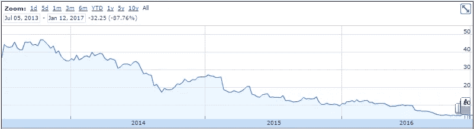
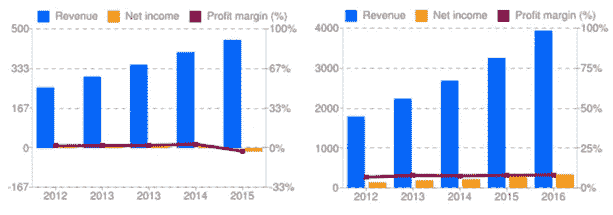

# 黑客金融:成长、价值和收益股票

> 原文：<https://medium.com/hackernoon/hacker-finances-growth-value-and-income-stocks-e7e28bc6b4e8>

*下一篇进入* [黑客金融](https://hackernoon.com/https-medium-com-davisjames-hacker-finances-introduction-14b8283e8677) *系列。*

在最一般的意义上，股票分为三类；[成长](https://hackernoon.com/tagged/growth)，价值或收入。成长型股票是那些预计会随着时间的推移而显著增长的股票。价值公司被认为其股票价格低于实际价值的投资者购买。购买收益股票是因为它们支付股息。

新兴市场中的新公司通常被称为成长型公司。增长是许多创业加速器和孵化器以及风投的口头禅。鉴于现有公司的巨大规模，迅速成长为一家规模可观的公司是长期生存的关键。新公司需要在强大的竞争对手做出反应并压垮它们之前变得更大。优步和 AirBnb 就是很好的例子。两人都没有受到竞争对手的重视，直到为时已晚，无法阻止他们。

特斯拉汽车公司是成长型股票的典型例子。电动汽车市场已经存在很长时间了，但就像 iPhone 一样，这个市场一直在等待有人推出合适的产品。我要说特斯拉是对的，到目前为止，股市也同意这一点。如果他们实现了他们的预测，很可能他们会低于自己的预测，但仍然超过我们的期望，特斯拉将上升到克莱斯勒在美国的位置。自从他们发布了 Model S，我就拥有了 TSLA，股票而不是汽车，我决心不犯第四个错误，过早地卖掉。是的，他们完全有可能在大规模生产 Model 3 的过程中失败。但到目前为止，与他们对赌已经被证明是一场失败的赌博。到目前为止，一切顺利。

我放下自尊，继续讲述墨西哥卷饼的故事，不耐烦地等待面条公司上市。面条是由 Chipotle 的前首席运营官创办和经营的。因此，很自然地，他会在面条公司取得和他给 CMG 带来的同样的成功，而我会得到我梦寐以求的第二次机会。面条是一个成长故事。他们正在建设新的商店和扩张。收入在增加。面条上市，我入股。

这不太好。

简而言之，如果成长股真的上涨，你就可以用成长股赚钱。面条公司的销售额事实上确实增长了，但是他们的利润却没有。

分析认为，NDLS 没有很好地培训新店管理人员，顾客体验没有达到应有的水平。同店销售萎靡不振。推出速度放缓。股票下跌了。滑了下去。滑了下去。在评估一家处于成长阶段的公司的业绩时，如果他们没有成长，而他们的竞争对手却成长了，那么这家公司就有问题。如果他们的竞争对手也不增长，那就是市场出了问题。就 NDLS 而言，他们处于一个增长缓慢的饱和市场，无法充分区分他们的商店。他们通过开设新店来增加收入，但利润率非常低，而且还在下降。相比之下，ULTA 在增长的同时保持着健康的净利润率。NDLS 不健康。

NDLS ULTA

价值股是指价格低于公司实际价值的股票。这种情况并不总是显而易见的，但不同的细分市场受到机构投资者的青睐，股票可能被低估，这是事实。基金经理可能会从一个部门跳槽到另一个部门。如果几只大型基金同时这么做，那么“from”板块可能会被过度卖出，这就提供了一个价值机会。也有可能是一家公司遇到了特定于其业务的困难。在这种情况下，强有力的领导通常会引导他们度过难关，他们会变得更加强大。这就是为什么在选择个股时，公司领导层是一个需要分析的关键地方。如果你能发现价值股，真的，我还没有学会如何辨别一个稳定的企业股价疲软，你就能做得很好。一个信号是一家公司的市盈率相对于他们的同类公司来说很低。然而，如果他们遇到了长期盈利问题，低市盈率可能是合理的。

一个可能的价值示例是卡特彼勒。他们制造运土设备，并拥有重要的国际业务。这些机器是在美国制造的，这对美国工人来说是件好事，只不过今天美元特别坚挺。这使得卡特彼勒设备在海外异常昂贵，国际销售占其收入的 50%以上。结果，他们的市场份额被小松等日本竞争对手抢走了。价值投资者会假设，当美元再次走软时，卡特彼勒的销售会回升，股价也会回升。因此，如果你知道美元的走向，你可能会用卡特彼勒赚一点钱。就我个人而言，我并没有特别针对价值购买股票，所以如果你有任何额外的见解，我很乐意在评论中听到。

收益股是成熟的长期业务，持续盈利，但增长不多。这些股票被称为蓝筹股。蓝筹股持续赚钱，并有越来越多的现金头寸，但其股价波动不大。因此，他们有时试图通过增加股息来提高股价。股息是从公司利润中支付给股东的现金。通过支付股息，公司使他们的股票更有吸引力，增加了对他们股票的需求，从而使股价上涨。一些蓝筹股每年增加股息。那些在很长一段时间内(实际上是 25 年或更长时间)持续增加股息的人，获得了股息贵族的绰号。分红贵族实际上，在某些方面，对自己的分红上瘾。管理层通常受到股票期权的激励。只有股票上涨，期权才有价值。对于一个运行良好的、不受欢迎的、没有增长的企业来说，让股票上涨的唯一方法是 a)增加股息，b)回购股票。回购股票减少了市场上的股票数量，减少了供应，从而抬高了价格。但真正的利润来自股息。

因为我很快就要退休了，我已经开始投资的一个工具是分红股票。我寻找每年增加股息的公司。实际上，这也增加了每年初始投资的收益。就像买了一张每年增加支付利息的存单。从中期来看，比如 10 年，这有一个有趣的效果。从 2006 年到 2016 年，AT & T 的股价从 26.62 美元涨到 40.34 美元。这不算大。年化增长率为 4.2%。然而，在同一时期，T 公司将股息从每股 1.33 美元增加到每股 1.92 美元。在这十年中，股息率从 5.0%上升到了 7.2%，股息率就是每年的股息除以你支付的价格。这意味着，假设这种表现持续下去，综合收益率现在是 4.2% + 7.2% = 11.4%。如果你看得很远，并且能识别出真正的贵族，你就能在分红方面做得很好。不管你喜不喜欢，麦当劳是有史以来最伟大的公司之一。1991 年，MCD 每股支付 9 美分，股价为 8.75 美元(经拆分调整)，当时的股息收益率为 1.1%。如果你在 1991 年 5 月买了这只股票，并一直持有到现在，那么现在的股息是每股 3.56 美元。初始投资的年现金收益率为 42.5%。

当你有一个长期的视野，至少 15 年，试着识别成长型股票。如果你离退休还不到 15 年，开始一个过渡，逐渐将股息股票作为你的投资工具之一。在选择他们的时候，看看他们的分红历史，看看他们在任何情况下都一直在分红。比如互联网泡沫和房地产泡沫金融危机。选择那些每年都会增加股息的公司，一定要成功。密切关注派息率。派息率是他们以股息形式支付的利润百分比。如果派息率很高，比如说超过 70%，你会想谨慎一些，看看其他一些东西，比如公司资产负债表上有多少现金和短期投资。如果派息率很高，而现金很少，他们就有可能没有现金支付股息，并可能停止或减少派息。这将导致他们的股价大幅下跌。不管它值不值得，我的分红策略仍然没有定论。大约一年半前，我开始专门为了分红而买入。从股息收益率和股价来看，这些股票总体表现良好。我瞄准了收益率较高的股票，这通常意味着它们出于某种原因处于价格低谷，而大多数已经走出了各自的低谷。他们提高了股息收益率，正如他们的历史所表明的那样。我持有的几只股票目前的平均股息率为 5.2%。我投资过的四家公司是麦当劳(McDonald's)、美国电话电报公司(Bernstein)、美泰(Mattel)和保诚(PRU)。如果你想知道我今天是什么心情，看看这四个人过得怎么样。

股息股的可怕之处在于，如果他们的业务真的陷入困境，他们不得不减少、暂停或停止派息，这真的会扼杀你的回报。在许多情况下，如果他们暂停了分红，几年后就会恢复。但你永远无法确定他们是否会完全恢复它们。大约 5 年后再来找我，我会告诉你我做得怎么样。希望我没有柯达瞬间。

无论如何，一定要分散投资，让股息只是你投资组合的一个组成部分，不要把所有的鸡蛋都放在股息篮子里。

这些都是买个股的基础。股票投资还有很多，但其他更先进的方法不适合新手或兼职股票投资者(或我)。我会逐一讨论它们，但说真的，除非你的财务状况非常稳固，你可以承受损失一些游戏币，否则不要乱用这些东西。

用保证金购买股票是放大你的收益和损失的一种方式。当你用保证金购买股票时，你从你的经纪人那里借现金来购买更多的股票。你买的股票是贷款的抵押品。你要为你借的钱支付利息。如果股票上涨，你的情况很好，如果你没有借钱，你会赚得更多。否则，你将会失去更多。如果股票下跌很多，你的经纪公司开始认为股票的价值可能会变得比你借的少，他们可能会发出“追加保证金通知”。追加保证金通知确实是个坏消息。这意味着你必须拿出足够的现金让账户恢复偿付能力，通常是通过出售大部分股票。举个例子，假设你想以 140 美元的价格购买 100 股 LinkedIn 股票，但你的经纪账户中只有 7000 美元。一旦你注册了保证金交易，无论如何你都会下 100 股的订单。你的经纪人会用你的 7000 美元购买股票，他们会再借给你 7000 美元。你开始为你借的 7000 美元支付利息。然后，只要 LNKD 的股票保持在每股 70 美元以上，你的经纪人就会很满意，因为如果需要的话，他们可以迫使你卖掉 100 股股票，以收回 7000 美元。如果 LNKD 上涨，由于借入的资金，你会放大你的收益。如果下跌，你会扩大你的损失。如果你接到追加保证金的通知，被迫卖出以偿还贷款，你基本上就血本无归了，你失去了 100%的原始本金。在我们的例子中，这意味着你失去了所有的 7000 美元，加上你一路上支付的利息。这不是黑客的方式，除非你真的想让你的一天充满活力，而不仅仅是咖啡因，并且可以轻松承受这些损失。不过，如果你不得不借钱购买股票，也许你无法承受损失。

另一个争议较少的交易方法是购买期权。期权就像保险。它们能最大限度地减少你的负面影响。例如，在撰写本文时，你可以购买一份期权，以 52.50 美元的价格购买 MSFT，期限为三个月。这意味着，如果 MSFT 在未来 3 个月上涨，你可以在 52.50 美元买入，然后立即卖出，赚取差价。如果价格没有上涨，你什么都不做，期权就到期了。这种权利是有价格的，在撰写本文时，这种期权的价格为每股 3.10 美元。例如，如果你买了 100 股的 3 个月期权，你要付给你的经纪人 310 美元。然后，如果在接下来的 3 个月里，你看到了行使期权的机会，你就会这样做。不管怎样，这 310 美元已经花掉了。但是，如果 MSFT 下跌，你什么也不做，只有 310 美元。

实际上有两种主要的期权，看涨期权和看跌期权。看涨期权给你在特定时间内以特定价格购买股票的选择权。看跌期权给予你以特定价格卖出的选择权。本质上，如果你买了看涨期权，你就是在赌股票会上涨。如果你买了看跌期权，你就是在赌股票会下跌。

期权实际上是为那些喜欢在投资中更有技巧的老练投资者准备的。期权可以限制你的下跌，但如果你错了太多次，它们仍然会侵蚀你的投资组合。一般来说，它们会占用你更多的注意力，超出你可能想要投入的范围，所以不要去理会它们。我从来没有买过期权，我也不觉得自己错过了什么重要的东西。也许当我有更多的空闲时间时，我会学习更多的机制和策略，并尝试一下。但不是今天。

如果你想无限下跌，卖空是给你的。我很想说不要，试着把这个词从你的记忆中彻底抹去。明智的黑客没有充足的理由做空股票，除非他们有明确的内部消息，比如雷诺·拉普朗什将突然辞职。当然，如果你事先知道，并在宣布之前做了简短的 LC，你会做得非常出色，直到 FBI 给你戴上手铐。

如果你买入一只股票“做多”，这意味着你预计它会上涨。本质上，你的上升空间是无限的。只要涨得高，你的收益就上去了。卖空意味着你正在出售一只你实际上并不拥有的股票。如果股票下跌，你就买入并平仓。你的利润就是差价。当投资者非常确定一只股票正在下跌，并且他们能够从下跌中获利时，就进行卖空操作。如果你做空一只股票，上涨空间仅限于你做空时的股价。你最多只能做到这个有限的数量。然而，如果你做空，股票上涨，那才是真正的心痛。价格越高，你的潜在损失就越大。你的潜在损失没有上限。

当被严重做空的股票大幅上涨时，它们会引发所谓的空头回补反弹。当这种情况发生时，做空股票的投资者开始对他们的空头头寸失去信心，并买入股票以弥补损失。如果他们中的许多人同时回补，额外的购买会进一步推高价格，更多的空头投资者会失去勇气和回补。这对我们这些很久没有在反弹中获得额外动力的人来说太好了。这对短裤来说是毁灭性的。我个人把卖空者和殡仪员归为一类。他们不是你想成为的那种人。

[1][http://www . fool . com/knowledge-center/does-a-stock-回购影响价格. aspx](http://www.fool.com/knowledge-center/does-a-stock-buyback-affect-the-price.aspx)

http://ir.lendingclub.com/file.aspx?IID=4213397&FID = 34233669

[3]好吧，这是一个很弱的文字游戏。柯达有一句广告语:“柯达瞬间”，意思是你拍照的瞬间。在支付了几十年不断增加的股息后，他们也经历了有史以来最严重的“股息崩溃”之一。[http://www . dividend . com/dividend-education/the-maximum-dividend-stock-disasters-of-time/](http://www.dividend.com/dividend-education/the-biggest-dividend-stock-disasters-of-all-time/)

> [黑客中午](http://bit.ly/Hackernoon)是黑客如何开始他们的下午。我们是 [@AMI](http://bit.ly/atAMIatAMI) 家庭的一员。我们现在[接受投稿](http://bit.ly/hackernoonsubmission)并乐意[讨论广告&赞助](mailto:partners@amipublications.com)机会。
> 
> 如果你喜欢这个故事，我们推荐你阅读我们的[最新科技故事](http://bit.ly/hackernoonlatestt)和[趋势科技故事](https://hackernoon.com/trending)。直到下一次，不要把世界的现实想当然！

