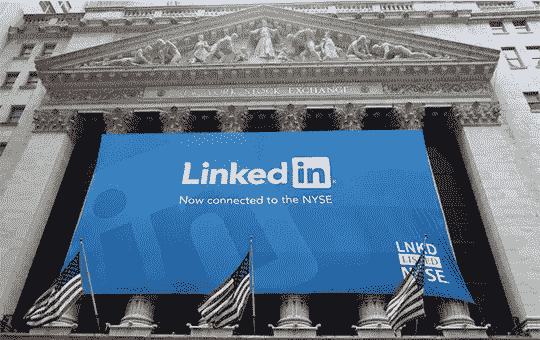
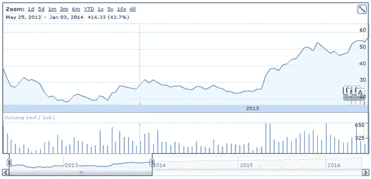
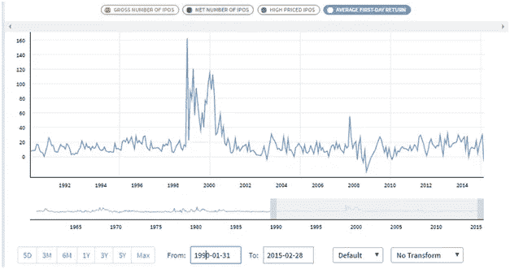
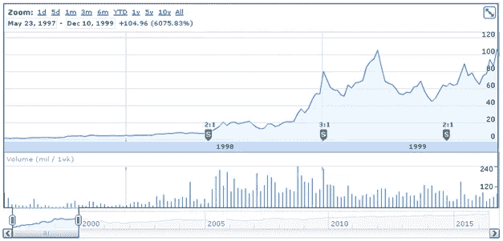
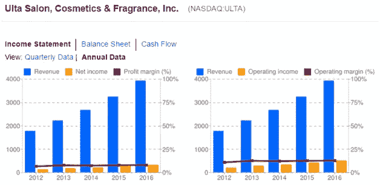

# 黑客金融:股票与共同基金，第三部分

> 原文：<https://medium.com/hackernoon/hacker-finances-stocks-versus-mutual-funds-part-iii-457b58c851c4>

www.wallstreetsurvivor.com

我犯了选股这本书里的所有错误。我买的太早，卖的太快，买的原因不对，买了亏的，卖的太晚，卖的原因不对，当然，我犯了更多的错误，我不好意思承认。但我还是会承认，以防你犯同样的错误。我的耻辱是你的收获。先说最丢人的，就是为了让它不碍事。

(侧边栏，如果你是黑客金融新手，从这里开始:[黑客金融:简介](https://hackernoon.com/https-medium-com-davisjames-hacker-finances-introduction-14b8283e8677))

1995 年，我的软件工程师朋友格雷格加入了一家名为 Worldtalk Corporation 的初创公司。Worldtalk 开发了一个系统，可以在当时的通用格式之间转换电子邮件格式。Worldtalk 上市的时候，我想支持格雷格，为他加油，所以买了一些股票。

错误 1:不要因为你的朋友在一家公司工作，就购买这家公司的股票。我想 Worldtalk 持续了几年。在被收购之前，这支股票下跌、疲软并遭受了重大损失。

在上世纪 90 年代中期互联网泡沫之前，曾经有一段时间“客户机-服务器”风靡一时。今天，它被称为“Web 服务器”和“API”。但在当时，它作为一种建筑是新颖的。远程过程调用是一件事，共享服务看起来不可能不变得巨大。我在《圣何塞水星报》上读到了古普塔科技公司首次公开募股的消息，于是我买了一些，这样我就能拿到那艘火箭船上的第一张票。我只知道他们是一家客户-服务器公司，但是我还需要知道什么呢？首先，如果我一开始就知道他们会一个季度接一个季度地达不到收入目标，那就好了。我不知道。该股萎靡不振，从未超过 IPO 价格。我坚持了一年左右，最终以-82%的跌幅退出。

错误 2:不要在 IPO 时买股票。是的，有些公司从未跌破发行价，比如 MSFT 和 CSCO。但通常情况下，它们会先跌后涨。脸书就是一个例子。以下图表显示了前两年的 FB:

该股从上市第一天开始下跌，超过一年半没有回到 IPO 价格。你可能已经注意到在[股票与共同基金第二部分](/@DavisJames/hacker-finances-stocks-versus-mutual-funds-part-ii-3fe5c7bfcbbe)中，团队也有同样的行为。6 个月后，它的交易价格仍低于其 IPO 价格。

当一家公司进行首次公开募股时，在进入之前给它几个季度的时间，这样银行家们在首次公开募股前涂的所有指甲油都会被擦掉，你可以看到他们真正的表现。给一直等着套现的内部人士时间卖出股份。给已经获得既得期权的员工时间出售他们的期权。给公司一些时间来产生一些财务回报，这样你就可以看到他们的销售额如何增长，他们的毛利润如何，他们把钱花在哪里，更重要的是，他们的领导层对他们将如何管理和发展公司的信任度如何。直到几个季度过去了，你才能真正感受到这一切。

90 年代末，似乎每个人都在买股票。日交易者像今天的创始人一样聚集在硅谷的咖啡店里，股票市场开始上涨。风险投资家和银行家们陷入了疯狂:找到一个有任何互联网想法的创始团队，为他们提供资金，让他们上市，然后尽可能快地冲洗、重复。公众对新上市公司的兴趣变得无法满足。这张图表显示了 1990 年至 2016 年 IPO 的平均首日回报率。

www.quandl.com

1998-1999 年的实质性波动就是泡沫。上市首日表现出色的公司越多，就有越多像你我这样的散户投资者想要进入。大冠军，正是我们前面提到的 VA Linux，其 IPO 价格为每股 30 美元，首日收盘价为 239.25 美元，首日涨幅为 698%。很难一周又一周地看到这些数字，而不是全神贯注地想从中分一杯羹。我们散户投资者想要的越多，回报就越大。这是一个完美的泡泡食谱。

那些银行家和风险投资者赚了大量的钱，主要是靠我们这样的散户投资者。

互联网泡沫在 2000 年将纳斯达克推高至 5048 美元，直到 2015 年才回到这一水平。这意味着，如果你在 2000 年 3 月 10 日的日内高点 5132.52 点买入了纳斯达克交易所交易基金并持有，那么 15 年内你都不会赚回一分钱。

正是在那段时间，我买了最粗略的公司。铜山网络，TheGlobe.com，和其他我甚至不记得的火焰熄灭只是从我的银行账户中取出现金，扔到风中。天哪，风真大。

错误 3:不要因为别人都买了一只[股票](https://goo.gl/1nZ8JP)就去买。

卖掉 GPTA 后，我带着那点可怜的残骸四处寻找可以打赌的地方。真的，我只是在赌博。原来 Amazon.com 刚刚上市。我看到他们成功地销售书籍，就在他们上市之前，他们开始销售音乐 CD。网上购物显然会成为一件事，所以很明显他们有很大的增长空间，他们是早期的领导者。所以我买了几股。

有几年我觉得自己很聪明。我是说，看看这张图表:

亚马逊成为互联网泡沫中的领头马。在大流行之前的两年里，它分裂了三次，我的股票是我买的 12 倍。你可能还记得，当时声名狼藉的亨利·布洛杰特预测亚马逊的股价会在一年内涨到 400 美元，这真是太令人兴奋了。它在 3 周内实现了飞跃，达到 430 美元。

然后泡沫破裂了，我看着 AMZN 和其他东西一起暴跌。它在 2001 年 9 月触底，然后逐渐温和回升。我最终决定在 2003 年出售，因为亚马逊仍然没有利润，而且为了扩大业务，背负了巨额债务。我的小额投资赚了 5 倍，但我失去了信心。那是昂贵的。自从我卖出以来，AMZN 又上涨了 14 倍。这是成倍增长的。5 倍乘以 14 倍是我放弃的 70 倍收益。

错误 4:过早卖出。这一点很难，因为你确实需要注意，并准备好在投资看起来已经结束时采取行动。当我卖掉 AMZN 的时候，我仍然因为看着我的泡沫股票被吹走而遍体鳞伤，我想要一场胜利，这样我就可以开始愈合一点。所以我拿了利润。但现在，我显然希望我没有。

自我鞭笞够了。从这些经历中，我总结出了一些如何以及何时买入股票的规则。我认为这些是正确的理由:

只投资你了解的业务。有些生意很简单，有些不简单。但如果你不了解它，你就不能对公司的业绩或他们的产品方法和竞争地位的可行性做出合理的判断。除了了解他们的业务，你还需要了解他们的市场。他们是在创造一个新的市场或服务，还是在一个现有的市场中表现得比现有公司更好？这个市场正在增长吗？如果是这样，它能变得多大？没有这种理解，你就无法真正意识到你的投资可以增长到多大，你也无法真正知道什么时候情况不会变好并退出。因此，我们黑客很可能会选择 T2 的科技公司。这是一个相当大的优势，因为科技公司的增长速度比任何其他细分市场都要快。市值排名前十的公司中有五家是科技公司，新公司也在不断涌现。所以机会是有的。

接下来，寻找你和你的朋友和家人实际使用的公司。实际使用它们意味着你可能对他们的业务和竞争优势有一个隐含的理解。墨西哥卷饼是我应该买的。我真的买了 Yelp！，因为我一直在用它，还叫！评级会影响所列企业的销售。这意味着 Yelp！有杠杆出售广告给企业上市，这将推动 Yelp！收入。这似乎是真的，因为他们的收入在 5 年内有 50%的复合增长率。谷歌在 10 多年前成为事实上的搜索引擎，他们的增长不仅超过了竞争对手，而且还在加速。我不断看到越来越多的朋友和同事使用它，所以我在 2006 年买了股票。出于类似的原因，我一直在关注一家名为 Ulta Salon，Cosmetics and Fragrance，Inc .的公司。它不是一家科技公司，但我有几个十几岁的女儿，她们在那里购买化妆品和美容产品。他们所有的朋友都是从哪里得到的。我看到越来越多的商店在这个地区开业。ULTA 的股票在过去的 5 年里以每年 39%的速度增长，我正在认真研究它。这是谷歌财经的美照:

请注意，不仅销售增长强劲，而且营业和净收入%保持不变。每一家新店都会增加利润。这说明了有控制的、强劲的增长和一个运行良好的企业。

挑选好股票的另一个关键是公司领导层。首席执行官和他或她的员工的精神特质是什么？我观察网飞好几年了，并考虑投资。但是直到我读了“网飞文化:自由&责任”[1]之后，我才扣动了扳机，这是一篇登上黑客新闻头版的幻灯片分享。我确信有很多地方是错的。但引起我注意的是，黑斯廷斯让运营创新成为公司的普遍指令。他似乎告诉员工，不管他们属于哪个部门，只要他们想做的事情有数据支持，他们就会去尝试。此外，被实施的想法也被仪器化，因此它们可以被监控以经验地证明它们是否有效。我印象深刻。当网飞宣布将 DVD 业务从流媒体业务中分离出来时，我得到了买入的机会。市场起初并不买账，股价从 2011 年 293 美元的高点(在他们 7:1 分拆之前)跌至约 64 美元的低点。毫无疑问，全世界的视频娱乐需求都将在网上得到满足，所以我对市场没有任何顾虑。黑斯廷斯让我相信他能执行。我在接近中期底部时买入，并一直持有，看着它们在成为地球电视台的道路上蓬勃发展。

公司领导力至关重要，找到有智慧和毅力推动增长和竞争的首席执行官总是一个不错的选择。你能把马斯克、贝佐斯、乔布斯和黑斯廷斯都放在一句话里说吗？

概括一下:

不要买股票，因为:

*   你的朋友在那里工作
*   其他人都在买它
*   它刚刚公开

不要卖出股票:

*   太快了。

购买股票是因为:

*   你了解他们的业务
*   你，或者你的朋友和家人，或者你认识的企业使用它
*   你了解公司领导层的精神特质，这让你产生了共鸣。

[1][http://www.slideshare.net/reed2001/culture-1798664](http://www.slideshare.net/reed2001/culture-1798664)

[2]https://en.wikipedia.org/wiki/Henry_Blodget

[3]股票分割不会改变公司或股票的价值，但在互联网泡沫时期，这是银行家从他们上市的公司中继续赚钱的一种方式。拆分两倍或三倍的可用股票数量，同时以相同的比例降低股价，以便市值不变。所有的股东都得到增加到他们账户上的额外股份，并且价格降低，因此他们股份的价值不变。大部分历史悠久的公司都已经分裂了。众所周知，伯克希尔哈撒韦公司(Berkshire Hathaway)几十年来一直非常成功，但它认为股票分割是一种人为的误导属性。BRK。a 的 IPO 估值为 19 美元。它目前的交易价格为 237，199 美元。这意味着今天，你需要将近 25 万美元来购买 1 股股票。股票从未被分割过。

> [黑客中午](http://bit.ly/Hackernoon)是黑客如何开始他们的下午。我们是 [@AMI](http://bit.ly/atAMIatAMI) 家庭的一员。我们现在[接受投稿](http://bit.ly/hackernoonsubmission)并乐意[讨论广告&赞助](mailto:partners@amipublications.com)机会。
> 
> 如果你喜欢这个故事，我们推荐你阅读我们的[最新科技故事](http://bit.ly/hackernoonlatestt)和[趋势科技故事](https://hackernoon.com/trending)。直到下一次，不要把世界的现实想当然！

