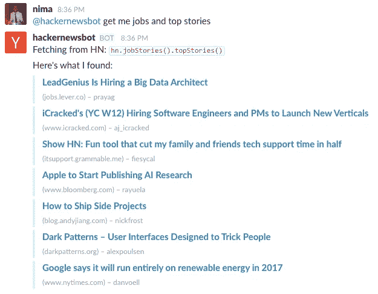
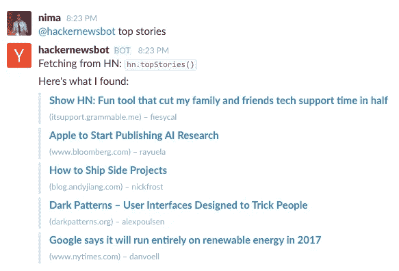
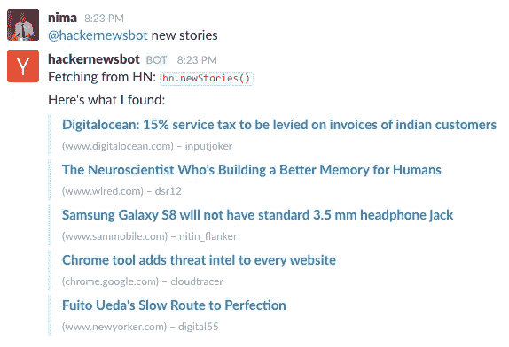
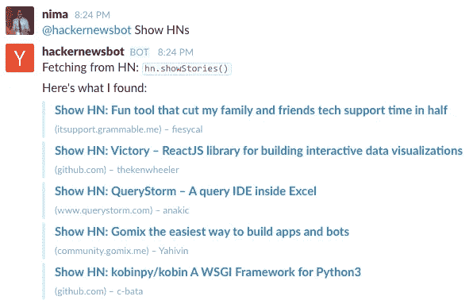
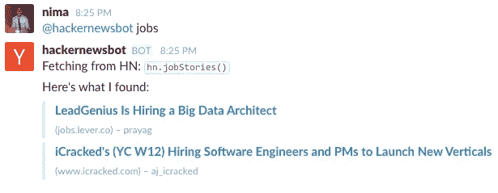

# 带有 Slack 事件 API 和 StdLib 的黑客新闻机器人

> 原文：<https://medium.com/hackernoon/hacker-news-bot-with-slacks-events-api-and-stdlib-33e28cea1b18>

我是黑客新闻的狂热消费者。这是我早上第一个去的地方之一，而且一天会去多次。这也可能是我的默认标签(尽管公平地说，我有一些更酷的东西)。

最近，我注意到 YC 有一个开放的官方黑客新闻应用编程接口，所以我开始创建一个 Slack 机器人(为我们正在开发的产品训练自己)。

这一切只花了几个小时，功劳都应该归于 Slack 的伟大的 [Events API](https://api.slack.com/events-api) ，它使你不需要在任何时候都运行一个机器人程序，并使我能够使用 [StdLib](https://stdlib.com) 和[bott kit](https://github.com/howdyai/botkit)一起，得到一个相当不错的体验。

# 功能

该机器人目前支持 API 的几乎所有公共功能(用户除外)。以下是如何使用它们:

## 多个查询

你可以通过在一条消息中要求不同的帖子类型，让机器人同时为你提供多种帖子类型！

> @ hackernewsbot 给我找工作和头条新闻

Querying multiple post types

机器人循环执行它看到的所有命令，执行所有命令，并以相同的顺序连接它们。自从我要求它`get me jobs and top stories`以来，它首先显示了招聘启事(因为它首先出现在我的文本中)，然后是头条新闻。

## 热门故事

你可以得到头条新闻(相当于进入 [HN](https://news.ycombinator.com) 的首页)。

> @ hackernewsbot 热门故事

Top Stories on Hacker News

每当你说任何含有`top`这个词的话，它都会给你看最重要的故事。

## 新故事

您可以获得最新的帖子(相当于 HN 的[/最新的](https://news.ycombinator.com/newest))。

> @ hackernewsbot 新故事

New Stories on Hacker News

每当你提到里面有`new`这个词的时候，它会显示最新的帖子。

## 显示 HNs

您可以获得最新的《展示 HN》帖子(相当于《HN》上的 [/show](https://news.ycombinator.com/show) )。

> @ hackernewsbot Show HNs

Show HN stories on Hacker News

只要您一提到`show`这个词，它就会为您提供最新的 Show HNs。

## 工作岗位

它可以向你展示 HN 最新的招聘信息(相当于 HN 的 [/jobs](https://news.ycombinator.com/jobs) )

> @hackernewsbot 乔布斯

Job postings on Hacker News

在未来，我希望它支持特定用户获取帖子(API 支持)，并可能在新帖子出现在头版时自动发布通知！

如果你只是想把它安装到你的 Slack 组，那么[去这里](http://f.stdlib.com/nemo/slack-bot)。

如果你想读代码，这里是[。](https://github.com/nemo/hackernews-bot)

> [黑客中午](http://bit.ly/Hackernoon)是黑客如何开始他们的下午。我们是 [@AMI](http://bit.ly/atAMIatAMI) 家庭的一员。我们现在[接受投稿](http://bit.ly/hackernoonsubmission)并乐意[讨论广告&赞助](mailto:partners@amipublications.com)机会。
> 
> 如果你喜欢这个故事，我们推荐你阅读我们的[最新科技故事](http://bit.ly/hackernoonlatestt)和[趋势科技故事](https://hackernoon.com/trending)。直到下一次，不要把世界的现实想当然！

