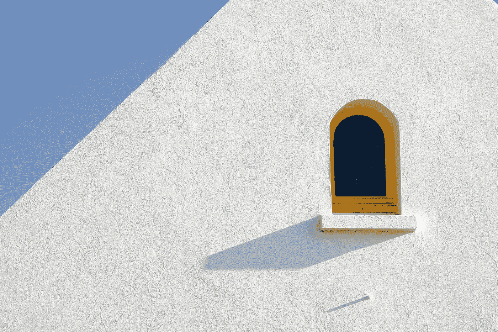

# 黑客的互联网简约主义指南

> 原文：<https://medium.com/hackernoon/hackers-guide-to-internet-minimalism-7aee9c1b566>

Image Courtesy: [https://pixabay.com/en/window-minimal-white-yellow-blue-1449251/](https://pixabay.com/en/window-minimal-white-yellow-blue-1449251/)

[你并不聪明播客](https://youarenotsosmart.com/2015/11/25/yanss-063-how-search-engines-make-us-feel-smarter-than-we-really-are/)中的一集讨论了搜索效应，这是一种认知偏差，即一个人觉得自己比实际上更聪明，只是因为我们可以在网上搜索答案。这是一个互联网时代，有大量的内容，只需一次点击或触摸或轻拍。这也是所谓的“**信息过载**或“信息中毒”的主要原因，每天我们都有大量的信息呈现在我们面前，但最终却被倾倒在我们宝贵的记忆空间中。

处理这种信息过载的唯一方法(或者可能是我所知道的唯一方法)是拥抱**互联网极简主义**(这是我第一次在 [Cal Newport 的博客](http://calnewport.com/blog/2016/12/18/on-digital-minimalism/)上看到的)

那么什么是数字极简主义呢？

> **“数字极简主义**是一种哲学，它帮助你质疑什么样的数字通信工具(以及围绕这些工具的行为)能给你的生活带来最大的价值。它的动机是相信有意识地积极清除低价值的数字噪音，优化您对真正重要的工具的使用，可以显著改善您的生活。”—加州新港

这与史蒂夫·乔布斯对专注的定义松散地结合在一起，我想把它理解为:

> 互联网极简主义意味着对现有的上百种好的数字资产说不。"

如何入门数码极简？

我知道，说教比实践容易多了。这是一个千禧一代炫耀他们拥有的社交媒体账户数量的时代，在同一时期成为一名数字极简主义者并不是一件容易的事情。但是请记住，这就是为什么成为一个极简主义者很重要的本质原因，因为其他人都喜欢超负荷，而你却不喜欢。在这里，我想列出几个行动要点来开始数码极简主义:

**再见脸书新闻提要:**

这是开始的第一步，因为脸书的新闻订阅是你在网上遇到的最有效的信息之一。

最近对 HN 的评论如下:

> 我没有删除我的帐户，但我让它休眠大约 4 年前。一点也不要错过。社交媒体就是让你感觉不好。
> 
> 这是一个让自卑的人梦想他们的生活会是怎样的平台。让老年人记住过去。对于一般的男人/女人来说。
> 
> 最重要的是，这里是蠢驴和有各种情结的富人向世界展示他们的生活有多好的地方。
> 
> 脸书很擅长找出你的弱点。以我为例，脸书成了我重新想象大学生活的窗口。
> 
> 不用了，谢谢。回忆之旅偶尔会很有趣，但壁橱里的旧图片目录已经变成了一个阴险的实体，总是在召唤你回来。我的手机震动了，有人贴了你 5 年前的新照片，有 50 个人喜欢。记得那天吗？所有那些人。不是吗？
> 
> 真他妈的，我受够了被一个专门为你设计的平台玩弄。

你可以给尽可能多的借口留在平台上，这是你的选择，留下来埋葬数字极简主义，但如果你想给自己一个机会克服这个瘾(亚当·奥尔特这么说的)，从停用你的 FB 账户开始。对于那些使用 Facebook Messenger 作为主要即时通讯工具的人来说，我们会做到的。

**受控推特:**

Twitter 并不是一个很好的产品(我也不偏向杰克·多西),但事实上没有比 Twitter 更好的突发新闻在线来源了。不管是地震还是 AWS 宕机，Twitter 仍然是老大(即使投资者持怀疑态度)。这是否意味着你有充分的自由去享受拉着刷新你的 Twitter feed 的快乐？见鬼不！这意味着你必须将你的粉丝数量减少到 50 个以下，这需要根据你的优先事项做出艰难的选择(问问你自己为什么会在那个平台上——是为了听特朗普先生的话，还是为了知道 AWS 什么时候停机？)

**即时通讯* n 其中 n 小于等于 1:**

有这么多不同的即时通讯工具简直是浪费时间——朋友用的 FB Messenger、家人用的 Whatsapp、团体用的 Telegram、组织用的 Slack(抱歉，因为这是公司的政策，所以不能删除)和没有目的的 Messenger。理想情况下，电子邮件仍然可用。是的，它不像即时消息那样即时，也没有蓝色记号或 R 标记，但它确实有助于对话交流，如果有更紧急的事情发生，我们还可以收到短信和电话。所以，下定决心，在你的手机上只使用一条即时消息。

**仅阅读来源:**

忽略你已经得到的任何其他阅读资源，只关注这个。[黑客新闻——news.ycombinator.com](https://news.ycombinator.com/)(头版):这个历史悠久的新闻公告板是一个很好的门户，可以很好地管理高质量的科技&非科技阅读内容组合。

**再多一点:**

虽然只有上面提到的那些东西会推动我们的互联网使用，但某些东西也可以增加更多的价值，这取决于对使用的控制程度:

*   堆叠交换讨论
*   产品搜索
*   Quora 上的问答环节
*   媒体上写得好的长文章
*   像 Farnam Street 这样的博客，基于你的兴趣的其他特定的个人/个人博客(不会每隔 x 分钟发布文章)

尽管这些不一定是日常数字生活的一部分，但如果偶尔啜饮一下(比如一周/两周一次)，它们也能增加一份体面的价值。

致富有两种方式:一种是获得更多，另一种是渴望更少——[杰姬·法国柯勒。](https://www.becomingminimalist.com/minimalism-quotes/)