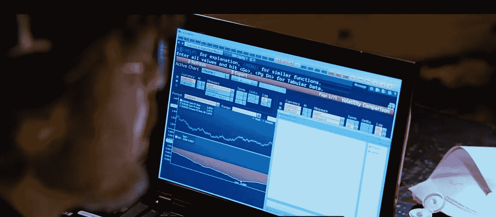
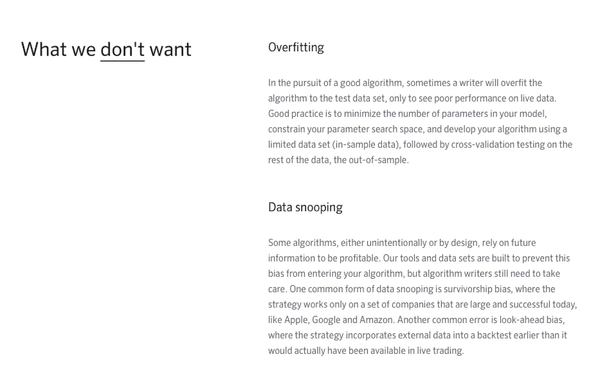
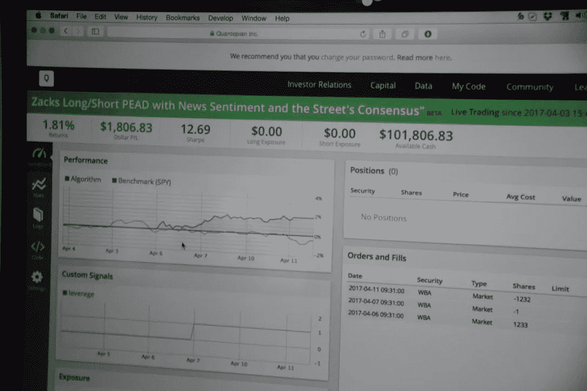

# 破解 8 个算法

> 原文：<https://medium.com/hackernoon/hacking-8-algos-161d1f28dcf3>

## 我的无代码经验是学习如何在 Quantopian 平台上克隆、测试和交易八个利润极高的 quant finance 算法。

上周，波士顿公司 [Quantopian](https://www.quantopian.com) 向算法发放了第一笔[数百万美元的资金分配，这些资金来自 Quantopian 社区，金额从 10 万美元到 300 万美元不等。这些算法是由来自世界各地的开放作者社区提交的。来自](https://www.quantopian.com/press/first-multi-million-dollar-allocations) [Q 基金](https://www.quantopian.com/allocation)的资金分配给了八个国家的作者，包括澳大利亚、加拿大、中国、哥伦比亚、印度、西班牙和美国，现在正在与 Quantopian 管理的第三方资金[进行实时交易。相当神奇！](https://www.bloomberg.com/news/videos/2017-04-06/point72-s-steve-cohen-invests-250m-in-quantopian-video)

可以理解的是，Quantopian 并没有公开公布它为哪些特定的算法分配了资金，以及分配了多少。

这给了我一个古怪的想法。

It seemed like a good idea to clone, test and run some of the best Algos being discussed on the [Quantopian Community Forums](https://www.quantopian.com/posts).

## 被嬉皮士洗脑

我一直潜伏在 Quantopian 社区论坛和他们的一些黑客马拉松中。

> 我清楚地记得很早就意识到自己无意中发现了一件大事，但我试图对自己的偏见保持怀疑。

几年前，我搬到西部住了一段时间，被嬉皮士洗脑，总是质疑自己的世界观和假设。巧合的是，这个起点似乎符合我最喜欢的一些数学势利者的量子理论，比如[德莱尼·格拉尼佐-麦肯齐](https://www.quantopian.com/users/5346083a839ff34e1400010a)和他的[量子理论讲座和研讨会](https://www.quantopian.com/lectures)，包括去年 QuantCon 的这个:[你不知道你错了多少](https://www.youtube.com/watch?v=fI3K4Mi1Szw)。

Recognizing and challenging our own biases is sometimes half the battle.

## **确认偏差**

由此开始了我对量子经济学的兴趣，这似乎不断强化了我对民主化量子金融的个人偏好。

去年 7 月，当对冲基金超级明星斯蒂芬·a·科恩(Stephen A. Cohen)承诺(T2)将投资 0 . 25 亿美元由 quanto pian(T3)管理时，我内心的“确认偏见”探测器变得更强烈了。然后，就在上周，mega-tron[black rock Capital](http://www.blackrockbkcc.com/frame.zhtml?c=209952&p=index)解雇了其在纽约的所有[选股对冲基金经理，转而支持完全量化的算法交易](https://www.wsj.com/articles/blackrock-bets-on-robots-to-improve-its-stock-picking-1490736002)。

## **黑掉宽客**

因此，我只有想当程序员的技能，只有简单的哲学背景，但(希望)有一个让我自己胡说八道的诀窍，我开始抄袭量子论坛上讨论的最好的算法，进行回溯测试，了解每个算法的优缺点，学习所有必需的“量子”概念(Sortino，Sharpe，Alpha，Beta，MaxDD 等)。)，并理想地将每个算法设置为“纸上交易”(即。在 Quantopian 计划于 2017 年 4 月 28 日至 30 日在纽约举行的 QuantCon 2017 之前，有充足的时间发布他们备受期待的[期货 API](https://www.quantopian.com/posts/quantopian-futures-api-tutorial) ，供任何加入他们开放的 quant finance 社区的人使用。

Once you get used to the Quantopian platform, Algos begin to flow pretty freely.

## **我的流程**

我研究、克隆并回溯测试了来自开源[量子社区论坛](https://www.quantopian.com/posts)的八个独立的算法。(那里正在讨论一些真正强大的想法！).一个很好的起点是[这篇文章链接到 Quantopian](https://www.quantopian.com/posts/top-10s-of-2016-the-most-cloned-backtests-and-notebooks) 上 10 个克隆最多的算法和笔记本。另一个开始的地方是这个 [Q 算法研究和思想](https://www.quantopian.com/posts/pipeline-factor-library-for-data)库，它有一些重叠。

在选择这些算法时(如下所述)，我尝试使用 Quantopian 使用的分配标准。然后我释放了一些算法(在纸上交易中)。今天有五个算法是实时文件交易！(如果您在下面注册，我将每周向您发布每个算法的结果)。

对于最初的八个算法，我从 [Quantpedia 的“收益公告”系列](https://www.quantopian.com/posts/3-earnings-example-strategies-based-on-the-quantpedia-trading-strategy-series)中选择了四个(这迎合了我的“法律和监管”背景)。对于剩下的 4 个算法，我稍微深入挖掘了一下实质性的[量子社区论坛](https://www.quantopian.com/posts)。许多熟悉(和不熟悉)的量化策略、概念和算法变体被比我更有经验和洞察力的人克隆、辩论和改进。这是一个相当尖锐的学习曲线，令人着迷和有益的！

[Quantopian’s Allocation Criteria](https://www.quantopian.com/allocation) provide a great starting point to analyze our Algos

我喜欢出于不同原因选择的八种算法中的每一种，它们都有一些一致的主题:每种算法 1)证明了持续盈利的回溯测试，2)使用广泛的股票和广泛的资本分布，独立于任何特定的股票或行业，3)保持市场不可知，以及 4)符合 Quantopian 团队规定的标准。我在下面简要描述了每一个，并为每一个独立的算法创建了更深层次的中级和量子帖子(包括上面那些有趣单词的一些定义)，只需点击！

Several of the Algos chosen are quite profitable already!

# **八个克隆算法:**

## **1。** [**扎克的多空 PEAD 与新闻情绪和街上的共识(现场交易)**](/p/38e084ce4f80)

*一个在* [*发布财报漂移*](http://quantpedia.com/Screener/Details/33) *上冲浪的有趣算法，使用几个数据源，适当做多和做空。*

## **2。** [**扎克笔下的长 PEAD 与新闻感悟**](/p/40752ff17317)

*收益公布后的漂移策略如上所述，只做多头。在各种回溯测试场景中有利可图。*

## **3。** [**回购公告是否可以预测收益？**(现场交易)](/p/379779cbc4ba)

*利用监管文件(附表 13-D，股票回购公告)预测收益公告期间的势头。相当有利可图的回测！*

## **4。** [**收益公布期间的反转(实时交易)**](/p/5c59cd1b665f)

*另一种收益公告变体，利用过度反应逆转后的收益公告。*

## **5。**[**【Clenow 动量策略(修正版)**](/p/3ba7baa97f82)

[Andreas Clenow](https://www.linkedin.com/in/clenow/) *，几本关于“动量交易”的经典书籍***的作者，已经出版了他自己版本的基础动量算法，该算法已经在社区中进行了多次尝试和迭代。让我们检查两种变体。**

## ***6。** [**VIX 罗宾汉动量策略(现场交易)**](/p/e421c23c0b22)*

**由 Charles Witt 于 2016 年提出的“隐含波动率”策略在 Quantopian 论坛上被广泛讨论和重复。最初被称为“罗宾汉极端审查”**

## ***7。** [**JAVoIS:只是另一种波动策略(现场交易)**](/p/bd1b21472eac)*

**最初由 Peter Bakker 于 2016 年 6 月提交，有来自社区的大量意见和迭代。**

## ***8。**[**101 Alpha 项目:Alpha# 41**](/p/5e7c07b868d9)*

**以一篇* [*学术论文*](https://papers.ssrn.com/sol3/papers.cfm?abstract_id=2701346) *为起点，101 Alphas 项目立志于创造 101 盈利公式化的 Quant 交易策略。这是阿尔法 41 号。**

# ***更多来了..***

*仅仅接触了一点点，我就不断有越来越多关于这些算法和其他算法的想法，其中一些我希望很快发表(或者可能在 [QuantCon 2017 黑客马拉松](https://www.meetup.com/NYC-Algorithmic-Trading/events/236049266/)上提交)。合乎逻辑的下一步是创建一个元算法，在其他算法之间智能地分配资本，甚至可能借鉴这些起点。*

*我在这里的目标是简单地利用(即克隆、测试和交易)来自 Quantopian 开源 quant 社区的几个算法。(正如 Quantopian 本身在其初始资本配置中所做的那样)。无论如何，社区的一些想法比我的酷得多；)但是我想到了一些关于 2017 年 4 月 30 日在纽约举行的 [QuantCon 黑客马拉松](https://www.meetup.com/NYC-Algorithmic-Trading/events/236049266/)(一些使用了 Quantopian 全新的[期货 API](https://www.quantopian.com/posts/quantopian-futures-api-tutorial) 和[数据](https://www.quantopian.com/posts/futures-data-now-available-in-research)！).*

**

*Alpha is Truth. And Truth, Alpha*

# *对真理的探索*

*在作者[斯科特·帕特森【2007 年出版的令人敬畏的书](https://en.wikipedia.org/wiki/Scott_Patterson_(author)) [The Quants](https://www.amazon.com/Quants-Whizzes-Conquered-Street-Destroyed/dp/0307453383) 中，他将“真理”或“阿尔法”(第 8 页)描述为:*

> *真相是关于市场运作方式的普遍秘密，只能通过数学来发现。对市场中模糊模式的研究显示，真相是开启数十亿利润的钥匙……当然，这与金钱有关，但也与证据有关。每增加一美元都是向证明他们实现了学术承诺和发现真相的又一小步。*

*我们迎来了一个新时代。一个民主化的算法时代，我们都可以编写自己的真理，回溯测试我们的算法，并在我们今天的场景和市场中采用我们的策略，首先进行测试，最终用真实的美元和风险进行测试(最好在市场打嗝、崩溃和其他事件的情况下，建立我们自己的逃生出口)。我敢说，只要有一点纪律、洞察力和代码，任何人都可以知道“真相”。*

# *承认*

*我不认为这些算法是我的功劳——它们是由 Quantopian 开放 quant finance 社区创建的，并在其中迭代。我只是读了所有我能读的东西，发现了这些迷人的线索(和许多其他的)，克隆了最新的版本，运行了更多的回溯测试，开始了纸上交易。在可能的情况下，我试图给予适当的信任——也许是错误的，或者已经忘记了你。如果有，请指教。我鼓励所有的反馈(负面和正面)和话语！*

*我对 Quantopian 心怀感激，并感谢 Quantopian 社区论坛上成千上万不同的聪明人进行的精彩讨论。我变得相当热情，并且已经找到了我想尝试的下 5 个算法。*

# *警告*

*这不是投资建议。我与 Quantopian 没有任何关系。此外，我在这里没有提到 Quantopian 平台上的一些最新特性和功能，包括 [Alphalens](https://www.quantopian.com/posts/alphalens-a-new-tool-for-analyzing-alpha-factors) 和[优化 API](https://www.quantopian.com/posts/optimize-api-now-available-in-algorithms) ，我希望在后续的帖子中使用和讨论这些特性和功能。*

# *保持联系。*

*如果你想让我随时告诉你结果，请在下面签名。*

******

> *[黑客中午](http://bit.ly/Hackernoon)是黑客如何开始他们的下午。我们是 [@AMI](http://bit.ly/atAMIatAMI) 家庭的一员。我们现在[接受投稿](http://bit.ly/hackernoonsubmission)并乐意[讨论广告&赞助](mailto:partners@amipublications.com)机会。*
> 
> *如果你喜欢这个故事，我们推荐你阅读我们的[最新科技故事](http://bit.ly/hackernoonlatestt)和[趋势科技故事](https://hackernoon.com/trending)。直到下一次，不要把世界的现实想当然！*

**