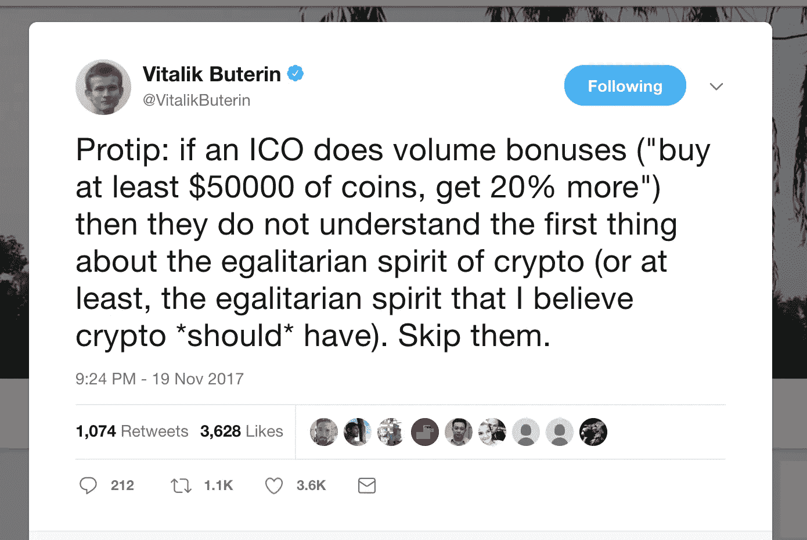

# 黑客攻击一种流行的 ICO 做法，只奖励富人

> 原文：<https://medium.com/hackernoon/hacking-a-popular-ico-practice-that-only-rewards-the-richer-7d10b2019f1e>


如果你已经加入以太坊/加密货币生态系统至少几个月了，你可能会意识到 ICO 热潮正在蔓延。
几乎每天都有几十起 ICO/Token 销售涌现，这可以在热门平台上看到——比如 [IcoAlert](https://www.icoalert.com/) 或[Token market](https://tokenmarket.net/ico-calendar)——追踪 ICO 活动。

ICO 团队推广和激励代币销售的最常见做法之一是，根据**何时**购买代币或**愿意投资多少**向贡献者提供高额折扣或奖金。



Why should the rich get richer?

最近，有一些关于 ico 是否可以根据购买量/花费来提供奖金的激烈争论。

这种做法的批评者认为，这违背了以太坊的精神——以及一般的加密——奖励拥有更多资源的人，以获得对其他资源较少的人的优势。

# 通过资源池访问批量折扣

基于销量的奖金不会很快消失。那么…如果我们不能(或不愿)承诺 ICO 团队要求的最低额，我们如何利用这些奖金呢？

其中一种方法是找到几个对特定 ICO 也感兴趣的朋友，让他们将他们的以太发送给组中的一个成员，让他购买代币，然后在这组朋友中相应地分发获得的代币。


Love, Faith and Hope. These are much needed when investing together with friends. (Photo by [Jonathan Brinkhorst](https://unsplash.com/photos/45W2fOHWxYo?utm_source=unsplash&utm_medium=referral&utm_content=creditCopyText) on [Unsplash](https://unsplash.com/?utm_source=unsplash&utm_medium=referral&utm_content=creditCopyText))

理论上，这种方法非常简单明了，但是在实践中，它可能会有问题。首先，你必须相信这个人接受了所有人的以太，这已经是一个危险的提议。如果这个人带着钱消失了呢？如果他忘记了他的私人钥匙怎么办？如果他的私人钥匙被偷了怎么办？如果他犯了一个错误，把钱寄到一个不正确的地址怎么办？有太多的事情可能会出错。

此外，如果我们没有足够多的朋友有兴趣和你一起投资某个特定的投资组合怎么办？你可能还是想这么做，然后和完全陌生的人凑钱。有一些网站和论坛，人们可以找到其他人一起投资，但这对所有参与者来说都是一个巨大的风险。我不会盲目地给一个我不太了解的人送钱，你也不应该。

那么，我们如何合作投资一个 ICO，而不必把我们的钱托付给任何人呢？当然是用智能合同！📄

# 建立投资池智能合同


在接下来的几段中，我将描述如何构建一个智能的合同，允许几个参与者给它寄钱；当满足某些先决条件时，让它投资于选定的 ICO 最后让它按比例分配购买的代币。

该智能合同将充当中介，从多个账户中收集资金，然后在一次交易中将收集到的资金转发给 ICO 合同，以便获得团队提供的基于数量的奖金。

然后，代币将通过合同购买，这允许参与投资池的参与者将代币提取到他们自己的账户中。

让我们看看允许这一切的智能合同。

## **但首先，一些免责声明、警告和注意事项:**

*   在使用以下合同为 ICO 创建投资池之前，您应确保 ICO 允许您以后提取令牌。例如，一些 ico 在收取捐款时不会使用智能合同。一些 ico 也有白名单机制和需要完成的 KYC 步骤，这些步骤可能会阻止合同代表自然人投资。
*   ICOPool 合同无法了解其目标 ICO 的细节，因为 crowdsale 合同没有标准协议。这意味着，例如，它不知道奖金是否有截止日期，最低/最高贡献金额是多少，或者 ICO 是否已经完成等。因此，该合同依赖于其管理员来正确配置它，并在适当的时候触发令牌购买。
*   ICOPool 契约通过对 crowdsale 契约进行外部调用，执行其回退功能，从而参与 ICO。大多数 crowdsale 合同准备在没有任何其他数据的情况下接收到 ether 时执行 buyTokens 函数(或类似名称的函数)。你应该确保你投资的 ICO 以这种方式运作。
*   不用说，所购买的令牌必须符合 ERC20 标准。如果没有，您将无法保证令牌可以从投资池转移到贡献者。
*   下面的代码还没有在现实项目中测试过。*使用自担风险，使用不当我不负责。*此外，确保您为投资池选择的 ICO 不是骗局。使用本合同的风险与通过向 ICO 发送以太网投资 ICO 的风险相同，本合同没有增加额外的安全机制。**谨慎从事。**

# ICOPool 智能合同

你可以在我的 Github 库中找到完整的源代码。 **请查看 README.md 文件，了解更多用法说明、更深入的信息和示例。**

**ICOPool 合同有 4 个部分:**

1.  配置投资池。
2.  接收来自贡献者的以太以形成池。
3.  一旦池的要求得到满足，就投资目标 ICO。
4.  允许贡献者获得所获得的代币。

## 配置投资池

为了建立一个投资池，首先我们必须部署带有几个参数的合同。部署 ICOPool 合同的帐户将成为其管理员。管理员的唯一目的是执行购买 ICO 的功能。

下面是创建投资池所涉及的代码。

```
function ICOPool(address _targetICO,
                    uint _minContribution,
                    uint _maxContribution,
                    uint _poolSoftCap,
                    uint _poolHardCap,
                    uint _contributorsSoftCap,
                    uint _contributorsHardCap
                    ) public {

        require (_targetICO != address(0));
        require (_minContribution > 0);
        require (_maxContribution > _minContribution);
        require (_poolHardCap > _poolSoftCap);
        require (_contributorsSoftCap > 1);
        require (_contributorsHardCap >= _contributorsSoftCap);

        // Max people * their minimum contribution should be able to meet pool softcap
        // For example, we can't allow having the max contributors (10 people) put $100 each when the softcap is $1500.
        require(_contributorsHardCap * _minContribution >= _poolSoftCap);
        // Min people * their maximum contribution should be within pool hardcap
        // For example, we can't allow 3 people to reach the hardcap if the minimum contributors is 5
        require(_contributorsSoftCap * _maxContribution <= _poolHardCap);

        targetICO = _targetICO;
        poolAdmin = msg.sender;
        minContribution = _minContribution;
        maxContribution = _maxContribution;

        poolSoftCap = _poolSoftCap;
        poolHardCap = _poolHardCap;

        contributorsSoftCap = _contributorsSoftCap;
        contributorsHardCap = _contributorsHardCap;
    }
```

该协定接收相当多的构造函数参数:

1.  **address _targetICO:** 这是投资池将向其投入资金的 ICO。任何使用这个契约的人都应该仔细检查这个变量是否指向组织者所说的 ICO。
2.  **uint _ min contribution&uint _ max contribution:**这些是投资池的贡献者可以放入池中的最小和最大乙醚量(以 wei 表示)。
3.  **uint _ poolSoftCap&uint _ poolHardCap:**这些是投资池为了能够投资目标 ICO 而允许的最小和最大乙醚量(以 wei 表示)。在管理员可以从 ICO 购买令牌之前，必须达到软上限。一旦达到硬性上限，就不接受任何捐款。
4.  **uint _ contributorsSoftCap&uint _ contributorsshardcap:**这些是投资池可以接受的最低和最高出资额。

请注意，所有这些参数之间存在复杂的关系，因此我们不会冒投资池被卡住的风险:

*   软上限( **_poolSoftCap)** 应低于贡献者的最大金额(**_ contributorsshardcap)**乘以他们的最小可能贡献( **_minContribution)。*通过这种方式，ICOPool 不可能在人员方面达到最大容量，但却无法达到最低以太网目标。(如果 10 人是允许的最大贡献者人数，如果软上限大于 10 个 eth，则他们每人不能只投资 1 个 eth)。***
*   同样，硬性上限应该高于缴款人的最低缴款额乘以他们的最大可能缴款额。这样，ICOPool 就不可能达到以太网的最大容量，但却达不到所需的最低人数。(如果最低人数为 3 人或 3 人以上，则不应允许 2 人到达游泳池的硬顶盖)。

注意到 ICOPool 合同没有办法知道触发奖金的最低贡献是多少也是非常重要的。这取决于管理员相应地正确设置软上限和硬上限。

## 从贡献者接收以太

一旦建立了投资池，创建合同的人就可以开始在其他人之间推广它，以汇集捐款。

向投资池投放乙醚的方式与众筹销售的方式相同。只要把乙醚转到给定的地址，合同会处理好的。

***值得一提的是，贡献者应该采取与直接投资众筹时相同的措施。例如，他们必须从他们拥有私钥的账户中汇款。**

下面是当有人从他们的账户汇款时执行的代码。

```
function() payable public {
        require(msg.value > 0);
        require(msg.value >= minContribution && msg.value <= maxContribution); // Must send eth within min and max contributions
        require(contributorsBalance[msg.sender].add(msg.value) <= maxContribution); // msg.sender's balance can't exceed max contribution limit

        // Pool can't exceed hard cap
        require(poolBalance.add(msg.value) <= poolHardCap);

        //Register how much eth the pool has
        poolBalance = poolBalance.add(msg.value);

        //If it is the first time this account contributes, increase num. of contributors
        if (contributorsBalance[msg.sender] == 0){
            amountOfContributors++;
        }
        // Pool can't exceed contributors hard cap
        require(amountOfContributors <= contributorsHardCap);

        //Register how much eth has each contributor put into the pool
        contributorsBalance[msg.sender] = contributorsBalance[msg.sender].add(msg.value);
    }
```

首先，我们确保所做的贡献在管理员定义的范围之内，并且没有超出人员/资金的硬限制。

如果捐款被接受，我们就把钱加到捐款人的账户上。贡献者不必一次投入所有的钱，但是每一笔贡献都应该达到管理员设定的最低要求。

## 投资目标 ICO

在任何时间点，只要满足最低要求，管理员可以决定停止收集资金，并从 ICO 购买代币。

一旦他这样做，投资池合同可能不再接受以太网的转让。

正如我之前提到的，这一步必须由管理员执行，尽管可以修改合同以允许任何贡献者执行。这种另一种做法，让契约少了对一个人的依赖，但也让契约更乱，更容易出问题。允许任何人购买令牌的主要问题是，这个 ICOPool 契约无法了解目标 ICO 的内部工作方式。为了避免冲突，管理员决定何时购买令牌，并对此负责。例如，合同无法检查 ICO 团队推广的批量奖励目前是否有效，因此由池管理员检查并继续购买令牌。或者什么都不做，这样捐献者就可以提取他们的资金。

```
function buyTokensFromICO() public {
        require(!investedInICO);
        require(poolBalance >= poolSoftCap);
        require(amountOfContributors >= contributorsSoftCap);
        require(this.balance >= poolBalance);

        //Can be called only by the pool admin to avoid timing problems
        // We'll need to trust the admin to execute this at the right moment
        // Could be changed to allow any contributor to call it.
        require(msg.sender == poolAdmin);

        investedInICO = true;

        // BE CAREFUL, OPENING RE-ENTRANCY DOOR
        require(targetICO.call.value(poolBalance)());

        // **************
        //If you are hesitant about using call() you can instead instantiate
        //the target ICO and directly use whatever function it has to buy tokens
        // ------
        //Crowdsale c = Crowdsale(targetICO);
        //c.buyTokens.value(poolBalance)();
        // **************
    }
```

将资金发送到目标 ICO 非常简单。一旦我们检查到满足软上限，我们就继续将以太网转发到目标 ICO。使用 call()函数并发送池余额将触发 ICO 的回退功能。

在投资资金池之前，管理员(和贡献者)应该做的一件事是确保资金池确实能够投资目标 ICO。该合约假设 ICO 具有回退功能，该功能触发合约自身的 buyTokens(或无论它被称为什么)功能。

如果目标 ICO 没有实现回退功能，或者您对使用 call()函数执行潜在的不安全代码感到不安全，那么您可以使用我在代码中保留注释的另一种方法。您可以实例化目标 ICO 契约，并直接调用它的 buyTokens 函数。

这个函数还设置了 investedInICO 标志，所以我们只能调用这个函数一次。如果相关人员想要筹集更多资金并进行第二次投资，他们必须创建一个新的 ICOPool 合同。

## 收回代币

完成上一步后，目标 ICO 的令牌应持有我们 ICOPool 的令牌余额。

您应该能够通过调用令牌的 balanceOf()函数来检查这一点，方法是将 ICOPool 的地址传递给它。

因此，每个贡献者还需要完成一个步骤；收回每个人有权得到的代币。

```
function withdrawTokens(address _tokenAddress) public {
        require(contributorsBalance[msg.sender] > 0);

        ERC20 token = ERC20(_tokenAddress);
        require (token.balanceOf(this) > 0);

        // tokenBalance is always the max tokens the pool bought (balanceOf + already withdrawn)
        uint tokenBalance = token.balanceOf(this).add(tokensWithdrawn);

        // Get contributor share based on his contribution vs total pool
        // poolBalance (total wei pooled) -> contributorsBalance[msg.sender] (wei put by msg.sender)
        // tokenBalance (total tokens bought with poolBalance) -> tokensToWithdraw (how many tokens corresponds to msg.sender)
        uint tokensToWithdraw = tokenBalance.mul(contributorsBalance[msg.sender]).div(poolBalance);
        tokensToWithdraw = tokensToWithdraw.sub(tokensWithdrawnByContributor[msg.sender]);

        require(tokensToWithdraw > 0);

        // Keep track of tokens already withdrawn
        tokensWithdrawn = tokensWithdrawn.add(tokensToWithdraw);
        tokensWithdrawnByContributor[msg.sender] = tokensWithdrawnByContributor[msg.sender].add(tokensToWithdraw);

        // Transfer calculated tokens to msg.sender
        require(token.transfer(msg.sender,tokensToWithdraw));
    }
```

正如我上面提到的，ICOPool 契约现在持有它购买的令牌。现在由每个贡献者调用 withdraw tokens(address _ token address)函数来撤回他们自己的令牌。

请注意，该函数需要一个参数，即令牌的地址，不要与 ICO 的地址混淆。此时，ICO 没有任何用处，我们需要的是改变令牌的所有权，因此我们需要获得令牌地址。

当其中一个贡献者调用此函数时，它将根据该池收到的总金额以及此人的贡献代表多少来计算他们有权获得多少代币。例如，假设总池余额为 100 eth，用于购买 100.000 个代币。如果我投资 30 以太，那么我将有权获得 30.000 代币。

该函数将计算出购买的所有令牌中有多少对应于贡献者，然后调用令牌上的转移函数，从合同向贡献者进行转移。

如果您再次调用 balanceOf()，那么贡献者现在应该拥有这么多令牌，而契约应该更少。

需要注意的一点是，这个函数被设计成贡献者可以不止一次地调用它，如果有比以前更多的令牌，他将得到差额。如果我之前提到 ICOPool 契约只能购买一次令牌，您可能会奇怪我们为什么要这样做。嗯，除了购买代币，我们的 ICOPool 合同还有可能收到代币。一些 ico 最近正在实施一种流行的营销实践，称为空投，他们基本上是向随机地址发送令牌，以推广他们的产品。我们的 withdrawTokens()函数的工作方式也允许贡献者获得他们的代币份额。

# 从这里去哪里

这份合同有许多可以改进的地方。例如:

*   部署合同的人(即管理员)将比其他贡献者产生更多的成本，因为他必须支付部署 ICOPool 合同所需的费用，而且他不会因此得到补偿。我们可以设计一些方案，奖励组织投资池的人更多的代币。
*   我们可以给它加上一个截止日期，如果到那个日期还没有买到代币，这个池就被取消了。
*   如果众筹合同有一些标准或通用的协议，我们可以让我们的合同对贡献者更友好。
*   合同可以修改，允许投资于一个以上的 ICO，甚至决定，以某种方式，投资于哪些 ICO 给他们的奖金计划。

如果你有兴趣执行这份投资 ICO 的合同，请给我写信。请联系我，如果你发现任何错误或你想讨论这个代码的任何部分。

我希望你喜欢读这篇文章，就像我喜欢写这篇文章一样。我目前正在从事与智能合同开发相关的咨询工作。如果你打算通过 ICO 筹集资金，或者开发基于区块链的产品，请随时与我联系。