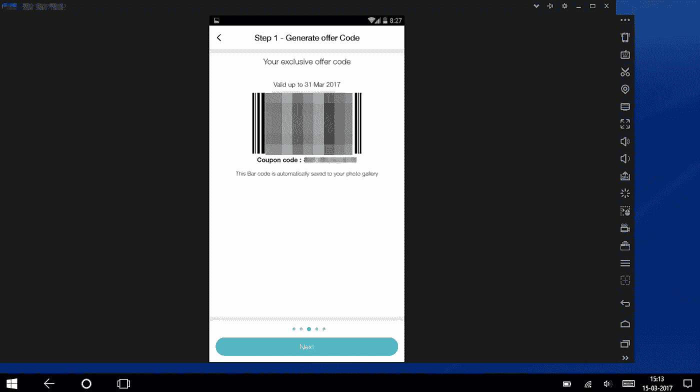

# 黑客和罗宾汉情结

> 原文：<https://medium.com/hackernoon/hacking-and-the-robin-hood-complex-63ae0074b8dd>

The phone emulator app running on a PC

很久很久以前，在微支付和 99 美分应用出现之前，我曾经通过寻找网络上的漏洞来黑掉我需要的任何软件(通常是微软的)。我不是真正的黑客，因为我对编码一无所知。但是我知道的足够多，可以找到漏洞，让软件在我的电脑和手机上运行。

## 伦理问题

我知道这是偷窃，但我会努力为自己辩护，说在那些天价(以印度货币计算)下，在盗版规则更严格的国家，软件开发者会收回更多的成本。例如，微软正在赚钱，所以很难对破解 Windows 或 Word 感到特别内疚。

此外，黑客软件也有其有趣的一面。他们提出了一个精神上的挑战，因为每当软件创建者消除了一个漏洞，破解者就会在复杂的修复上领先一步。破解一个应用程序可能是一个相当令人沮丧的练习，但那个“哈哈”时刻让它值得麻烦。

也有消极的一面。上传漏洞的网站过去充斥着病毒、色情和网络钓鱼诈骗。我的电脑总是有受损的风险。此外，被黑客攻击的软件经常是有缺陷的，并且倾向于崩溃，我过去不得不浪费相当多的时间来修复它。

回顾过去，我认为钱不是人们入侵软件的唯一原因。许多黑客都有罗宾汉情结。例如，为了挤出竞争对手的浏览器，那个时代的软件巨头微软将互联网浏览器捆绑到了它的视窗操作系统中。这导致了网景导航的崩溃，它曾经拥有 72%的浏览器市场。微软因其垄断策略被政府罚款，并以恶棍的身份出现。所以，剽窃微软的软件并与那些负担不起的穷人分享是可以接受的。

尽管如此，我仍然对入侵应用程序感到内疚。我已经在写作了，我知道如果有人偷了我正在写的东西，我不会喜欢的。但在那些日子里，我是一个破产的学生或刚刚起步，它要么是黑客软件或什么都没有。但我一直在寻找出路。

因此，当苹果推出应用商店，应用价格开始变得合理时，我收起了我的黑客帽，走上了一条笔直狭窄的道路，并一直走下去。此外，一旦你习惯了法律应用程序，就很难回头，因为我更喜欢花时间“使用应用程序”而不是“修复应用程序”

无论如何，我和微软达成了和解，成为了 Windows 10 的测试人员，为此他们给了我一个免费的操作系统版本。在这条线上的某个地方，我转到了苹果电脑，在那里大部分基本应用都是免费的。苹果公司的大部分利润来自其昂贵的硬件，我想应用商店里的应用会降价 30%。

在手机方面，我确实尝试过越狱一部旧 iPhone，只是为了寻求刺激，但很快就厌倦了崩溃，并恢复了手机。我懒得给我的安卓系统装根，因为那时我已经受够了摆弄软件，对能正常工作的设备更感兴趣，所以我可以工作了。看起来我的黑客生涯确实结束了。

但是随着一个新的公司恶霸的到来，生活发生了意想不到的转变。

## 镇上的新恶棍

在印度，手机网络提供商已经取代软件巨头成为企业界的新恶人。在市场领导者 Airtel 的领导下，他们形成了一个非正式的卡特尔，在提供最低服务的同时人为地保持高价格。一个为期 30 天的 1gb LTE 数据包的价格约为₹300(5 美元)。电话和短信是额外的，在印度的另一个邦旅行会增加漫游费用。因此，普通用户每月在手机上的总支出可以很容易地触及₹1500 那微不足道的 1 GB 数据。

并不是说他们满足于榨取市场。有一次，Airtel 甚至试图通过对 WhatsApp 语音通话收费，让客户为出售给他们的数据支付两倍的费用。Airtel 声称，客户拨打 WhatsApp 电话带来的语音通话收入正在减少。

当新的蜂窝网络提供商 Jio 推出为期 3 个月的免费试用服务，每天提供 4GB 的数据，以及无限制的免费语音通话和消息，并且没有漫游费时，Airtel 的说法的荒谬性暴露无遗。语音通话是通过数据进行的，就像 WhatsApp 通话一样。Jio 将试用期限又延长了三个月，然后在 4 月份宣布推出 1gb/天、4G 速度的数据包、免费通话和短信，以及每天不到 5 美元/月的₹10 漫游费。尽管 Jio 的数据速度还没有达到 4G，而且有一些节流，但它仍然是世界上最好的数据方案之一。

这对其他卡特尔成员的影响很有趣。犹豫了一段时间后，他们削减了客户成本，并增加了数据量，以满足 Jio 的报价。没有什么比竞争更能让顾客生活得更好了。

但那时，顾客已经开始涌向 Jio。这是事情变得危险的时候。卡特尔成员不想失去客户，开始削减通过他们网络的 Jio 呼叫(掉线)。印度政府进行了干预，对他们征收了巨额罚款，这才得以解决。

但是希望将现有号码移植到 Jio 的客户仍然发现他们的道路上有许多障碍。我就是这些客户之一，因为我的网络提供商 Aircel 拒绝了我的移植请求，说我的账单没有支付。那不是真的，因为我在上一次账单上多付了钱。此外，我在他们那里有₹1500 存款。理论上，我可以再次申请，但有一个技术问题。

## 寻找漏洞

印度政府坚持认为所有的 SIM 卡都应该绑定一个身份，以便追踪恐怖分子之类的人。因此，Jio 使用 Jio 应用程序，根据客户 4G 手机上生成的条形码发行 SIM 卡。该代码通过顾客的 Aadhaar 卡(印度的国民身份证)与顾客联系在一起。

问题是 Jio 的政策是“一部手机一个条形码”。该代码还与手机的 IMEI 号码相关联。一旦移植请求被拒绝，那个条形码就会被搁置，你需要一部新手机来生成另一个条形码。这意味着如果你没有第二部手机或者没有第二部手机，你就被困住了。谁会买手机只是为了生成一个条形码？

卡特尔成员知道这个漏洞，并通过谎称账单未付来拒绝移植请求。基本上他们是反复无常的，并希望侥幸逃脱。我是移植过程陷入僵局的受害者之一。

## 道德黑客的悖论

如果像 Aircel 这样的网络提供商扭曲规则，我想我自己扭曲规则是合理的，以绕过他们不正当的计划。

那么我需要做什么呢？

我不得不破解 Jio 应用程序来生成一个有效的条形码。使用它，我可以放入一个新的应用程序，将我的号码移植到 Jio 网络。

在一个不存在的或被盗的 IMEI 上生成条形码对我来说似乎不太合适。如果某个可怜家伙用我用过的 IMEI 买了手机，却发现代码已经被兑换了，那该怎么办？他会被卡住。

这扰乱了我的公平观。让一个无辜的人为我与企业恶霸的斗争付出代价是不对的。

回到绘图板，或者更确切地说，回到互联网，没多久我就发现了一个漏洞，这个漏洞让我处于法律边缘。

我的 Android 手机有一个双 SIM 卡插槽，这意味着它有两个 IMEI 号码。Jio 应用程序仅使用第一个 SIM 卡插槽的 IMEI 来生成条形码。如果我可以欺骗应用程序使用我手机的第二个 IMEI 号码会怎么样。这样，我就不会偷任何人的 IMEI 号码。

所有系统准备就绪。

## 让假想的钞票消失

但首先，我需要确保 Aircel 不会再次拒绝我的移植请求。我需要做的是将我的后付费 SIM 卡转换为预付费 SIM 卡，因为预付费 SIM 卡无法报销未付账单。

幸运的是，我已经预见到这种情况，并在四个月前申请了 Aircel。他们接受了我的请求，并漫不经心地说这将需要三个月的时间来实施，因为有很长的转换队列。我咬咬牙，说好吧。四个月后，我回到 Aircel，要求知道为什么没有转换为预付费。客服人员说当天就能搞定。不是的。于是第二天在回家的路上又回去了，这样持续了三天。面对如此巨大的压力，Aircel 别无选择，只能将我的 SIM 卡转为预付费卡。相应的，我的手机就下线了。我打电话给服务中心，他们说需要三天的时间转换才能生效，手机才能重新上线。今天是第二天。

到目前为止，一切顺利。

## 破解密码

我的下一步是欺骗 Jio 应用程序在 4G 手机上生成条形码。我在网上查了一下，发现如果我给我的安卓系统加根，我就可以改变它的 IMEI。因为我不知道如何给一个机器人安装根，所以我在 YouTube 上找了一个 12 岁的孩子帮忙。

生根工作完美无缺，但原本应该改变 IMEI 号码的 Android 应用程序有问题。我试图下载一个替代应用程序，但它开始从随机网站安装应用程序，导致我的手机疯狂地弹出病毒警告。我不想要处理病毒和数据盗窃的头痛，也不了解足够多的机器人来整理病毒。是时候按下暂停键，回到绘图板了。

第二轮。在网上多做一点研究就给出了第二个选择。一个可以在 PC 上运行的手机模拟器。值得一试。

只有一个条件。过去几年，我一直使用 Mac 电脑，并不熟悉 Windows 电脑。但是没有选择，因为 Mac 版的应用程序缺少关键功能。所以我下载了这个应用程序，并把它安装在我孩子的电脑上。

这是我第一次运行手机模拟器。所以整件事看起来有点陌生。但是，在稍微摆弄了一下之后，我开始找到了窍门。

这个东西基本上是为了让游戏玩家在 PC 上玩手机游戏。但像往常一样，黑客们已经知道如何用它做其他事情。

在我的例子中，我可以访问仿真手机的设置，并将它的 IMEI 号码更改为我想要的号码，然后在仿真手机上运行 Jio 应用程序来生成条形码。

此时，我遇到了新的障碍。最新版本的 Jio 应用程序不会被模拟手机愚弄。所以我需要更早的版本。在网上搜索了一会儿后，我找到了以前的应用程序，并将其安装在仿真手机上。在运行应用程序时，它生成了条形码。

我追踪了这么久的猎物终于在我手里了。差不多了。

## 业余选手摊牌

在这一点上，我的业余身份变得明显。我只是不知道如何从电脑中取出条形码。互联网懒得解释，因为它认为任何正派的黑客都会知道这些基本的东西。

经过一番探索，我发现模拟器应用程序提供了一个屏幕捕捉功能。宾果，我对条形码屏幕进行了截屏，应用程序通知我它已保存到图库中。

但是现在我遇到了一个新问题。我就是找不到屏幕截图，因为它不在图库中，也不在电脑的任何地方。

我完全迷惑了，花了半个小时打破了我的头，在我的管灯终于打开之前。屏幕截图必须保存在模拟器手机的图库中。果然，它就在那里。

当我右击截图，选择“复制”并把它粘贴到我的 u 盘上时，我明显松了一口气。我用完了电脑。

我通过 WhatsApp 把它从 USB 发送到我的手机上，现在我使用这种设备比使用个人电脑更舒服。

现在我所要做的就是耐心地等待我的 Aircel 后付费 SIM 卡完成到预付费 SIM 卡的转换，之后我可以在 Jio 重新申请移植过程，同时让我的手指交叉在黑客上。

## 测试裂缝

幸运的是，第二天一个朋友打电话来说了类似的移植问题。他还想把现有号码移植到 Jio，但只有一部 4G 手机。他已经用它生成了 Jio 条形码。他确实有第二部手机，但那是一部 3G 手机，不会生成条形码。

这是我测试黑客的机会，也是我帮助一个朋友逃离另一个卡特尔成员沃达丰贪婪魔掌的机会。

由于 3G 手机是我朋友自己的手机，我不必担心窃取别人手机的 IMEI 来生成 Jio 条形码。于是我让朋友把 3G 手机的 IMEI 号发给我。然后，我继续再次运行黑客。第二次就简单多了，几分钟后，我把条形码发给了他。

第二天他拜访了 Jio 经销商，申请移植，把条码给了经销商。

几分钟后，我收到了一条信息，一个‘竖起大拇指’的表情符号。

> [黑客中午](http://bit.ly/Hackernoon)是黑客如何开始他们的下午。我们是 [@AMI](http://bit.ly/atAMIatAMI) 家庭的一员。我们现在[接受投稿](http://bit.ly/hackernoonsubmission)，并乐意[讨论广告&赞助](mailto:partners@amipublications.com)机会。
> 
> 如果你喜欢这个故事，我们推荐你阅读我们的[最新科技故事](http://bit.ly/hackernoonlatestt)和[趋势科技故事](https://hackernoon.com/trending)。直到下一次，不要把世界的现实想当然！

