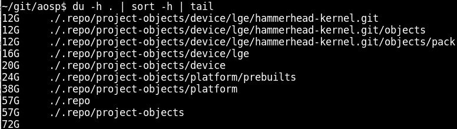

# 黑安卓手机。兔子洞有多深。

> 原文：<https://medium.com/hackernoon/hacking-android-phone-how-deep-the-rabbit-hole-goes-18b62ad65727>


我的第一部 Android 手机 Galaxy Note N7000 是在 2011 年 10 月发布会后买的。多亏了一个叫 bauner 的德国人，我有机会使用最新版本的 CyanogenMod(现在是 [LineageOS](https://forum.xda-developers.com/galaxy-note/development/rom-nightowl-preview-t3455847) )。不幸的是，我的手机在大约一年半前使用廉价的中国汽车充电器后死亡。

我花了很长时间寻找替代品，停在了[京瓷](https://ru.wikipedia.org/wiki/Kyocera)(是的，他们生产手机)KC-S701。看起来挺野蛮的，没有触摸按键。我甚至没有想过要以 root 用户身份访问电话。我确信现在每部手机都有可能获得 root。总会有人能把 CyanogenMod 移植到它上面。我弄错了。

在一年半的时间里，只发布了一个内核更新— [修复](https://github.com/torvalds/linux/commit/a134f083e79fb4c3d0a925691e732c56911b4326)解决了一个特制 ping 数据包上的内核故障。此外，一年前，Android KitKat 已经被认为是相当老了。不幸的是，既没有信息，也不可能获得根访问。同样的硬件也用于名为京瓷准将 E6782 的美国版手机。默认情况下，它具有快速启动模式，无法启动未签名的内核(只能启动，不能闪存，只能使用旧的易受攻击的引导加载程序，[CVE-2014–4325](https://www.codeaurora.org/projects/security-advisories/fastboot-boot-command-bypasses-signature-verification-cve-2014-4325))，此外，它还提供了一个通过按下手机按钮启动到快速启动和恢复模式的机会。通过威瑞森(或者京瓷)的努力？)安卓版的准将已经更新到棒棒糖了。

于是，我决定自己处理在 Android 上获取 root 的过程。

两个月前，我对 Android 内部一无所知(实际上，现在[我甚至不知道更多](https://en.wikipedia.org/wiki/I_know_that_I_know_nothing))。大多数知识是通过阅读源代码和实验获得的，因为互联网上缺乏关于 Android 黑客的信息。以下信息适用于 Android 4.4 KitKat，但我认为也有可能应用于新版本。

我想提请你注意的是，这篇文章中描述的信息只是我个人在特定手机型号上的 Android 黑客经验，所以如果你不想破坏手机，请小心使用它。如果你想用这篇文章来修复你的手机，我建议你忘记你在日常生活中使用你的手机，做一个备份，然后进行硬重置。这将在出现致命错误时保护您的数据。

这篇文章不仅描述了导致成功的行动，也描述了错误。我希望我为达到期望的结果所做的尝试，以及无数次的失败，会让你感兴趣。

这项研究是在 Linux 环境下进行的。

# dirty cow(CVE-2016–5195)

简而言之，dirty cow([Android 的工作漏洞](https://github.com/timwr/CVE-2016-5195))允许你替换任何进程的内存(如果你熟悉汇编就很有用)，或者任何可供读取的文件，即使它在只读文件系统中。建议哄骗大小大于或等于替换大小的文件。dirtycow for Android 的主要攻击是`/system/bin/run-as`欺骗。它是 Android 中的某种`sudo`，允许调试应用程序。由于 **android-19** API(参见[匹配 API 和 android 版本的表格](https://source.android.com/source/build-numbers.html))`/system/bin/run-as`具有 **CAP_SETUID** 和 **CAP_SETGID** 功能标志(在旧版本中使用 suid 位- `6755`):

```
$ getcap bin/run-as
bin/run-as = cap_setgid,cap_setuid+ep
```

如果文件系统是以读写模式装载的，dirtycow 欺骗的所有内容都将被写入文件系统。因此，您必须备份原始文件，并在获得 root 访问权限后恢复它，或者不要以读写模式重新挂载文件系统。一般 Android 中的 **/system** 分区默认以只读方式挂载。

这就是为什么 dirtycow 被认为是 Linux 中发现的最严重的漏洞之一。使用适当的知识，您可以绕过内核的所有安全级别，包括 SELinux。

# SELinux

初学者应该知道 SELinux 上下文是如何工作的。Gentoo wiki 里有一篇很好的文章:[https://wiki . Gentoo . org/wiki/SELinux/Tutorials/How _ does _ a _ process _ get _ into _ a _ certain _ context](https://wiki.gentoo.org/wiki/SELinux/Tutorials/How_does_a_process_get_into_a_certain_context)

简而言之，你应该知道以下几点:

*   如果在 sepolicy 规则(上下文转换)中描述了这样的操作，则可以更改 SELinux 进程上下文。Android 4.4 (KitKat)提供了通过改变 SELinux 上下文来提升权限的可能性。从 Android 5.x 开始，这已经不可能了。
*   有文件上下文。
*   除了进程和文件上下文，Android 还实现了自己的 **property_contexts** 。
*   规则如下:源上下文(应用程序)被允许访问目标上下文(文件系统)。在 SELinux 强制模式下，应用程序只允许执行明确授权的操作。其余的是禁止的。

# Adbd 和控制台

在生产 Android 设备中获得部分特权外壳的唯一可能方式是开发者模式。开发者模式启动 adbd 守护进程，它可以充当某种 ssh / telnet 服务器。在 Android KitKat `/sbin/adbd`中，二进制文件位于 [initramfs](https://en.wikipedia.org/wiki/Initramfs) 中，对于非 root 用户来说是不可读的。最初，adbd 作为根用户执行，它运行在 **u:r:init:s0** SELinux 上下文中(由 init 使用，通常比其他上下文有更多的特权)。如果`/init.rc`有明确指定的进程上下文，如 **seclabel u:r:adbd:s0** ，进程将在该上下文中立即开始。在初始化的情况下，根据编译选项( [user、userdebug 或 eng](https://source.android.com/source/building.html#choose-a-target) 和 Android 设置( [properties](http://rxwen.blogspot.com/2010/01/android-property-system.html%5D) )，adbd 降低特权:它将当前用户更改为 shell，将 SELinux 上下文设置为 **u:r:shell:s0** ，并修剪除 **CAP_SETUID** 和 **CAP_SETGID** 之外的所有系统功能(这是通过`run-as`调试应用程序所必需的)。**功能限制集**不允许应用程序升级功能，只能删除它们。这些特权允许你做更多的事情。您可以使用下面的命令`cat /proc/self/status | grep CapBnd`查看当前进程的能力。例如，用`capsh`命令(Android 上没有)解密它们。：

```
$ capsh --decode=0000001fffffffff
0x0000001fffffffff=cap_chown,cap_dac_override,cap_dac_read_search,cap_fowner,cap_fsetid,cap_kill,cap_setgid,cap_setuid,cap_setpcap,cap_linux_immutable,cap_net_bind_service,cap_net_broadcast,cap_net_admin,cap_net_raw,cap_ipc_lock,cap_ipc_owner,cap_sys_module,cap_sys_rawio,cap_sys_chroot,cap_sys_ptrace,cap_sys_pacct,cap_sys_admin,cap_sys_boot,cap_sys_nice,cap_sys_resource,cap_sys_time,cap_sys_tty_config,cap_mknod,cap_lease,cap_audit_write,cap_audit_control,cap_setfcap,cap_mac_override,cap_mac_admin,cap_syslog,cap_wake_alarm,cap_block_suspend
```

您可以使用`id`或`cat /proc/self/attr/current`命令查看当前的 SELinux 上下文。可以通过`cat /proc/self/attr/prev`查看以前的上下文。

查看文件的上下文:`ls -Z`

查看正在运行的进程的上下文:`ps -Z`

# 获得 root 访问权限

我做的第一件事是使用 dirtycow 来实现它的预期目的——欺骗`/system/bin/run-as`,它允许我将 UID / GID 设置为 0(和`su`做的一样)。然而，我无法挂载文件系统(以及 tmpfs)，无法加载内核模块和查看`dmesg`。我甚至无法浏览拥有 0700 权限并属于其他系统用户的目录。我只能读写块设备。只有当适当的 UID / GID 被设置为指定的用户时，查看文件或目录才是可能的(我发明了自己的[轮](https://github.com/kayrus/CVE-2016-5195/blob/3d8262a5399bd91d187533095361995c98974040/run.c) - `su`选择，它设置 SELinux 上下文和用户/组)。这有助于我理解内部)。

然后我转储了整个固件，引导和恢复:

```
$ dd if=/dev/block/mmcblk0 of=/storage/sdcard1/mmcblk0.img
$ dd if=/dev/block/platform/msm_sdcc.1/by-name/boot of=/storage/sdcard1/boot.img
$ dd if=/dev/block/platform/msm_sdcc.1/by-name/recovery of=/storage/sdcard1/recovery.img
```

您可以使用`kpartx`和`[unpackbootimg](https://github.com/osm0sis/mkbootimg)`等实用程序来检查完整的转储。`kpartx -a mmbblk0.img`命令创建一个可通过`/dev/mapper/loop0`路径使用的虚拟块设备。您可以像使用常规块设备一样使用转储。引导和恢复分区的转储可以使用`unpackbootimg`来解包。

然后我试图**零**恢复，只是为了检查写操作是否工作，然后立即从转储中恢复恢复。

如果我可以写入块设备，那么我也可以编写自定义恢复。我找到了准将的 TWRP，闪入恢复分区，重启手机:`adb reboot recovery`。我没有看到任何与 TWRP 有关的东西，只有带感叹号的安卓图标。这看起来像一个标准的 Android 恢复，不像 TWRP。

我重启手机进入正常模式，运行漏洞并检查恢复分区的哈希——哈希与原始分区匹配。我试图再次写入数据—哈希已更改！然后我想起了 Linux 页面缓存，并刷新它(`echo 3 > /proc/sys/vm/drop_caches`)——哈希值再次与原始值匹配。因此，我写入块设备的所有内容都被“重定向”到`/dev/null`中，没有任何错误，有时还会存放在 Linux 缓存中。但是固件更新是如何工作的呢？以及用户数据是如何存储到内存中的？我不得不进一步挖掘。

# 试图禁用 SELinux

当时我认为所有的限制都是由于缺少 SELinux 特权造成的(我完全忘记了功能的减少)。我无法查看 dmesg，logcat 没有显示任何相关内容。我开始思考如何禁用 SELinux。

我能找到的第一条线索是:

```
$ grep -A2 reload_policy boot_initramfs/init.rc
on property: selinux.reload_policy = 1
     restart ueventd
     restart installd
```

[源代码](https://android.googlesource.com/platform/system/core/+/android-4.4.2_r2/init/property_service.c#350)说当你改变这个选项时，init 从`/sepolicy`文件中重新读取和加载 SELinux 策略。

因为我使用的是 dirtycow，所以我可以覆盖`/sepolicy`并执行`setprop selinux.reload_policy 1`命令来重新加载更新后的策略。

首先你必须弄清楚`/sepolicy`文件里面是什么。您可以使用`sesearch`命令(Debian 中的`setools`包)来读取它的规则。

```
$ sesearch --allow sepolicy
$ sesearch --neverallow sepolicy
$ sesearch --auditallow sepolicy
$ sesearch --dontaudit sepolicy
```

在我的例子中,`/sepolicy`文件只包含**允许**规则，这意味着——当 SELinux 处于强制模式时，应用程序只被允许做策略中授权的事情。因此允许 init 进程重新加载策略，但不允许它改变实施模式:

```
$ sesearch --allow sepolicy | grep 'load_policy'
  allow init kernel: security load_policy;
```

我的目标是允许 init 上下文将强制模式设置为 permissive (setenforce 0)。

我做的第一步:从库存的 Android KitKat 构建一个标准策略，替换原来的`/sepolicy`，加载(作为 root: `setprop selinux.reload_policy 1`)并在状态栏中收到一条消息，表明手机处于无保护模式(稍后会有关于此通知的更多细节)。在那之后，手机拒绝运行应用程序，变得非常周到，除此之外，我仍然无法设置许可模式，因此手机最终重启。否定结果也是结果，`/sepolicy`替换有效。

我的第一个想法是:股票政策不适合这款手机，由于缺乏权限，它开始出现故障。

然后，我决定重新构建原来的策略，并向 shell 上下文添加尽可能多的特权。

我找到了一篇[文章](https://ge0n0sis.github.io/posts/2015/12/exploring-androids-selinux-kernel-policy/)，它解释了如何“逆向工程”该政策。我能够解决所有的依赖关系并运行`[sedump](https://github.com/kayrus/sedump/)`实用程序。结果，我收到了一个文本文件，我能够把它编译成二进制格式(KitKat 的`checkpolicy -M -c 26 -o sepolicy.new policy.conf`)，甚至得到了一个和原来的`sepolicy`大小完全一样，但是十六进制内容不同的文件。加载新的策略文件导致了与之前完全相同的结果——几分钟后手机重启。

我决定从以下文件中编译两个策略:原始反编译的`policy.conf`和拥有`allow init kernel: security`内所有权限的`policy.conf`，包括 **setenforce** 。这些文件的比较可以告诉我哪些字节我必须替换原始的`sepolicy`二进制文件。

原来只改了两个字节。我试图在原始的**策略**中找到匹配，但是我找不到。然后我写了一个强力脚本，将两个字节替换为“0xFF，0xFF”，启动`sesearch --allow | grep "desired result"`，如果不符合结果，就尝试替换下一个递增偏移量上的字节，依此类推。几分钟后，脚本在原始策略中找到了必要的偏移量。我替换了字节，在电话里伪造了原来的政策。此时它工作正常，没有重新启动。但是我仍然无法禁用 SELinux 强制模式。

过了一会儿，我发现了一个可以修改二进制文件的 [sepolicy-inject](https://bitbucket.org/joshua_brindle/sepolicy-inject/) 实用程序。它可以添加新的许可 SELinux 上下文，或者将功能添加到现有规则中。虽然添加许可上下文会增加`sepolicy`文件，但修改现有规则不会增加文件大小。不幸的是，该工具每次运行只添加一个权限。我不得不编写另一个脚本来授予每个规则所有的功能。新策略文件的大小与原始文件的大小相匹配。但是，政策再一次没有帮助。

然后我注意到 Android 有`load_policy`命令可以从任何路径重新加载策略:

```
# it has to be executed under system user
# since /sys/fs/selinux/policy is owned by system user in my phone
adb shell run-as /data/local/tmp/run -u system -c u:r:init:s0 load_policy /data/local/tmp/sepolicy.new
```

或者这样:

```
$ run-as /data/local/tmp/run -u system -c u:r:init:s0 sh -c "cat my_policy > /sys/fs/selinux/load"
```

您可以添加任何许可域，加载新策略并在该域的上下文中工作(顺便说一下，chainfire [的 supersu 对于新的 Android 版本以相同的方式工作](https://su.chainfire.eu/#selinux-contexts-basics))。但即使这样也没有给我禁用 SELinux 的可能性。我决定从另一个方向挖掘。

# 调查恢复


我从检查引导分区和恢复分区之间的差异开始。除了 initramfs 之外，它们是相同的。恢复分区的 initramfs 有`init.rc`，它只有一个执行`/sbin/recovery`的服务。调查`strings sbin/recovery | less`输出和读取[原始恢复源代码](https://android.googlesource.com/platform/bootable/recovery/+/android-4.4.4_r2/recovery.cpp)得出以下结果:

*   默认恢复只是显示 Android 徽标，然后在超时后重新启动
*   如果你想“进入”恢复，你必须创建一个`/cache/recovery/command`文件，里面有相应的命令，即`--show_text`，它将显示恢复菜单。

我编写了文件并执行了`adb reboot recovery`命令。手机重新启动，我能够看到标准的恢复菜单。至少有些结果。我试图通过`adb sideload`刷新 supersu ZIP 文件。操作因出错而终止。我并没有真正注意这个错误，而是开始研究负责 ZIP 数字签名验证的恢复代码。

原来，恢复 initramfs 包含一个 [minicrypt](https://github.com/IanHarvey/minicrypt) 格式的`res/keys`公钥，用于检查 ZIP 文件的数字签名。公钥似乎是一个标准的 Android 测试密钥，所以我可以用这个密钥签署任何 ZIP 文件。您可以使用下面的命令检查该密钥:

```
$ java -jar dumpkey.jar android/bootable/recovery/testdata/testkey.x509.pem > mykey
$ diff -u mykey res/keys
```

我试图直接从 sdcard 安装 ZIP，但是在安装 sdcard 时恢复导致了一个错误。对`etc/recovery.fstab`文件的调查显示了实际问题:恢复模式下的 SD 卡被安装为 vfat:

```
$ grep mmcblk1 recovery/ramfs/etc/recovery.fstab
/dev/block/mmcblk1p1/sdcard vfat nosuid, nodev, barrier = 1, data = ordered, nodelalloc wait
```

我的 64Gb 卡是用 exFAT 格式化的。我找到了一个旧的 2Gb 卡，将其重新格式化为 vfat，编写了 ZIP 并将其插入手机。这一次恢复能够安装卷，我可以在手机上查看它的内容。但是，ZIP 安装再次导致错误: **E:无法设置安装所需的挂载；中止**。

`strings recovery | less`命令显示这次恢复有自定义的 Kyocera 字符串，至少有与`/data`分区擦除命令相关的字符串。在阅读原始源代码后，我发现这个错误是由`[roots.cpp](https://android.googlesource.com/platform/bootable/recovery/+/android-4.4.2_r2%20/roots.cpp#206)`文件的`setup_install_mounts`函数引起的。由于某种原因，恢复未能卸载`recovery/ramfs/etc/recovery.fstab`中列出的所有分区。

# 调查内核源代码

与 AOSP 的 Apache 许可证不同，GPLv2 许可证要求智能手机制造商发布 Linux 内核源代码。感谢莱纳斯和斯托曼给我这个机会。有时制造商发布假的源代码，有时是正确的，但没有`defconfig`文件，有时有`defconfig`，很少带有如何构建源代码的说明(例如 LG)。

在我的例子中，源代码是和正确的`defconfig`一起发布的，但是没有说明。因此，我花了一些时间来构建内核。

经过长时间的源代码研究，我停在了两个文件上:

*   [https://github . com/Kay RUS/KC-s701-torque-kernel/blob/master/security/selinux/hooks . c](https://github.com/kayrus/kc-s701-torque-kernel/blob/master/security/selinux/hooks.c)
*   [https://github . com/Kay RUS/KC-s701-torque-kernel/blob/master/arch/arm/mach-MSM/restart . c](https://github.com/kayrus/kc-s701-torque-kernel/blob/master/arch/arm/mach-msm/restart.c)

# 钩住

为了增加手机的安全性，京瓷刚刚在潜在的危险操作上实现了自定义的 SELinux 挂钩:`mount`、`umount`、`insmod`(唯一允许加载的模块是`wlan`，并且只有当它由 init 进程或非 root 用户加载时)和其他一些。这是恢复失败的实际原因。它无法卸载`/system`分区！只允许 init 进程进行`/system`分区的安装/卸载操作。特别是，我不能禁用 SELinux，因为这个特性在内核编译时被禁用了。只有当内核加载了某些引导参数时，这些钩子才会被绕过( **kcdroidboot.mode=f-ksg** 或**androidboot . mode = KC factory**)。

# 重新开始

该文件描述了电话可能的重新启动选项:

*   **adb reboot bootloader** —快速启动模式，在我的手机中不可用(`0x77665500` - `00556677`分区中的十六进制标记)
*   **adb 重启恢复** —默认 Android 恢复模式(`sbl1`分区中的`0x77665502` - `02556677`十六进制标记)
*   **adb 重启 RTC**——所谓`ALARM_BOOT`。我不明白这是干什么用的，在`sbl1`中没有十六进制符号。大概和[https://developer . Android . com/reference/Android/app/alarm manager . html](https://developer.android.com/reference/android/app/AlarmManager.html)有关
*   **adb 重启 oem-X** (在我的例子中是 oem-1，`0x6f656d01` - `016d656f`十六进制标记在`sbl1`分区中)。制造商定义了在这种模式下会发生什么。据消息人士称，如果位于`modem`分区的固件文件验证失败，手机将重启进入该模式。
*   **adb 重启 edl** —紧急下载，重启进入默认的高通下载模式。手机标识为 **QHSUSB__BULK** COM 口，可以用来引导一个自定义的 bootloader(但要用手机型号对应的私钥签名)，用你的手机进行底层操作，包括闪烁、解锁等。通常与 QPST 应用程序一起使用。对于一些手机来说，这些引导程序已经泄露到互联网上。
*   某个**下载模式**，可以由内核引导参数触发。看起来挺有意思的。

一些关于高通手机如何启动的信息:

内置 ROM 高通引导程序(pbl —主引导程序)验证并引导`sbl1`分区(辅助引导程序)。`sbl1`验证并引导`tz`(信任区)，然后`aboot`(安卓引导，小内核，lk)。然后 aboot 可以引导到内置的快速启动维护模式，进行正常引导或引导到恢复或 fota。

启动时涉及的分区描述:

*   tz——高通信任区。它执行低级操作，包括使用 QFuses (rpmb 安全 mmc 分区)。
*   rpm —资源和电源管理器固件。专用 SoC 的固件，负责资源和电源。
*   sdi —信任区域存储分区。信任区域使用的数据。

所有这些分区都由证书链签名。

# 厚实棉布

在某些情况下，忽略固件更新是有用的。

FOTA——固件空中下载。与引导或恢复不同，fota 是一种非官方的 Android 引导模式。Fota 的任务是更新固件。京瓷使用 [Red Bend](https://en.wikipedia.org/wiki/Red_Bend_Software) 专利解决方案，适合 35Mb 的全部更新。包括`boot`、`tz`、`recovery`、`fota`甚至`system`分区的更新。这就是为什么`/system`分区在只读模式下可用。如果你修改这个分区，基于差异的 fota 更新可以砖手机。

我的手机从 2015 年 9 月开始更新。我没有更新我的手机，因为我害怕失去一个扎根我手机的机会。现在我可以轻松地执行更新过程，因为我可以完全访问`/cache`分区，并随时中止更新过程。

在检查了负责的[基于 Java 的](http://www.javadecompilers.com/apktool)更新工具的源代码后，我很清楚它是如何工作的:

*   Java app 将一个特殊的 delta 文件下载到`/cache/delta/boot_delta.bin`中，创建一个`/cache/delta/Alt-OTA_dlcomplete`文件，验证 delta 文件是否下载成功。
*   当您确认更新过程时，它会再次验证文件。
*   如果先前的验证成功，那么使用`libjnialtota.so`动态库修改`fotamng`分区。
*   手机重启。

重启不会立即发生，所以我可以在重启前删除一个文件，看看`fotamng`分区会发生什么。

我写了脚本，不断使`fotamng`分区转储并重命名`/cache/delta/boot_delta.bin`文件。我在更新确认后立即运行了它。手机重新启动到 FOTA 模式，显示一个错误，并重新启动到正常启动模式。

我开始调查转储的数据。分区还包含一个额外的东西:fota 和 dmseg 日志！看来 fota 启动可以通过在`fotamng`分区中设置几个字节为“1”来初始化:

```
$ dd if=/data/local/tmp/one_bit.bin of=/dev/block/platform/msm_sdcc.1/by-name/fotamng seek=16 bs=1 count=1
$ dd if=/data/local/tmp/one_bit.bin of=/dev/block/platform/msm_sdcc.1/by-name/fotamng seek=24 bs=1 count=1
$ dd if=/data/local/tmp/one_bit.bin of=/dev/block/platform/msm_sdcc.1/by-name/fotamng seek=131088 bs=1 count=1
$ dd if=/data/local/tmp/one_bit.bin of=/dev/block/platform/msm_sdcc.1/by-name/fotamng seek=131096 bs=1 count=1
```

这些字节在重启后被清除。我还注意到 fota dmesg 日志中的 **kcdroidboot.mode=f-ksg** 内核参数。在这里！因此，bootloader 删除了 fota 引导的手机保护，理论上，如果我写一个常规的引导分区，而不是 fota，并重新启动手机进入这种模式，我会得到禁用京瓷保护的内核。但是我仍然没有系统相关分区的写权限。

# 调查小内核(lk)源代码

小内核或 Android bootloader 位于 aboot 分区内。普通源代码可从[https://source.codeaurora.org/quic/la/kernel/lk/](https://source.codeaurora.org/quic/la/kernel/lk/)获得

在那里你可以找到关于如何引导进入某些模式的信息。例如，如果将**引导恢复**写入`misc`分区，那么下一次引导将是[恢复模式](https://source.codeaurora.org/quic/la/kernel/lk/tree/app/aboot/recovery.c?h=LA.BR.1.3.3_rb2.29#n65)，不需要执行 **adb 重启恢复**。当您使用这种方法引导进入恢复模式时，**引导恢复**标签[将被重置](https://android.googlesource.com/platform/bootable/recovery/+/android-4.4.4_r2/recovery.cpp#335)。如果恢复不能启动，手机将得到启动循环，你会失去它。所以要小心，最好避免这个选项重新启动。

您还可以找到启用系统相关 emmc 区的只读保护[的代码。这是对为什么不可能重写恢复分区这个问题的回答。这种保护可以在 Linux 内核中禁用。另外一个对京瓷手机感兴趣的人已经](https://source.codeaurora.org/quic/la/kernel/lk/tree/platform/msm_shared/mmc.c?h=LA%20.BR.1.3.3_rb2.29#n2572)[编写了这样一个模块。这个模块不时工作，有时挂在 mmc 的索赔功能。理想情况下，这需要详细的调查。](https://github.com/hiikezoe/android_mmc_protect)

下面是 aboot 如何验证引导分区:[https://source . code aurora . org/quic/la/kernel/lk/tree/platform/MSM _ shared/image _ verify . c？h=LA。BR.1.3.3_rb2.29](https://source.codeaurora.org/quic/la/kernel/lk/tree/platform/msm_shared/image_verify.c?h=LA.BR.1.3.3_rb2.29)

# 最初的成功

Google 帮我回答了为什么读不到内核日志的问题:`[/proc/sys/kernel/dmesg_restrict](https://www.kernel.org/doc/Documentation/sysctl/kernel.txt)`。当电话启动时，该参数的值被设置为 1。如果用户没有 **CAP_SYS_ADMIN** 能力，则日志对其不可用。

# uevent_helper

就我而言，令人惊讶的是，我有可能被写进`/sys/kernel/uevent_helper`。如果你写一些可执行文件的路径，它将在 root 用户下执行，初始化 SELinux 上下文，最重要的是拥有完整的功能(shell 脚本也可以)

我写了以下脚本:

```
#!/system/bin/sh
echo 0 > /proc/sys/kernel/dmesg_restrict
```

把它上传到手机上，把它的路径写到`/sys/kernel/uevent_helper`里，我就可以读取 dmesg 日志了！

# 修补的 adbd



由于功能限制，我不能轻易研究手机的内部结构，所以我决定用 21 点和妓女建立自己的 adbd。为此，我必须下载 70 Gb 的 Android 源代码(我不想单独弄乱每个依赖项)。我去掉了删除功能的检查，编译了 adbd，替换了`/sbin/adbd`，得到了一个完整的根控制台。现在，我可以挂载文件系统，读取 dmesg 日志而不会弄乱 **dmesg_restrict** ，轻松查看或编辑不属于 root 的文件，等等。但是我仍然不能挂载`/system`分区并将模块加载到内核中。

顺便说一下，可以通过编译 [lsh](https://github.com/baselsayeh/custombackdoorlshserver) 并将其路径写入`/sys/kernel/uevent_helper`来避免这个过程。我建议将 lsh 封装在设置`PATH`环境的脚本中启动，否则您必须指定每个命令的完整路径。

# 无线局域网（wireless fidelity 的缩写）

我手机里的 WiFi 是通过内核模块工作的。当 WiFi 打开时，模块被加载。当 WiFi 关闭时—模块被卸载。如果您用自己的模块文件替换模块文件并打开 WiFi，则必须加载假冒的模块。幸运的是，我的手机不会检查模块的数字签名。我尝试的第一件事是编译并加载通过替换内核内存来禁用 SELinux 的模块。该模块最初是为亚马逊 Fire Phone 编写的:[https://github.com/chaosmaster/ford_selinux_permissive](https://github.com/chaosmaster/ford_selinux_permissive)

为了编译这个模块，你需要一个或多或少合适的内核源码和`Module.symvers`文件。如果源代码明确对应手机中使用的内核，那么可以使用内核编译过程中自动生成的`Module.symvers`。

如果内核模块在**上抱怨不同意符号模块布局**的版本，你将需要从`boot`分区中提取`Module.symvers`。这可以使用[https://github.com/glandium/extract-symvers](https://github.com/glandium/extract-symvers)脚本来完成:

```
$ unpackbootimg -i boot.img -o boot
$ extract-symvers.py -e le -B 0xc0008000 boot/boot.img-zImage > %PATH_TO_KERNEL%/Module.symvers
```


你还记得这个[列表](https://github.com/kayrus/kc-s701-torque-kernel/blob/e3f29f4412f645ac06a580c5327298f7a2e087b9/security/selinux/hooks.c#L5228)吗？这个模块应该叫做`wlan`。我是这样解决这个问题的:

*   创建了一个`wlan.c`符号链接
*   修改的 Makefile

```
...
MODULE_NAME = wlan
...
```

在应用了这些技巧并执行了`svc wifi disable && svc wifi enable`之后，模块已经成功加载(`wlan`模块使用的内存减少了，可以使用`lsmod`命令来检查),但是 SELinux 并没有被禁用。

dmesg 日志不包含任何与新模块相关的信息。这是由另一个内核选项引起的:`/proc/sys/kernel/printk`，它过滤包括模块日志在内的信息日志。我降低了所有日志的阈值:`echo '8 8 8 8' > /proc/sys/kernel/printk`，重新加载了模块，看起来模块就是找不到所需的字节模式。我决定写自己的内核模块。

# 编写模块

# 禁用安全保护

我未能禁用 SELinux，但通过类比 https://github.com/chaosmaster/ford_selinux_permissive 模块，我可以尝试禁用京瓷挂钩。我只需要使用 Linux 内核模块设置一个 **kc_bootmode** 或 **kc_kbfm** 变量。

Linux 内核有可能获得所有函数和变量的指针地址:`cat /proc/kallsyms`。默认情况下，这些地址显示为 0。这是另一种内核保护，可以通过下面的命令禁用:`echo 0 > /proc/sys/kernel/kptr_restrict`。

一旦获得了所需函数的地址，就可以用适当的参数调用它，函数会将相应的变量设置为 1。我注意到不是所有的 Linux 内核都显示变量的地址( **d** 或 **D** 类型，case 表示变量是否是公共的)这就是为什么我使用函数指针，而不是实际的变量指针。也许是由内核编译时的`CONFIG_KALLSYMS_ALL`选项决定的。

```
$ adb shell "grep kc_bootmode_setup /proc/kallsyms"
c0d19d84 t kc_bootmode_setup
```

首先，我必须声明我想在模块中调用的内核函数:

```
int (* _kc_bootmode_setup) (char * buf) = (int (*) ()) 0xc0d19d84;
```

然后称之为:

```
_kc_bootmode_setup("f-ksg")
```

您也可以动态确定地址:

```
_kc_bootmode_setup = (int (*) (char * buf)) kallsyms_lookup_name("kc_bootmode_setup");
```

我加载了[模块](https://github.com/kayrus/kc_s701_break_free)，它禁用了保护！现在我可以挂载`/system`并加载任何内核模块，不管它的名字是什么。

受保护的 eMMC 区域仍处于只读模式，它不允许您定期修改`/system`分区。这些文件可以被编辑，但是当你清理内核缓存的时候，一切都回到了原来的状态。

# 最后禁用 SELinux

它已经不是必需的了，但只是为了好玩，我决定最终禁用 SELinux。我不能修改已定义的`selinux_enabled`常量，但是我可以用钩子指针取消对`security_ops`结构的引用。

这可以通过调用`reset_security_ops`函数来完成:

```
void (* _reset_security_ops) (void) = NULL;
... ... ...
_reset_security_ops = (void (*) (void)) kallsyms_lookup_name("reset_security_ops");
if (_reset_security_ops! = NULL) {
  _reset_security_ops ();
}
```

它禁用所有 SELinux 挂钩和函数，但系统仍然认为 SELinux 被启用，因为`selinux_enabled`包含 1 个整数值。因此，可能存在一些与 SELinux 函数相关的问题，即不正确的`ls -Z`输出。

# 重启进入下载模式

```
int (* _enable_dload_mode) (char * str) = (int (*) ()) 0xc0d0cc18;
... ... ...
_enable_dload_mode("dload_mode");
```

同样的操作适用于我上面写的`download_mode`。模块加载后，手机重启将启动它在一个特殊的模式，作为 USB 大容量存储设备。这样我就可以完全访问手机的所有分区了！我试图覆盖恢复分区，它甚至在清除内核缓存后也能工作。

实际上常规的`dd`不工作，手机的 USB 大容量存储设备断开连接，写入停止。这可能是大容量存储加载程序的内部缓存溢出的结果。我不得不写一个解决方法。重`system`分区的高级脚本在这里有:[https://github . com/Kay RUS/KC _ s701 _ break _ free/blob/master/inject _ supersu/write _ root _ system . sh](https://github.com/kayrus/kc_s701_break_free/blob/master/inject_supersu/write_rooted_system.sh)。主要的技巧是读取你想要覆盖的数据。读比写快得多，所以我比较源和目的地的散列，如果它们不同，我就写新的数据。这节省了大量时间，1.2Gb 的修改分区可以在 2-3 分钟内刷新，而不是 35 分钟。

使用这种方法，我将 supersu 二进制文件安装到下载的分区中，并刷新到手机中。手机开机了，但我在通知栏里得到了如下消息:`Low security level. Inappropriate application may have been installed. Please uninstall it and reboot the phone.`。我在加载不安全的 SELinux 策略时已经看到过这条消息。这个通知还会导致永久的红色 LED 闪烁，并且手机在超时时不会关闭屏幕(我猜是为了引起用户的注意，手机被黑客攻击)。我花了一些时间，发现这个通知是由`/system/vendor/bin/akscd`后台程序触发的。它是一个小的守护程序，监视在`PATH`中可以找到的`su` / `sudo`二进制文件，监视 SELinux 状态以及`/system`分区是否以读写模式挂载。它将安全状态写入`/data/system/akscd/out_%s.dat`并触发上述通知。我刚刚禁用了这项服务，但应该有一个更好的修复方法，只禁用`su` / `sudo`检测，并允许监控`/system`状态，因为我仍然想控制我的手机的安全。

初始任务完成:获得了永久根访问和写入外部 SD 卡的可能性。此外，我编写了一个[实用程序](https://github.com/kayrus/kc_s701_break_free/blob/master/disable_security.c)，它将`system` UID 设置为`CAP_SYS_MODULE`功能，然后加载原始的`wlan`模块，然后加载我的假`wlan`模块，该模块禁用安全性，最后再次加载原始的`wlan`模块。

我的下一个目标是引导定制内核。我希望没有数字签名验证，我决定启动我的自定义启动分区。由于刷新常规引导分区是危险的，我决定将其刷新到恢复分区，并使用 **adb reboot recovery** 命令重新引导到恢复分区。**记住** `**misc**` **分区，不建议通过该分区中的** `**boot-recovery**` **条目引导进入恢复，会造成引导循环**。不幸的是，手机无法启动到恢复，它只是振动，然后重新启动到正常模式。

看来我得解锁手机的引导程序了。没有太多关于如何做到这一点的信息，但我发现了几个适用于旧手机的方法:

*   [https://github.com/beaups/SamsungCID](https://github.com/beaups/SamsungCID)。
*   [https://github.com/djrbliss/loki](https://github.com/djrbliss/loki)
*   [https://bits-please . blogspot . com/2016/02/unlocking-Motorola-boot loader . html](https://bits-please.blogspot.com/2016/02/unlocking-motorola-bootloader.html)

# aboot 和引导分区的数字签名

我很好奇 aboot 到底是如何验证引导分区的。所以我从一个 boot 分区(`binwalk -e aboot`)打开所有的证书，提取图像签名，循环所有的公钥试图解密签名。原来所有的启动映像都是用同一个密钥签名的。

```
#!/bin/bash# mkdir boot
# unpackbootimg -i 09-boot.img -o boot
# cd boot
# mkbootimg --kernel 09-boot.img-zImage --ramdisk 09-boot.img-ramdisk.gz --cmdline "`cat 09-boot.img-cmdline`" --base `cat 09-boot.img-base` --pagesize `cat 09-boot.img-pagesize` --dt 09-boot.img-dtb --kernel_offset `cat 09-boot.img-kerneloff` --ramdisk_offset `cat 09-boot.img-ramdiskoff` --tags_offset `cat 09-boot.img-tagsoff` --output mynew.img
# dd if=../09-boot.img of=signature.bin bs=1 count=256 skip=$(ls -la mynew.img | awk '{print $5}')
# cd ..
# binwalk -e 05-aboot.img
# openssl rsautl -raw -inkey <(openssl x509 -pubkey -noout -inform der -in _05-aboot.img.extracted/4D8D8.crt 2>/dev/null) -pubin -in signature.bin 2>/dev/null | hd
# print cert in text mode: openssl x509 -inform der -in 1768B.crt -text -nooutNAME=$1
IMG=${NAME}/mynew.img
SIG=${NAME}/signature.binCALC_SHA256=$(sha256sum ${IMG} | awk '{print $1}')for i in `find . -name *.crt`; do
  ORIG_SHA256=$(openssl rsautl -inkey <(openssl x509 -pubkey -noout -inform der -in ${i} 2>/dev/null) -pubin -in ${SIG} 2>/dev/null | hexdump -ve '/1 "%02x"')
  if [ "${ORIG_SHA256}" != "" ]; then
    echo "sha256 was decrypted using ${i} key - ${ORIG_SHA256}"
  fi
  if [ "${ORIG_SHA256}" = "${CALC_SHA256}" ]; then
    echo "sha256 matched the calculated sha256 ${ORIG_SHA256}"
    echo "$i"
  fi
done
```

该脚本打印以下输出:

```
$ ./verify.sh boot
 sha256 was decrypted using ./_05-aboot.img.extracted/31464.crt key - 91642909810cde935881d1656f6290ebf32e19975d99d739bd03162f79e000d7 sha256 matched the calculated sha256 91642909810cde935881d1656f6290ebf32e19975d99d739bd03162f79e000d7 ./_05-aboot.img.extracted/31464.crt
```

aboot 分区的验证似乎更复杂。我提取并解密了图像的 sha256 签名。但是我自己无法计算这个散列。幸运的是，[Android security internals](http://nelenkov.blogspot.de/2014/04/android-security-internals.html)的作者 Nikolay Elenkov 帮助并转发给我高通白皮书:[https://www . Qualcomm . com/media/documents/files/secure-boot-and-image-authentic ation-technical-overview . pdf](https://www.qualcomm.com/media/documents/files/secure-boot-and-image-authentication-technical-overview.pdf)。它解释了如何计算目标 sha256。哈希依赖于证书主题中定义的`HW_ID`和`SW_ID`，即

> *Subject: C=US，ST=CA，L=San Diego，OU=07 0001 SHA256，OU=06 001E MODEL_ID，OU=05 00002000 SW_SIZE，OU=04 0039 OEM_ID，OU = 03 0000000000000002 DEBUG，OU=02 009180E10039001E HW_ID，OU = 01 0000000000002*

工作脚本可以在 Nikolay 的 [github 库](https://github.com/nelenkov/aboot-parser)中找到。

# 试验 fota 分区

因为我知道引导/恢复和 fota 分区是用相同的密钥签名的，而且 fota 分区是在禁用内核安全性的情况下引导的，所以值得尝试检查一下将引导分区刷新到 fota 分区是否可行。

这是相当危险的，我可以得到类似于恢复引导的引导。boot-in-fota 标志被写入`fotamng`分区，如果 aboot 没有引导 fota，它会尝试在无限循环中引导它。

不幸的是，用 fota 编写的引导分区无法加载，但幸运的是 LK 在引导时重置了 fota 字节，我没有面对引导循环。不清楚为什么它不工作，可能是因为不同的 ramdisk 和标签偏移量(很可能它们被硬编码在 LK 中):

启动/恢复:

```
ramdisk: 0x01000000
   tags: 0x00000100
```

fota:

```
ramdisk: 0x02000000
   tags: 0x01e00000
```

# 试用准将引导程序

为了做实验，我订购了一台破碎屏幕的京瓷准将。

我检查了 KC-S701 和准将 aboot 分区的数字签名，看起来它们是由相同主题的证书签署的，所以 aboot 分区应该是可互换的。我决定做一个实验:将一个 boot 从 KC-S701 闪存到准将。引导加载程序成功启动。令人惊讶的是，eMMC 写保护没有被激活，我可以很容易地恢复原来的引导加载程序(我想只读标志可以由 QFuses 设置)。

然后我试着将准将的 aboot 闪存到 KC-S701 中。我可以有机会使用快速启动并启动任何未签名的内核。此时手机没有开机。

此时，故事可能会以“手机无法启动”和黑屏结束。但是，幸运的是，这个黑屏是“下载模式”。我能够刷新原来的 aboot 分区，手机复活了。我仍然想知道它为什么不启动。两个证书链都是有效的，理论上应该可以互换。我面临这个问题最有可能是因为准将基于 msm8928，而 KC-S701 基于 msm8226 SoC。它们都来自同一个 SoC 系列，但有一些微小的差异(msm8928 支持 USB OTG)。

# 还有什么需要澄清的

为什么策略重新编译不起作用？不完美的策略反编译器？

# aboot 分区隐藏了什么？

`oem-1`重启模式背后隐藏着什么？Aboot 分区包含`fastboot`代码，至少有:`flash`、`erase`、`oem device-info`、`preflash`、`oem enable-charger-screen`和`oem disable-charger-screen`命令。如何进入快速启动模式？

# 如何禁用相机快门声？

我已经找到了至少 3 个控制相机快门声音的选项，但是没有一个有效。禁用它的唯一方法是替换`/system/media/audio/ui/camera_click.ogg`文件。但是我不喜欢这个解决方案，并且仍然希望找到一种更优雅的方式来禁用这个选项。最有可能的是，它是由专有京瓷属性控制的。

# 京瓷特性说明

京瓷和安卓系统属性一起使用自己的内部属性。我很肯定会有一些棘手的选择，可以影响引导加载程序保护或相机快门声音不能被禁用的删除(哦，伙计，我刚刚意识到在 KC-S701 有多少限制)。手机有一个 **libkcjprop_jni.so** 动态库和 **kcjprop_daemon** 守护进程。我可以写一个应用程序，将使用这个库，但与其他待办事项相比，这项任务的优先级较低。

选项被写入文件系统，看起来像二进制数据:

```
$ ls -la /sysprop/kcjprop/rw/8d9d788ddd5fecfdbc6c5f7c5cecfc
 -rw-rw ---- root root 16 1970-01-22 21:01 8d9d788ddd5fecfdbc6c5f7c5cecfc
```

# Kexec

Kexec 允许 Linux 内核加载另一个内核。默认情况下，生产内核版本不支持 Kexec，但是可以使用内核模块来启用它。然后，使用用户端实用程序，您可以加载任何自定义内核来替换当前内核。这看起来像一个黑客，但是如果你想加载你的自定义内核并绕过数字签名验证，这是一个选择。

# QSEE 漏洞

QSEE-高通信任区保护，该保护可能存在在信任区上下文中执行自定义代码的漏洞:[https://bits-please . blogspot . com/2016/05/QSEE-privilege-escalation-vulnerability . html](https://bits-please.blogspot.com/2016/05/qsee-privilege-escalation-vulnerability.html)。看起来我必须构建一个特殊格式的 SCM 命令来烧录相应的 QFuse 并解锁 bootloader。还有待完成。

# 结论


我解决的每个问题都会引发大量新问题，很难预测兔子洞有多深。

在我的 github repo:[https://github.com/kayrus/kc_s701_break_free](https://github.com/kayrus/kc_s701_break_free)中可以找到模块的源代码、aboot 加载器和处理京瓷属性的库。

我想对京瓷开发商的优秀设备和高安全性表示感谢。否则这篇文章就写不出来了。另一方面，没有定期更新让我真的很苦恼。如果京瓷有能解锁 bootloader 的新手机型号，我肯定会买。

我还是没有放弃解锁 bootloader。最赚钱的时候是在圣诞节，但现在我很难找到一些空闲时间，专注于这个问题。

附注:非常感谢[尼古拉·埃伦科夫](http://nelenkov.blogspot.de/)。他向我解释了 Android boot chain 的工作原理，并帮助我进行 aboot 数字签名验证。

[](http://bit.ly/HackernoonFB)[](https://goo.gl/k7XYbx)[](https://goo.gl/4ofytp)

> [黑客中午](http://bit.ly/Hackernoon)是黑客如何开始他们的下午。我们是 [@AMI](http://bit.ly/atAMIatAMI) 家庭的一员。我们现在[接受投稿](http://bit.ly/hackernoonsubmission)并乐意[讨论广告&赞助](mailto:partners@amipublications.com)机会。
> 
> 如果你喜欢这个故事，我们推荐你阅读我们的[最新科技故事](http://bit.ly/hackernoonlatestt)和[趋势科技故事](https://hackernoon.com/trending)。直到下一次，不要把世界的现实想当然！

