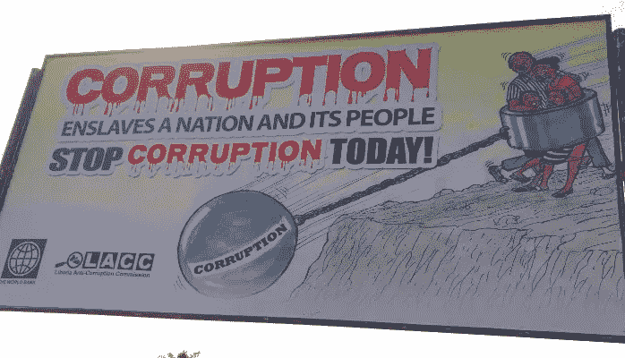

# 黑客腐败

> 原文：<https://medium.com/hackernoon/hacking-corruption-4ef0b63209d8>

2015 Monrovia, Liberia, Anti-Corruption Billboard

## **腐败是网络化的**

在经历了几十年的冲突后，利比里亚从国际腐败排名的底部攀升，展示了许多渐进的成功。利比里亚工作环境的成功导航需要同理心的现实检查，以了解、合乎道德地运作和影响变化。

虽然在黑暗的办公室里接受牛皮纸袋现金的阴暗人物的陈词滥调确实存在，但要清楚地看到其普遍的腐败，需要看看腐败最底层的现实。认识到索马里、阿富汗和苏丹等对美国外交政策利益至关重要的国家仍然排名垫底，利比里亚作为一个透明度恢复的国家提供了一个很好的测试案例。

在我们在利比里亚的工作中，我们遇到了各种各样的道德挑战，因为小团体甚至个人利用漏洞和瓶颈:政府办公室拖延所需的文件，医院工作人员填写发票，承包商对他们的合同看得很松，警察检查站除了勒索小额贿赂外，通常没有什么作用。

## **贫穷导致腐败，腐败导致贫穷**

在最底层，不道德的行为通常来自真正的迫切需要:工资低且不可靠的工人、战争的受害者和前儿童兵等。

在发达国家，很容易将腐败视为个人的秘密罪行，但利比里亚的经验表明，偷窃、贪污和勒索的强大驱动力是沉重的家庭和社区责任，这些责任落在了少数幸运地获得稳定就业的利比里亚人身上。即使是最诚实的受雇的利比里亚劳工也很快发现自己成为出于严重需要而提出的大量要求的目标:*“即使是最优秀的工人和政府雇员也很容易发现自己处于这样一种境地，他们要么欺骗老板或客户，要么通过原则性的不作为伤害他们所爱的人。”*

复合这是原则*“穷则贵。”最初的资金缺乏会产生越来越多的费用的连锁效应:无力维护车辆或房屋导致紧急维修，无力及时偿还债务导致昂贵的利息和罚款，无力支付预防性药物导致昂贵的紧急医疗费用。最终结果是，极度贫困者无力采取原本谨慎的措施来避免以后的支出。*

最后，利比里亚不稳定的历史和教育缺陷导致了根深蒂固的不良金融习惯，阻碍了前瞻性思维，即使工人后来发现自己有能力实现稳定。一名员工向我们申请预支工资，因为她负担不起儿子上学的交通费。当我们坐下来和她一起制定预算时，事实证明她在我们这里的工作比她之前的工作收入高得多，但由于她的最后一份工作是按周支付的，她可以留出每周的交通费用，但当每月收到一次更高的工资时，其他义务的压力会在下个月发薪日前几周耗尽她的储蓄。

作为一家在利比里亚运营的美国公司，我们在管理陷入周期性贫困的员工方面有许多劣势，很难强调透明度和商业道德的重要性，而不会给人留下自私自利的印象，要求员工和供应商遵守“我们的规则”，并通过放弃从系统中哄骗更多钱的机会来牺牲自己的安全。经常面对这些不舒服的情况使我们想出了几个关键的公司政策来塑造一个更加透明和道德的工作环境。

## **设定道德行为的条件**

对我们来说，一个关键的优势是有意识地意识到贫困和社会压力在最底层驱动着不道德的行为。在我们的外籍员工中，我们互相强调，即使是最让我们烦恼的决定，在某种程度上，也是基于务实的个人决定。正如一名外籍员工对我们的首席执行官所说:“*这些人没有一个想要伤害你，他们只是想先照顾好自己的人*”

## **当地员工对理解至关重要**

我们的当地员工，包括我们的会计师、首席工程师和始终至关重要的“解决者”，是了解利比里亚情况的宝贵钥匙。尤其是当我们的脾气紧张到了爆发点，我们有一种强烈的愿望要把负面情绪倾泻到任何阻碍我们前进的地方力量上。我们当地的工作人员和我们在一起，向我们解释这种似乎只是恶意干涉背后的动机。这个问题是双向的，当我们能够将外国组织的担忧和看似不合理的行动放入利比里亚同事的背景中，消除工作中固有的文化冲突。充当双方的共鸣板让双方更强大，当一方能够理解以前的“外国”问题时，设计解决方案就变得容易得多。

## **责备起来**

尽管这可能是一种令人不舒服的技巧，但“责备”可能是一种重要的消除冲突的工具。对于我们组织中的退伍军人来说，将令人不快的决定的责任推给更高的无定形 *Other* 是完全违背直觉的，他们来自一个你有义务内在化并拥有那些高于你的人的价值观的环境。但是在一个[发展](https://hackernoon.com/tagged/development)的环境中，个人关系是关键，社会和地理距离是巨大的，分享“我不得不做的事情”的个人烦恼可以创造一种相互同情和处于共同困境的感觉。

这种技术经常获胜的一个地方是警察或移民当局的敲诈勒索，公务员几乎真的工资过低，期望他们能弥补差额。出于各种各样的原因，我们不想行贿，既出于原则，也出于我们自己的风险，如果我们允许自己被视为人类的存钱罐，对其他发展工作者的风险，当然还有这样一个事实，即到处分发现金不是一个成功的财务策略。

为了坚持反对小额勒索，但建立友谊而不是对抗，并且非常重要的是给勒索者一个挽回面子和感到亲切的机会，有时我们只是夸大其词:*“我的伙计，我知道在检查站工作很辛苦，我知道一点零花钱有帮助，但是我的女老板，如果她发现我支付零花钱，我就会被解雇。如果她不解雇我，而出资人发现了，我们就会失去合同，我们都会失业。如果只有我，我会给你一些小钱，没问题，因为我知道你是个好人，工作努力，但我不能冒被解雇的风险。像你我这样的人，我们必须尽一切努力保住我们的工作。”*

## **抢先媒体**

我们公司邀请了《赫芬顿邮报》摄制组拍摄一部名为《瑞安·达菲的未来》的纪录片。广告该项目的拍摄被证明是创造刺激和遏制不道德行为的有力工具。没有人想成为一个举着一个好的新闻故事和国际关注试图挤出另外五美元的“额外费用”的人，因为他们知道如果他们的不当行为以某种方式进入节目，整个社区都会责怪他们。

我们认为，我们能够将媒体传统的事后揭露腐败的焦点转变为道德行为的推动者——一种先发制人的透明度威胁，让地方当局注意自己的形象。

不幸的是,《赫芬顿邮报》不会拍摄我们的每一个项目，但我们可以通过保持强大的社交媒体部门，展示记录我们经历的好与坏的承诺，在较小的层面上重现同样的效果。

**创造力和语言柔道**

我们反腐败战略的核心是致力于*消除冲突*和几乎像游戏一样鼓励创造力，并结合到言语柔道的艺术中。在几个月的时间里，我们头撞在墙上，在每次搜查时争论不休，威胁要叫更高级别的警察来惩罚他们，叫我们的修理工跑过去解决问题，或者好莱坞式的逃避检查站和失去警察的壮举，我们最终得出结论，聪明地说话是最简单的解决办法，也是一个有趣的挑战。

设置“游戏”的关键是进入对抗，目标是每个人都快乐地出来，并且用言语柔道真理“如果感觉很好，不要做。”称一名警察为腐败的混蛋，或者告诉一名干扰他人的办公室职员你会举报他们，这可能会让你感到满意，但这只会建立一种敌对关系，现在你的对手受到荣誉的约束，会想方设法伤害你，以保全面子。把某人逼到墙角只会让他们朝你扑来，而你却想给他们留一个一英里宽的缺口……这正好把他们引向对你有利的地方。钱是人们想要的好东西，但通常情况下，尤其是当钱看起来不容易到手时，人们会依靠“赢得”尊重或认可来挽回面子。任何找我们麻烦的警察，我们都会发现他值得表扬的地方；我们很高兴 100%同意我们不应该在红灯时右转，我们完全同意外国人不能免受法律制裁，我们尊重他们让我们靠边停车。我们不会付钱，但是过度的赞美、合作和建立关系会让检查站警察从他的赚钱企图中优雅的退出。

腐败有多种表现形式，从一份价值百万美元的大规模合同被搁置等待一名政客签字，到汽车注册更新可能需要“五分钟或五天”，这取决于公民的“慷慨程度”。无论规模如何，简单地不要让预期的腐败循环永久化是发展工作者为社会变革定下基调的一个关键方法。行贿几乎总是更容易，从纯粹的功利主义角度来看，短期内可能会便宜得多，但在最基本的层面上，行贿只是共谋的又一部分一种阻碍利比里亚充分发挥潜力的社会弊病。

2015 Monrovia, Liberia, Anti-Corruption Billboard