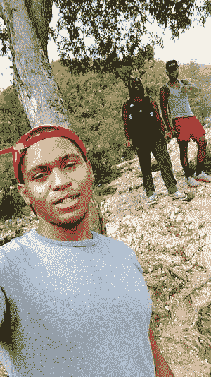
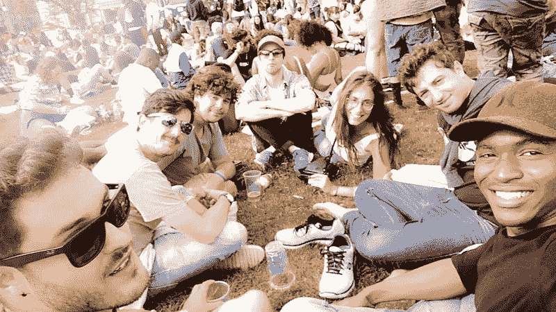
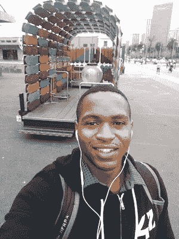
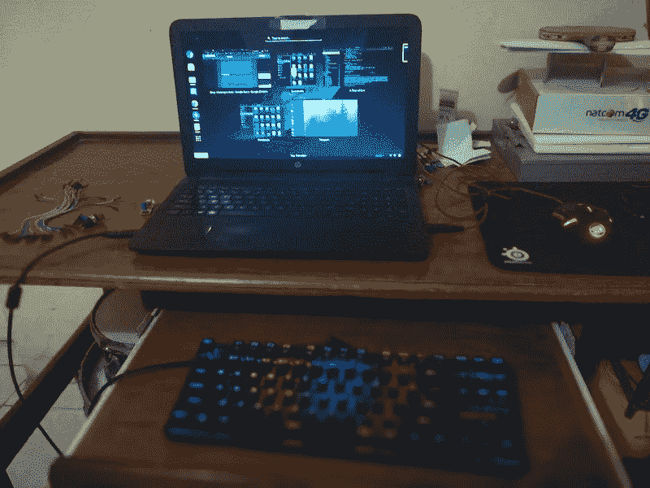

# 海地的黑客攻击

> 原文：<https://medium.com/hackernoon/hacking-in-haiti-b68ba3ebcb21>

这是 Joe-Bernick Rameau 的客座博文，他是海地的一名自学成才的开发人员。Joe-Bernick 谈到了在海地建设的挑战，以及像 BeeHyve 这样的社区如何能够提供帮助。我们希望你喜欢它。世界各地都有学习者。

# **你是谁，有什么背景？**

我是 Joe-Bernick Rameau，是一名自学成才的软件工程师，来自海地的 Jacmel。

Hiking with some Haitian friends

我生在海地，长在海地，13 岁的时候(2008 年)，当我母亲把她的第一台工作电脑带回家时，我开始了[编程。我从在【上玩游戏开始，直到有一天我决定创建自己的游戏，尽管我对网络开发一无所知。这对我真的很难，因为我的朋友都不喜欢计算机科学，但我仍然做到了。我甚至在学校的大部分课程都不及格，因为我太投入了。我用](https://hackernoon.com/tagged/programming)[webs.com](http://webs.com/)创造了[http://gamestaken.webs.com](http://gamestaken.webs.com/)，有一天变成了[http://gamestaken.com](http://gamestaken.com/)。现在它关闭了，因为我被我的共同创始人内部黑了，他开始和我一起工作(说来话长)。

在这 9 年多的时间里，我做了很多自由职业者的工作，在 CodeCanyon (Envato)等平台上以及通过我自己的个人代理公司(Crakken)创作产品。通过这些，我能够卖我自己的东西。这是我的父母开始意识到技术作为一种职业可以有多好的时候。然而，他们仍然犹豫不决，因为它不稳定。然而，通过这段经历，我学会了多种语言，框架，并从根本上提高了我的英语水平，但几乎没有改善我的联系。当时，我更喜欢网络开发，但去年，我决定成为一名多面手，学习我喜欢的任何东西。我意识到我可以学到任何东西，只要我专心致志。这是我进入美国 42 学校的时候，这是我生命中一个惊人的游戏改变者。

在海地，每个人都相信文凭，尽管很明显，如果你没有正确的关系，你就找不到工作。我从来不相信这些，所以很难得到父母的支持。即使是现在，对我来说也很艰难。我今年 22 岁，我总是有压力，因为这么多年过去了，我仍然没有一份稳定的工作，尽管我觉得我有足够的经验至少可以在一家公司做一名初级开发人员。我是 42 届首届毕业生中的一员，当我还在努力的时候，我的大多数同学都找到了工作。因为我没有美国绿卡，所以我从一开始就没有机会被拒绝。但我必须保持坚强，继续努力。

Enjoying some free time with 42 friends

最终，我在硅谷 42 号交了很多新朋友。我不仅在那里学会了编程，还学会了如何与人相处，成为更好的队友。当然，自从我们一起参加社交活动以来，这并不总是关于代码的。那些激动人心的时刻和我遇到的人让忙碌变得如此愉快。

另一个让这种经历更加愉快的部分是锻炼。为了保持健康和激励他人，我几乎每天都做健身操。这就是为什么我在 Instagram 上保留了一个简介:[https://www.instagram.com/justpull/](https://www.instagram.com/justpull/)。你也可以通过 BeeHyve 上的 [r4meau](http://beehyve.io/s/r4meau) 找到我，或者发邮件到 r4meau@gmail.com 找我。

Going to devweek 2016 event in SF

# **你在建什么？**

现在，我正在开发一个移动应用程序，它可以对我国的创意人员有很大的帮助。我很快会在我的博客上发布更多关于它的内容(暂时是个秘密；) ).目前，技术不是海地最大的资产，我正在努力改变这一点。我也在网上做一些自由职业来养活自己。我目前正在重新学习 C++(已经很久没用了)，这样我就可以重新投入到竞争性编程中。我还在学习一种叫做 Processing 的语言的视觉艺术，从事一个学校项目(关于用 C 创建我自己的 shell)，并从这里和那里学习一些小知识以保持循环(这就是我如何发现 BeeHyve 的)。我在自己的网站( [https://rameau.me](https://rameau.me) )上写博客，在 Github([https://github.com/r4meau](https://github.com/r4meau))上发布我的开源项目。

# **海地黑客事件**

我不得不说，这是一个艰难的承诺。我知道很少有人编码，所以注意力分散达到了顶峰。很难平衡你的社交生活和工作，因为这两者之间没有直接关系。

现在对我来说最大的挑战是被当地和非当地的公司认真对待，因为我从大学退学去了一个叫 42 的非正式学校(没有老师也没有文凭)。因此，在一个坚信纸质文凭的国家，这是一个大忌。

Me doing some acrobatic move

尽管最近取得了一些进展，海地仍然是一个不安全的地方，对当地人来说甚至比游客更不安全，所以我呆在家里。甚至没有一个像“星巴克”一样的地方可以让你遇见另一个开发者。我相信[黑客](https://hackernoon.com/tagged/hacking)是共享，但当你独自一人在房间里，仅仅依靠互联网，而该地区没有任何黑客活动，这真的是黑客吗？我只是独自尝试新事物，并希望有一天我能把我的知识用在那里。我只是希望这里有更多的黑客马拉松和会议。

# **碧芙帮了什么忙？**

[Beehyve](http://www.beehyve.io) 是一个学生之间关于任何话题的资源共享网站。如果你是学生，而那个定义并没有让你想加入，请，重新思考你的人生(开玩笑:P)。不过，严肃地说，这是上帝的恩赐。我擅长在网上找到我想要的东西。只有在找到 Beehyve 之后，我才意识到这是一个多么漫长的过程(在多个选项卡中打开一堆链接，快速阅读以确保这是一个适合主题的好链接……)。现在想象一下，让另一个学生为你做这件事，告诉你他们为什么推荐一个特定的资源，其他学生在一个地方投票和评论。你还能要求什么？[将](https://www.beehyve.io/s/r4meau)链接到我的个人资料。

# **海地的编码是什么样的？**

尽管最近在这方面取得了一些进展，海地仍然是一个不安全的地方，对当地人来说甚至比游客更不安全，所以我呆在家里。甚至没有一个像“星巴克”一样的地方可以让你遇见另一个开发者。我相信黑客是分享，但当你独自一人在房间里，仅仅依靠互联网而没有任何黑客活动时，这真的是黑客吗？我只是独自尝试新事物，并希望有一天我能把我的知识用在那里。我只是希望这里有更多的黑客马拉松和会议。

My current workspace

# 在资源有限的情况下，有什么黑客技巧吗？

我很幸运能买得起一台电脑，因为我敢打赌很多海地人也喜欢黑客。他们只是无法接触到它。我能说的是，继续非常非常努力地工作，因为与其他一些人相比，你必须付出两倍于他们的努力，才能成为这个世界上你想成为的人。这是冷酷无情的现实。这需要时间，但我很确定事情会改变。就目前而言，如果你的资源有限，最好的办法是筹集资金(通过众筹)，这样你就能负担所需的材料。此外，充分利用你已经拥有的。