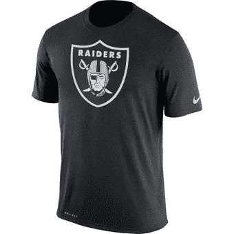
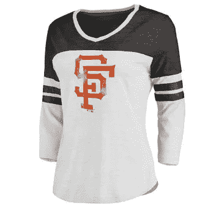
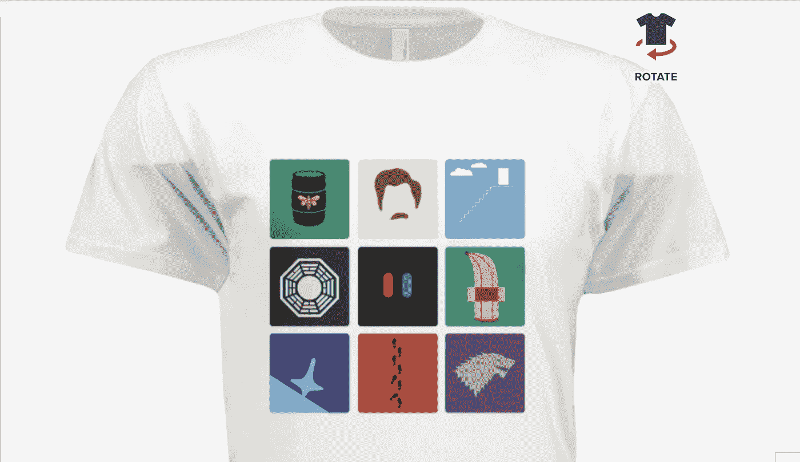

# 用我的 t 恤黑掉社交互动

> 原文：<https://medium.com/hackernoon/hacking-social-interaction-with-a-me-shirt-6f57b6edcf37>

## 我设计了我自己的个性化“我的衬衫”，你也可以这样做。

时尚是强大的。时尚定义了流行文化，象征着思想运动，也许最重要的是，时尚是一种自我表达。

时尚也是激发人与人之间联系的绝佳机会——如果我想与另一个人的“表达自我”交流，我可以通过评论一件衣服或嘲笑一件有趣的 t 恤来实现。

然而，大多数人穿的衣服显示共同的品牌或有简单，坚实的模式。**但是如果我们真的可以用我们的服装与人联系会怎么样呢？**

一些最常见的选项与运动队、音乐会、品牌或家乡有关。

但是，我们能做得更好吗？

如果每个人不是因为在某个场所出售而购买衬衫，而是真的把他们自己的衬衫制作成真正代表他们自己的艺术品会怎么样？这种衬衫可以让人们更好地理解一个人的身份感，使判断超越简单的外表特征。

作为一名旅行者，我总是对与陌生人的频繁互动感到沮丧，如果我们有机会真正筛选我们的共同兴趣，这种互动本可以更深入。t 恤是向陌生人提供提示的好方法(“嘿，你衬衫上的标志是什么？”或者“我也喜欢那个电视节目！你看最新一集了吗？”).

# 实验:设计一件“自我衬衫”

为了探索这个想法，我制作了自己的“自我衬衫”我是一个超级电视和电影迷，所以我决定制作一件衬衫，代表深刻启发和塑造了我的电视节目和电影。你能拿到推荐信吗？

From left to right, top to bottom: Breaking Bad, Parks and Recreation, The Truman Show, Lost, The Matrix, Arrested Development, Inception, The Usual Suspects, and Game of Thrones

我使用 Sketch 进行设计，并大量借鉴了其他设计师的作品(因为我不是在商业上出售，所以这属于合理使用)。我用 [Rush Order Tees](https://www.rushordertees.com/) 创建了这件衬衫，它以非常合理的价格创建并邮寄给了我。参考文献故意含糊其辞——只有看过这个节目的人才会真正理解参考文献。

# 结果:成功？

穿了这件衬衫几天后——一个陌生人居然和我说话了！一家餐馆的收银员注意到了这些设计，并正确地猜出了每一个参考文献。虽然从那以后我的经历并不十分富有成效，但这仍然是一种很棒的方式，既能穿上我自己的作品，又能向陌生人展示我的兴趣，有机会进行新的互动。我希望制作几个其他的个人设计来更多地尝试这个。

对于那些感兴趣的人，我在我的新 t 恤网站上发布了一大套我设计的个人 t 恤， [Minimal Shirt](http://www.minimalshirt.com) :

 [## 简约衬衫

### 设计简约的漂亮衬衫。受媒体启发，专为您打造。

www.minimalshirt.com](http://www.minimalshirt.com) 

你们中有没有人有自己最喜欢的 t 恤，穿上它来进行社交活动？你们中有人设计过自己的 t 恤吗？希望在评论中听到更多！

您可能感兴趣的其他文章:

*   [我如何生活 115 件事](https://hackernoon.com/how-i-live-my-115-things-53558259575b)
*   [说服他人的 7 种最佳社会心理学战术](https://hackernoon.com/mind-control-how-to-influence-and-persuade-e9ad430341bd)
*   阅读书籍，这样它们才会持久