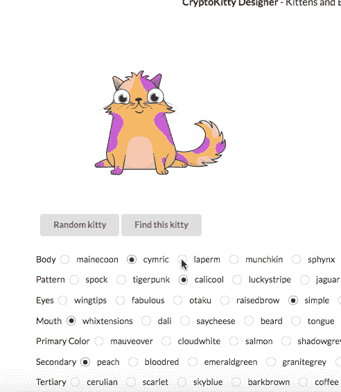
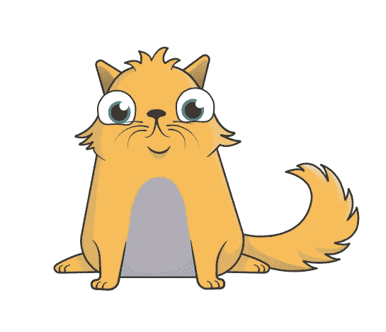
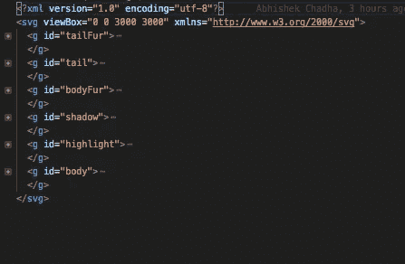
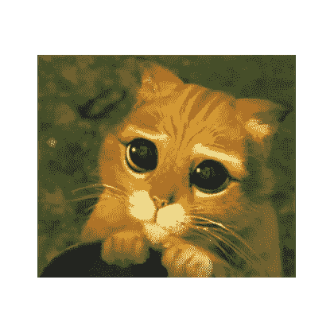

# 破解密码猫的基因组

> 原文：<https://medium.com/hackernoon/hacking-the-cryptokitties-genome-1cb3e7dddab3>



我的朋友 Anshul 最近告诉我关于 [CryptoKitties](https://hackernoon.com/tagged/cryptokitties) 的事情。我听说过它堵塞了 ETH 管道，导致价格下降，但没有意识到 CryptoKitties 团队实现了多么惊人的设计。隐猫基本上是在以太坊[区块链](https://hackernoon.com/tagged/blockchain)建造的可繁殖的豆豆娃。然而，它们还远远不止这些:CryptoKitties 是一个数字游乐场，程序员、遗传学家以及经济学、生物信息学、机器学习和博弈论方面的专家可以聚集在一起学习和玩耍。

# 研究隐猫

对于那些刚接触 CryptoKitties 的人，请看一下[的 Mashable 指南](http://mashable.com/2017/12/04/how-to-play-cryptokitties/#Mu_VwGqGMsqy)；这将教你 CryptoKitties 游戏系统的基础知识。为了更好地了解猫咪到底是什么，你可以浏览一下 [CryptokittiesCore 合同](https://etherscan.io/address/0x06012c8cf97bead5deae237070f9587f8e7a266d)。你会发现 CryptoKitty 基本上是 EVM 上的一个结构，看起来像这样。

```
struct Kitty {
 uint256 genes;
 uint64 birthTime;
 uint64 cooldownEndBlock;
 uint32 matronId;
 uint32 sireId;
 uint32 siringWithId;
 uint16 cooldownIndex;
 uint16 generation;
}
```

我们还看到了其他一些有趣的东西…

```
modifier onlyCEO() {
        require(msg.sender == ceoAddress);
        _;
}
```

还有…

```
/// [@title](http://twitter.com/title) SEKRETOOOO
contract GeneScienceInterface {
    function isGeneScience() public pure returns (bool);/// [@dev](http://twitter.com/dev) given genes of kitten 1 & 2, return a genetic combination - may have a random factor
    /// [@param](http://twitter.com/param) genes1 genes of mom
    /// [@param](http://twitter.com/param) genes2 genes of sire
    /// [@return](http://twitter.com/return) the genes that are supposed to be passed down the child
    function mixGenes(uint256 genes1, uint256 genes2, uint256 targetBlock) public returns (uint256);
}
```

哇一个秘密。这就是秘密。如果你玩过 cryptokitties，你就会知道这就是 kitties 是如何产生的。你会注意到，繁殖小猫以一种直观的方式产生后代:特征有时会从父母传给后代，但不总是如此，有时会隔代遗传。这是运行在非零代密码猫概念上的代码。

十年级生物课上的一个简短的遗传学补习班

> 一个**表现型**(来源于[希腊文](https://en.wikipedia.org/wiki/Greek_language) *phainein* ，意为‘展示’，而*错别字*，意为‘类型’)是一个[生物](https://en.wikipedia.org/wiki/Organism)的可观察特征或[性状](https://en.wikipedia.org/wiki/Trait_(biology))的复合，如其[形态](https://en.wikipedia.org/wiki/Morphology_(biology))、[发育](https://en.wikipedia.org/wiki/Developmental_biology)、生化或生理特性、[行为](https://en.wikipedia.org/wiki/Behavior)，以及行为的产物(如燕窝)。一个表型来源于一个生物体遗传密码的[表达](https://en.wikipedia.org/wiki/Gene_expression)，其[基因型](https://en.wikipedia.org/wiki/Genotype)，以及环境因素的影响和两者之间的相互作用。当一个物种的同一种群中存在两种或两种以上明显不同的表型时，该物种称为[多态](https://en.wikipedia.org/wiki/Polymorphism_(biology))。一个有据可查的多态性是[拉布拉多犬着色](https://en.wikipedia.org/wiki/Labrador_Retriever_coat_colour_genetics)；虽然毛色取决于许多基因，但在环境中可以清楚地看到毛色为黄色、黑色和棕色。

管理我头脑中的所有特征是困难的。我需要一个地方来组织我的想法，所以我创建了一个电子表格做一些基本的数学运算。从目前 crypokitties.co API 提供的特征来看，我们知道隐猫有多达 1.15792×10⁷⁷表型。假设 CryptoKitty 的“基因型”是一个 256 位的整数，那么 CryptoKitty 有 2 种⁵⁶可能的基因型。在 cryptokittydex 上，我可以看到每个 kitty 和 block 地址的基因型！多么有趣

CryptoKitties.co 的 API 提供围绕这个区块链创建游戏所需的公共数据。它创建图像，命名“特征”,然后通过 API 提供服务，并使用 MetaMask 促进玩游戏所需的以太坊交易。

在玩 cryptokitties 的时候检查浏览器，你会发现对 cryptokitties.co 的请求提供与表型和家族关系中表达的特征相关的结果。运转

```
curl '[https://api.cryptokitties.co/kitties/123606'](https://api.cryptokitties.co/kitties/123606')
```

给

```
{
 "id": 123606,
 "name": null,
 "generation": 4,
 "created_at": "2017-12-07T06:54:46.000Z",
 "image_url": "[https://storage.googleapis.com/ck-kitty-image/0x06012c8cf97bead5deae237070f9587f8e7a266d/123606.svg](https://storage.googleapis.com/ck-kitty-image/0x06012c8cf97bead5deae237070f9587f8e7a266d/123606.svg)",
 "color": "topaz",
 "bio": "What's up! I'm Kitty #123606\. I've never told anyone this, but I once pawed at a dog. I once got in a fight with a moose, and won. We can be friends, but keep the ultra purrsonal stuff to yourself, please.",
 "is_fancy": false,
 "is_exclusive": false,
 "fancy_type": null,
 "status": {
  "is_ready": true,
  "is_gestating": false,
  "cooldown": 1512636431155,
  "cooldown_index": 3
 },
 "auction": {},
 "owner": {
  "address": "0xb464f93be01bde143c92176d921c1d0d533bc3ca",
  "image": "17",
  "nickname": "KittyHodlr"
 },
 "matron": {
  "id": 123288,
  "name": null,
  "generation": 3,
  "owner_wallet_address": "0x8081ecb6f3350fe5ed46f1bd74d5ada62c62e740",
  "created_at": "2017-12-07T06:30:08.000Z",
  "image_url": "[https://storage.googleapis.com/ck-kitty-image/0x06012c8cf97bead5deae237070f9587f8e7a266d/123288.svg](https://storage.googleapis.com/ck-kitty-image/0x06012c8cf97bead5deae237070f9587f8e7a266d/123288.svg)",
  "color": "topaz",
  "is_fancy": false,
  "is_exclusive": false,
  "fancy_type": null,
  "status": {
   "is_ready": true,
   "is_gestating": false,
   "cooldown": 1512635143445
  }
 },
 "sire": {
  "id": 96883,
  "name": "Gen 3 Purple Sizzurp",
  "generation": 3,
  "owner_wallet_address": "0x8081ecb6f3350fe5ed46f1bd74d5ada62c62e740",
  "created_at": "2017-12-05T23:09:11.000Z",
  "image_url": "[https://storage.googleapis.com/ck-kitty-image/0x06012c8cf97bead5deae237070f9587f8e7a266d/96883.svg](https://storage.googleapis.com/ck-kitty-image/0x06012c8cf97bead5deae237070f9587f8e7a266d/96883.svg)",
  "color": "sizzurp",
  "is_fancy": false,
  "is_exclusive": false,
  "fancy_type": null,
  "status": {
   "is_ready": false,
   "is_gestating": false,
   "cooldown": 1512641108913
  }
 },
 "children": [],
 "cattributes": [{
  "description": "orangesoda",
  "type": null
 }, {
  "description": "simple",
  "type": null
 }, {
  "description": "granitegrey",
  "type": null
 }, {
  "description": "coffee",
  "type": null
 }, {
  "description": "pouty",
  "type": null
 }, {
  "description": "totesbasic",
  "type": null
 }, {
  "description": "topaz",
  "type": null
 }, {
  "description": "cymric",
  "type": null
 }]
}
```

根据 API，这就是 CryptoKitty 的样子。我们可以看到主人的地址，以及 Kitty # [123606](https://api.cryptokitties.co/kitties/123606') 的特征。最重要的是，我们得到了一张令人惊奇的、毛茸茸的猫的照片。



So cute and fluffly!

每只猫都有基于其基因的属性。还记得那个 256 位的单位吗？决定了你的猫咪长什么样。

忽略拍卖系统，我们可以认为这个系统的遗传方面有两个部分

*   基因 X **— (cryptokitties.co)→ (** 表现型 X，图片 X)
*   基因管家+基因父系**——(混合基因)→** 基因后代

其中 **mixGenes** 是我们的秘制酱料函数。我们能否通过研究隐猫的繁殖模式来预测繁殖结果？

我们希望能够通过检查区块链以太坊来获得这些神秘生物的基因组数据。我们可以编写代码来下载和解析到目前为止所有的 cryptokitties 事务，但是那会很慢，而且没有人有时间处理 cat。我决定尽快写一个 scraper 来收集 cryptokitties.co 和 cryptokittydex.com 上现有的猫。

我写了这个[代码](https://github.com/achadha235/cryptokitties-ingester)来使用一个无头 Chrome 实例‘访问’[cryptokittydex.com](https://cryptokittydex.com/)，并将所有猫的基因组、它们的主人和它们的图像放入一个 S3 桶(或磁盘)中。我让它一直运行，直到它下载了大约 10 万只猫和它们的图片。

第二天，我决定研究我收集的隐猫样本。我很快注意到花式小猫有**。png** 扩展当普通小猫被保存为 **.svg.** 时，我开始注意模式，并通过反复试验和参考 reddit 指南，学习每个 cryptokitty 属性的基础知识。显而易见，哪些功能是独有的，我慢慢觉得我在分类 cryptokitties 方面变得更好了。那天晚上快结束时，我觉得自己可能很快就会成为隐猫中的格雷戈尔·孟德尔。

# **Cryptokitty 基础知识**

有 3 种基本特征类型。除去‘花哨’，每只猫都有 7、8 个可见特征。每只猫有两个不可见的生殖特征。

1.  **体型特征(4)** :体型、花纹型、口型、眼型、
2.  **色彩特征(4)** :原色、二次色、三次色、眼睛色
3.  **繁殖**:冷却，世代

我在研究猫的时候注意到了一些模式。

1.  基础猫不表达它们的第三色，但是有这种基因
2.  胡须是唯一包含颜色的嘴部特征。它使用原色。
3.  眼睛的颜色也是背景颜色
4.  原色是猫皮毛的主色
5.  如果猫的图案类型有两种颜色，则次要颜色是猫的毛皮补片/条纹的颜色
6.  三级色在猫的皮毛中表现为三种颜色的一些图案类型

现在的问题是——哪些猫还没有被发现？我们能不能做一个*隐猫* *基因测试*来看看这些猫在出生前会是什么样子？打开 SVG，很容易看到小猫的不同部分。



我四处寻找这只小猫的*海蓝宝石*色，并在另一只中寻找。所有文件都是一样的！然而，继续浏览数据集，我发现并不是所有的毛发图案都使用了所有的 3 种颜色，有些非常复杂，很难用 JSDom 直接操作 SVG。我决定只把 SVG 当作字符串，并创建三组图像。第一组是一组 48 张照片，照片上有各种体型和图案组合的猫。第二组是一组 8 只猫，所有的嘴都组合在一起。第三种——你猜对了——所有可能的眼睛。分离出这些“基因”中每一个的 svg 元素，让我能够构建一个 quick React.js 原型，它能够呈现任何可能表现型的 kitty。

```
**<Cryptokitty**
**body**={body}
**mouth**={mouth}
**eye**={eye}
**pattern**={pattern}
**colors**={[
  c.Primary[primary],
  c.Secondary[secondary],
  c.Tertiary[tertiary],
  c.EyeColor[eyeColor]]}
/>
```


添加一些简单的控件，我为我的 cryptokitty 基因测试公司做了一个非常早期的原型。喵我所要做的就是找一个很酷的人，带着很好的 venchair 地毯。

说说你的想法！非常鼓励 PRs。

**CryptoKitty 设计师:**

[https://bytesforbites.github.io/cryptokitty-designer/#/](https://bytesforbites.github.io/cryptokitty-designer/#/)

**来源:**

[https://github.com/BytesForBites/cryptokitty-designer](https://github.com/BytesForBites/cryptokitty-designer)

将 kittehs 和 tips 发送到**0x 02 ee 97 a 13 e 434717 E3 FFA 12758 a 235 D1 a 1680775**



Please sir, I’m just a dev cat that needs to pay for my new mouse