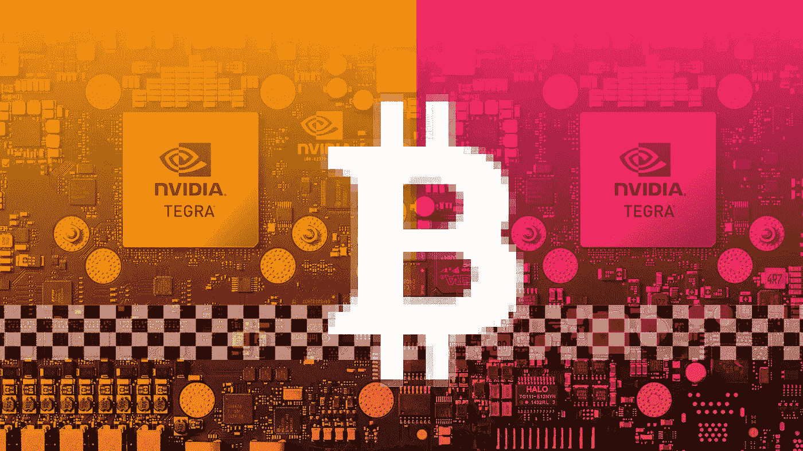
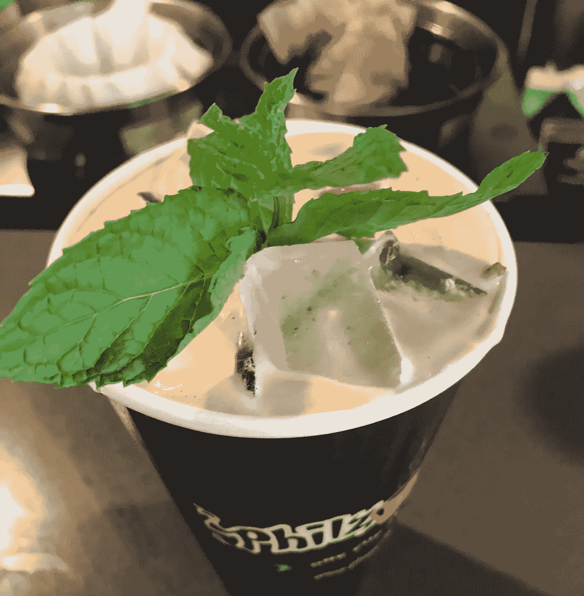

# 黑客入侵地下自主街道赛车现场

> 原文：<https://medium.com/hackernoon/hacking-the-underground-autonomous-street-racing-scene-523d40286be5>

## 小说

## 学生们正在黑汽车，将他们的车辆和算法推到极限。

Nvidia’s Drive PX 2 supercomputer is used to fuel a new kind of street race

我们前往马萨诸塞州的剑桥，在那里，叛徒们正在破坏偏僻的道路。数百万美元的比特币赌注和万亿字节的数据转储正在推动街头赛车的新场景。

随着现代汽车中高级驾驶员辅助系统(ADAS)的出现，(例如车道保持和自动泊车)，自动驾驶已经向大众开放。标准的 ADAS，加上 Comma.ai、Udacity 和百度的 Apollo 等开源软件，让黑客可以完全控制他们的车辆。

一种新的街头赛车正在接管，由计算机科学专业的学生组成，他们在 Snapchat 狗过滤器、无情的火绒约会和宿舍狂饮的时代感到沮丧。就像 20 世纪 50 年代时髦的热棒文化一样，一种独特的亚文化正在让他们的肾上腺素在方向盘后面凝固。

周日上午 11 点，我和“肖恩”见了面。出于显而易见的原因，肖恩的名字被改了。他是一名学生，正在攻读计算机科学学位，据我所知，他是整个行动的幕后策划者。

他要给我看的是高度非法的手术。他后来告诉我，冒这个险是值得的，“这是从来没有人做过的事情。就像丝绸之路或加密货币一样，这是一项改变一切的技术。”一种全新的运动正从这个未命名的团体的代码行中出现。

肖恩在马萨诸塞州剑桥市一栋毫不起眼的破旧工业建筑外抽着烟。他用钥匙把我们锁了进去，带我穿过一扇钢车库门旁边的门。

蠢朋克穿过灯光昏暗的走廊，在一个开放的空间结束。它看起来像一个旧的机械商店，20 世纪 70 年代的公告栏现在展示着汽车的照片和《连线》杂志的剪报。

三辆装配状态各异的汽车在我面前闪闪发光。六个学生狂热地学习。大麻从一辆车旁正在编码的人的 vape-pen 中飘散出来。

我花了五个星期才被介绍到这里，而工程系的学生几乎没有注意到我在那里。

肖恩吻了他的女朋友，给我看了他的极品。地板上到处都是摇滚明星能量罐和香烟盒。一个服务器机架覆盖了后墙。各种颜色的以太网电缆散落在天花板上，从服务器机架蜿蜒而出。

他陪我走到他改装过的汽车前。引擎盖是开着的，但除此之外，人们看不出这辆车有什么特别之处。它是终极沉睡者。那个在笔记本电脑上抽大麻的家伙被称为“爱因斯坦”。他编写了几个机器学习算法，这些算法采用了开源软件并对其进行了增压。他的黑色 Macbook 有一根电缆接入一个定制设计的 T-Box，直接插入汽车的 CAN 接口。

这些工程师中的任何一个都可能在谷歌、优步或数十家向自动驾驶汽车竞赛投入数十亿美元的公司中获得 6 位数的薪水。相反，他们正在这样做，推动反病毒技术远远超过其他任何人。

“当你完全放松管制时，就会发生一些事情，”肖恩解释说，“它会以最大速度前进。”在他的案例中，团队围绕监管展开工作。到现在为止，已经有几个工程师在他们的代码、汽车和大麻绿洲里抬头看着这个陌生人。我问肖恩是如何资助这个项目的，他保持沉默。我改变了语气，问这一切是如何开始的。

“它始于 github 上发布的一个 AV 源代码，”他解释道，低头看着重建的讴歌引擎，“该死的代码在 OnePlus 3 智能手机上运行。这太简单了，我不得不试一试。”

肖恩指的是 Comma.ai 发布 OpenPilot。这家备受争议、典型鲁莽的旧金山初创公司正在智能手机中使用 820 GPU 来捕捉数据和控制汽车。DIY 套件插入车辆的 CAN 接口，控制加速和转向。

“所以我们把它搞得一团糟，把它推到了极限，”肖恩解释道，“直到一个开着野马的笨蛋在我开到 150 英里的时候开枪，”他把一个空的 Rockstar 罐子踢到了地板上，“这时候我突然想到了这个疯狂的主意。如果我们能比任何人都开得好，会怎么样？”肖恩有办法让你陷入他无法表达的话语中。在过去的 8 个月里，他组建了一个由计算机专业学生、瘾君子、酒鬼和真正的创新者组成的精英团队。他们碰巧都非常擅长深度学习。

经过 6 个月的逆向工程别人的代码，并最终建立自己的，他们准备好了他们的第一场比赛。

肖恩坐在他的白色讴歌车的方向盘后面。他指着窗户角落里的两个摄像头，以及现有的 ADAS 摄像头。“你必须相信这个准则，”他双手放在方向盘上，近乎虔诚地说，“她是一台真正有自我意识的机器，必须受到尊重。”

在汽车的后备箱里，两台 Nvidia PX 超级计算机，分别带有各自的冷却系统，被安置在后面。转向控制器必须换成一个扭矩更大的，VCU 完全重新映射。

我再次问坐在副驾驶座上的肖恩，他是如何资助一切的。他看了看服务器机架，然后回头对我说，“这么说吧……我用比特币赚了很多钱。从*节省下来的钱*足以在一场比以往任何人都大的比赛上下赌注。”他看着我的眼睛，“够了。”

我们生活在一个平庸的比特币百万富翁的时代。那些在十几岁时挖掘或编写一些愚蠢而聪明的东西的孩子，到他们上大学时已经完全定型了。

他从车里爬出来，“所以现在你知道我们没有装满它，当我们比赛时，我会给你发一封电子邮件。”

我问什么时候。

肖恩笑着回头看了一眼服务器机架，“当剩下的赌注已经完成。”领我出去，我最后看了一眼商店里“编码”的汽车。从外面看，它们几乎令人厌烦。

我问了最后一个问题，为什么他让我看这一切。

肖恩正要打开通向街道的门，他停了一会儿，“因为，”他想，“我们正在创造历史。这些车辆正在获得意识，我想让世界看到这一点。”我甚至看不出我后面的车是独一无二的。

几周之后，我的收件箱里才会随机收到一封电子邮件。它只是简单地说了一个时间和一个地点，结果是一个图书馆，还有“不要迟到:”

凌晨 3 点刚过，我登上了从旧金山到洛根的下一趟航班，离开了我在南波士顿的 AirBnb。那是波士顿的七月，夏夜温暖宜人。这让我想起了高中时的鬼混，跳过铁丝网围栏，喝偷来的酒。

我们在波士顿郊区的公共图书馆相遇。肖恩开着他的讴歌在等我。后窗上安装了几个微型摄像头，还有一个警察巡逻车风格的笔记本支架，“老兄，你的 Lyft 司机真慢。上车吧。”

在他的 Macbook 上，谷歌地球是打开的，显示了我乘坐出租车的轨迹，距离我们坐的地方大约一英里。

“别生气，几周前我们见面时，我抓过你的 IMEI。英国人称他们为 IMSI 捕手，联邦调查局，黄貂鱼。我们用它们来追踪警察。”肖恩解释说，每辆警车要么有无线电中继器，要么有一个带手机的警察。跟踪 IMEIs 所需的软件无线电(SDR)可以很容易地从中国花几百美元买到。每辆赛车都有一个特别提款权，他们的信号三角定位警察。

我没有问，但足够快的 SDR 可以用来干扰大多数警察信号，包括他们的手机。肖恩调低了屏幕的亮度，看了看他的手表，一只发光的劳力士 GMT。讴歌启动时，他没有碰到任何控制装置，前灯打开，引擎加速。我们在路上。

Macbook 上出现了一张地图，显示了另外两辆汽车，以及汽车周围的视图。看着汽车的传感器编译出我们周围夜晚的 3D 视图，感觉既诡异又超现实。

“我们正前往佛蒙特州，”肖恩平静地说，他按下藏在点火装置附近的一台摩托罗拉收音机上的一个按钮。“爱因斯坦，你推了最新的构建？我想在 4G 网络退出之前尝试一下。”肖恩抓住方向盘，他的车更新到最新的固件，他又躺在座位上。

我们没怎么说话，只是几次无线电检查。正如他所说，4G 变得参差不齐，最终我们只能靠自己了。我们一进入佛蒙特州，就加入了另外两辆车。他们兴奋地在我们身后闪着远光灯。

肖恩关掉了汽车前灯，其他汽车也跟着关掉了。我们的世界淹没在黑暗中，以超过 80 英里的时速行驶，我们甚至还没有到达第一缕曙光。

肖恩对着收音机笑了起来，“爱因斯坦，58 连接工作得很好”。在屏幕上，我们对车辆的感知已经扩大了三倍。他借着 macbook 的灯光看着我，眼睛看着前方看不见的路，“当你有原始相机数据时，谁还需要大灯？”

Macbook 显示了一个巨大的，上帝之眼的前方和后方的道路视图。每辆车都通过 150Mbps 的 V2V Wi-Fi 链接共享数据，足以在黑暗中行驶。汽车甚至没有退缩。

天一亮，我们就进入了佛蒙特州的森林深处。出于某种原因，我在威瑞森的手机收不到任何信号。郁郁葱葱的森林和山丘环绕着公路，太阳从地平线上露出来。

每个人都靠边停下来，跳上他们的车，喝着热水瓶里的咖啡。肖恩拿出了他的黄金像素手机。四个男孩和三个女孩站在汽车周围，拥抱校园帽衫和他们的爱人。

“女士们，先生们，”他看着前方车辆上的每一个摄像头。他停顿了一下，看着他的手机感到惊讶，“赌注已经设定！”他看着他的每一个团队成员的眼睛，“四千二百比特币，”其中一名工程师吐出他的咖啡，“将是这场比赛的奖金。我们全世界的人都在这上面押了超过 15 万个比特币！”他停顿了一下，“这是前所未有的。”

作为参考，在 2017 年 7 月，15 万 BTC 的价值远远超过 10 亿美元。如果洗得好的话会少一点。

大家安静了一会儿。“这些资金，”肖恩继续说道，“已经被收集、混合，正在等待分配。”他关掉屏幕，举起手机，然后看了看手表，“对那些通过卫星看直播的人来说，现在是世界协调时 10 点 17 分，”他盯着自己汽车上的摄像头，“这可能是赛车史上最大的赌注。”

肖恩精力充沛，非常危险。他平静地、沉着地、快速地说:“比赛开始！”爱因斯坦点了一支烟，递给一个留着小辫的女孩。肖恩吻了坐在另一辆车里的女友。大家沉默了一会儿。

接下来的几个瞬间很难记住。我记得爬进肖恩的编码出来的讴歌，心想，*这是完全疯狂的*。我收紧了我的种族安全带。

每个人都在公路边排队。肖恩的车停在最后，他冷静地做了无线电检查，警察扫描，并检查了卫星互联网连接。

“同步时钟…马克！”他按了回车。我们车辆的命令提示符中出现了一个倒计时器。

在你的生活中，有时现实会扭曲，你会被不可思议的加速度推向一个全新的世界。四周爆发出巨大的噪音。三辆精心设计的超级跑车在不到 4 秒的时间内从 0-60 英里的时速飞驰而过，照亮了道路。当我的身体压进赛车座椅时，我回头看了看模糊的轮胎烟雾。

我面前的笔记本电脑屏幕被切成两半，显示出汽车周围的 3D 地图，以及催眠般的代码漩涡。数十亿种可能性被分析和抛弃。被认为可以接受的结果通过光纤转换成汽油爆炸，把座位压到我的背上。

我还没来得及眨眼，车速就达到了每小时 100 英里。我在我的 5 点式安全带座椅上左右摇晃。肖恩欣喜若狂，双手放在脑后。我们以接近每小时 150 英里的速度驶入了丘陵地带。如果代码现在失败，做任何事情都为时已晚。何必自忧？

其他车会在前面几英寸的地方行驶。似乎每时每刻我们都将面临死亡，但计算机发现这种风险完全可以接受。

也许发动机的噪音是最具催眠作用的。每一次换挡都是艺术化的，车辆转向的方式是神秘的。我想要更多。

屏幕上的地图显示了几条可能的轨迹，其中一条变成了绿色。我们绕过一个死胡同，从前面的汽车旁飞驰而过。一辆小型货车迎面驶来，亮着前灯！我们的车突然转向，失去了牵引力，顺利地纠正过来。

我开始感到恶心。肖恩大声发誓，这就是他活着的目的。这也是他愿意为之而死的，至少以这种速度。

我们努力控制住我的胃，以超过 100 英里的时速跳入致命的发夹弯。我发现电脑知道如何漂移。当我们加速进入直道时，引擎开始红线。

奇怪的事情发生了。肖恩的车自己穿过虚线中心线。前面的汽车向右移动了。在我们后面，最后一辆车开进了旁边的空间。肖恩的车没有挡住去路，而是让其他车辆通过。

这些汽车不是被设计成相互竞争，而是一起工作，将它们的规格发挥到极致。他们互相让路，看哪辆车能被推得最猛。

剧烈的震动震动了我们的汽车。随着车轮左右摇晃，除我们之外的汽车都在努力保持直线行驶。速度计读数是 160，卫星连接读数接近 200。

地图上出现了一个转弯。这辆车开始分析数百万条轨迹，花了比平时更长的时间来选择一条路径。肖恩现在呼吸沉重，汗水顺着他的脸，“你打算怎么办宝贝？你打算怎么办？”

这是一场斗鸡游戏，看哪辆车会让另一辆车先转弯。

电脑犯了，把我们的身体扔进了弯道。

***

赛后几周，我和 S ean 在帕洛阿尔托的 Philz coffee 见了面。奇怪的是，这栋建筑的所有者是 Palantir，它是盈利性大数据大规模监控的象征。肖恩感觉就像在家一样，喝着薄荷莫吉托，戴着反光的雷朋太阳镜。团队已经解散，大部分成员已经毕业。肖恩尽可能远离新英格兰寒冷的冬天。

那场比赛让每个成员都成了千万富翁。除了奖金之外，每个成员还从全球赌注中抽取相当一部分。没有一个人一生中需要多工作一天，但几乎所有人要么加入了一家公司，要么正在建立自己的公司。

我知道这将是我和肖恩的最后一次会面。我们拿比赛开玩笑，谈论技术的发展方向。他解释说，目前大多数反病毒软件都是基于规则的。那些无需任何人工干预就能自主学习的系统最终会胜出。"这不是一场规则游戏，而是一场学习游戏."

我问他下一步做什么。

“嗯，我得到的硬币比上帝还多。和比谷歌更好的算法。我现在该怎么办？”肖恩抿了口咖啡。他带着奸笑看着我，然后抬头看着角落里的监控摄像头，“想办法让它看起来像是我在交税！"

加勒特·金斯曼在旧金山和印度班加罗尔撰写科技文章。

*不幸的是，这是一部虚构的作品*