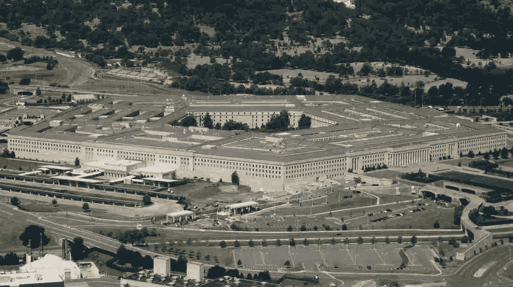
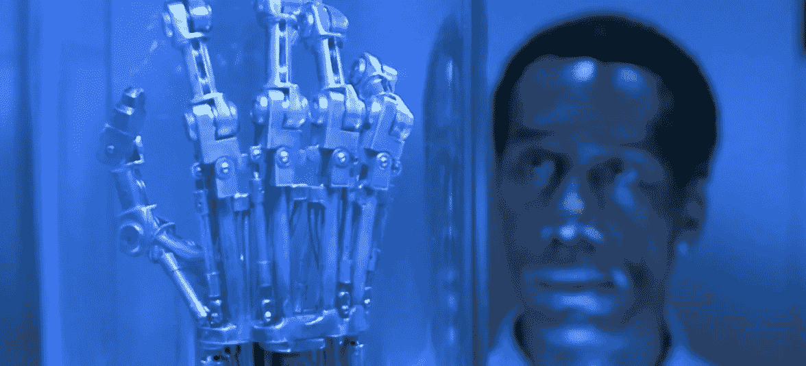

# 黑客 UFO 技术，SETI，和“体面”科学的边界

> 原文：<https://medium.com/hackernoon/hacking-ufo-tech-seti-and-the-boundaries-of-respectable-science-aeaf126ce979>

# 我们将何去何从？

本周末《纽约时报》刊登了一篇突破性的报道，名为[发光的光环和黑钱:五角大楼神秘的不明飞行物项目](https://www.nytimes.com/2017/12/16/us/politics/pentagon-program-ufo-harry-reid.html)，该项目被国际媒体报道，这是自 20 世纪 60 年代以来五角大楼首次承认他们正在认真对待不明飞行物。

UFO 世界的许多人欢呼这是一个点滴披露的开始，不仅是关于研究 UFO 目击事件的所谓黑人政府项目的存在，而且对科学家和工程师来说可能是一个更有趣的披露:在我们的领空存在无视我们已知的物理定律的技术，我们*正在积极尝试*对它进行逆向工程。

直到现在，如果你公开问任何严肃的科学家关于 UFO 的问题，他们通常会给出一个 CYA 式的答案。这让我想起了商界的一句老话，“没有人会因为和 IBM 合作而被解雇。”没有一个学者或研究人员会因为说“没有证据表明 UFO 存在，所以我们不应该研究它们”而被解雇。另一方面，如果他们说这件事应该认真对待并给予资助，他们会受到各种嘲笑，并可能失去工作。

这让我想起了电影《T4 接触》中的一段对话(根据非常受人尊敬的天文学家卡尔·萨根写的书改编)，艾莉·阿罗威(朱迪·福斯特饰演)和她的导师，非常受人尊敬的科学家大卫·德拉姆林(汤姆·斯凯里特饰演)之间的对话。他基本上告诉她:“你是一个有前途的科学家。不要丢掉事业……找小绿人。”

随着这份令人震惊的报告和国防部承认它严肃对待 UFO，这种态度会改变吗？

## 一点历史

在我们回答这个问题之前，让我们先回顾一下历史。

大约 50 年前的今天，1969 年 12 月 17 日，蓝皮书计划，一个政府资助的研究 UFO 目击事件的项目被关闭了(奇怪的是，这一天也是我出生的日子，尽管它发生在地球的另一边！).

对于“蓝皮书计划”(以及相关项目)的关闭，流行的说法是，大多数不明飞行物都是错误识别或自然发生的，由于军方不认为它们是一种威胁，政府正式不再参与不明飞行物业务。

这种说法有三个问题:

1)许多目击事件“无法解释”——这些不同于“不完整”的目击事件(即没有足够的信息来确定它们是什么)。

2)许多人怀疑政府继续对国防部的绝密项目表现出兴趣，甚至在声称他们“不再感兴趣”之后还在继续研究不明飞行物。事实上，有许多说法认为，最有趣的 UFO 案件是由国防部直接调查的，从未移交给 BB。

J. Alan Hynek 博士是该项目的首席科学顾问，他后来成为严肃的 UFO 研究的倡导者，经常与卡尔·萨根辩论，卡尔·萨根(至少公开地)认为钱应该花在像射电天文学这样的“严肃”科学上。海涅克不仅发明了“第三类亲密接触”这个术语，还在斯皮尔伯格 1977 年的电影中客串了一个角色。

## 重大声明

今年，2017 年 12 月 16 日，随着《纽约时报》的报道，国防部发布了第一个与军方遭遇 UFO 的“官方镜头”。他们自 1969 年以来第一次承认，有另一个秘密组织是由参议员哈里·里德和其他人成立和资助的，以研究这一现象。

如果你阅读了那份报告和其他报告中包含的信息，真实的故事不仅仅是国防部承认他们正在研究 UFO——而是这是他们第一次公开承认有真实的证据——包括视频、雷达、目击者、照片甚至实物——证明美国军用飞机和未知飞行器之间的遭遇违反了已知的物理定律。

对我来说，这个故事最有趣的方面，也许对你来说，如果你是一名工程师或科学家，就在这里:

> 在毕格罗的指导下，该公司改造了拉斯维加斯的建筑，用于存放金属合金和其他材料，埃利宗多和项目承包商称，这些材料是从不明空中现象中回收的。

**这是一个惊人的承认。**事实上，这可能是自 1947 年罗斯威尔事件(军方发布了一份新闻稿，称其捕获了一个飞碟，但在接下来的几天里又收回了这篇报道)以来，政府中的任何人第一次真正承认他们拥有飞碟/UFO/UAP 技术。

## 科学家、工程师和硅谷会有什么反应？

这是否会导致主流科学家在被问及不明飞行物时更加小心一点？

几年前，我在 SETI-CON(由 SETI 发起，寻找外星智慧，其执行董事吉尔·鞑靼是一位受人尊敬的射电天文学家，也是《T4 接触》的女主角背后的灵感来源之一)时，我问那里的首席射电天文学家塞斯·肖斯塔克，为什么 SETI 不研究不明飞行物。

赛斯对我的回答大致是这样的:“嗯，不明飞行物的人都疯了。他们认为他们有证据表明不明飞行物在这里，而实际上没有任何证据。我重复零证据。”我一直怀疑这是 CYA 的标准答案，因为事实上有大量证据表明他不想花时间去整理。

既然五角大楼已经基本上确认有不明飞行物在我们的天空中飞行，他们不仅研究了它们，而且我们从它们那里得到了*人工制品*，真正的问题是:

学术界和工业界的平民科学家难道不应该要求我们试着弄清楚这些东西是如何工作的吗？

硅谷应该发出巨大的呼声——它应该是创新的中心(我住在这里，离山景城的谷歌和 SETI 只有一段路)。埃隆·马斯克(Elon Musk)没有花费时间试图让火箭(一项 50 多年的老技术)更好地工作，如果他真的希望我们成为行星间(或许是恒星间)的物种，他难道不应该投资几十亿美元来搞清楚这种尚未被理解的交通方式吗？

虽然谷歌获得了月球 X 奖，让我们重建了 40 年前开发的登月技术，但他们难道不应该投资更多美元来获得 X 奖，这将标志着物理学和人类探索的真正进步——展示一个基于非火箭的飞行和推进系统到恒星吗？

## 再造/黑掉 UFO 技术？

事实是，我们真的不知道这项不明飞行物技术是如何工作的，在基础研究领域，硅谷可能更像是一个落后者，而不是创新者。我说的“我们”，是我们的主流科学真的不知道它是如何工作的。亚瑟·C·克拉克曾经说过，足够先进的技术与魔法是无法区分的——我们“可敬的”主流科学家最讨厌的莫过于因为我们不理解而显得“神奇”的东西。

来自《纽约时报》的同一篇报道:

*“我们的处境有点像是，如果你给列奥纳多·达·芬奇一个车库门开启器，会发生什么，”工程师哈罗德·e·普霍夫(Harold E. Puthoff)说，他曾为中情局进行超感知觉研究，后来成为该项目的承包商。“首先，他会试着弄清楚这是什么塑料东西。他对所涉及的电磁信号或其功能一无所知。”*

我可以说，我亲自与来自顶尖大学(斯坦福、麻省理工、哈佛)的研究人员交谈过，他们看到了文章所引用的“人工制品”，以及其他类似的更隐秘(或许更具功能性)的人工制品。

虽然我通常是提出科幻小说场景的人，但一名研究人员向我提出了一个贴切的场景:在电影*终结者 2* 中，科学家和工程师只能有限地接触“它”——来自未来的微芯片和终结者的骨架。他们正在对它进行逆向工程，试图弄清楚它是如何工作的。它远远领先于迄今为止开发的任何东西。

听起来很熟悉？我听说逆向工程就是这样。

这是一个非常大的挑战。想想我们在过去 100 年中在科学和技术方面取得的进步，想象一下我们在未来 100 年将取得的进步。现在想象一下，我们拥有领先我们一百万年的*文明的科技！*

## 前进的道路

如果我们要弄清楚这东西是如何工作的，我们将需要这方面最好的头脑——不仅仅是来自军方或一些发誓保密的秘密研究人员。这是一个比我们努力做的任何事情都要大得多的项目——因为一旦基本的材料问题得到解答，我们可能需要新型的电磁信号和新型的计算机科学，而不是我们所学的。我被告知，一些已经被发现但尚未被谈论的技术涉及到将意识与物理人工制品进行接口，这也让我们大多数主流科学家和工程师匆忙赶到他们在 CYA 的角落，嘀咕着“伪科学”和“轶事证据”

我们这些研究过这一现象的人都知道，本周末的文章只是冰山一角。我亲自看过 20 世纪 50 年代和 60 年代的老照片，它们比迄今为止发布的任何照片都要清晰得多。汤姆·德隆，前 blink182 音乐人，他组建了明星学院的*乐队，并在发布这一声明中发挥了重要作用，他自己在推特上写道:“还有更多的 s-t 即将到来！”*

我心中的一个大问题是，既然秘密已经泄露，随着更多信息的披露，那些“可敬的”科学家们会做些什么呢？

我认为有三种可能的方法:

1.来自主流的科学家和工程师继续否认，否认，否认，并给出了一个 CYA 答案:*没有证据表明 UFO 或 UFO 技术，它不值得研究。*

2.随着更多的信息泄露，在某个时候，大卫·德拉姆林效应发生了。什么是*大卫德鲁姆林效应*？在同一部电影中，*联系*，在一个来自另一个世界的真实信号被发现后，嘲笑埃莉·阿罗威的同一位科学家突然成为新信号和外星人的“专家”，并试图吸收这项工作，从未承认他们之前的封闭态度。

3.科学家和工程师与不明飞行物研究者和国防部一起工作，同时保持谦逊和开放的心态。可能需要一种新的开放的方法，科学家和工程师可能必须以“我们错了”的态度开始，并且“我们还没有发现所有有待发现的东西，远远没有”作为起点。这可能会导致重新发现一些关于空气动力学，量子物理学，甚至，我被告知意识及其影响物质世界的能力的基本概念。

随着更多的发现，我们可能需要重新考虑我们的傲慢，不仅是在宇宙中孤独，而且还认为我们的科学/技术在技术上是先进的，我们可以对其他文明和他们“访问”我们的能力做出明确的声明。我们这些“亲科学”的人可能也要重新考虑我们自己的科学技术的一些基本方面，更困难的是，我们对我们不了解的事物的偏见和狭隘。

> PS——非常感谢像汤姆·德隆、前国防部官员路易斯·埃利桑多、记者海伦·库珀、拉尔夫·布卢门撒尔和不知疲倦的莱斯利·基恩这样的人的努力，以及其他坚持这个主题并通过《纽约时报》等帮助发布这个公告的人。