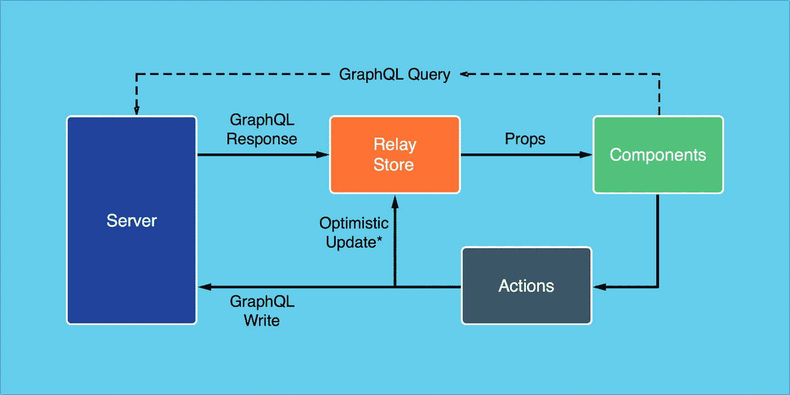

# 敏捷地处理 React 应用程序中的 AJAX

> 原文：<https://medium.com/hackernoon/handling-ajax-in-your-react-application-with-agility-413f1f21fc70>


自从脸书将 API 公之于众后， [**React**](https://facebook.github.io/react/) 生态系统变得巨大。更重要的是，React 采用的声明式风格已经构建了很多优秀的库。

然而，现实生活中的应用程序需要向服务器发出 AJAX 请求。这在使用 React 时会带来很大的挑战。您需要知道 AJAX 流程应该使用什么库。

知道用 React 处理 AJAX 有不同的方法是很好的。这就是 React 作为 [**视图库**](https://en.wikipedia.org/wiki/Model%E2%80%93view%E2%80%93controller)——*灵活性*的妙处之一。

# 如何用 React 发出 AJAX 请求

1.  在 React 组件内。
2.  代表继电器。
3.  代表 Redux。

# 1.在反应组件内

对于 AJAX 请求来说，这是最简单也是最常见的方法。这里，AJAX 请求直接在组件的[**componentDidMount**](http://www.tutorialspoint.com/reactjs/reactjs_component_life_cycle.htm)生命周期方法中发出。随着应用程序的增长，事情可能会变得一团糟。

*对 Github API 的一个获取用户详细信息的请求如下:*

Basic implementation of AJAX within React component

*让我们来测试一下……*

Basic implementation of AJAX within React

# **2。代表继电器**

[Relay](https://facebook.github.io/relay/) 允许你用 GraphQL 声明你的组件的数据需求。relay 通过道具使它们可用。

对于构建大型应用程序来说，Relay 是优雅的——但是它有一些开销。这包括从学习 relay 和 GraphQL 到设置 GraphQL 服务器。

*一个示例中继流可能是这样的:*



[https://facebook.github.io/react/blog/2015/03/19/building-the-facebook-news-feed-with-relay.html](https://facebook.github.io/react/blog/2015/03/19/building-the-facebook-news-feed-with-relay.html)

# **3。代理冗余**

[**Redux**](http://redux.js.org/) 基于 [Flux 架构](https://facebook.github.io/flux/docs/overview.html)构建，用于管理 React 应用的状态。使用 Redux，您可以将应用程序数据和 AJAX 流程从组件中移出。


Redux workflow example

从图中，您可以看到应用程序状态和异步流程是如何移动到存储区的。

[Store](http://redux.js.org/docs/api/Store.html#dispatch) 是一个保存你的应用程序的完整状态的对象。注意，在 Redux 中，所有应用程序状态都存储为一个对象。改变其状态的唯一方法是通过 [*调度动作*](http://redux.js.org/docs/api/Store.html#dispatch) 。通过这种实现，您可以在整个应用程序中维护单一的真实来源。

[reducer](http://redux.js.org/docs/basics/Reducers.html)只是纯粹的函数，它接受先前的状态和动作，然后返回新的状态。它不会改变状态；它复制以前的状态，对其进行转换，并将新的状态返回给存储。如果有更改，存储将使用新状态更新视图。

> **reducer**，给定相同的参数，应该计算下一个状态并返回。没有惊喜。没有副作用。没有 API 调用。没有突变。减速器是同步和被动的，因此不是异步动作的理想场所。

```
(previousState, action) => newState
```

**那么你应该如何处理有副作用的手术呢？** *Redux 异步库来拯救:*

1.  [重复承诺](https://github.com/acdlite/redux-promise)
2.  [Redux-thunk](https://github.com/gaearon/redux-thunk)
3.  [Redux-saga](https://github.com/yelouafi/redux-saga)

它们是 Redux 中间件，用于处理 React/Redux 应用程序中的异步任务和副作用。

Redux-promise 使用 Flux 标准操作，并承诺为异步呼叫带来清晰的约定。这是三个中最不受欢迎的。它是一个中间件功能，接收承诺并分发承诺的解析值。它基本上向调用者返回一个承诺，以便它可以等待操作完成后再继续。

**Redux-thunk** 允许动作创建者返回一个函数，而不是一个动作对象。这样，动作创建者就变成了一个 [thunk](https://en.wikipedia.org/wiki/Thunk) 。

一个 **thunk** 是一个通常被自动创建的函数，用来帮助调用另一个函数(例如 API 端点)。thunk 将异步操作包装在函数中。

当一个动作创建者返回一个函数时，这个函数将被 Redux Thunk 中间件执行。这个函数不需要很纯；因此，允许它有副作用，包括执行异步 API 调用或路由器转换。该函数还可以分派动作。

为了启用 Redux Thunk，我们使用了 [applyMiddleware()](http://redux.js.org/docs/api/applyMiddleware.html) 。

> 如果启用了 Redux Thunk 中间件，那么每当您试图调度一个函数而不是一个动作对象时，中间件将调用该函数，并将 dispatch method 作为第一个参数。

查看 [**此处**](http://stackoverflow.com/questions/35411423/how-to-dispatch-a-redux-action-with-a-timeout/35415559#35415559) 为[**丹·阿布拉莫夫**](https://www.codementor.io/gaearon) ，Redux 的创造者，Redux-thunk 给出了详细的使用案例说明。

我们可以分派普通对象动作和其他 thunks，这让我们可以在单个流中组合异步动作。

Basic AJAX request with redux-thunk middleware

Redux-thunk 很容易用相对较小的 API 来学习——只有十行代码。但是很难测试。

*让我们来测试一下……*

Implementing AJAX with redux-thunk

仍然好奇，看另一个[异步动作](https://github.com/reactjs/redux/tree/master/examples/async)的例子。

[**Redux-saga**](http://yelouafi.github.io/redux-saga/) 是一个 Redux 中间件，它消除了 React/Redux 应用程序中异步流程的复杂性。它利用了 [ES6 生成器](https://developer.mozilla.org/en/docs/Web/JavaScript/Reference/Statements/function*)的能力，使得异步任务易于测试、编写和推理。

Redux-saga 以比其他中间件更简洁的方式管理异步请求和副作用。它通过将**回调、承诺、try/catch** 块变成简单的指令来降低这类请求的复杂性。更重要的是，它使你的代码更具声明性、可测试性和可读性。虽然你可以一起使用 R **edux-thunk** 和 R **edux-saga** ，但 Sagas 正是治愈你复杂工作流程痛苦的东西。

> 当您的商店需要处理复杂的异步操作时，请考虑使用 Redux-saga。它将异步操作作为简单的指令来处理。Redux-saga 优雅地管理异步任务，保持您的减速器纯净。

## ***A)定义传奇***

Saga

传奇是生成器函数。它使用 ES6 发电机。查看**凯尔** **辛普森**关于 ES6 发电机[基础知识的文章。](https://davidwalsh.name/es6-generators)

发生器是可以暂停和恢复的功能。由于生成器的工作方式，Redux-saga 能够使复杂的异步工作流看起来同步。

我们有两个 sagas 来完成这个操作: **watchRequest** 和 **loadUserDetails** 。传奇在函数前用*标识。

Redux-saga API 公开了我们完成任务所需的一些方法:

1.  **call** 是一个运行可选参数函数的效果创建器。它挂起生成器，因为返回的结果是一个承诺。当承诺被解决或拒绝时，生成器将恢复。
2.  **fork** 是一个对函数进行非阻塞调用的效果创建器。
3.  **takeLatest** 取消任何当前操作，并返回与其模式匹配的最新操作的结果。
4.  **takeEvery** 返回匹配其模式的所有动作的结果。
5.  **put** 简单地将动作放到/分派到指定的通道*(一个用于发送和接收消息的对象)。*

查看[文档](https://github.com/yelouafi/redux-saga/tree/master/docs/api#channel)了解更多信息。

***回本码*** 。

*   **获取要调度的 LOAD_USER_REQUEST 操作的最新**手表。
*   然后，它使用返回的操作对象对 **loadUserDetails** 进行非阻塞调用。在这种情况下，操作类型和用户名。
*   **调用**使用有效载荷(即用户名)运行 **gitHubApi** 函数，并解析分配给**用户的值。**
*   现在， **put** 将带有用户值的 LOAD_USER_SUCCESS 调度回商店。
*   最后，如果操作失败，调度失败操作是一个好的实践，在我们的例子中是 LOAD_USER_FAILURE。

## ***B)装上萨迦商店***

Mount Sagas to the store

为了使商店的状态和功能对 React 组件可用，[**React-redux**](http://redux.js.org/docs/basics/UsageWithReact.html)**提供了:**

1.  ****连接**功能—将 React 组件连接到 Redux 存储。**
2.  ****提供者组件** —一个更高级的组件，用于使存储对应用程序中的所有容器组件可用，而无需显式传递它。**

## *****3)将 React 组件连接到 Redux 存储*****

**Connect React connect React component to Redux store**

***让我们来测试一下……***

**Sample implementation of AJAX with React and Redux-saga.**

# ****总结****

**React 应用程序中的 AJAX 操作可以用 Redux 异步库更好地处理。使用 Redux 时，不要把 AJAX 放在 React 组件中。关注点分离是关键。更重要的是，如果您的 React/redux 应用程序需要进行异步操作，请使用 Redux-thunk 或 Redux-saga 灵活而优雅地处理它。在 reducers 中发出异步请求是一种反模式，应该避免。**

**在 [Github](https://github.com/rowlandekemezie/React-saga-tutor.git) 上查看源代码。**

**非常感谢[伊曼纽尔·艾萨克](https://medium.com/u/7fdd3829d91?source=post_page-----413f1f21fc70--------------------------------)、[阿卜杜勒夸杜斯·阿比奥顿·舒艾布](https://medium.com/u/c9fe2a3c798b?source=post_page-----413f1f21fc70--------------------------------)和[奥卢瓦费米·苏乐](https://medium.com/u/f0a6e9a09a0e?source=post_page-----413f1f21fc70--------------------------------)抽出时间通读草稿。**

****注:**本文原载于[共同导师](https://www.codementor.io)。你可以在这里 查看 [**。**](https://www.codementor.io/reactjs/tutorial/handling-ajax-in-your-react-application-with-agility-0)**

> **如果我错过了什么，请在评论区留下您的反馈、评论和问题。*如果你觉得这篇文章有用，点击推荐给他人💚也通过在社交媒体上分享。***

**[](http://bit.ly/HackernoonFB)****[](https://goo.gl/k7XYbx)****[](https://goo.gl/4ofytp)**

> **[黑客中午](http://bit.ly/Hackernoon)是黑客如何开始他们的下午。我们是这个家庭的一员。我们现在[接受投稿](http://bit.ly/hackernoonsubmission)并乐意[讨论广告&赞助](mailto:partners@amipublications.com)机会。**
> 
> **如果你喜欢这个故事，我们推荐你阅读我们的[最新科技故事](http://bit.ly/hackernoonlatestt)和[趋势科技故事](https://hackernoon.com/trending)。直到下一次，不要把世界的现实想当然！**

****