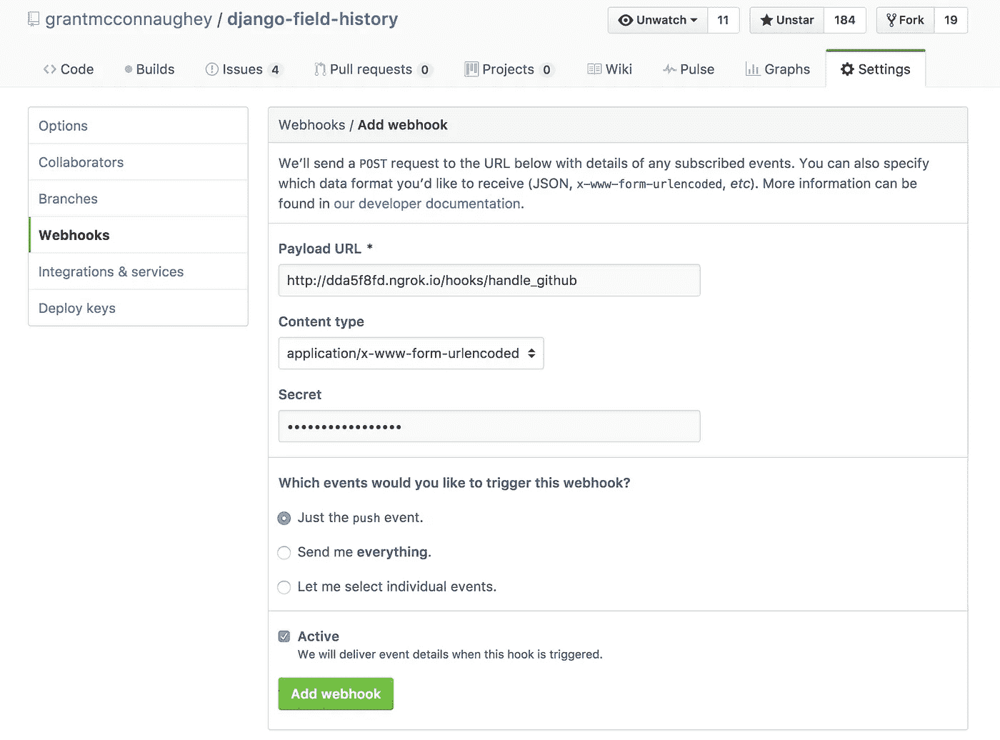

# 使用 Django 和 ngrok 处理 webhooks

> 原文：<https://medium.com/hackernoon/handling-webhooks-using-django-and-ngrok-b7ff27a6fd47>

在本文中，我们将介绍如何使用 Django 处理 webhook，在 [GitHub](https://hackernoon.com/tagged/github) 中创建一个 webhook，并使用 ngrok 在您的本地机器上测试 web hook。但是首先简单介绍一下 webhooks。

如果你已经熟悉 webhooks，那么可以跳过第一部分。

# 什么是 webhooks？

假设您正在编写一个应用程序，需要在另一个系统中发生事件时得到通知。事件可能是用户发送推文或某个商品的价格发生变化。

知道事件何时发生的一个方法是经常检查。例如，你的应用程序可以每 5 分钟向 Twitter 发出一个请求，询问“用户*已经发布了什么吗？”这被称为轮询，它会对您的服务器造成负担，因为您必须不断地向外部服务发出请求。*

另一种知道事件已经发生的方法是让其他服务在事情发生变化时通知你的应用程序。这可以通过使用 **webhooks** 来完成。使用 webhooks，您不再需要每 5 分钟或每天进行一次投票。相反，你的应用程序**实时接收事件**。

# 处理 GitHub webhooks

GitHub 有太多的事件可以触发 webhooks。我们要处理的事件是默认的`push`事件，当用户将提交、分支或标记推送到 GitHub 存储库时会发生该事件。

让我们写一些代码来处理 GitHub 的 webhooks。我们正在编写一个 Django 应用程序，所以我们将创建一个视图函数。确保将这个视图连接到 URL `/hooks/handle_github`。

下面是一个视图函数，它将根据 GitHub 文档中的说明处理 GitHub webhooks [。要做到这一点，你需要首先添加一个`GITHUB_WEBHOOK_SECRET`到你的设置文件中。把这个当作你的 webhook 的密码，所以用一个包含很多随机字符的长字符串。另外，记住它，因为我们以后会用到它。](https://developer.github.com/webhooks/creating/)

来自 GitHub 的请求通过`handle_github_hook`查看功能进入我们的应用程序。视图确保请求得到授权，加载有效负载 JSON，对有效负载做一些有用的事情，并返回 HTTP 响应。

当编写你的处理程序时，记住 [GitHub 希望你在 30 秒内响应 web hooks](https://developer.github.com/guides/best-practices-for-integrators/#favor-asynchronous-work-over-synchronous)。如果你需要执行的任务可以快速完成，那么就同步完成。否则最好使用[芹菜](http://www.celeryproject.org/)或 [RQ](http://python-rq.org/) 将任务放在后台。

现在我们有了处理 webhooks 的代码，我们需要测试它。

# 输入 ngrok

Webhooks 需要一些工作来进行本地测试。这是因为从本质上来说，他们希望有一个可公开访问的 URL 来发送请求，而我们的大多数开发笔记本电脑都没有这个功能。幸运的是，有一个非常简单的方法，我们可以创建一个公共 URL，直接指向我们的开发服务器: [ngrok](https://ngrok.com/) 。

Ngrok 是一个命令行应用程序，您可以使用它将您的开发机器暴露给互联网。要安装 ngrok，请转到 [ngrok.io](https://ngrok.com/) 并遵循其安装步骤。下载解压就这么简单。你去做那件事时，我会等着的。

> 🎵危险主题曲🎵

ngrok 现在安装了吗？太好了！要运行它，请打开您的终端并输入以下内容。

```
ngrok http 8000
```

这应该会启动一个连接到本地 HTTP 端口的安全隧道。它看起来会像这样:

```
ngrok by [@inconshreveable](http://twitter.com/inconshreveable)                                                                                                                                         (Ctrl+C to quit)Session Status                online
Version                       2.1.18
Region                        United States (us)
Web Interface                 [http://127.0.0.1:4041](http://127.0.0.1:4041)
Forwarding                    [http://dda5f8fd.ngrok.io](http://dda5f8fd.ngrok.io) -> localhost:8000
Forwarding                    [https://dda5f8fd.ngrok.io](https://dda5f8fd.ngrok.io) -> localhost:8000Connections                   ttl     opn     rt1     rt5     p50     p90
                              0       0       0.00    0.00    0.00    0.00
```

转发 URL[http://DDA 5 F8 FD . ngrok . io](http://dda5f8fd.ngrok.io)是我将用于 webhook 的 URL。您的 URL 会有所不同，所以使用 ngrok 提供的任何东西。

# 设置我们的网页挂钩

现在我们已经有了代码来处理 webhooks *和*一个可公开访问的 URL，让我们在 GitHub 中设置一个 webhook。

您可以使用 GitHub 的 API 以编程方式将 webhook 添加到存储库中。事实上，这就是你*应该*做的事情，以使整个过程自动化。然而，本着简洁的精神，我们将通过 GitHub UI 添加一个 webhook。为此，请转到 GitHub 中的一个存储库，选择设置，然后选择 Webhooks。

将您的 ngrok URL + `/hooks/handle_github`添加到有效负载 URL 字段。接下来，将 Django 设置中的秘密字符串添加到秘密字段中。GitHub 会发送这个秘密字符串，这样你就可以验证请求是否真的来自他们。最后，选择你希望 GitHub 通知你的应用程序的事件。当一切就绪后，表单应该如下所示:



Setting up our webhook in GitHub

点击添加网页挂钩按钮，你的网页挂钩就可以使用了。

# 测试它

终于到了确认整件事正常运作的时候了。为此，通过运行`python manage.py runserver`启动开发 Django 服务器。这应该在端口 8000 上启动您的服务器，这是 ngrok 期望的端口。

接下来我们需要在 GitHub 中触发一个事件。如果你的 webhook 被配置为处理默认的`push`事件，那么将一个分支推送到 GitHub 就足够了。

克隆您创建 webhook 的存储库。例如:

```
$ git clone [https://github.com/grantmcconnaughey/django-field-history.git](https://github.com/grantmcconnaughey/django-field-history.git)
```

现在，创建一个新的分支，并将其推回到 GitHub。

```
$ git checkout -b webhook_test
$ touch new_file.py
$ git add new_file.py
$ git commit -m "Testing webhooks"
$ git push origin webhook_test
```

这将触发`push`事件，GitHub 将向您在回购设置中输入的 ngrok URL 发出请求。这意味着您应该在运行 ngrok 的终端上看到一些活动:

```
HTTP Requests
-------------POST /hooks/handle_github/            202 Accepted
```

万岁。🎉我们已经成功处理了一个 GitHub webhook。

# 结论

在这篇文章中，我讨论了**什么是**，以及它们为什么有用。接下来，我向您展示了如何在 Django 应用程序中使用视图功能处理 webhooks。然后我开了一个衍生的玩笑，涉及一个深受喜爱的美国游戏节目。之后，我向您展示了如何**配置您的本地开发**机器来处理互联网上的 webhooks。最后，我们证明了**所有这些实际上都有效**。

我希望你学到了一些东西，感谢你的阅读！

*这段代码几乎一字不差地摘自我的项目*[***Lintly***](https://lintly.com)*，一个连续的*[*Python*](https://hackernoon.com/tagged/python)*与 GitHub 集成的代码林挺服务。如果你想* ***跟踪你的 Python 代码质量*** *，那么 Lintly 可以提供帮助。去 lintly.com 的*和[看看吧。](https://lintly.com)

*另外，如果你对推特感兴趣，请关注我*[*@ gmconnaugney*](https://twitter.com/gmconnaughey)*。*

[](http://bit.ly/HackernoonFB)[](https://goo.gl/k7XYbx)[](https://goo.gl/4ofytp)

> [黑客中午](http://bit.ly/Hackernoon)是黑客如何开始他们的下午。我们是 [@AMI](http://bit.ly/atAMIatAMI) 家庭的一员。我们现在[接受投稿](http://bit.ly/hackernoonsubmission)并乐意[讨论广告&赞助](mailto:partners@amipublications.com)机会。
> 
> 如果你喜欢这个故事，我们推荐你阅读我们的[最新科技故事](http://bit.ly/hackernoonlatestt)和[趋势科技故事](https://hackernoon.com/trending)。直到下一次，不要把世界的现实想当然！

