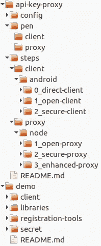
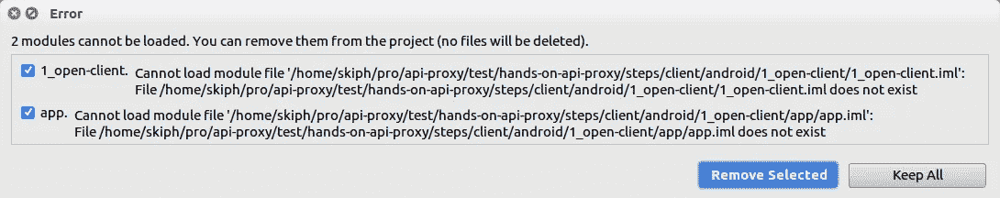
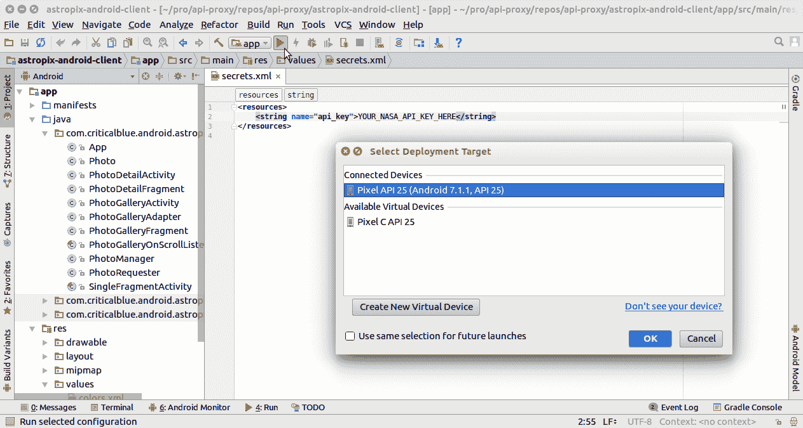
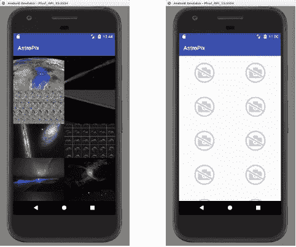
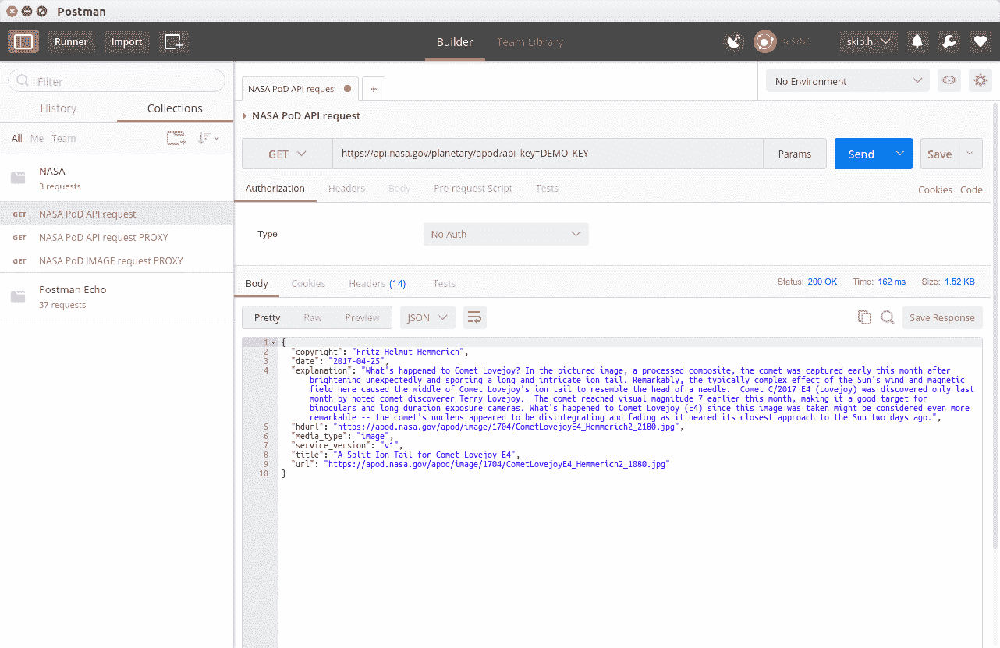
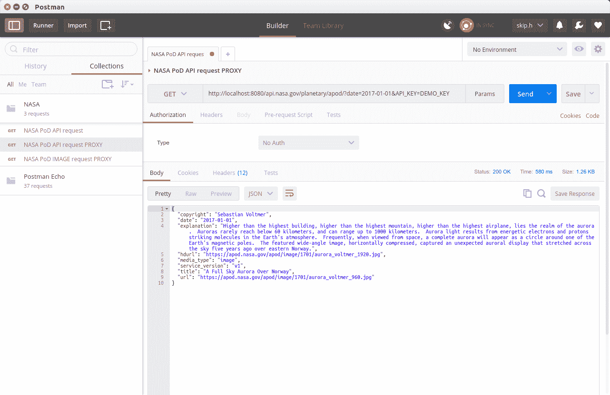
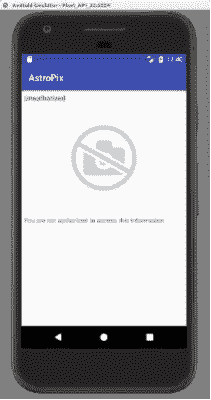
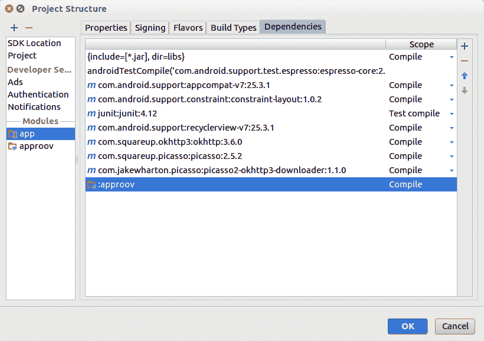

# 移动 API 安全性实践:消除客户端秘密

> 原文：<https://medium.com/hackernoon/hands-on-mobile-api-security-get-rid-of-client-secrets-a79f111b6844>

## 引入 API 密钥代理以提高移动安全性


**UGC 12591: The Fastest Rotating Galaxy Known [Image Credit:** [NASA](http://www.nasa.gov/), [ESA](http://www.esa.int/), [Hubble](https://www.nasa.gov/mission_pages/hubble/story/index.html)]

API 密钥和其他隐藏在移动应用程序中的秘密是移动不安全的一个常见来源。你可以[做得更好](https://hackernoon.com/they-reverse-engineered-16k-apps-heres-what-we-d-fix-67e9eeceefb5)。

在本教程中，您将使用一个简单的照片客户端，它使用 API 键来访问 [NASA 每日图片服务](https://apod.nasa.gov/)。在客户端和图片服务之间引入 API 代理将消除在客户端存储和保护 API 密钥的需要。除了提高安全性之外，这种方法还在可管理性和可伸缩性方面提供了一些好处。

在本教程中，您将修改一个 Android 客户端和 Node.js 代理服务器。出于演示目的，Android 客户端仿真和节点服务器可以在一台笔记本电脑上一起运行。

我假设您对 Android 有一些非常基本的了解，并且能够阅读 Java 和 Javascript。所有代码都已提供，所以即使您在这些环境中的经验有限，也应该能够理解。

# Astropiks 移动应用程序

Astropiks 移动应用程序是一个相对简单的联网 Android 客户端，有两个主屏幕。初始屏幕显示了 NASA 近期每日一图的图库。点击一幅图像，会出现一个包含完整图像及其描述的详细屏幕。


Gallery and Detail Screens

该应用程序使用 [NASA 的每日图片 API](https://api.nasa.gov/api.html#apod) 来检索图像和描述。要访问该服务，API 需要一个注册的 API 密钥，该密钥最初存储在客户端应用程序中。

# 为什么要添加 API 代理？

任何复杂性的应用程序都将通过其公共 API 大量使用多个第三方服务，这意味着处理和保护许多秘密的 API 密钥。秘密应该是保密的。不幸的是，对于一个保存在移动应用程序上的秘密来说，问题不在于它是否会被窃取，而在于它会在什么时候被窃取，以及需要付出多大的努力。

通过在客户端应用和其第三方服务之间引入 API 密钥代理服务器，我们可以将不安全的移动客户端中的 API 密钥移除，并将它们放在更安全的代理服务器上。我们还添加了一个证明服务来建立客户机和新代理服务器之间的信任。在[移动 API 安全文章](https://hackernoon.com/mobile-api-security-techniques-682a5da4fe10)中详细讨论了这种方法。

我们将使用 NASA 服务作为一个 API 的例子，它通常是从移动客户端应用程序调用的。我们在客户端和服务之间增加了额外的一跳，但它确实提供了显著的好处。既然我们已经从客户那里移除了这个秘密，它就不会再被偷走了。

如果秘密由于某种原因被泄露，可以在代理服务器上用新的秘密替换它。从可管理性的角度来看，由于秘密不再在客户端，所以可以做出提高安全性的决定，而不需要对客户端的安装基础进行任何更改。

代理服务本身是[无状态的](http://stackoverflow.com/questions/5539823/what-are-the-benefits-of-a-stateless-web-application)，这带来了负载平衡、故障恢复和其他可伸缩性的好处。通过在客户端和代理服务器之间建立信任，证明服务提供了一个快速拒绝过滤器，以在实际的 API 服务器增加负担之前丢弃无效的流量。当多个 API 服务通过同一个服务器代理时，这些好处会增加。

# 初步设置

要开始，您需要下载教程源代码，获得一些密钥，并确保您的开发工具已准备就绪。本教程应该可以在 windows、mac 或 linux 环境下正常运行。

## 1.下载 API 代理教程源代码

所有教程源代码都可以在 github 上找到。在终端或命令窗口中，切换到存储教程的目录，并克隆这个公共 git 存储库:

```
tutorials$ git clone [https://github.com/approov/hands-on-api-proxy.git](https://github.com/approov/hands-on-api-proxy.git)
```

## 2.从 NASA 注册一个 API 密匙(免费)

美国宇航局需要一个有效的注册码来访问他们的免费图片服务。打开浏览器，访问 https://api.nasa.gov/index.html#apply-for-an-api-key 的。完成注册，并将您的 API 密钥保存在安全的地方。

## 3.下载证明演示服务包(免费)

证明服务用于在客户端和代理服务器之间建立信任。打开浏览器，访问[https://www.approov.io/demo-reg.html](https://www.approov.io/demo-reg.html)获得免费演示服务。完成注册，打开电子邮件，将 zip 文件解压到一个方便的地方。在所示的示例目录树中，我将它放在与 api-key-proxy repo 相同的父目录下。



在本教程中，您将对移动客户端和 api 密钥代理进行更改。已经为您创建了一个工作目录`pen`，其中保存了客户端应用程序和 API 密钥代理的初始副本。

对于客户机和代理，教程的每个完成的步骤都存储在`steps`目录下。如果您想从某个中间点开始，可以将其中任何一个复制到您的工作目录中。

不久将使用`config`目录用您的特定密钥和秘密预先配置这些步骤。

## 4.安装 Android Studio 和 SDK

Android Studio 和 Android SDK 用于构建和运行 Astropiks 客户端应用程序。确保安装了 Android Studio，并且是最新的，最好是 2.3 版或更高版本。如果您需要全新安装 Android 工具，请访问 Android 开发者网站[开始安装。](https://developer.android.com/studio/index.html)

本教程假设您将在 Android 模拟器中运行客户端，但是您也可以使用 Android 手机或平板电脑。Android 设备应该运行 API 19 或更高版本。

## 5.设置 Node.js

Node.js 环境用于构建和运行示例密钥代理服务器。确保安装了 Node.js 环境，最好是稳定的版本 6。如果您需要全新安装，请访问 [Node.js](https://nodejs.org/) 开始安装。如果要维护多个节点版本，请安装[节点版本管理器(nvm](https://github.com/creationix/nvm) )。

这将安装节点及其软件包管理器 npm。我们将在构建每个代理时安装额外的包依赖项。

Android 和 Node.js 环境被选为示例演示环境。其他实现，包括用于客户端的 iOS 和用于代理的 NGINX 或 Go，当然也是合适的。如果你想看看其他的客户端或代理实现，在回复中添加一个建议，我会看看有什么可以添加的。

## 6.配置代码示例

`config`目录包含一个节点脚本，它将帮助配置所有的示例代码步骤。首先进入`config`目录，并安装所需的节点依赖项:

```
tutorials$ cd api-key-proxy/config
tutorials/api-key-proxy/config$ npm install
```

接下来将示例机密配置文件`secrets.sample.yaml`复制到`secrets.yaml`中，并打开它进行编辑:

```
tutorials/api-key-proxy/config$ cp secrets.sample.yaml secrets.yaml
```

将`proxy_home`设置为完全合格的 URL 地址和协议。如果您将在仿真器中运行 Android 客户端，并在本地运行代理服务器，那么使用`http:`作为协议，使用`10.0.2.2`作为地址(仿真器到`localhost`的默认隧道)，并在示例文件中选择一个未使用的本地主机端口`8080`。

更改`nasa_api_key`和`approov_token_secret`值，以匹配您收到的 NASA API 密钥和您在演示下载中获得的 Approov 令牌秘密。将`approov_android_lib`指向演示下载中`approov.aar`文件的位置。保存`secrets.yaml`，运行配置脚本:

```
tutorials/api-key-proxy/config$ npm start
```

如果配置是正确的，那么所有客户端和代理步骤现在都拥有一组一致的配置和密码值，approov 演示服务 SDK 库已经添加到相关的客户端步骤中，并且已经为客户端和代理设置了代理 URL。

`pen`工作目录包含启动配置、`0_direct_client`和`1_open_proxy`的副本。你应该可以走了。

# 构建初始客户端应用程序

最初的客户端应用程序直接与 NASA 每日图片服务通信。NASA API 密钥必须存储在应用程序中，并随每个 API 调用一起提供。

启动 Android Studio，打开`api-key-proxy/pen/client`工作目录下的 Astropiks Android 客户端。Android Studio 将需要一段时间来加载库依赖项，并重建项目。如果您的配置是有效的，那么项目应该会正确构建。

您可能会看到无法加载模块的通知或错误消息，还可能会出现一个对话框，询问是否可以删除模块:



如果您在目录之间移动了 android 项目，这通常会发生，例如，如果您将一个完成的步骤复制到您的工作目录`pen`中。对`Remove Selected`模块来说应该是安全的，并且你的项目应该同步，没有进一步的问题。

这个应用程序是一个相当简单的模型-视图-控制器风格的主从照片库。`PhotoRequester`类使用 [OkHttp](http://square.github.io/okhttp/) 库处理初始 API 调用，使用 [Picasso](http://square.github.io/picasso/) 库下载图像。NASA API URL 存储在`app/src/main/res/values/config.xml`文件中，应该如下所示:

`App`应用程序类在一个方便的地方为所有活动创建并提供 HTTP 客户端和下载程序。

在运行您的应用程序之前，确保您的 NASA API 密钥在`app/src/main/res/values/secrets.xml`文件中设置正确:

根据需要创建和/或更新这两个文件。

注意`secrets.xml`已经被添加到。`gitignore`文件，这样它就不会被无意中添加到您的 git 存储库中。已经有足够的[个密钥被登记到 GitHub](https://arstechnica.com/security/2015/03/in-major-goof-uber-stored-sensitive-database-key-on-public-github-page/) 中，不需要添加你的！

现在构建、安装并运行应用程序 APK。在 Android Studio 中，点击运行“应用”按钮，启动模拟器或其他连接设备:



您应该会看到类似左边截图的内容:



Good (left) and Bad (right) Gallery Screens

如果您看到右边的屏幕，您可能没有正确配置您的 API 密钥，或者您有网络连接问题。打开浏览器或 [Postman](https://www.getpostman.com/) ，尝试访问 NASA 服务，用自己的密钥替换下面截图中的 DEMO_KEY:



调试您的设置连接和 API 密钥，直到您获得有效的响应。确保您的`api_key`正确设置在`secrets.xml`文件中，并且您的`api_url`正确设置在`config.xml`到`https://api.nasa.gov`中。仔细检查您是否在另一个文件中设置了这些值，比如`strings.xml`。

运行后，向下滚动图库屏幕，从 NASA 获取更多图片。点击图片以查看其详细屏幕。点击返回箭头返回画廊屏幕。

*作为参考，现阶段客户端 app 的一个完整版本在* `*steps/client/android/0_direct-client*` *中。*

# 窃取客户端的 API 密钥

您的 API 密钥用于客户端和 NASA 服务器之间的 API 调用。大多数生产应用程序将调用多个第三方 API，并持有多个 API 密钥。

客户端应用程序应该始终使用 [TLS 最佳实践](https://www.owasp.org/index.php/Transport_Layer_Protection_Cheat_Sheet)，包括证书锁定，来保护 API 通信，这样您的 API 密钥就不会被轻易发现。只要客户端使用一个密钥，客户端的 APK 就包含该密钥的静态表示。在我们的例子中，使用 [Apkool](https://ibotpeaches.github.io/Apktool/) ，逆向工程你的 APK 并揭示 APK 的`api_key`值是一件简单的事情。混淆技术会使这变得更加困难，但您的密钥最终会被找到。

一旦你的 API 密匙被发现，就可以用来访问 NASA 的公共服务。在这种情况下，黑客反复调用 NASA 网站将触发速率限制，最终您将被拒绝访问。但是如果你是电商网站呢？如果你的站点忙于处理无意义的 API 调用，真正的客户会因为响应能力差而被拒绝访问或者放弃。一个恶意的黑客可能能够创建一堆虚假的商品订单或获取竞争信息。或者，黑客可以使用你的 API 创建一个类似的应用程序,在一个缩小的网站上显示你的库存，从即将愤怒的客户那里收集订单，并在这个过程中获取他们的凭据和信用卡信息。

让我们从你的应用程序中找出这个秘密。

# 构建初始 API 密钥代理

要开始在代理服务器上工作，请切换到代理工作目录，并安装任何缺失的节点依赖项:

```
tutorials$ cd api-key-proxy/pen/proxy
tutorials/api-key-proxy/pen/proxy$ npm install
```

这可能需要一段时间，您可能会看到几个依赖项的一些警告，根据您的主机平台，这些警告可能是不必要的。

根据您的初始配置，您的`src/config.js`文件应该如下所示:

您正在将 NASA API 密钥从客户端应用程序转移到代理中，因此您的`src/secrets.js`文件应该如下所示:

确保`nasa_api_key`被设置为你的 NASA API 密匙串。

像您的客户端的`secrets.xml`文件一样，`secrets.js`文件将被 git 安全地忽略。

代理服务器是一个简单的快速应用程序。NASA API 调用在`src/api/nasa.js`模块中处理。当代理服务器看到对 route `/api.nasa.gov`的调用时，它将您的 API 键添加到查询字符串中，将请求代理到 NASA 每日图片服务，并将响应转发给原始调用者。

启动代理服务器:

```
tutorials/api-key-proxy/pen/proxy$ npm start
```

您应该会看到一条消息，表明服务器正在监听在`config.js`中为代理指定的端口。

使用浏览器或邮递员呼叫代理，尝试使用您的代理。假设您正在本地运行端口`8080`，用现在代理的调用`htttp://localhost:8080/api.nasa.gov/planetary/apod?date=2017–01–01&api_key=YOUR_API_KEY`替换对 NASA 的直接调用。请注意，我们还将协议从`https`切换到`http`。这对于生产来说是不安全的，但是可以更容易地在本地运行我们的示例，而无需锁定连接。



JSON 响应包括日期、解释和一个或多个下载媒体的 URL。如果您看到一个格式良好的响应，则您的代理服务器工作正常。否则，检查你的 API 密匙在`secrets.js`中是正确的，并且你的服务器正在运行，正在监听正确的端口，并且能够访问外部网络。

虽然这个例子只使用了一个 API，因此只需要一个 API 键，但是大多数应用程序会使用多个 API 和多个 API 键。API 密钥服务器必须能够代理多个不同的 API 代理。尽管这是一个简单的 Express 应用程序，但它被设置为自动加载在`src/api`目录中找到的所有路线处理程序。要添加额外的 API 密钥代理，您可以创建一个类似于`nasa.js`的新路由处理程序，并将 URL 和密钥添加到配置和机密文件中。

*作为参考，现阶段代理服务器的一个完整版本在* `*steps/proxy/node/1_open-proxy*` *中。*

# 修改客户端应用程序以使用 API 密钥代理

既然 API 密钥代理正在工作，您可以修改 Android 客户端来通过代理。您将使用与上面相同的端口号。按照惯例，如果在 Android 模拟器中运行，`localhost`可以使用`http:`通过地址`10.0.2.2`访问。因此，对于默认的模拟器和本地代理服务器，代理 URL 应该是`[http://10.0.2.2:8080/api.nasa.gov](http://10.0.2.2:8080/api.nasa.gov/planetary/apod.)` [。](http://10.0.2.2:8080/api.nasa.gov/planetary/apod.)

在`app/src/main/res/values/config.xml`文件中适当修改`api_url`值:

您不再需要客户机中的 API 密钥，所以删除`app/src/main/res/values/secrets.xml`文件。您还应该从`PhotoRequester` `getPhoto()`函数中的`urlRequest`查询字符串中删除`api_key`:

通过`config.xml`和`PhotoRequester.java`的这些小改动，重新构建修改后的客户端 app。

确保代理服务器正在运行，并像以前一样在 Android 模拟器或设备上安装并运行修改后的客户端应用程序。您应该会看到和以前一样的结果，但是现在照片是通过 API key 代理提供的。您应该在 API 密钥代理控制台日志中看到照片请求。

如果您没有看到照片，请仔细检查您的代理 URL 和网络连接。如果代理是本地的，确保您使用的是`http:`而不是`https:`协议，并仔细检查主机地址和端口号。或者，在您的客户端设备或仿真器上启动一个浏览器，并尝试从那里访问代理服务器。如果在模拟器上运行，这将有助于验证`10.0.2.2`是本地主机的正确地址。

*作为参考，现阶段客户端 app 的一个完整版本在* `*steps/client/android/1_open-client*` *中。*

# 添加代理安全性

恭喜你，你现在应该有一个正常工作的代理服务器了。客户机上不再有任何秘密，但是您有了一个任何人都可以使用的代理。您需要一种方法来确保只有受信任的客户端可以访问您的代理服务器，而不需要该客户端上的任何新机密。一种方法是使用动态证明服务将客户端应用程序认证为您信任的人。

您将通过使用之前下载的 Approov 演示包来连接到证明服务。一旦证明服务在客户机上运行(下一节)，客户机将把一个短期的 [JSON Web 令牌(JWT)](https://jwt.io/) 传递给代理服务器。使用只有证明者和代理服务器知道的应用程序机密，代理服务器可以验证 JWT 签名和过期，如果有效，可以满足代理请求。

为此，我们将在代理服务器中添加演示令牌密码和 JWT 令牌检查。从演示包中，打开`secret/token-secret.txt`文件。复制令牌字符串并粘贴到`src/secrets.js`文件中作为`approov_token_secret`:

approov 令牌将使用名为`approov`的请求头来传递。在调试期间，我们希望验证令牌，但即使令牌验证失败，也允许请求通过。打开`src/config.js file and add` approv _ header 和`approov_enforcement`条目:

原始的`index.js`文件包含一个预处理所有请求的路由处理程序:

这只是一个简单的占位符，现在将被一个预处理所有路由处理程序所取代，该处理程序将检查每个请求的有效 approov 令牌。用以下代码替换占位符例程:

重启代理服务器，重启你的 Android 客户端应用。在代理服务器控制台中，您应该看到令牌检查失败，但是服务器仍然满足 NASA API 请求，因为强制被禁用。客户端应用程序应该仍然像往常一样显示照片。

接下来，在`src/config.js`中，将`approov_enforcement`值更改为`true`。重新启动代理服务器和客户端应用程序。现在，您应该会看到失败的证明和未经授权的访问错误返回到客户端应用程序。



*作为参考，现阶段代理服务器的一个完整版本在* `*steps/proxy/node/2_secure-proxy*` *中。*

# 添加客户端证明

接下来，您将在客户端应用程序中添加缺失的证明功能。

首先将 Approov SDK 库添加到客户端项目中。该库位于`libraries/android/approov.aar`的 approov 演示包中。

在 Android Studio 中，点击`Build -> Edit Libraries and Dependencies…`菜单项。在“项目结构”对话框中，确保突出显示 app 模块并选择“依赖项”选项卡。点击对话框左上方的`**+**`按钮。在新建模块对话框中，选择`Import .JAR/.ARR Package`选项并点击`Next`。在文件名字段中，导航到您的`libraries/android/approov.aar`文件并点击确定。子项目名称字段将用 AAR 文件的名称填充，在本例中为`approov`。点击`Finish`。将启动 gradle 项目同步。



回到项目结构对话框，点击对话框左上方的`**+**`按钮，选择`3\. Module Dependencies`。在选择模块框中，选择`:approov`模块并点击`OK`。

您可以使用 Approov SDK 来创建 approv 证明对象。该对象将定期要求证明服务验证其真实性，并将缓存生成的短期验证令牌。对于 API 调用，还添加了一个拦截器对象，它将拦截所有 API 请求，并将最新的令牌添加到请求头中。

这几个变化都包含在 App 类中。将`app/src/main/java/com/criticalblue/android/astropiks/App.java`源文件替换为:

应该不需要其他更改。

确保代理服务器正在运行。重新构建并运行 Android 客户端应用程序。可悲的是，Astropiks 客户端仍然没有显示照片！

如果你做的一切都正确，Approov 服务现在正在验证应用程序，但它仍然返回一个失败的验证令牌。在您向证明服务注册应用程序之前，证明者不知道如何验证您的应用程序。

要注册这个应用程序，打开一个终端或命令窗口，进入解压后的 approov 演示文档中的目录，这个文档包含了适合 Android 和您的本地环境的注册工具。例如，在 Linux 上，该目录是 registration-tools/Android/Linux。运行注册工具，指定应用程序 APK 的路径。如果你的 approov 演示位于`~/tutorial/demo`，你的 Astropiks 项目位于`~/tutorial/api-key-proxy/pen/client`，那么:

```
tutorial$ cd demo/registration-tools/Android/Linuxtutorial$ ./registration -a ~/tutorial/api-key-proxy/pen/client/app/
build/outputs/apk/app-debug.apk -t ../../registration_access.tok 
-e 2dSubmitting data…Success: new app signature added to database.You can check in the Approov portal that signature vmz6h52XaGJ5VZPWC5W4YQ6kWlU7KR0im/NrVhQclas= has been added to the library 1490625733147480904
```

请注意，您正在使用和注册调试 APK`app-debug.apk`。如果您使用的是生产版本，请确保您的 APK 在注册到 approov 服务之前已正确签名。

上面的应用程序注册将在 2 天后过期。无论设置的过期时间有多长，Approov 演示服务都会定期删除客户端注册，因此，如果您将来再次启动客户端，您可能需要再次向演示服务注册它。

给 Approov 演示服务几秒钟的时间，你的应用应该可以正确注册了。重新启动您的客户端应用程序，如果一切都正确，证明者服务将不断验证您的客户端，代理服务器将验证 Approov 令牌并完成 API 请求，Astropiks 客户端将再次显示 NASA 当天的照片库！

*作为参考，现阶段客户端 app 的一个完整版本在* `*steps/client/android/2_secure-client*` *中。*

# 没有假客户

秘密已经不在 app 上了。代理服务器持有 API 密钥，证明者服务和代理服务器共享一个秘密以在客户机和代理服务器之间建立信任。没有 API 密匙有可能构建一个假的 app 吗？

在 Android Studio 中，尝试通过简单地清理和重建现有应用程序来构建一个假应用程序。重新安装并运行新构建的应用程序。运行成功吗？

尽管它具有完全相同的功能，但这不是同一个 APK 版本，因此认证失败。如果您想使用这个新应用程序，您必须单独注册这个新版本。

# 增强代理服务

这是一个可选部分，它修改 API 响应，以便图像下载请求也通过 API 密钥代理运行，并因此使用 approov 令牌进行验证。这是一个如何在代理路由处理程序中添加额外处理的示例，以修复响应中包含的 URIs，调整或组合 API 调用，或者添加额外的安全性。

再次查看来自早期浏览器调用的 JSON 响应。该响应包括用于下载图像的 URL。请注意，这些 URL 直接指向 NASA，不需要 API 密钥。

为了增加安全性，我们也可以通过我们的 API 代理服务器来运行这些。您可以通过重写响应 JSON 中的图像下载 URL 来通过代理来实现这一点。Javascript 正则表达式替换重写了 URL 字符串，并且我们还需要修改`content-length`头以考虑更长的 JSON 主体。您还为`apod`图像请求添加了一个简单的直通代理。将现有的`src/api/nasa.js`文件替换为:

重启修改后的代理服务器，重启你的 Android 客户端应用。客户端应用程序应该仍然像往常一样显示照片。在代理服务器控制台中，您现在应该可以看到 NASA API 和 NASA apod 图像请求。

当代理更复杂的 API 时，您需要小心地转换响应，以修复代理的资源 URIs 和其他重定向。

作为参考，此阶段代理服务器的完整版本在`steps/proxy/node/3_enhanced-proxy`中。

# 在野外

不要忘记在生产中使用带有证书固定的 TLS，以便通信通道是适当安全的。

您的应用程序的每个版本都将被单独注册，您可以根据需要注册和取消注册版本，可能会在下次使用时强制更新未注册的应用程序。

当秘密保存在应用程序中时，替换一个泄露的密钥需要更新现有的客户端安装基础。现在，由于 API 密钥不再位于客户机上，因此可以在 API 密钥代理服务器上轻松地更改它们，而不需要对移动客户机的安装基础进行任何更改。

尽管有额外的跃点，API 密钥代理服务器提供了增强的安全性、可伸缩性和恢复优势。

# 前进

感谢阅读！如果你推荐这个教程(点击❤按钮)让其他人也能找到它，我会非常感激。

要了解更多关于 API 安全性和相关主题的信息，请访问[approv . io](https://www.approov.io/)或在 twitter 上关注@critblue。

[](http://bit.ly/HackernoonFB)[](https://goo.gl/k7XYbx)[](https://goo.gl/4ofytp)

> [黑客中午](http://bit.ly/Hackernoon)是黑客如何开始他们的下午。我们是 [@AMI](http://bit.ly/atAMIatAMI) 家庭的一员。我们现在[接受投稿](http://bit.ly/hackernoonsubmission)并乐意[讨论广告&赞助](mailto:partners@amipublications.com)机会。
> 
> 如果你喜欢这个故事，我们推荐你阅读我们的[最新科技故事](http://bit.ly/hackernoonlatestt)和[趋势科技故事](https://hackernoon.com/trending)。直到下一次，不要把世界的现实想当然！

