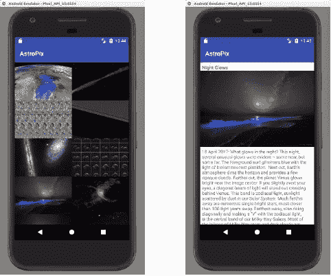
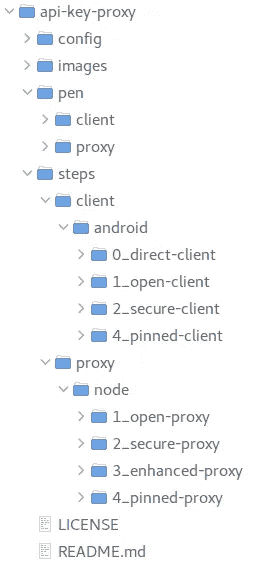
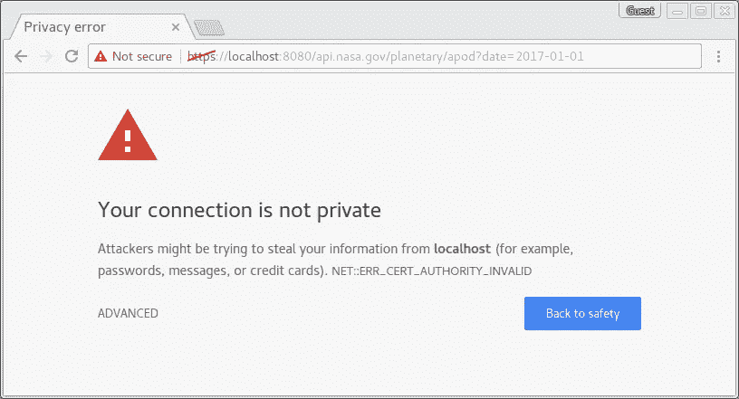
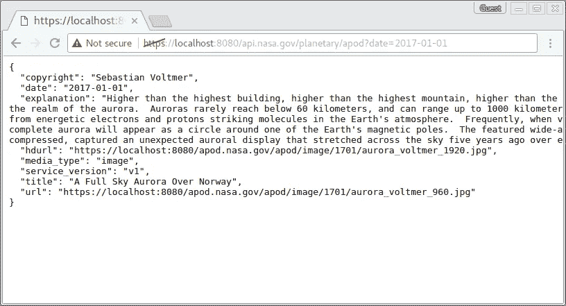

# 移动 API 安全性实践:固定客户端连接

> 原文：<https://medium.com/hackernoon/hands-on-mobile-api-security-pinning-client-connections-ebee4d82a911>

## 删除客户端机密时添加 TLS 和证书锁定


[手把手教移动 API 安全:清除客户端秘密](https://hackernoon.com/hands-on-mobile-api-security-get-rid-of-client-secrets-a79f111b6844)教程演示了如何通过[从移动应用中移除易受攻击的 API 秘密](https://hackernoon.com/we-reverse-engineered-16k-apps-heres-what-we-found-51bdf3b456bb)来提高移动应用的安全性。在本教程中，您将使用一个简单的照片客户端，它需要一个 API 键来访问 [NASA 的每日图片服务](https://apod.nasa.gov/)。在客户端和图片服务之间引入的 API 代理消除了在客户端本身存储和保护 API 密钥的需要。



因为我希望大多数人在模拟器中使用 Android 客户端运行本教程，在本地主机上使用代理服务器，所以我特意在客户端和代理之间运行普通的 HTTP 协议。虽然这简化了教程，但它不适合生产环境。为了增强安全性，您可能希望运行带有证书锁定的 [HTTPS 协议](https://www.owasp.org/index.php/Certificate_and_Public_Key_Pinning)来防范中间人(MitM)攻击。

因此，在这个续集中，您将在配置期间生成一个自签名证书，并将修改 Android 客户端，以便只接受来自持有证书私钥的服务器的连接请求。

# TLS 和固定

[传输层安全性(TLS)](https://en.wikipedia.org/wiki/Transport_Layer_Security) 在客户端和服务器之间建立安全连接，提供隐私和数据完整性。[公钥基础设施(PKI)](https://en.wikipedia.org/wiki/Public_key_infrastructure) 用于建立客户端和服务器之间的信任，建立安全通信。

但是，如果攻击者能够将自己插入到客户端和服务器之间，他就可以截获初始 TLS 握手，出示自己的有效 PKI 证书，并在中间截获点建立一个人，在那里他可以读取和更改客户端和服务器之间的通信。

证书锁定建立了客户端将接受的证书的白名单。即使 MitM 攻击可能提供合法证书，客户端也只会接受由已知证书签名的连接。

# 入门指南

首先，下载更新的动手 API 代理源代码*。*在终端或命令窗口中，切换到存储教程的目录，并克隆这个公共 git 存储库:

```
*tutorials$* **git clone** [**https://github.com/approov/hands-on-api-proxy.git**](https://github.com/approov/hands-on-api-proxy.git)
```



遵循[原始教程](https://hackernoon.com/hands-on-mobile-api-security-get-rid-of-client-secrets-a79f111b6844#c7b3)中的附加设置说明。

`steps`目录包含教程每一步的代理和服务器代码的工作版本，包括最终固定的客户机和代理项目的工作版本。

当您运行配置设置时，它将生成一个自签名的数字证书和相应的私钥，并将它们放在适当的固定客户端和代理项目位置。

或者，您可以使用现有的证书-私钥对，或者您可以使用 [OpenSSL](https://www.openssl.org/) 生成自己的自签名证书-私钥对:

```
*$* **openssl req -x509 -newkey rsa:4096 -keyout key.pem -out cert.pem
        -nodes -days 365**
```

如果您完成了前面的教程，您的`pen`目录应该包含工作客户端和代理项目。如果从一个新的存储库开始，应该从安全客户端和增强代理的工作副本开始。将安全客户端和增强代理步骤复制到相应的游戏围栏目录中，例如:

```
*api-proxy$* **rm -rf pen/client**
*api-proxy$* **cp -r steps/client/android/2_secure-client pen/client**
*api-proxy$* **rm -rf pen/proxy**
*api-proxy$* **cp -r steps/proxy/node/3_enhanced-proxy pen/proxy**
```

您可以构建当前的`pen`项目，并确认客户端和代理正在按预期工作。

# 将 HTTPS 添加到本地主机代理

首先，确保您的数字证书和私钥对位于代理的源目录中。如果您使用的是在配置过程中生成的证书，它们分别被命名为`cert.pem`和`key.pem`:

```
*api-proxy$* **cp steps/proxy/node/4_pinned-proxy/src/cert.pem
   pen/proxy/src/**
*api-proxy$* **cp steps/proxy/node/4_pinned-proxy/src/key.pem
   pen/proxy/src/**
```

在代理`pen`中，确保安装了所需的模块:

```
*api-proxy$* **cd pen/proxy**
*api-proxy/pen/proxy$* **npm install**
*api-proxy/pen/proxy$* **npm install https --save**
```

接下来，修改节点代理以运行 HTTPS。需要`https`包，并用一个调用替换默认 HTTP 服务器的`app.listen()`调用，以创建一个

使用密钥对的 HTTPS 服务器。修改如下所示:

启动代理服务器:

```
*api-proxy/pen/proxy$* **npm start**
```

使用浏览器调用代理来试用您的代理。假设您正在本地运行端口`8080`，用现在代理的调用`htttps://localhost:8080/api.nasa.gov/planetary/apod?date=2017–01–01`替换对 NASA 的直接调用。使用 chrome，我看到了这样的回应:



Chrome 不信任自签名证书，所以它警告我们，我们正试图使用不可信的证书运行 HTTPS，如果我们仍然使用`ADVANCED`继续，我们应该会通过 localhost API 代理看到来自 NASA 服务器的正确响应:



如果您仍然没有看到有效的 JSON 响应，请仔细检查您的代理 URL、网络连接和数字证书。三重检查代理 URL 是否指定了 HTTPS 协议。同样在`src/config.js`中，检查并强制`approov_enforcement`值为`false`。重新启动代理服务器，您将在代理日志中看到失败的证明，但服务不会被阻止。

如果您使用由公认的[认证机构(CA)](https://en.wikipedia.org/wiki/Certificate_authority) 签署的证书，浏览器将使用 CA 的公钥来验证签名。由于浏览器信任 CA，如果签名有效，那么浏览器将依次信任证书。

相比之下，自签名证书很容易生成且免费，但大多数浏览器或网络客户端堆栈不信任它们。对于自签名证书，我们必须以另一种方式建立信任，通常是通过验证我们收到了预期的数字证书，并且我们认识发送它的主机。

要在生产环境中固定连接，您可能会使用由可信 CA 签名的证书，这实际上是更容易实现的方法。使用自签名证书进行 pin 需要在客户端内部做更多的工作，这一点我们将在接下来讨论。

*作为参考，此阶段完成的 API 代理版本在* `*steps/proxy/android/4_pinned-proxy*` *中。*

# Android 客户端锁定

在 Android 客户端应用程序中，我们希望锁定 HTTPS 通道，以便只接受持有我们的数字证书的连接。

首先将`config.xml`中的`api_url`改为使用 HTTPS 而不是 HTTP:

对于联网，Android 客户端使用 [OKHttp 库](http://square.github.io/okhttp/)。如果我们的数字证书是由 Android 认可的 CA 签署的，那么可以使用默认的信任管理器来验证证书。要锁定连接，只需向客户端添加主机名和证书公钥的散列值`builder()`。请看[这个 OKHttp 配方](https://github.com/square/okhttp/blob/master/samples/guide/src/main/java/okhttp3/recipes/CertificatePinning.java)的例子。具有相同主机名和公钥的所有证书都将匹配散列，因此可以采用诸如证书轮换之类的技术，而无需更新客户端。多个主机名-公钥元组也可以添加到客户端`builder()`。

对于本教程，我们使用自签名证书，而不是 CA 签名证书。要使用自签名证书建立信任，您必须创建一个自定义的`TrustManager`，并提供一个方法来验证目标主机。OKHttp 提供了一个[自定义](https://github.com/square/okhttp/blob/master/samples/guide/src/main/java/okhttp3/recipes/CustomTrust.java) `[TrustManager](https://github.com/square/okhttp/blob/master/samples/guide/src/main/java/okhttp3/recipes/CustomTrust.java)` [菜谱](https://github.com/square/okhttp/blob/master/samples/guide/src/main/java/okhttp3/recipes/CustomTrust.java)。

在`pen`客户端项目中，首先将自签名证书`cert.pem`添加到应用程序的主`assets`目录中。`cert.pem`的副本可以在`steps/client/android/4_pinned-client/app/src/main/assets`中找到。

在`App.java`文件中，在`App`类中创建一个私有的`SSLContextPinner`类，它将你的数字证书读入到一个`KeyStore`中，这又会初始化一个新的`TrustManager`链。然后`TrustManager`链初始化 TLS `SSLContext`。添加返回`SSLContext`和初始`X509Trustmanagerfrom`链的方法:

接下来，您必须提供一个主机名验证器。通常，您可以将 DNS 名称与证书相关的主机名进行比较，但是对于绝对 IP 地址，这种[技术在浏览器和其他网络堆栈中会失效](https://developer.android.com/training/articles/security-ssl.html#CommonHostnameProbs)。因为我们在这个例子中是固定一个已知的证书，所以我们将盲目地接受主机名对于本教程是有效的。只要没有人窃取我们的证书的匹配私钥，这是可以接受的风险；但是，在生产中，您将使用更强的检查。现在，在`App`类中创建一个始终为真的主机名验证器:

使用这些类进行证书固定和主机名检查，为您的自签名证书构建固定客户端。修改`App`类的`onCreate()`方法:

完成这些更改后，您就可以测试客户机和服务器之间的固定连接了。确保代理服务器正在运行，像以前一样在 Android 模拟器或设备上构建并运行修改后的客户端应用程序。您应该在模拟器中看到当前 NASA 照片的图库，并在 API 代理控制台日志中看到照片请求。

如果您看不到照片，请仔细检查您的代理 URL、网络连接和数字证书。仔细检查代理 IP 地址(通常来自 Android 模拟器的`10.0.2.2`)和端口地址(通常设置为`8080`)。在`src/config.js`中，检查并强制`approov_enforcement`值为`false`。重新启动代理服务器和客户端应用程序。在代理上，您将看到失败的证明，但服务不会被阻止。

如果您想要执行客户端证明检查，您必须像在[原始教程](https://hackernoon.com/hands-on-mobile-api-security-get-rid-of-client-secrets-a79f111b6844#3333)中所做的那样，向 Approov 演示服务注册修改后的客户端应用。

*作为参考，此阶段完成的 API 代理版本在* `*steps/proxy/android/4_pinned-proxy*` *中。*

# 不会又是一个秘密吧？

祝贺您成功锁定自签名证书。在这一点上，你可能会问自己“如果教程的目的是从客户端应用程序中删除秘密，我们不是刚刚在应用程序中添加了一个新的秘密吗？”

嗯，我们确实在应用程序中添加了一个*常量*，如果使用自签名，它就是证书本身。但是，证书是公钥-私钥对的公开方。API 代理服务器将把这个证书发给任何试图建立安全连接的人。这不是秘密。私钥保存在服务器上，而不是客户端上，是真正的秘密信息。

关键是防止任何人用自己的证书添加或替换你的证书，并重新打包应用程序。任何使用修改后的应用程序的人都容易受到 MitM 攻击。这就是像[approv](https://approov.io)这样的客户证明的关键所在。任何篡改应用程序的尝试都将导致认证失败。

# 在野外

如果您还没有这样做，我建议您确保[approv 演示包](https://approov.io/demo-reg.html)是最新的，并按照[原始教程](https://hackernoon.com/hands-on-mobile-api-security-get-rid-of-client-secrets-a79f111b6844#3333)的最后步骤重新注册您的最终固定客户端-代理对。这大大加强了您的安全性。

将 HTTPS 与锁定结合使用可以提供隐私和数据完整性。牵制是防止中间人攻击的一项重要技术，但是如果客户端被篡改，它就很容易受到攻击。在这种情况下，这不是隐藏秘密的问题，而是确保公共证书不能在 app 中被修改。使用客户端证明服务可以有效地消除这种攻击媒介，恢复连接的私密性和完整性。

# 前进

感谢阅读！如果你推荐这个教程(点击❤按钮)让其他人也能找到它，我会非常感激。

要了解更多关于 API 安全和相关主题的信息，请访问[approv . io](https://www.approov.io/)或在 twitter 上关注@critblue。

[](http://bit.ly/HackernoonFB)[](https://goo.gl/k7XYbx)[](https://goo.gl/4ofytp)

> [黑客中午](http://bit.ly/Hackernoon)是黑客如何开始他们的下午。我们是 [@AMI](http://bit.ly/atAMIatAMI) 家庭的一员。我们现在[接受投稿](http://bit.ly/hackernoonsubmission)并乐意[讨论广告&赞助](mailto:partners@amipublications.com)机会。
> 
> 如果你喜欢这个故事，我们推荐你阅读我们的[最新科技故事](http://bit.ly/hackernoonlatestt)和[趋势科技故事](https://hackernoon.com/trending)。直到下一次，不要把世界的现实想当然！

