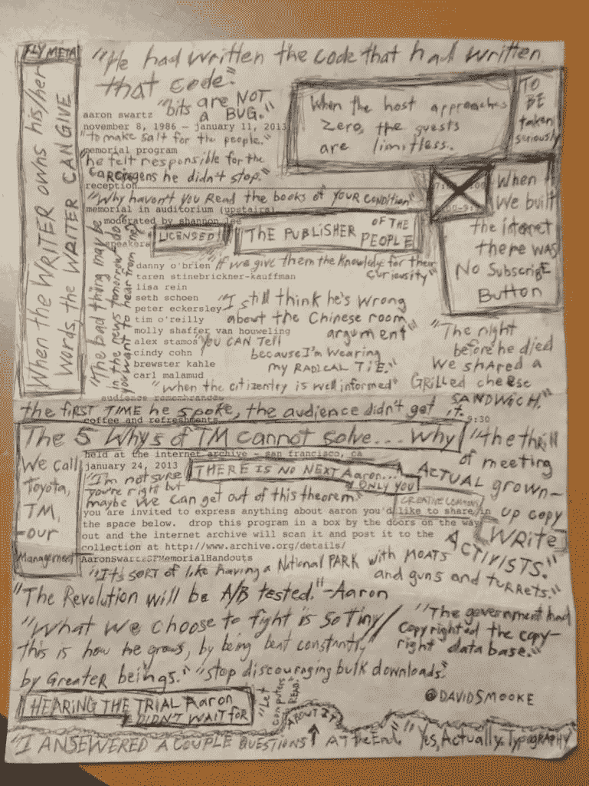

# 旧金山互联网档案馆艾伦·施瓦茨纪念仪式上的手写笔记

> 原文：<https://medium.com/hackernoon/handwritten-notes-from-aaron-schwartz-memorial-service-at-the-internet-archive-in-san-francisco-17b4e767f74b>

## "这场革命将经受考验。"—艾伦·施瓦茨

我从未见过艾伦·施瓦茨，但在 2013 年 1 月 24 日，我加入了数百人庆祝他的一生。下面是纪念节目。当这一切发生时，我记下了我听到的一些片段，以及他一生的工作让我想到的一些想法。你可以[在这里](https://l.facebook.com/l.php?u=http%3A%2F%2Fwww.youtube.com%2Fwatch%3Fv%3Dx3Fz1V3LZtw&h=ATOgasAh7Cm_TjzQIdw0loausP_W965n2FAnveKn8m-WXca1KRdNVvbD1hMz13xGCiza3bpY-kN2kv015b-QkJsXc7Ug_GDZjoSBk3M1tvovr-va1x6WkIRDKFkE8OW4NHVX7L60qgUKQ8Y)观看纪念视频。

