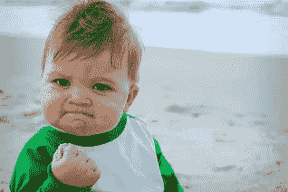

# 方便的 R Markdown 电子邮件黑客

> 原文：<https://medium.com/hackernoon/handy-r-markdown-hacks-e53b2bec956e>


**R markdown is awesome, but hacks are needed**

我喜欢 R 和 R 降价。但是当我使用 Rmd 生成 HTML 电子邮件报告时，使用了如下简单的东西:

```
rmd="my_report"Rscript --vanilla -e "require(knitr); rmarkdown::render('$rmd.Rmd',params=list() )"cat $rmd.html | mail -a "From: [fromemail@servername.com](mailto:fromemail@server.com)" -a "MIME-Version: 1.0" -a "Content-Type: text/html" -s "$subject" $recip
```

…我遇到了一些障碍。

以下是问题和解决方案或解决它们的方法。希望他们帮到你！

# 通过电子邮件发送地块

我希望我的 Rmd HTML 报告的收件人可以在他们的电子邮件客户端查看它们。但是电子邮件客户端通常不喜欢嵌入 base64 字符串的图像。另一个选择是将图像保存在服务器上。但是怎么做呢？

**解决方案:**将图片移动到一个公共的 web 文件夹中，并用 bash 和 trusty coreutils 重写图片链接。由于此报告可能有多个版本，请使用按确切报告时间命名的文件夹:

```
#folder named by timestamp
dt=`date +"%Y-%m-%d--%H-%M-%S-%N"`# move external files
mkdir /var/www/report_cache/$dt
cp -r ${rmd}_files /var/www/report_cache_folder/$dt# rewrite image links
cat $rmd.html | sed "s/img src=\"/img src=\"https:\/\/servername.com\/report_cache_folder\/$dt\//g" > rw_$rmd.html
```

现在，所有的图片都由公共的[网络服务器](https://hackernoon.com/tagged/webserver)提供，因此电子邮件客户端可以访问。

# 纲领性标题

我想要数据驱动的标题和图表，但事先不知道会有多少。我发现 pandoc.header 限制太多，因为你必须在 chunk 选项中预先声明 results='asis ',这完全限制了你在 R 块中可以做的事情。

现在，如果您在没有 results='asis '的情况下调用 pandoc.header("My pandoc header "，2)，您会在输出中得到如下内容:

```
## ## My pandoc header
```

…如果你在 HTML 中查找，它被

```
和标签包围着。其未处理的 [markdown](https://hackernoon.com/tagged/markdown) 头，前缀为“##”。
```

**解决方案:**使用 htmltools 从 R 块中动态生成头(不需要结果=‘asis’):

```
library(htmltools)```{r echo=FALSE}h1("main heading")
h2("smaller heading")```
```

**注意事项:**新标题是缩进的，不像那些通过 markdown 直接生成的标题，它们不会出现在目录中。我只是确保有“常规的”高级标题，这样看起来就不会奇怪。

# 电子邮件的内嵌样式

我对 R markdown 提供的默认样式不太满意，尤其是表格。

现在我提到，对于电子邮件客户端，我们不希望图像数据直接内嵌。但是相比之下，为了让电子邮件客户端呈现样式，我们需要内嵌 CSS。

**解决方案:**使用 python [premailer](https://pypi.python.org/pypi/premailer) 内联样式。然后 unicode 出现了一个问题，用 PYTHONIOENCODING 纠正了这个问题，如下所示:

```
cat rw2_$rmd.html  |  PYTHONIOENCODING=UTF-8  python -m premailer | mail -a "From: [fromemail@server.com](mailto:fromemail@server.com)" -a "MIME-Version: 1.0" -a "Content-Type: text/html" -s "$subject" $recip
```

# 可重复使用的样式

我有多个报告，我想使用相同的风格。所以我在每个 Rmd 文件的顶部都有这样的内容:

```
<STYLE TYPE="text/css">
  td{
    font-size: 8pt;
  }
  th {
    font-size: 8pt;
  }
</STYLE>
```

现在我们怎么把它弄干？

**解决方案:**把上面的 CSS 放到样式里就可以了。Rmd，然后包括每个报告中文件，如下所示:

```
```{r child = 'styles.Rmd'}
```
```

(好吧，这个问题不算是黑客，但我发现这个问题很难用书籍或谷歌来解决，而且它在许多其他情况下也很有用。)



**After putting all these hacks together, I finally had lovely Rmd email reports**

[](http://bit.ly/HackernoonFB)[](https://goo.gl/k7XYbx)[](https://goo.gl/4ofytp)

> [黑客中午](http://bit.ly/Hackernoon)是黑客如何开始他们的下午。我们是 [@AMI](http://bit.ly/atAMIatAMI) 家庭的一员。我们现在[接受投稿](http://bit.ly/hackernoonsubmission)，并乐意[讨论广告&赞助](mailto:partners@amipublications.com)机会。
> 
> 如果你喜欢这个故事，我们推荐你阅读我们的[最新科技故事](http://bit.ly/hackernoonlatestt)和[趋势科技故事](https://hackernoon.com/trending)。直到下一次，不要把世界的现实想当然！

[](https://goo.gl/Ahtev1)