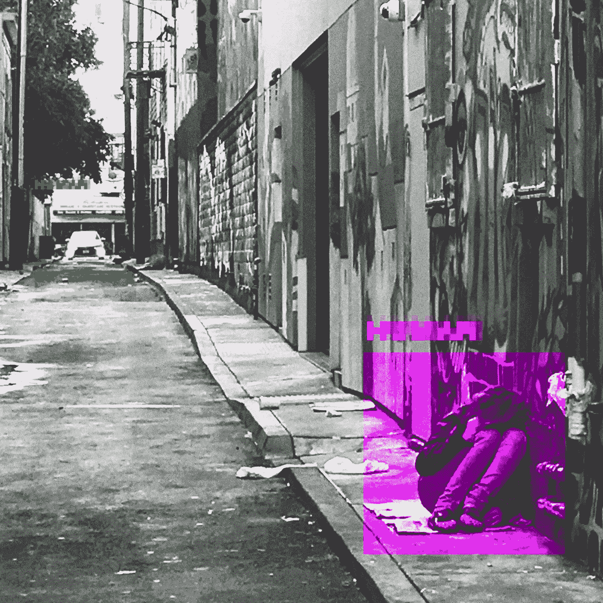
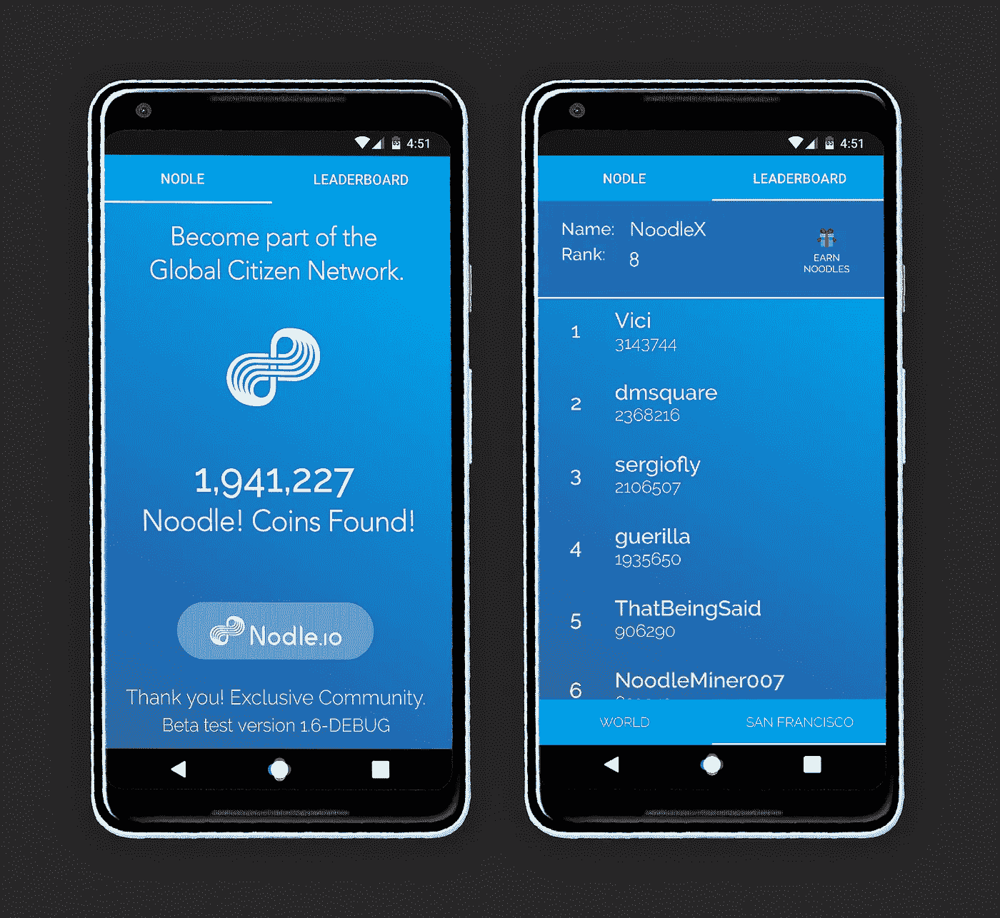
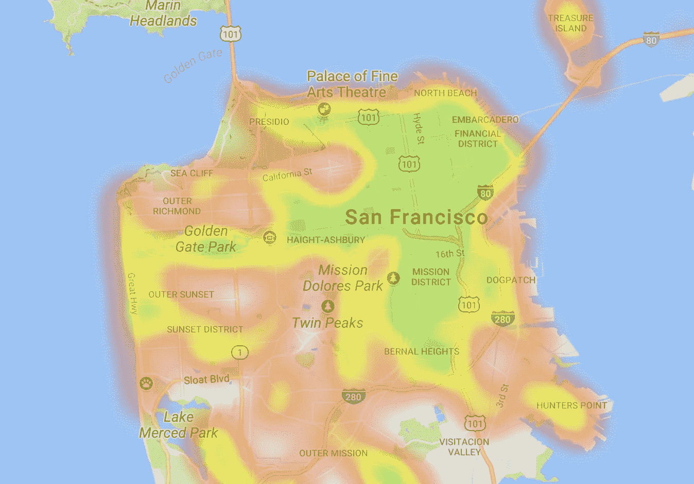

# 现在发生—一种不同的 ICO(第一个初始社区产品)

> 原文：<https://medium.com/hackernoon/happening-now-a-different-kind-of-ico-the-first-initial-community-offering-1751bd1212bf>

Mission District, San Francisco — November 20th, 2016 — Micha Benoliel

# 帮助我们建立第一个公民网络，为饥饿者提供食物。我们为每根面条捐赠 1 美元给旧金山马林食品银行！12 月硬币应用下载。

这个假期，Nodle 团队正在旧金山使用 Android 手机上的蓝牙连接建立一个点对点网络。为了让它工作，我们需要人们下载面条！硬币应用程序形成了第一个公民网络——一个民有、民治、民享的网络。

正如你们许多人所知，发布一个应用程序是很难的。我们怎么能做面条呢！硬币应用程序推出不同？

> 帮助创建第一个公民网络，Nodle 将为每一个新注册用户向旧金山马林食物银行捐赠 1 美元，以此回馈社区。

我们考虑了在我们新的移动应用程序上发起竞赛的所有[传统](https://hackernoon.com/tagged/traditional)途径来播种网络。我们考虑过为脸书的广告付费，购买游击式营销活动，用印有三藩市标志的海报淹没三藩市，甚至向获胜者赠送[比特币](https://hackernoon.com/tagged/bitcoin)。

相反，我们决定播种我们网络的最好方式是**为每一个** [**面条的新用户捐赠 1 美元！Android 上的硬币应用程序**](https://hackernoon.com/r/?url=https%3A%2F%2Fplay.google.com%2Fstore%2Fapps%2Fdetails%3Fid%3Dio.nodle.noodle%26hl%3Den) 将整个 12 月份的硬币存入 SF-Marin 食物银行。捐赠的每一美元都为这个广受好评的食物银行每年服务的 225，000 名当地居民之一提供了两顿丰盛的饭菜。我们希望您能让我们为这项有意义的事业捐赠数万美元。

## 如何打面条！

面条！硬币是虚拟货币和口袋妖怪的结合。通过在旧金山市内走动，玩家收集“面条”。

这是怎样的面条！硬币应用程序工作原理:

*   安装[面条！硬币应用](https://play.google.com/store/apps/details?id=io.nodle.noodle&hl=en)(仅限安卓)
*   点击“赚面”邀请好友

每当旧金山市有人注册，我们就会捐 1 美元。如果你通过发送链接邀请你的朋友，而他们注册了 Noodle！(并加入比赛)你赚 5 万*面条！硬币*我们会再捐 1 美元。

**市民网络**将帮助您的社区寻找丢失的物品，定位最近的自行车租赁点，或者从当地的空气污染传感器收集数据。公民们一起工作将降低连接成本，并为 T2 的制造商 T3 提供一种新的方式让他们的设备上线。

除了捐赠给旧金山马林食物银行，谁收集的*面条最多！硬币*将可以用这些硬币兑换一部 iPhone X。比赛将于 2017 年 12 月 31 日结束。

在您的帮助下，我们希望让旧金山市成千上万的人过上更美好的假期，并播种有史以来第一个公民网络，以证明人民的力量可以推动物联网的重要网络。请加入我们。