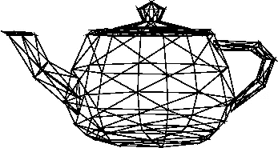
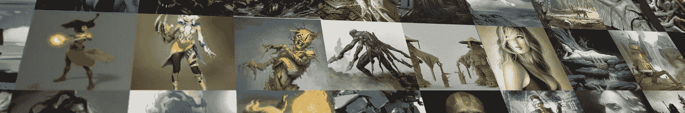

# 12 月 3 日快乐！

> 原文：<https://medium.com/hackernoon/happy-3december-44350de5b7ad>

今天，12 月 3 日，是我们庆祝 3D 计算机图形和所有创造数字艺术的人的日子。如果你对视觉效果、动画、游戏设计或任何与使用计算机图形作为媒介相关的东西感兴趣，那么恭喜你，祝你节日快乐！=)

如果你不是 3D 艺术家，这是一个试验这种东西的好时机。多年来，我一直是这个领域的超级粉丝，尽管我热爱编程，但 3D 仍然是我做过的最有趣的事情，我最喜欢的爱好，我向所有人强烈推荐它！

去下载[玛雅](http://www.autodesk.com/products/maya/free-trial)、 [ZBrush](https://pixologic.com/zbrush/trial/) 、[搅拌机](https://www.blender.org/download/)，或者，我个人最喜欢的 [SideFX Houdini](https://www.sidefx.com/download/) ，试着用它造点东西！我保证，会很棒的。

要发现一些杰出的数字艺术家并获得灵感，请访问 [ArtStation](https://www.artstation.com/artwork?sorting=popular2016) ，查看他们创作的令人惊叹的艺术作品。

## 3 十二月挑战

如果你准备好迎接挑战，选择一个主题，用这个主题创建一个 3D 模型或动画。在 [/r/3December](https://www.reddit.com/r/3December) 上分享你的项目(和正在进行的工作)，在 twitter 上用 [#3December](https://twitter.com/hashtag/3december) 标签分享，或者回复这篇文章！

(我在我的 [ArtStation 个人资料](https://www.artstation.com/artist/rayalez)上分享我的个人艺术作品，在我的博客上分享我的教程、装备和我在学习 CG 方面的进展)。

> 黑客中午是黑客如何开始他们的下午。我们是这个家庭的一员。我们现在[接受投稿](http://bit.ly/hackernoonsubmission)并乐意[讨论广告&赞助](mailto:partners@amipublications.com)机会。
> 
> 如果你喜欢这个故事，我们推荐你阅读我们的[最新科技故事](http://bit.ly/hackernoonlatestt)和[趋势科技故事](https://hackernoon.com/trending)。直到下一次，不要把世界的现实想当然！

