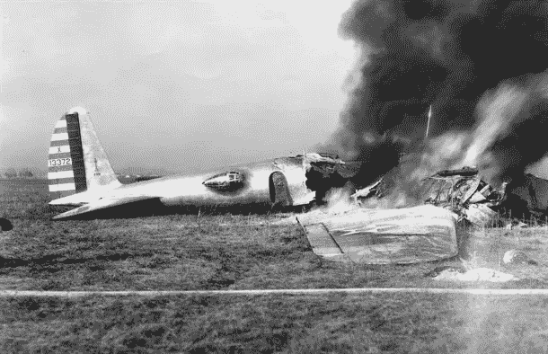
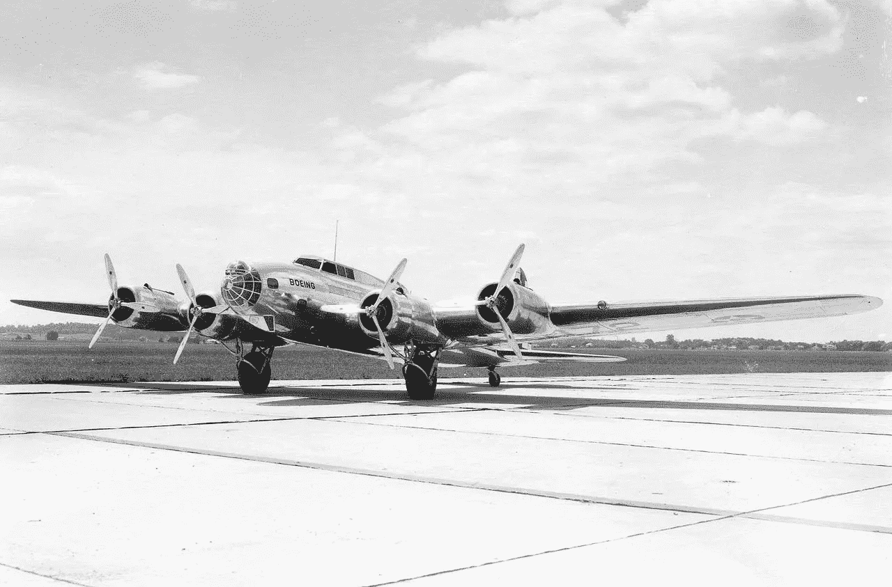
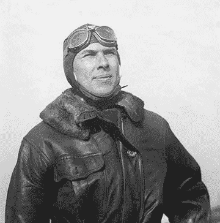
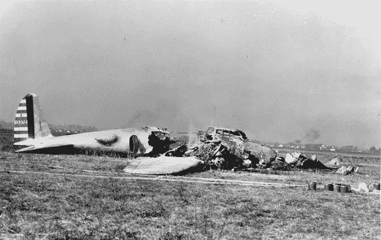
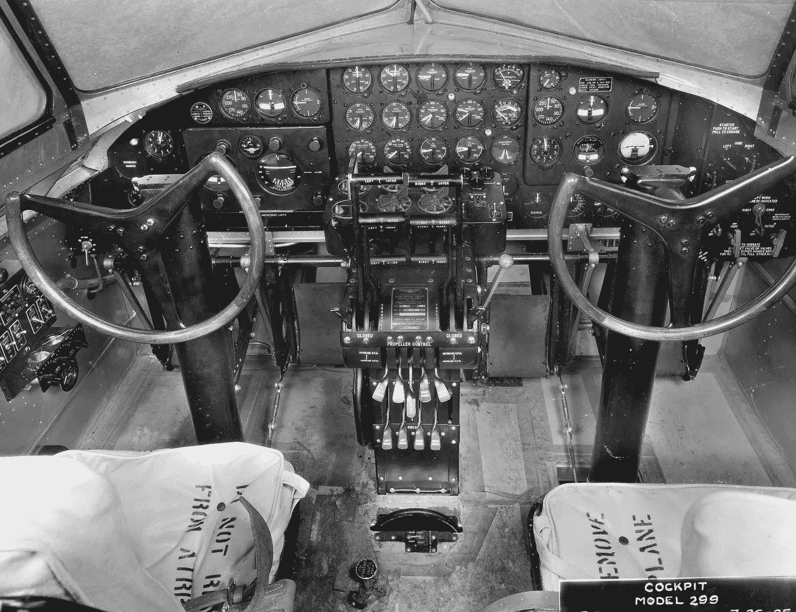

# 快乐的国家清单日——了解 1935 年 10 月 30 日的历史和重要性

> 原文：<https://medium.com/hackernoon/happy-national-checklist-day-learn-the-history-and-importance-of-october-30-1935-17d556650b89>

Being Model 299 Crashes on Takeoff on October 30, 1935

1935 年 10 月 30 日，一场致命的飞机失事永远改变了航空业的未来。波音公司准备通过引入全新的 299 型号，也就是众所周知的波音 B-17 飞行堡垒，来彻底改变美国军方和整个航空业。这个飞行技术奇迹已经开发了 5 年。它有 4 个引擎，一个中央炸弹舱，以及遍布机身的炮手站。

这是航空史上最复杂的飞机。

Model 299, also known as the Boeing B-17 Flying Fortress

波音公司不惜重金为美国陆军航空兵精心展示了这一产品。毕竟，他们在竞争一个数百万美元的投标，这将有助于他们进入数十亿美元的航空集团波音公司今天。

Major Ployer P. Hill, U.S. Army Air Corps,

波音公司和美国陆军航空队在俄亥俄州代顿东北的莱特机场相遇。

这架 299 型飞机由美国陆军航空兵少校普利耶·p·希尔驾驶，上尉·唐纳德·利安德·普特担任副驾驶。

为了不冒险，Beoing 的首席试飞员 Leslie R. Tower 和 Beoing 的机械师 C.W. Benton 也在这架注定要坠毁的飞机上。

起飞后，美国陆军航空兵和波音公司的成员兴奋而自豪地看着美国航空的未来。

飞机在跑道上加速，实现了完美的升力，开始爬升，几秒钟后，在旁观者惊恐的注视下，飞机失速、倾斜并坠入机场。

机上两人丧生，包括飞行员，少校普利埃·p·希尔。副驾驶和机上的另外两个人被从燃烧的残骸中拉了出来，从而救了他们的命。

## 发生了什么事？

调查发现这架飞机状况良好。没有发现会导致致命事故的机械故障。经过更深入的调查和目击者报告，包括幸存的副驾驶，确定**机组人员只是忘记释放飞行控制阵风锁**。从而导致飞机在起飞后立即俯冲入地面。

Crash of Model 299 on October 30, 1935

## 如此微不足道的事情怎么会被遗忘呢？

进一步确定的是**这架飞机对人类来说“太复杂”而不能飞行**。技术和现代飞机安全起飞所需的大量任务已经超越了人类记忆的极限。

Cockpit of the Model 299

简单来说，有太多的事情需要记住，即使是世界上最好的飞行员。

## 解决方案

在 1935 年 10 月 30 日 299 型飞机坠毁后，**波音公司推出了这份清单，作为一种永久性的强制性工具**，供波音机队的所有飞行员使用。

在[清单](https://hackernoon.com/tagged/checklist)推出后，波音最终能够将 299 型出售给美国陆军航空兵，在那里飞行了数年，没有发生任何事故。

今天，如果没有飞行员使用的强制性清单，你就不能在商业飞机上起飞或降落。它不止于此；从每架飞机的制造，到维护检查，再到帮助你进行在职飞行的空乘人员，清单在整个航空业都是强制性的。

大脑最重要的插件清单拯救了无数的生命。

这份清单已经超出了航空领域，现在已经成为外科医生、护士、建筑师、教育工作者、软件、营销、心理学以及你能想到的所有其他行业的必备工具。

## 结论

这个故事和许多其他类似故事的力量，是 checkli.com背后的灵感，我的创业公司帮助任何人**发现和使用世界上最好的清单。**

清单给我和许多其他人提供了一种替代药物如利他林和 Adderall 的解决方案。当我们被无尽的干扰、想法和技术淹没时，它们帮助我们保持专注。

无论你是用笔和纸，还是你最喜欢的应用程序，清单都是大脑的终极插件。

利用这个免费工具。

国家清单日快乐。