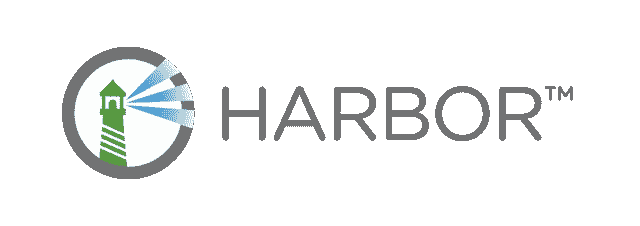
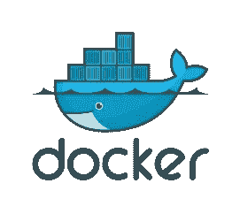
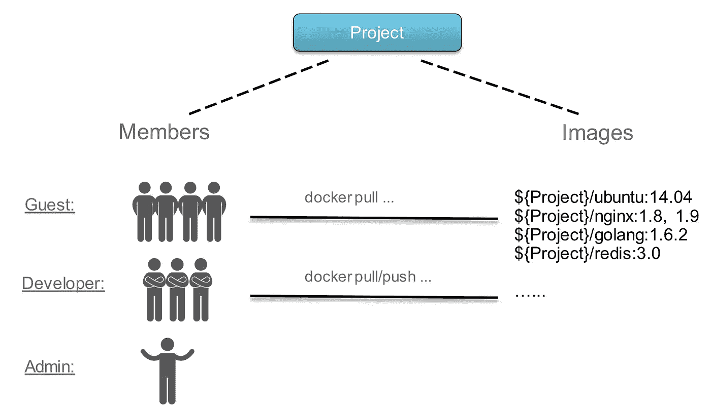
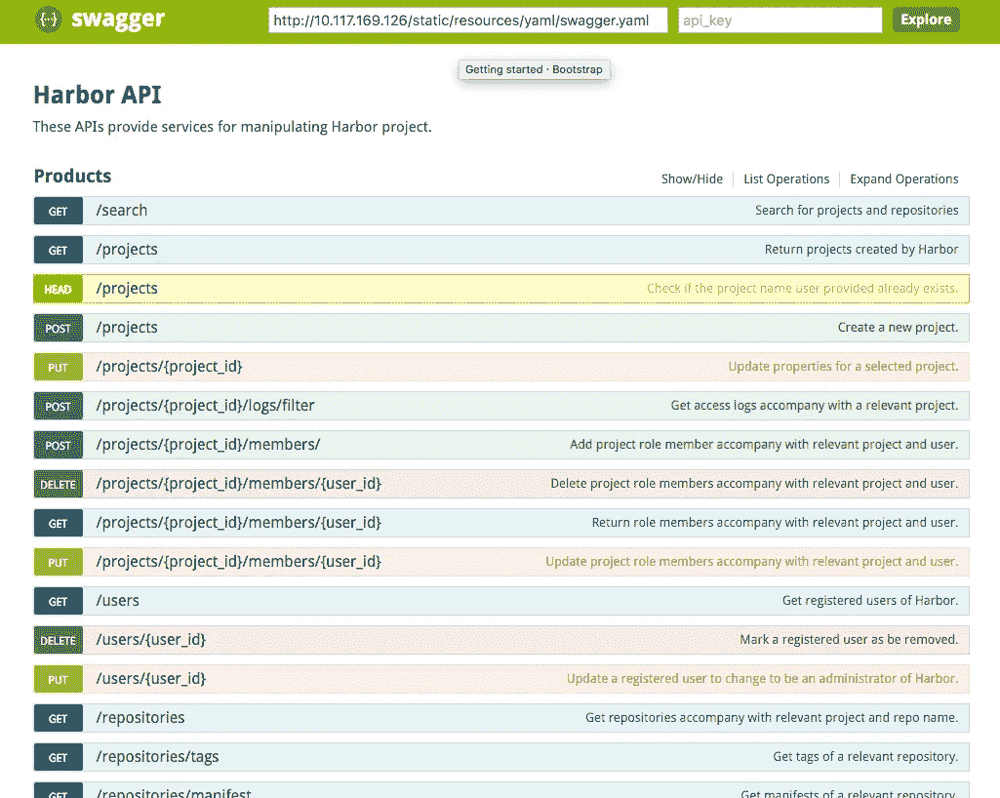

# harbor—VMWare 为您的码头工人提供安全的避难所

> 原文：<https://medium.com/hackernoon/harbor-secure-shelter-for-your-dockers-4c87e83341c9>

[http://vmware.github.io/harbor/](http://vmware.github.io/harbor/)

自从我第一次了解 Docker 和 Docker 注册表已经有一段时间了。我必须说——就产品的功能、速度和质量而言，Docker 团队做得非常好。社区还创建和扩展了 Docker 平台，提供了各种各样的解决方案。

从一开始，Docker 就引入了 Docker hub——图像的公共注册表。它对平台的采用和扩展帮助很大。虽然 DockerHub 让你可以访问所有官方图片和社区贡献，但你总是有必要存储越来越多的自己的图片。

当然你可以使用 [DockerHub](https://hub.docker.com) ，但是你只能有一个私人回购，否则你需要付费。也有一些第三方解决方案，如[纸盒](https://bintray.com)、[扭锁](https://www.twistlock.com)等。如果您只需要保存您的私人图像，并且您没有大量的存储库(可能有 100 个以上的存储库)，这些解决方案会很好地工作。

但是，当您不仅需要管理您的图像，还需要管理您的客户时，这可能会变得过于昂贵。

# Docker 注册表

现在登场的是— [Docker 安全注册表](https://docs.docker.com/registry/deploying/)。 [Docker Registry](https://github.com/docker/distribution) —出色的解决方案，支持各种存储后端(文件系统、AWS、Azure、Swift、Google Cloud)、授权(LDAP、令牌、基本)等等。

一旦我们开始在我当前的项目中采用 Docker——我们部署了简单的 Docker registry，并且非常满意。

当时我们的注册表并不安全(我们在一些内部主机上运行它:5000，显然我们使用了自签名证书)，我们需要配置我们所有的 Docker 主机来信任这个不安全的注册表(Docker 团队非常重视安全性)。我们不时需要清理硬盘，因为 Docker 注册表没有例行清理过时的图像。

大约一年前，我们开始公开展示我们的图像，只对我们的一些客户开放，这种设置运行良好。我们为几个用户设置了基本认证，每个人都很高兴。

最近，我们在产品中添加了一些功能，允许客户将图像上传到我们的注册表。起初它工作得很好，因为每个人都使用不同的名称，没有命名冲突(因为我们为客户构建存储库的名称)。

两三个月前，我们开始寻找带有认证服务器的 Docker 注册解决方案。这样的没有那么多。我们选择的 VMWare 产品名为 Harbor。

# 海港

[Harbor](https://vmware.github.io/harbor/) —是 Docker Registry 的开源令牌认证服务。它允许你创建/邀请用户，或者用户可以自己注册。港口实施[令牌认证规范](https://github.com/docker/distribution/blob/8be8b60ce505af40e31cb842b56de67a40910251/docs/spec/auth/token.md)。

至于权限和 ACL，有三种抽象。项目、成员和图像。每个项目都有成员(管理员、开发人员或来宾)。来宾只能拉取、开发人员-拉取/推送和管理员管理权限、添加新用户等。

# 部署

看起来该项目正在积极开发和高需求。约 2000 颗星，约 450 个开放问题，但仍处于良好状态。您可以通过两种不同的方式进行部署:脱机模式和联机模式。你可以下载 tar 包，拷贝到你的 linux 机器上，运行安装脚本就可以了。你有自己的 Docker 注册表。但是不安全。为了确保安全，您需要在负载平衡器或代理服务器上终止 ssl。或者，如果您还没有为您的域生成证书，您可以使用 Let's Encrypt 来生成证书。

此外，如果您使用 Kubernetes 港有单独的部署程序。这真的很好——因为在生产中，我们使用 Kubernetes 来部署我们的容器。

# REST API

我们一直在寻找的特性之一是 REST API。我们需要以编程方式管理项目和用户，从我们的应用程序设置权限。这对我们来说至关重要。Harbor 在 Swagger 中很好地记录了 API 这是另一个优点。

# 配置

当您使用部署脚本时，Harbor 会部署它自己的注册表实例。你可以配置它与 AWS，Azure，谷歌云等一起使用。或者 Docker 注册表可用的任何其他[配置选项](https://github.com/docker/distribution/blob/8be8b60ce505af40e31cb842b56de67a40910251/docs/configuration.md)。但这并不意味着你不能已经安装了注册表，并将其配置为用作 Harbor UI 的注册表后端。

# 结束了

如果您正在为您的公司或您自己的项目寻找 Docker 注册表，Harbor 绝对值得一查。它有所有必要的功能，简单的安装脚本，所有组件捆绑在一起。5 分钟就可以安装，开始玩了。

> [黑客中午](http://bit.ly/Hackernoon)是黑客如何开始他们的下午。我们是 [@AMI](http://bit.ly/atAMIatAMI) 家庭的一员。我们现在[接受投稿](http://bit.ly/hackernoonsubmission)，并乐意[讨论广告&赞助](mailto:partners@amipublications.com)机会。
> 
> 如果你喜欢这个故事，我们推荐你阅读我们的[最新科技故事](http://bit.ly/hackernoonlatestt)和[趋势科技故事](https://hackernoon.com/trending)。直到下一次，不要把世界的现实想当然！

