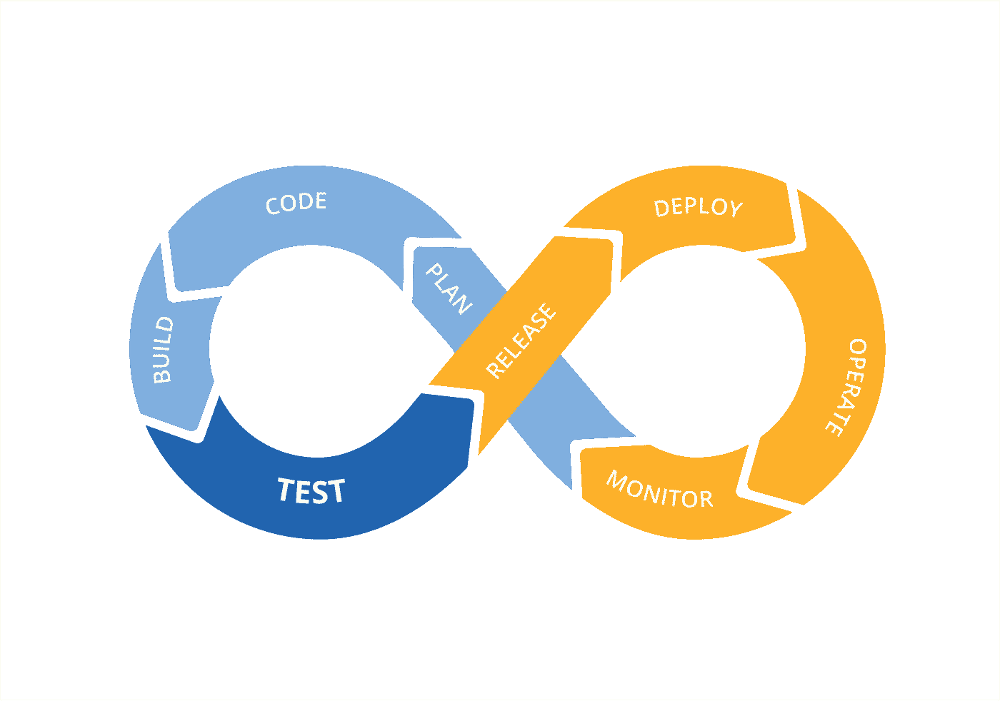
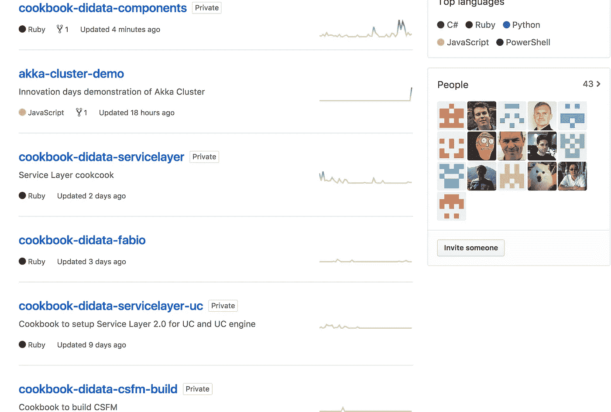
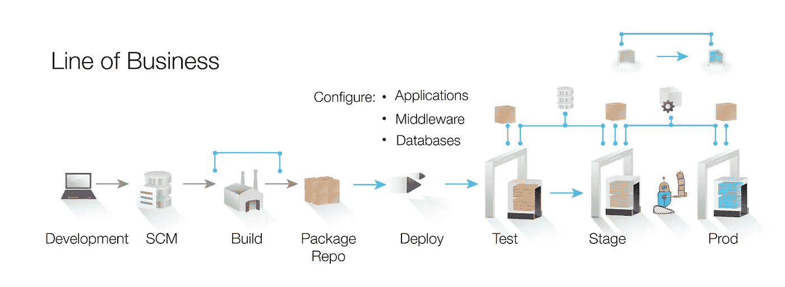
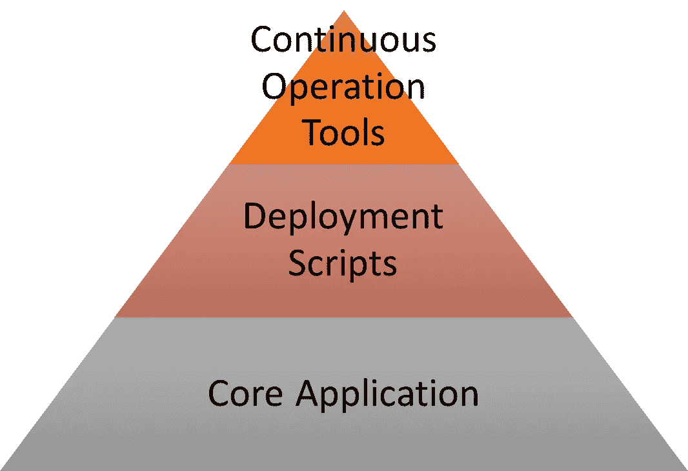

# DevOps 是否改变了测试人员的角色？

> 原文：<https://medium.com/hackernoon/has-devops-changed-the-role-of-a-tester-b140dddc7824>

DevOps 应该是过时的维基页面的*形式的**流程**的替代品，是团队中知道如何正确配置服务器的一个人，或者是你为了修复数据库问题而经常求助的自动化人员。*

一切都是代码。基础设施即代码、网络即代码和数据库即代码升级。

但是在这个一切都是代码的世界里，测试它是谁的责任呢？测试人员的角色还必须局限于核心应用程序吗？谁测试所有其他“应用程序”,为什么人们不认为它们是任务关键型的？

# 我测试的是哪个代码？

也许在 DevOps 世界中，你可以使用工具、应用和框架来构建你的完美部署和自动化管道。到目前为止，关于“TestOps”或“DevQAOps”的文章将测试人员引向这些工具，以便运行他们的集成测试，并以与团队相同的速度迭代。远不止这些，我认为 DevOps 已经改变了正在构建的应用程序的数量、复杂性和类型，测试团队因坚持相同的流程和工具而错失了机会。

DevOps 还意味着那些专注于操作的人现在必须理解使用 DSL 和脚本的软件。以 Chef 为例，我与一个使用 Chef 对定制应用程序和操作系统环境进行配置管理的团队密切合作。他们开发基于 C#的微服务，然而在这个 GitHub 组织中，第二大语言是 **Ruby** 。

为什么？因为一旦你偏离了 Chef、Puppet、SaltStack 或 Ansible 的界限，你就在扩展他们的产品，使之与你的产品兼容，这意味着用 Python 或 Ruby 编码。在许多团队中，这些库完全未经测试就投入生产是很常见的。

# 逐步地

让我们看看这个典型的 DevOps 管道(由 IBM 开发)。因此，在这种情况下，有 3 个环境。

但是如果我们的环境是软件定义的；使用可重复且经过测试的 DevOps 工具构建，为什么要有单独的暂存环境？

当云服务器可以在几秒钟内部署完毕时，除了生产环境，为什么还要有长期运行的环境呢？当然，您会希望每个环境都是干净的，这样您就知道您正在测试的场景和配置。CI/CD 使这成为可能，但是仅仅到“构建”或“测试”环境，当它被移交给测试团队时，他们可能以完全不同的步调工作。

我在 DevOps 场景中见过的最危险的事情之一是开发人员运行诊断程序，并在没有记录的情况下进行特定于环境的更改。因此，下一次部署软件包时，该配置可能会保留下来，例如防火墙配置。那应该在主厨食谱或可行的剧本里，而不应该是 ***“哎呀，我忘了做那个了”。***

为什么？因为拥有一个成熟的测试团队或能力意味着每次都要自信地进行部署。他们没有参与。

# “代码”的其他位

团队构建了各种各样的包、脚本、工具和库，但不在典型测试团队的范围内。

## 开发和源代码控制

*   合并前提交挂钩
*   构建脚本
*   打包脚本

**部署**

*   CI/CD 脚本
*   厨师、Ansible 等的扩展模块。

**监控**

*   响应监控脚本
*   警报集成

对于一个复杂的应用程序来说，这些不仅仅是到处可见的 5 行 Perl 脚本，它们可能是巨大的、单一的、写得很差的并且**完全没有经过测试的**工具**。**

如果我们把那些代码库放入一个金字塔中，并且说它们超出了测试专业人员的范围，我会让读者质疑测试团队的目的是什么？

为了*验证*交付的应用程序功能符合规范？在预算和范围内验证质量？

# 在这种新的应用中，测试人员可以做些什么呢？

下面是测试人员在成熟的 DevOps 环境中可以做的一些事情。

*   了解自动化流程，挑战其可重复性和变更频率，以实现更稳定的部署
*   为 DevOps 工程师提供培训，SRE 的测试理论，如何和为什么测试以及测试的重要性
*   将测试环境视为**不可变的**并绑定到构建
*   测试环境部署、打包和应用程序生命周期的其他组件
*   讨论部署工具的代码质量和迭代，不仅仅是核心应用程序