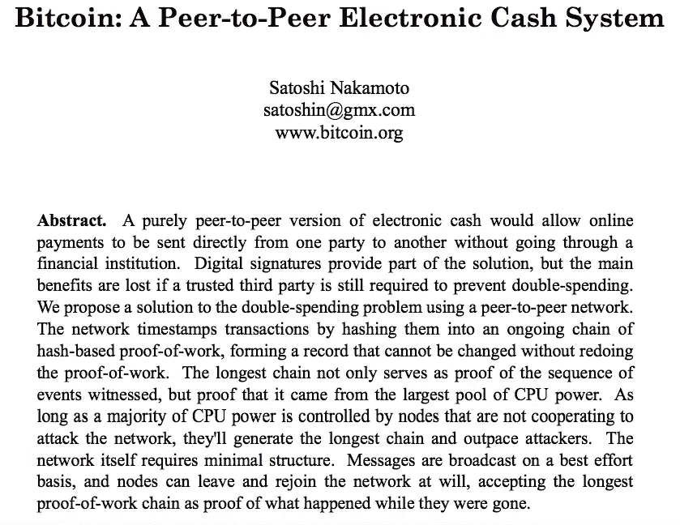
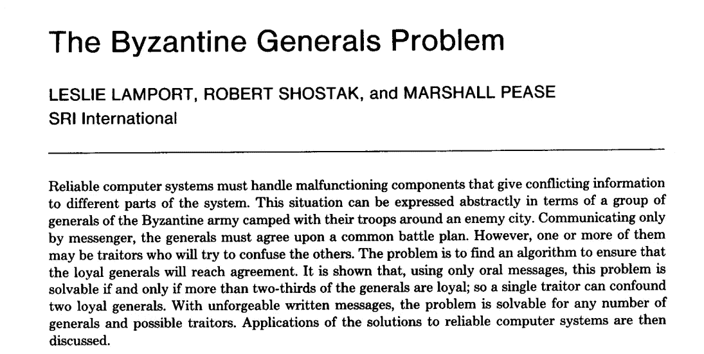

# 哈苏布对密码宇宙的思考

> 原文：<https://medium.com/hackernoon/haseebs-thoughts-on-crypto-universe-8341c6c7ba7f>

## 论对立思维、区块链共识和分权的优缺点(是的，缺点)

**谢谢你，Haseeb，感谢你今天抽出时间。我想问你几个关于你过去的问题，然后挖掘几个更深层次的区块链话题，向你请教。你能不能先告诉我们你的背景，以及最终是什么让你来到区块链的？**

**哈苏布:**是的，绝对是。所以我的背景有点乱。在过去的生活中，我是一名职业扑克玩家。我这样做了大约五年，相当成功。

 [## 关于

### 简而言之:我第一次接触扑克是在 16 岁的时候。我从 50 美元开始，不到一年，就变成了 10 万美元…

haseebq.com](https://haseebq.com/about/) 

我 21 岁时退出扑克，回到学校。从那里，我蜿蜒进入了技术世界，在那里我参加了一个编码训练营。然后我成为了应用学院的产品总监。之后，我在 Airbnb 找到了一份软件工程师的工作，处理支付欺诈问题。那是我真正开始认真看待比特币的时候。

我想，我第一次听说比特币是在 2014 年——相对于一些已经在这个领域呆了一段时间的人来说，这是相对较晚的。我出于好奇对它不屑一顾，了解了默克尔树和区块链以及它们是如何运作的。但我并没有真正领会“大意”。

我在处理支付欺诈后“明白了”,对敌对的环境和网络想了很多——部分是因为在 Airbnb 工作，但也是因为我过去是一名扑克玩家。crypto 背后的许多想法真的开始引起我的共鸣，对我来说很有意义。

所以，当我不久前离开 Airbnb 时，我意识到[区块链](https://hackernoon.com/tagged/blockchain)可能是目前[技术](https://hackernoon.com/tagged/technology)中最有趣的事情，作为一名技术专家，我想投身其中。

所以，在过去的九个月里，我一直在深入区块链，阅读和获取我能找到的任何东西，建造并融入这个生态系统。从八月份开始，我就在[Earn.com](http://www.earn.com)，一家由[Mastering Bitcoin, Chapter 7](https://medium.com/u/f5a2e83d6d8f#merkle_trees)

那是区块链。这不是什么突破性的革命性想法。区块链已经存在一段时间了。20 世纪 80 年代，有人首次提出了区块链的概念。人们经常用“区块链”这个词来象征比特币背后的创新。比特币背后真正伟大的想法不是区块链。比特币背后的伟大理念是工作证明和中本聪共识。

## 工作证明

工作证明(“PoW”)的基本思想是，您构建一个区块链，其中，您不仅仅需要前一个块的加密哈希，而是需要前一个块的加密哈希足够难以计算。

使其难以计算的方法是生成一个随机数(nonce ),并尝试不同的数字，直到获得足够小的块哈希(有足够多的前导零)。这表明你已经花费了大量的计算工作来挖掘这个区块，或者解决这个难题。

从表面上看，这有什么关系并不明显。工作证明带给你的是**对等系统中一些非常有趣的安全属性**。

> **来自 V 的旁注:**点对点系统不是普通的“客户端-服务器”计算机模型，在这种模型中，一台计算机充当客户端(你的 PC /笔记本电脑)，并依靠服务器(或服务器群，如 Google Drive 或 Amazon Web Services)获得计算能力和内存。在对等系统中，每台计算机(或**节点**)都扮演着客户端和服务器的角色，为“无领导”网络做出贡献。如果你曾经通过 Napster / BitTorrent 下载过音乐，你就会明白这是如何工作的。对等系统已经在计算中开辟了可能性，但传统上并不是最安全的。有了权力，这种情况开始改变。

那么你得到的安全属性是什么呢？要回答这个问题，这里有一个快速的思维实验: ***如果没有工作证明，区块链会是什么样子？***

假设任何人都可以在任何时候向区块链添加区块。会发生什么？

答案是网络会不断发散。没有人能够在任何事情上达成一致。这将是非常容易的，在 300 个街区内，有人从区块链开始广播 500 个街区，并完全抹去原来的 300 个街区的历史。如果我们想要确定这个区块结构是稳定的，并且我们要在历史上达成一致，那就真的是不可取的。

工作证明 1) **减慢系统速度**以便我们能够以不太可能逆转的方式就网络状态达成一致，2) **使用计算能力**来保护网络。

如果有人没有足够的计算能力，他们就无法重写历史，也无法在网络中产生长期的分叉(重写历史的一个分支)。因此，PoW 为任何对等和分散的系统创造了理想的特性。

## 事实证明，钱是一个很好的选择。

[Bitcoin White Paper](https://bitcoin.org/bitcoin.pdf) Abstract

这就是比特币最终的作用:它充当了货币的 ***区块链。***

从那以后，人们就如何利用区块链提出了许多其他想法。Nakamoto consensus/Proof-of-Work consensus 的一些相同的想法以分散的方式建立密码安全系统，该系统仍然可以-相当快速和可靠地-就网络状态达成一致。

以太坊就是一个很好的例子。以太坊不是在造货币，而是在造电脑。以太坊是一台巨大的计算机，世界上的每个人都可以运行它，他们可以用这台计算机的本地货币以太(ETH)来支付，以便让计算机运行程序。

 [## 以太坊项目

### 以太坊是一个运行智能合约的分散平台:应用程序完全按照编程运行，没有任何…

www.ethereum.org](https://www.ethereum.org/) 

这是一个伟大的想法。有很多创造性的东西都是建立在这个想法上的，人们也想出了很多其他的应用程序来使用区块链。

所以，这又不是真正的区块链。区块链不是一个好主意。大的想法是所有的共识，在街区周围。[公钥加密](https://blog.vrypan.net/2013/08/28/public-key-cryptography-for-non-geeks/)、区块链、[点对点八卦协议](https://managementfromscratch.wordpress.com/2016/04/01/introduction-to-gossip/#examples)和工作证明/ Nakamoto 共识的组合。人们在上面建造有趣的东西，但那就是区块链。

**牛逼。我很高兴能链接到许多这些原语，并允许人们挖掘你的定义。我没有听说过没有工作证明的区块链的思想实验。如果你只是把一个区块链放在那里，你没有通过计算来验证区块链，会发生什么——会发生什么？那很有帮助。**

我认为这可以很好地转入另一个话题。我们在这里谈了很多关于工作证明和中本聪共识的内容。在这次对话之前，我们已经谈到了其他共识机制——一些传统的共识机制，前比特币时代，以及一些人们正在思考并试图理解的较新的共识机制。你介意更深入地研究一下中本聪共识，然后是一些先前的共识机制，以及它们现在都在哪里吗？

是啊，当然。因此，工作证明最令人满意的特性就是拜占庭容错。首先，我们应该定义什么是容错，然后区分容错和拜占庭容错。

容错是分布式系统中的一个术语，基本上意味着您的系统可以容忍一定数量的故障。嗯，**什么是断层**？

> **V 的旁注:**容错是计算机系统的一种品质，在这种品质下，尽管在硬件、软件或其他输入中存在错误，系统仍能继续运行，而不会对最终用户造成故障。该故障可能需要系统优雅地重新定向资源，以完成其任务。

举个例子，谷歌运营着几个数据中心。他们托管你所有的数据，搜索索引，所有其他的东西。他们运行许多硬件，有时这些硬件会出故障。它会倒下死去。谷歌知道会发生这种情况。这在数据中心每天都在发生。据统计，每天都会有几台计算机发生故障。因此，谷歌想要的是他们分布式系统中的任何一个节点(或计算机)都瘫痪——让**出现故障** — 而不会给你带来任何麻烦。所以这个过程终止了，但是系统保持运行，你作为用户没有注意到。

这就是容错。这些算法已经被研究了很长时间。它们现在已经被很好的理解了。您可以做很多事情来实现容错，这是一个理想的属性。在这一点上，容错是相对便宜的。

还有另一种更强的容错形式，称为**拜占庭容错**。

[The Byzantine General’s Problem (1992)](https://www.microsoft.com/en-us/research/wp-content/uploads/2016/12/The-Byzantine-Generals-Problem.pdf)

容错就是你的服务器离线，系统不死机。拜占庭式的宽容是指服务器不会死亡，而是做一些完全随机的事情。完全任意(甚至恶意)。所以通常情况下，你可能会担心一个硬盘快没电了...如果它要死了，它只会做正常的硬盘驱动器的事情，然后死去。那是正常的错误。但是如果硬盘运行正常，然后在死亡前开始谎报内容呢？它说我身上没有更多的文件了，我的硬盘空间已满，我已经复制了我的信息——但实际上并没有。简直就是撒谎，然后下线。

特别是如果系统开始恶意撒谎，这是在对等系统中最重要的考虑，当你有很多个体对等体有动机撒谎时。 ***你的系统怎么能容忍骗子？*** 你是如何容忍坏演员的？以及体制内可以容忍什么门槛的不良演员？这是衡量你有多拜占庭式容错能力的标准。

因此，有很多关于所谓的拜占庭容错(“BFT”)算法的文献，尽管有一些拜占庭错误，但这些算法可以达成共识。这些经典的 BFT 算法出现在 80 年代。传统上，BFT 算法通常可以容忍高达 33%的网络是拜占庭式的。那就不错了*对吧？你所有节点的三分之一只是公然恶意地对你撒谎，你可以容忍。那挺好的！然而，这些算法的一个缺点是它们非常慢。所以这在一个严肃的点对点网络中显然是不可行的。*

*有一些算法对于拜占庭容错来说更快。然而，问题是你必须预先知道网络中的所有节点。所以你需要事先说:这 1000 人在我们的点对点系统里。如果他们中的三分之一在任何给定的时间离线…那么，这已经是你 33%的潜在拜占庭错误。“离线”和拜占庭基本上是同等对待的。*

*此外，在对等协议中，事情通常变化很快。节点一直离线，很难知道谁是成员。到处都是。这些 PBFT 算法在点对点的环境中并不太管用。Nakomoto consensus/proof of work 的主要创新之一是它 ***不需要你知道谁是网络*** 的一部分。*

***不需要事先注册所有人。**比特币让我们可以说:出示这个工作证明就行了。谁做的和谁在线并不重要。工作证明算法是自我调整的，因此它会根据有多少节点在线而变得更容易/更难。这种自动调整难度+能力的方式使得它成为一个点对点的系统，任何人都可以在任何时候加入。*

*也就是说，还有其他方法。PoW 的一个缺点是速度。我们讨论了为什么这种缓慢是可取的，因为它允许我们更好地协调—但是，它也限制了我们的吞吐量。所以区块链，即使是最快，最高水平的区块链仍然相当慢。*

*以太坊每秒只能处理大约 7-10 笔交易，相对于 VISA 每秒处理数千到 10，000 笔交易来说，这是一个非常微不足道的吞吐量。因此，区块链现在无法使用电源真正支持有意义的吞吐量。*

*所以，有些区块链使用其他形式的共识。例如，如果你看看 [Ripple](https://ripple.com/build/xrp-ledger-consensus-process/#consensus) 、 [Stellar](https://www.stellar.org/blog/stellar-consensus-protocol-proof-code/) 、EOS、Steemit 或 Bitshares……它们都使用某种形式的领导人选举，如“委托”证明利益一致。*

## ***委托股权证明***

*授权利害关系证明背后的想法是有一个更小的人才库——本质上是民选官员——他们是民主选举出来的。如果这些当选官员达成共识，就可以开采一个区块。现在，你实际上只有一百个“选出的”节点，你可以使用一些老式的 BFT 算法。信息不会变慢，因为你不需要等待电力通过。对于一个相对较小的网络来说，这些网络要快得多，而且您可以获得比 PoW 高得多的吞吐量和规模。*

*因此，如果您 ***放弃一些集中化*** ，您可以获得更多的吞吐量。但是，对于授权的利害关系证明算法来说，存在这种风险。批评之一是，早期加入网络的人往往拥有最多的股份，他们最终也拥有最多的权力——他们最终成为验证者(即“当选官员”)和矿工。这意味着创始人和密友是共识协议的重要组成部分，这比完全证明工作要分散得多。*

## ***股权证明***

*这就是我们谈到的利害关系证明(“PoS”)。PoS 是目前正在探索的较新的共识机制之一。*

*首先，让我们谈谈支撑比特币网络的总哈希能力。比特币的节点产生的能量总和相当于整个摩洛哥的能量。*

* [## 比特币挖矿耗电量超过 20+个欧洲国家

### 随着比特币继续向主流采用迈进，它飙升的价格并不是唯一的…

thenextweb.com](https://thenextweb.com/hardfork/2017/11/23/bitcoin-mining-electricity-africa/) 

那是相当多的电。运行比特币极其昂贵。人们一直在问的一个问题是: ***我们如何才能减少运行对等网络的浪费/环境足迹？*** 其中一个想法就是股权证明。

因此，正如我们所讨论的，比特币本质上是由计算能力保护的(计算能力消耗了所有的电力)。如果没有比特币网络的其他部分那样强大的计算能力，你就无法对比特币发起攻击。

> 计算能力的成本是多少？钱。

好吧，如果没有钱的代理——因为购买计算能力最终是一个代理——如果你直接用钱投票呢？

现在，为了发展攻击比特币的力量，你需要带外资金。你必须在现实世界中购买一些电脑和电力/计算能力。如果相反，你把钱投在乐队的股份上呢？区块链协议内的。毕竟我们在协议里有钱。

我们可以用这笔钱来设计一个投票系统，决定下一步开采哪个区块。这使我们能够采用一些传统 BFT 算法的最佳思想，同时也将所有东西都移入协议中，而不是依赖额外的计算工作。

**我很高兴你澄清了机制之间的区别，以及为什么考虑 PoW 的替代品对环境很重要。**

**我们还感兴趣的是，转向股权证明实际上让我们更接近传统的 BFT 机制。除了证据证明更节能之外，它还能被认为比 Nakamoto consensus 更强大吗？**

很有争议。PoW 的优势在于，通过使用一些更老的 BFT 算法，你可以获得更高的吞吐量。我们之前讨论过:有限数量的节点验证事务的速度比 PoW 快得多。这是其中一个关键因素。

也就是说，不利的一面是你得到了更多的集权。PoW 的另一个好处——有些被低估了——很容易理解。它有一些纯粹的东西，吸引了很多人，让他们信任比特币。你可以向青少年解释比特币的工作原理，只要你解释其组成部分，他们就会明白。

由股权证明担保的货币更难理解。**为什么是这个钱？这有什么价值？**出于某种原因，某种关于燃烧能量并将其转化为金钱的东西...人们会说好吧，明白了。有了 PoS，感觉就是黑盒魔术。

PoS 还有其他问题——这是最大化主义者或对共识的替代形式持怀疑态度的人不喜欢的。

股权证明的一个问题是富人越来越富。这当然是真的，因为你持有的股份越多，你就越能在 PoS 系统中“下注”,你就能从验证中赚更多的钱。这让人们感到恐慌——钱正流向那些已经很有钱的人。

现实中，这种情况也发生在比特币上。拥有百万美元钻机的矿工得到了所有新铸造的比特币。但是，故事依然存在。

比特币挖矿是分散的，任何人都可以做，只要打开你的电脑，你就可以做到。在这一点上是完全错误的。因为 ASIC 比 CPU/GPU 的效率要高得多。

然而，叙述做了很多工作。钱不仅仅是系统的技术属性。这也是关于我们都在玩的这个游戏和这些共同点。所有这些关于彼此的信念是赚钱的很大一部分。

对于很多人来说，PoS 是一个棘手的问题。这是一个真正的弱点。但它确实有很多好的特性，比如更节能、吞吐量高。

> 以太坊基金会(Ethereum Foundation)最近加大了解释股权证明的力度，或许是为了帮助缓解 Haseeb 恰当地提到的一些担忧，即为了让人们接受股权证明是一种保护其货币的共识机制，它必须易于理解。

 [## 以太坊卡斯帕 101

### TL；卡斯帕博士将在以太坊实现利益证明。我们首先回顾一下为什么股权证明很重要，以及…

medium.com](/@jonchoi/ethereum-casper-101-7a851a4f1eb0) 

**好极了。感谢您让我们达成共识。这是所有可用方法的重要历史背景。我们将从这里转到一些更哲学的问题上。**

**区块链有一种说法可以很好地概括为“分散一切”。我们之前谈过，你分享了一个有趣的观点，关于分权的优点以及分权系统的问题。**

这股去中心化的浪潮是万物的未来吗？什么情况下集权更好？

是啊，这是个好问题。从我们讨论的问题中，您应该对使用区块链的挑战有所了解。

> 总之，分散系统 a)速度更慢，b)更复杂，因此更容易受到攻击。

如果你的系统需要很高的吞吐量，那就太不幸了。今天，区块链不会为你带来好的结果。另一个缺点是区块链很复杂，很难建造。如果您想构建大多数应用程序，那么控制基础设施比试图让应用程序在区块链上工作要容易得多。

许多 ICO 说“我们将在未来几年内建立 A、B、C 和 D”。用传统技术(服务器、MySQL 数据库、一个不错的前端)构建这些业务中的大多数都是微不足道的。很容易把这些东西集中起来。分散化引入了大量的技术开销和复杂性来使这些应用程序工作。这些是一些最明显的缺点。

***现在区块链什么时候有用？当你有一个有许多参与者的系统，而这些参与者不信任一个集中的团体时，这是很有用的。***

没有值得信任的中央政党的情况并不多见。

许多人指着一个市场，比如优步，声称将会有一个分散的优步。区块链的优步会好得多，因为没人需要相信优步。这种想法的一个问题是，人们实际上并不讨厌优步。

人们可能不喜欢优步的企业做法，但他们会选择 Lyft。然而，问题不是我不相信 Lyft /优步会偷我的钱，或者让我和糟糕的司机配对。人们很大程度上关心的是: ***是不是又好又快？它能带我去我想去的地方吗？没有人不使用优步，因为他们担心优步是中央集权的。***

人们通常认为‘去中心化’减少了寻租( ***注自 V:*** *)就像优步每次乘车收取 20%的费用*)。没办法拿到房租，太好了！在现实中，有很多事情是中央集权更有效的。争议解决、客户支持、规模经济——所有这些事情都因中央集权而变得更加容易。好的商业策略——不需要与成千上万的人协调就能快速做出决策——在集中化的情况下要容易得多。集中化有很多好处。

## 哪里分权更好

很少有人会说，“我真的很想用这个，但是它是集中式的。”因为是集中的，所以不行。对我来说，很明显，钱实际上是其中之一。

很多人，尤其是像赛佛朋克这样的人，正是不喜欢由政府控制的中央集权货币的人。

 [## 比特币和密码朋克的崛起——coin desk

### 从比特币到区块链，再到分布式账本，加密货币领域正在快速发展，到了可以…

www.coindesk.com](https://www.coindesk.com/the-rise-of-the-cypherpunks/) 

在他们看来，我们需要找到某种方法来摆脱腐败政府、政客和国家的控制，他们都有自己的利益。

我可以理解为什么钱正是那种需要分散的东西。

另一个很好的例子是 Mastadon，一种去中心化的 Twitter。

乳齿象不使用区块链，但乳齿象是一个在 Twitter 上受到审查的人，或者有反对 Twitter 政策的利益/社区的人可以使用乳齿象的地方。这是一个相当大的用例。有很多社区不能真正通过 Twitter 来管理自己。

从进化的角度来看，如果权力下放有这么多好处，那将是令人惊讶的，但还没有人做到这一点。分权的局限并不是我们没有区块链。有许多方法可以在没有区块链的情况下分散项目。但是人们不这样做。 ***有何不可？***

要么 **a)** 反对权力下放是一种耻辱，人们不理性地决定**不**权力下放，要么 **b)** 集权有很多好处。通过集中化可能会有更好的决策、管理和执行。

我猜想，当许多这些集中式应用程序的分散版本开始试图获得用户，并实际上试图获得市场份额(不仅仅是出售令牌)时，他们会发现分散化是很难的。他们会意识到一只手和一条腿被绑在背后。这将是对这些 ICO 的一个粗暴的觉醒，他们将意识到在区块链上这样做是一个价值减法，而不是一个价值加法。

这大概就是我在分权问题上的观点。有很多不同的问题你可以不同意，但总的来说，有相对较少的应用程序受到这个问题的困扰: ***我们不信任任何人，*** 我们希望完全消除寻租，我们需要一个完全密码安全的点对点系统，没有领导者。

**是的，令人着迷。我认为这是一个重要的话题。这是对现实的检验。有一个考虑到积极和消极两方面的观点是很好的。**

**这回避的问题是:你仍然对正在发生的事情充满激情。是什么让你对区块链感到兴奋——尽管有许多挑战——继续推动你在这个领域发展？**

是啊。我认为，如果你不愿意正视不好的想法，并称之为不好的想法，你就没有足够深入地思考太空中正在发生的事情。

区块链是技术中最前沿、最不确定的空间之一。对于机器学习，或人工智能，或虚拟现实，有一个相当好理解的路径。对于区块链，没有人有任何想法。你可以做出很多不同的猜测。

我相当有信心去中心化的 Airbnb，优步，无论什么都不会成为现实。但是会有很多东西被区块链大规模破坏。

**金钱至上。说“好吧，钱……现在怎么办?”很容易。但是钱是巨大的。**

就市场规模和价值而言，这是你可能想象到的最大的事情。认为我们过去 10 万年的赚钱方式就是我们将继续这样做的方式是天真的。

钱是纸，我们互相传递，最终我们把纸拿到银行。制造所有纸张的人决定何时制造更多的纸张。我们将永远这样做的想法是荒谬的。这很天真，因为我们生活方式的其他一切都随着技术发生了巨大的变化。认为金钱不会受此影响的想法——我们建立的第一个系统是最好的系统——是愚蠢的。

所以我不知道区块链会不会赢——我当然不认为比特币会取代货币——但这是已经存在了很长时间的系统的第一次重组。

几乎所有建立在金钱之上的金融科技(如 Paypal 和 Stripe)看起来都很酷，很前卫，但仍然是纸上谈兵。它仍然在底层使用一张纸。关于比特币和加密货币的整个想法是: ***如果我们重新开始呢？*** 如果你只是有技术，你是怎么做到的？

比特币是我们解决这个问题的第一个办法。第一个解决方案是:如何完全数字化地取代货币？比特币解决了这个问题。我认为技术专家对这一巨大的创新给予的信任太少了，即使没有其他事情发生。这是人类历史上的一个分水岭时刻，如果我们对货币和货币的思考方式在比特币出现后发生改变的话。

**太棒了。人们不禁要问，“区块链能扰乱的 25 种不同事物是什么？”**

当一个简单的答案出现在金钱面前时，很难记住仅仅说金钱会扰乱成千上万的事情，你真的不需要走得太远。你可以在那里潜水。我很高兴你提醒了我们这个观点。

绝对的。也就是说，数字货币带来的令人兴奋的事情是，我们在货币的基础上建立了所有这些可以重新想象的抽象概念。合同、握手协议、银行——所有这些我们用来裁决纸币问题的昂贵的东西。

如果合同本身与你的钱相互作用，你可以做很多事情。现在，没有。你不会把美元钉在你的合同上，对吧？如果你能做到这一点，生活会简单得多。事实证明，有了智能合约，这是可能的。

当你的钱在协议层面上与你的软件/业务流程交互时，你可以做很多令人惊奇的事情。谁知道它会变成什么样子…我认为这还为时过早。以太坊是两年前刚刚发明的。我们不知道。我们现在正一步一步来。当谈到区块链时，我们仍然对自己的成熟垂涎三尺。我们现在正处于非常早期的创新阶段。我们在尝试不同的东西，看看什么有效。

这让我很兴奋。我认为你必须直言不讳地说，现在有很多坏主意，但创新的潜力是巨大的。在我们最终发现之前，还会有更多的愚蠢:这里是智能合约的真正杀手级应用。这是过程的一部分。

我也很兴奋。一两年后，我们可以就智能合约和创新进行另一次对话，看看进展如何。

最后一个问题:你已经在太空呆了九个月了。你有很强的软件开发经验，并且之前在 Airbnb 这个伟大的公司工作过。过渡进行得如何？你会向两个不同的人推荐什么:a)没有软件工程经验的人，希望进入区块链；b)已经是软件工程师的人，希望开始工作。

是啊，好问题。假设你想进入加密领域。首先，你要知道比特币是什么。比特币是加密货币的鼻祖。为了真正了解太空中发生的事情，你需要了解比特币。幸运的是，这是最容易理解的，所以这是一个很好的方法来浸泡你的脚趾。

 [## 区块链宇宙的兔子洞

### 注意:虽然列出了一个 3 分钟的阅读，这篇文章只是带你进入兔子洞。

medium.com](/kryptosstudio/a-rabbit-hole-into-blockchain-universe-e01d055e01e7) 

从那里，有一个非常棒的阅读清单，由 Scanate 命名为[道德清单](https://github.com/Scanate/EthList)。有很多关于比特币、区块链的读物，然后过渡到以太坊的阅读清单。它以开发人员为中心，但也有面向非开发人员的非技术内容。

几周前我在 YouTube 上做了一个演讲，主要讲述了如何从零开始建立一个区块链，如何从零开始建立一个加密货币。这相当简单。即使您不是开发人员，也可以从这个讲座中获得很多价值。

> (【Vivek 的评论:这个演讲太棒了，而且被低估了。如果你没有时间一次看完，那就值得分块看几周。

一般来说，要想真正进入加密货币，有两个途径。你可以从 a)交易员或 b)建筑商的心态出发。

中间真的没有空间。如果你把密码想象成市场，你想从市场中赚钱——你寻找的信息与你是技术专家时完全不同。在这两种情况下，空间中的聚会，你想要阅读的博客是非常不同和独立的。

所以我认为，对于任何想进入加密货币的人来说，决定你想成为过道两边的哪一边。如果想赚钱，大概就是交易。如果你想把自己放在长远的位置上，或者在区块链发展你的事业，你可能想站在另一边。这通常是我画出系统的方式。

对我来说，我花了大约 2-3 个月的时间学习和研究。Arvind Narayanan 博士在普林斯顿大学开设了一门关于加密货币的课程。这是 Coursera 的课程，所有的视频都在 YouTube 上。

已经写了几本好书:一本也是纳拉亚南博士([比特币&加密货币技术](https://d28rh4a8wq0iu5.cloudfront.net/bitcointech/readings/princeton_bitcoin_book.pdf?a=1))写的，另一本是安德烈亚斯·安东诺普洛斯([掌握比特币](http://chimera.labs.oreilly.com/books/1234000001802/))。他还将推出《掌握以太坊》,这本书应该也很不错(目前仍在出版前)。

有很多很好的影响者名单。大多数区块链人生活在推特上。鉴于这是一个“分散”的事情，没有一个城市可以垄断它。与许多其他技术不同，大多数人认为硅谷是一个几乎所有活动都在发生的地方，但对区块链来说，情况并非如此。

旧金山湾区社区很大，但肯定远远不是区块链的大部分。鉴于它非常国际化，全世界的人都在谈论区块链。因此，如果你想参与对话，在 Twitter 上找到有影响力的人，关注你看到的每一个人，很快你就会有一个准备好的 Twitter 源。

**这些都是好东西。有什么最后的想法要分享吗？**

我写了几篇关于区块链的博客。下一篇文章是关于我认为区块链的杀手级应用。希望那会很有趣。我会继续写，所以如果你想在 [Twitter](https://twitter.com/hosseeb) 、 [Medium](/@hosseeb) 或[我的网站](http://haseebq.com)上看到更多，请关注我。

 [## 我们已经知道区块链的杀手级应用

### 就在不久前，硅谷还对加密货币嗤之以鼻。遍布山景城的咖啡店和…

hackernoon.com](https://hackernoon.com/we-already-know-blockchains-killer-apps-f2d443eba35) 

**太棒了，这太棒了。再次感谢您的宝贵时间！**

当然伙计。我很乐意。

*再次感谢*[*Haseeb*](https://medium.com/u/8bc4e5f8b505?source=post_page-----8341c6c7ba7f--------------------------------)*抽出时间和我们一起在氪星回顾区块链。如果你对未来的话题有任何问题或建议，请在下面的评论中留下或在 Twitter 上找到我！**