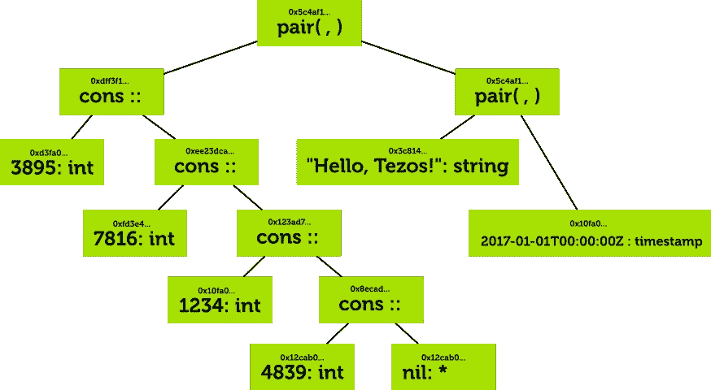
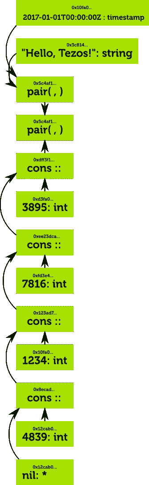
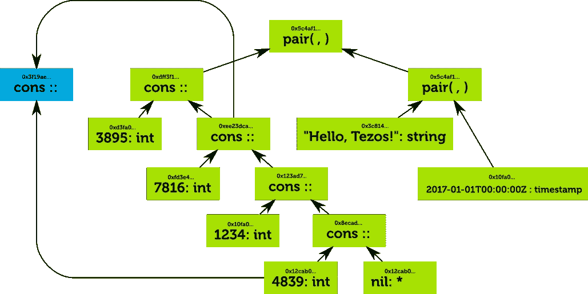
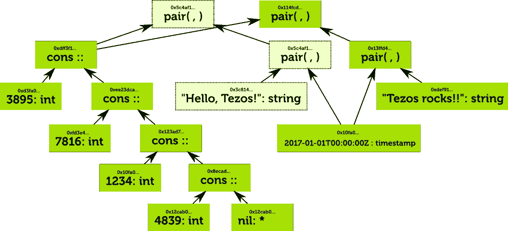

# Tezos 中的哈希考虑

> 原文：<https://medium.com/hackernoon/hash-consing-in-tezos-e4a59eeea5cd>

我已经多次谈到散列考虑作为一种为 Tezos 区块链有效存储合同数据的方式。下面是为什么它有用，它是如何工作的，以及它的局限性是什么。

# 为什么它有用

Tezos 中的哈希考虑让智能合约无缝共享数据，没有重复。如果两个智能合约存储同一个表，则它们只被存储一次。如果它们存储的数据略有不同，重叠部分也只存储一次。每当两个数据相同时就会发生这种情况，即使是偶然的。

这有几个好处:

*   许多契约很可能实现子令牌，很像以太坊中著名的“ERC20”契约。这种契约通常在公钥和金额之间维护一个大的映射。复制这个映射对于创建其他令牌是有用的，这些令牌以相同的分配开始，然后分开。例如，EggCoin 的发行者可以轻松地将一个鸡蛋分配给 ChickenCoin 的每个持有者，而无需复制任何数据。
*   智能合约代码也是共享的。许多契约中使用的函数只存储一次。没有必要调用“库”契约，因为区块链上的任何一段代码都是隐式的库！
*   契约开发人员不必担心序列化已复制的大型结构或将大型结构传递给其他智能契约的成本。没有昂贵的数据拷贝。

# 它是如何工作的

## 创建复杂值

迈克尔逊值是类型化的，迈克尔逊类型是由一些原子类型构建的，如`int`(任意精度整数)`string`(字符串)`timestamp`(时间戳)，甚至`signature`(加密签名)，以及其他一些原子类型。

我们可以使用构造函数组合这些原子类型来构建更复杂的类型。例如，`pair int string`表示一对两个值，一个整数和一个字符串，`or signature string`表示一个值，或者是一个签名或者是一个字符串，`list timestamp`是一个时间戳列表，`map key_hash nat`是一个公钥散列和一个正整数之间的关联映射的类型。

## 都是二叉树

最后，所有这些复杂的结构本质上都可以用二叉树来表示。叶子是原子类型，中间节点构造新的类型。

例如，下面是以下结构的表示。它将一个整数列表作为第一个元素，将一对字符串和时间戳作为第二个参数。

sample hash-consed value

列表是使用“cons”操作符构建的，该操作符在列表前添加一个值，以及一个表示空列表的多态 nil 值。

注意树中的每个节点和叶子都有一个散列。这让我们将这棵树存储在一个哈希表中:

Structure represented in a hash table

注意每个条目如何表示一个值，以及条目的散列如何反映该值的全部内容。

## 共享数据

一旦数据被共享，事情就变得有趣了。

例如，假设我们希望在表 list `[3839; 7816; 1234; 3839]`中存储一个新值。这几乎与列表`[1234; 7816; 1234; 3839]`相同，但是第一个元素已经改变，现在匹配最后一个元素。

这是表示的样子:

The new list is stored by simply adding a cons node

注意整数`4839`只存储一次，列表的尾部`[7816;1234;4839]`也是如此。这是自动发生的，因为相同的值存储在哈希表的相同位置。我们的树不再是一棵树，而是一只 [DAG](https://en.wikipedia.org/wiki/Directed_acyclic_graph) 。

# 困难和解决方法

## 开销

散列考虑为它存储的每个值引入了散列的开销。引入 160 位散列来存储 64 位整数会引入 250%的开销！解决这个问题的一种方法是只对超过一定大小的子树应用散列考虑。例如，如果散列仅应用于大于 1KB 的子树，开销将小于 2%。

## 碎片帐集

假设存储上述数据的契约将字符串“Hello，Tezos”更改为“Tezos，Rocks”。新的结构看起来像这样

Changing “Hello, Tezos!” to “Tezos rocks!!”

树中的大多数节点保持不变，但是一些节点现在是不相关的(用浅绿色表示),因为它们没有连接到树的根。

移除这些节点被称为“[垃圾收集](https://en.wikipedia.org/wiki/Garbage_collection_(computer_science))”。幸运的是，由于我们从不在数据结构中形成循环，我们可以使用一种非常简单的垃圾收集方式，称为[引用计数](https://en.wikipedia.org/wiki/Reference_counting)。简单地说，对于每个节点，我们跟踪它指向了多少个其他节点。如果计数降到零，并且该节点不是智能合同中的顶级值，则可以删除整个子树。

总的来说，通过引用计数进行垃圾收集所花的时间永远不会比创建数据所花的时间多。然而，事情变得棘手的地方是，在许多事务过程中缓慢构建的数据结构可能需要在单个事务后进行垃圾收集。这不适用于区块链，因为我们希望严格限制处理一个块所需的时间。

因此，诀窍是限制在每个块执行的垃圾收集量，然后如果需要，在下一个块继续。这是可行的，但要正确实现并不容易。

# 分担费用

用尽分类账的状态代表了一种成本，谁应该为此买单，如何买单？

一种模式是让每个合同持有与所用空间量成比例的特殊余额。如果一个交易增加了所需的存储空间，额外的存储成本可以从交易费中提取。

为了激励用户清理未使用的数据，如果合同被破坏，将存储余额退还给合同创建者是有意义的。

在数据共享的情况下，这个模型是如何工作的？如果数据是共享的，那么复制它并不会真正增加存储，也不应该花费太多，但是销毁它的一个实例并不一定会减少存储。

处理这个问题的一个自然模式是分摊费用。例如，如果 Alice 创建了一个数据 x，她可能会存储 0.100 ꜩ。假设现在鲍勃复制了数据 x。他将拿出 0.050 ꜩ用于存储，爱丽丝将收到 0.050 ꜩ.的退款仍然正好有 0.100 ꜩ致力于在区块链上存储数据 x，但是它现在在 Alice 和 Bob 之间平均分配，他们都准备通过删除他们的数据来恢复 0.050 ꜩ。

不幸的是，我还没有找到一种方法来有效地进行这种核算。例如，假设 Alice 创建了一个列表`[1;2;3;4;5;...;100000]`，Bob 创建了整数`1000000`。`1000000`上的引用计数增加 1，很容易立即计算出 Bob 应该为额外的存储支付多少费用。但是，为了确定 Alice 是否有资格获得小额退款，必须从列表中一直回溯到第一个元素。另一种方法是让存储中的每个节点维护指向引用它们的每个契约的指针，但是这种方法的空间效率非常低:如果`N`用户存储一个`M`元素的公共列表，这将引入`N * M`指针！

# 结论

散列考虑可能不会出现在 Tezos 的第一版中，但我希望在 v2 中看到它。一个重要的未解决的问题是如何有效地执行存储成本核算。