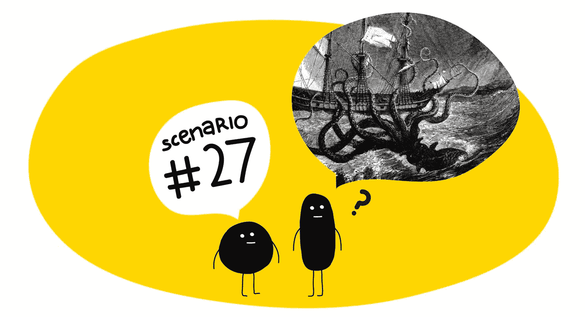
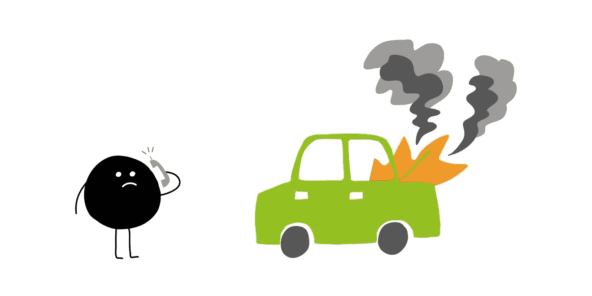
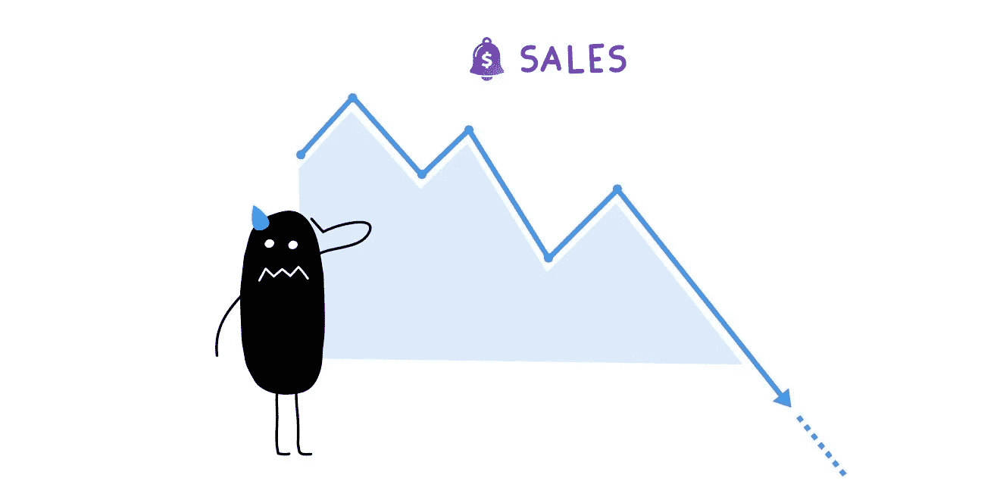
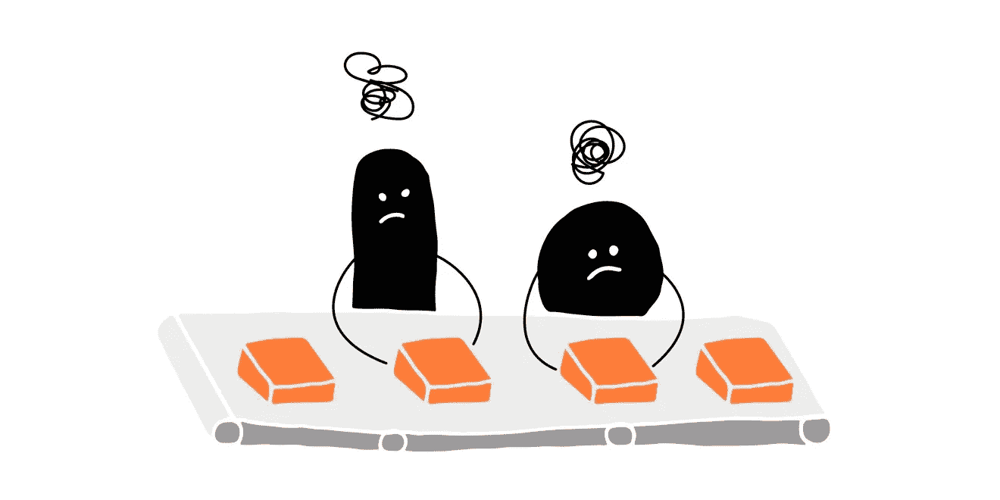
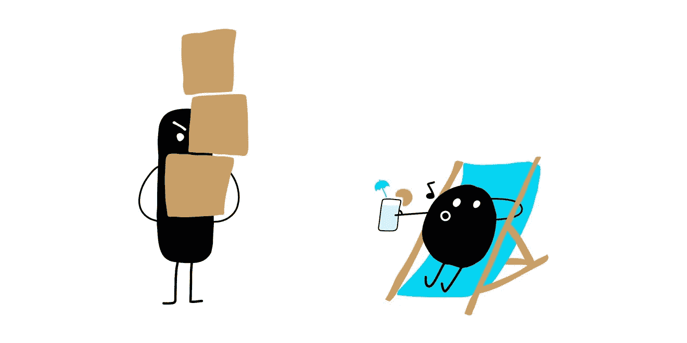
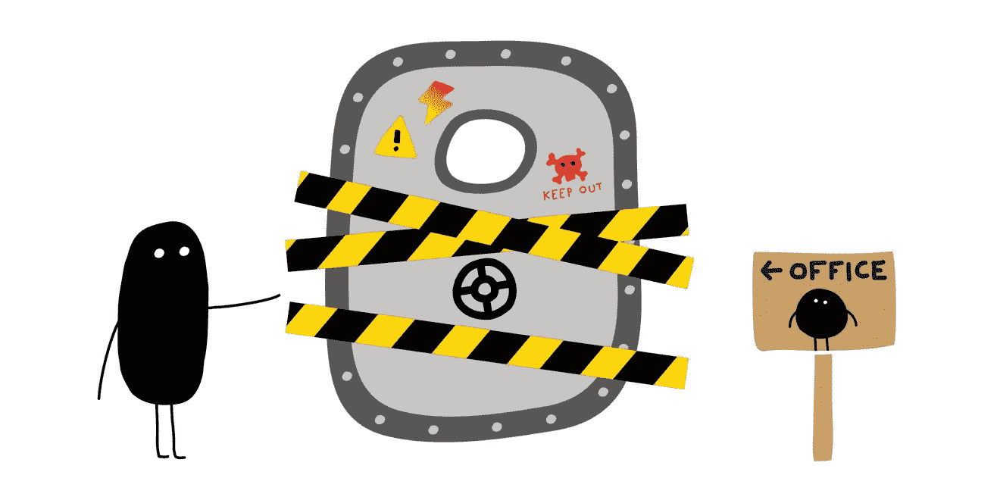
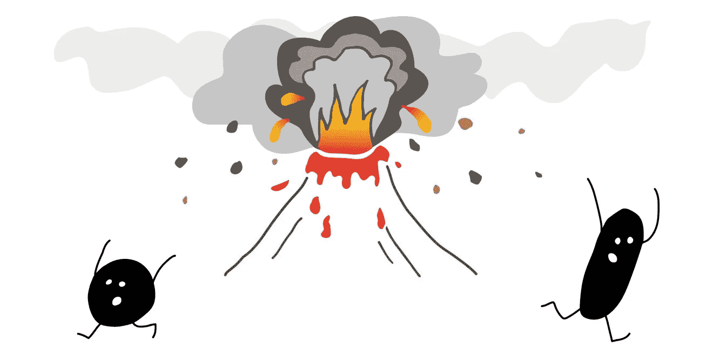

# 有联合创始人吗？不要让这 7 种有毒场景毒害你。

> 原文：<https://medium.com/hackernoon/have-a-co-founder-dont-let-these-7-toxic-scenarios-poison-you-ade597a6ffcb>

你终于找到了终极的联合创始人。他们很聪明，他们交付，他们有令人印象深刻的经验。什么会出错？

嗯，看来**很多**可以去**大错特错**。

你的朋友可能有可怕的合伙创业故事。你的律师有更多。而互联网可以激发无限的噩梦。

– Ok, let’s review Catastrophic Scenario #27
– The kraken attack?

因此，在一起创办我们的第一家公司之前，我们([朱利安](https://twitter.com/supacruz)和[巴斯蒂安](https://twitter.com/bastienpetit))试图确定我们面临的是什么。

我们希望找到可能导致我们之间关系紧张的情况，并在它们分化我们和危及公司之前进行讨论。

以下是我们目前最想避免的 7 种有毒场景:

# 场景#1:精疲力竭

我们往往充满热情，工作时间长。但从长远来看，把自己逼得太紧是不可持续的。这会导致精疲力竭。

## 我们如何预防它:

*   定义现实的月目标和周目标。
*   不要试图用疯狂的时间来“超越”我们的联合创始人。
*   客观地看待事物。我们想做好工作，但是如果我们晚发布一个功能，没有客户会死。

## 我们如何看待它的到来:

*   在我们的月度回顾中提出工作量的问题。

## 如果发生这种情况，我们如何反应:

*   强制休假！

# 场景#2:未达到我们的收入目标

我们在自力更生，还没有创造足够的工资。太长时间不能支付自己将会损害一切。

## 我们如何看待它的到来:

*   请看 [CashNotify](https://cashnotify.com/) 中我们自己的销售图表。😇

## 我们如何预防它:

*   遵循我们的 KPI。每个行动都需要影响 KPI。

## 如果发生这种情况，我们如何反应:

*   第 1 财年:依靠我们的储蓄生活。
*   第二财政年度:通过自由职业来支付账单。

# 场景 3:工作满意度下降

我们开公司不是为了成为百万富翁，也不是为了尝试而死。我们这样做是为了用有意义的创造性工作来支持自己。如果我们变得不快乐，我们可以自由决定继续前进。

## 我们如何看待它的到来:

*   工作变得无趣。

## 我们如何预防它:

*   在每三个月一次的创意静修中谈论我们自己的满意度。
*   允许我们选择有趣的任务，即使它们不是最重要的。

## 如果发生这种情况，我们如何反应:

*   如果只是几个星期:忍一忍，会过去的。
*   如果情况更严重，我们可以暂停一个项目。或者就一个比较难的话题寻求帮助。或者短暂休息一下。

# 场景#4:不平衡的努力

如果我们中的一个人投入更多的时间和精力，情况就会变得不公平。

## 我们如何看待它的到来:

*   我们中的一个人许下了很多承诺，却没有结果。
*   我们中的一个人很少在线，事先没有任何警告。

## 我们如何预防它:

*   就我们双方都能接受的工作量达成一致。
*   接受短期失衡。我们中的一个人有几周没什么魅力是很正常的。或者正在度假。

## 如果发生这种情况，我们如何反应:

*   我们聊天。
*   如果我们中的一个人没有足够的时间进行长期投资，我们可以考虑设定不同的薪酬来进行补偿。

# 场景#5:未表达的紧张

很容易开始想象消极的意图。尤其是在压力、疲劳和涉及金钱的时候。

## 我们如何看待它的到来:

*   我们发现自己在想象对方在故意做 X，逃避做 Y，拒绝做 z。

## 我们如何预防它:

*   默认认为对方是仁慈的。
*   在给怨恨时间积累之前，先表达出来。

## 如果发生这种情况，我们如何反应:

*   我们聊天。

# 场景#6:创造性分歧

我们都有自己的设计和写作风格。我们中的一个人不应该有这样的印象:他不得不经常妥协。

## 我们如何看待它的到来:

*   我们中的一个会感到沮丧。

## 我们如何预防它:

*   我们解释我们提议背后的理由。
*   当另一方有更好的论点时，我们会很快承认，而不会以“正确”为荣。

## 如果发生这种情况，我们如何反应:

*   指定谁对每个项目有创造性的控制权。

# 场景#7:全面冲突

这种新的冒险会变得很有压力。我们之间可能会有很大的意见分歧。这可能会分裂我们，甚至损害我们的友谊。

## 我们如何看待它的到来:

*   我们讨厌我们的合作，并开始不喜欢一起工作。
*   我们对公司的发展方向意见不一。

## 我们如何预防它:

*   我们聊天。
*   每三个月举行一次创意务虚会，共同决定策略。

## 如果发生这种情况，我们如何反应:

*   除了支持请求之外，暂停一切。
*   在做更大的决定之前，休息一个月。
*   最终我们中的一个可能不得不离开公司。

# 为什么创建这个列表是有帮助的

## 1.它迫使我们回顾重要的问题

我们不得不讨论我们通常不会提起的话题。专注于工作很容易忘记问“我们为什么要这样做？”或者“有什么事情困扰着你吗？”。

## 2-它变成了一种承诺

我们更加认真地对待这些话题，因为我们已经把它们列为对公司的威胁。

## 3-它让我们变得更强大

提前讨论这些情况有助于我们预见它们的到来。并解决它们。

## 4-它帮助我们起草法律文件

我们的股东协议只是我们希望避免的一大堆场景，用花哨的法律术语写成。

# 你的中毒场景是什么？

## 我们的经历

我们在这里分享自己的例子。这是我们的目标、个性以及我们彼此非常了解的事实的结果。

2017 年 8 月，我们启动了自己的公司，致力于创建像 [CashNotify](https://cashnotify.com/) 这样的项目。这是我们的全职工作。

但在此之前我们有很长的历史，因为我们:

*   学生时代一起做项目。
*   在同一家网络公司工作了两年。
*   在一家[创业公司](https://hackernoon.com/tagged/startup)工作了 7 年(分别担任首席运营官和产品总监)。
*   我们在印度做了一年半的室友，在那里我们管理着一个开发团队。
*   建立了像 [InviteRobot](https://inviterobot.com/) 这样的实验，以证实当我们没有工程师/设计师团队时，我们可以创造价值。
*   已经在 2017 年 6 月推出了 CashNotify [。](https://www.producthunt.com/posts/cashnotify-for-stripe)

这意味着，当我们决定成为联合创始人时，我们已经:

*   彼此信任。
*   知道我们擅长/不擅长什么。
*   一起经历了许多挑战。
*   我知道我们可以强烈地批评对方，而不会“大发雷霆”。

## 你的经历

一些问题的想法开始识别你自己的有毒场景:

*   你希望每周工作多少小时？
*   你可以几个月没有薪水？
*   什么会让你不开心？
*   你绝对不准备在什么事情上妥协？
*   最坏能发生什么？

如果你有一个需要支持你的计划的配偶，它们甚至更重要。或者要供养一个家庭。

# 结论

我们喜欢查理·芒格所说的“向后思考”:

> 生活和事业中的许多成功都来自于知道你想避免什么:早逝、不幸的婚姻等等。[……]找出你不想要的东西，避开它，你就会得到你想要的东西。
> — [*查理·芒格*](https://25iq.com/2015/09/12/a-dozen-things-ive-learned-from-charlie-munger-about-inversion-including-the-importance-of-being-consistently-not-stupid-2/)

对于我们的有毒场景，我们正在这样做。

最主要的收获是，它概述了我们最糟糕的情况并没有让人觉得不可收拾。只要我们看到他们早来。聊了聊。🙂

我们希望阅读我们的经验对您有所帮助。如果你在开始时做了类似的事情，我们很想知道！

欢迎你加入关于[独立黑客](https://www.indiehackers.com/@bastienpetit/toxic-scenarios-to-review-with-your-new-co-founder-b9a4fa75fe#comments)的讨论。

*插画作者* [*多米蒂勒*](https://www.domitillecamus.com/) *。*

*原载于 2017 年 11 月 22 日*[*cashnotify.com*](https://cashnotify.com/journal/toxic-scenarios/)*。*