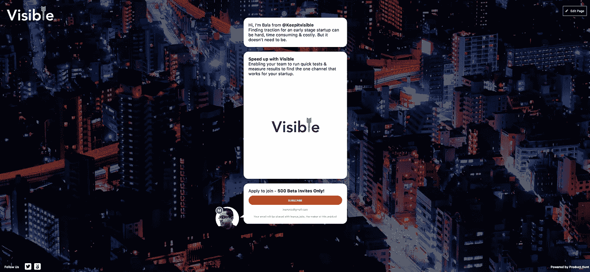
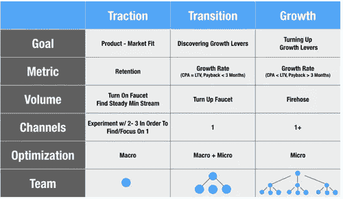
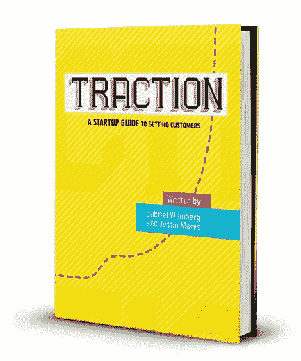

# 你的创业公司找到牵引力了吗？

> 原文：<https://medium.com/hackernoon/have-you-found-yours-4de883547306>

***找到适合你的渠道***

# 申请早期测试版——我们今天正在[寻找产品](https://medium.com/u/b8b4445269d0?source=post_page-----4de883547306--------------------------------)

 [## 保持可见-产品搜索

### 保持可见性——在寻找产品的过程中为你的创业寻找动力

www.producthunt.com](https://www.producthunt.com/upcoming/keep-it-visible) 

***我们如何到达这里，我们将从这里走向何方——下面的故事……***

**你有了一个好主意，决定冒险一试，测试最危险的假设，现在你真的成功了。**

> 你的核心受众在哪里？
> 你每周都在进行哪些测试，
> 做决定，向前迈进。

大多数创业公司都在这个阶段苦苦挣扎。找到一个能让你找到适合市场的产品的渠道。你还没有努力达到增长图。(所以请把那根曲棍球棒拿开…暂时的)。

**背景故事:**我个人的挫折让我想办法进行测试，帮助我找到一个(或多个)渠道？不太可能)。我还没找到。但是我有一种运行&测量测试的方法，它能告诉我测试是否表现良好。引导更多测试的指南——就像攀登台阶(只知道什么时候爬下来)。

关于这一点的一些观点，由[布莱恩·鲍尔弗](https://medium.com/u/cae0f48dccf6?source=post_page-----4de883547306--------------------------------)的— [共提 ](http://www.coelevate.com/essays/traction-vs-growth)

这一切有意义吗？如果你有类似的问题，正在拔头发，不要担心。你并不孤单。

这是它开始的地方-

The Traction Book

大约两年前，我读了加布里埃尔·温伯格写的《牵引》一书。这本书详细讲述了 19 种不同的渠道，如果你的创业公司想要接近产品市场的话，你应该看看这些渠道。

它继续谈论你对你将要运行的测试中的每个想法所做的假设，对它们进行评级，用头脑风暴法得出最高评级的想法，忽略长远的想法，选择听起来最有希望的想法。找出每个测试的表现，然后继续下一个测试…等等。

对于受资源(人和钱)限制的早期创业公司来说，这可能是一项艰巨的任务。您将所有的精力都集中在产品上，几乎没有多少选择来运行每周测试，看看是什么推动了指针。

一个只有 2 到 3 个联合创始人的团队，很少或没有财务资源，会发现很难运行这些测试，跟踪它们，并转移到下一个测试。

根据手头的资源，在这 19 个通道上运行一个完整的测试周期将需要 3 个月或更长时间。

我希望有一种方法来运行测试，存储并与我的团队共享结果，还希望团队能够轻松地访问所有这些信息。[牵引书](http://tractionbook.com/)附带一个 excel 文档，里面列出了所有的渠道，以及你应该用它们做什么。

使用 excel 文档很好，但是它存储在设备上看不到的地方。我在寻找类似于可以挂在墙上的[精益画布](https://leanstack.com/lean-canvas/)或[商业模式画布](http://www.businessmodelgeneration.com/canvas/bmc)的东西。团队可以看到的东西。人们可以走近它，看看——我们这个星期进行什么测试，对测试的期望是什么，我们打算花多少钱，测试进行多长时间，哪些想法坚持，哪些不坚持，等等。

我以 excel 文档为灵感，将其临时制作成一个挂图，人们可以在上面写字、做笔记等。我们准备好了第一个版本，挂在墙上。它大约 5 英尺高。是的，我知道——与瘦画布相比非常大，但我想把它拿出来，这样人们就可以使用它，我们也可以获得一些早期反馈。

我们开始运行每周测试(更像是每两周一次测试)，但是开始在挂图上记录一切。这很快引起了团队成员好奇的目光，他们想看看在给定的一周内发生了什么。人们看着挂图，评论，讨论这些测试，并提出我们可以在测试中做得更多的方法。

所有这些都是来自工程、营销、销售和产品团队成员的宝贵反馈。

但是我想从我们团队之外得到一些反馈。我想看看其他创业公司是如何解决这个问题的。我需要一个可以提问并可能得到一些答案的小组。

为什么有人会费心回复我的问题？这对他们有什么好处？我需要一个社区基础，至少会喜欢我必须分享的东西，然后可能会回应我的查询。

我想——让我们转向可能的社交媒体渠道，在那里我有一些认识我的朋友或同事。这是一个寻求帮助的好地方。我已经有一段时间没有使用脸书了，我的推特账户也是空的。

我觉得 twitter 可能是一个很好的起点，因为我跟踪了大约 300 个来自创业界的有影响力的名字。我读他们的博客，关注他们的推特，梦想着有一天我也能做类似的事情。

我现在迫切需要一群喜欢我分享或说的东西的人。

# 这让我找到了一种方法，让我的 twitter 粉丝在不到一年的时间里从 124 人增长到 5000 人。

(稍后会有更多相关报道)

回到我的挂图故事..

我希望有一双新的眼睛来看看这张挂图，并给我们一些反馈——如果我们这样做是正确的，或者它只是狗的早餐。

我想，为什么不向在创业牵引方面有一些严肃背景的人询问这个牵引图呢——一些有影响力的人，创业创始人或风险投资家，他们以前做过这种事情，可以给我们一些有价值的见解。但是他们为什么要这么麻烦呢？

这个时候，我的 twitter 账户每月有大约 400 名粉丝，我觉得我应该在 Twitter 上发布这个图表，看看人们的反应。

实际上，我更进了一步。我向一个可能最了解创业牵引的影响者发送了一条直接消息(抱歉，我不能在这里提到他的名字！).我不期待任何形式的回复，因为我确信我的推文与其说是信息，不如说是垃圾信息。一个顶级创始人、风险投资人或有影响力的人一天可能会收到数千个请求，如果他们不立即联系到这个故事，就没有办法回复。

事实证明我错了。第二天早上，我漫不经心地打开了手机上的 twitter，正在浏览提要。我有一些喜欢，一些即时消息和一些信息。我查看了邮件，无法相信这位影响者的回复。他觉得这是一个很好的测试角度，如果他同意的话，我请求和他用 skype 聊天。

令我惊讶的是，他同意了，我们进行了 30 分钟的 skype 通话，在通话中，我解释了我对运行测试的想法。他给了我一些非常棒的见解，帮助我简化了挂图。

这对车队来说也是一个很大的推动，因为他们现在觉得我们在正确的方向上。影响者非常乐意通过 twitter 消息回答进一步的问题，对话加快了速度，并看到了挂图的一些重大变化。

我很想知道其他创业公司对他们的牵引故事有什么看法，以及他们是如何解决这个问题的。

我建立了一个登陆页面，并提交给了 [Betalist](https://betalist.com/startups/bullseye)

一个月后，这个页面在 Betalist 上被接受了，我开始在我的 twitter 账户上发微博。我们在 4 天内收到了 220 份申请。

现在，我想通过 [Producthunt Maker Festival](https://www.producthunt.com/chats/makers-festival-2018) 重新审视这个项目，并让更多的人了解这个项目，这样他们就能制造出畅销并受客户喜爱的产品。

> 点击 查看 product hunt Maker festival[T5 的进度](https://www.producthunt.com/upcoming/keep-it-visible)

一个很好的起点是阅读由[加布里埃尔·温伯格](https://medium.com/u/e1a76f1f570?source=post_page-----4de883547306--------------------------------) & [贾斯汀·马雷斯](https://medium.com/u/48a938fea429?source=post_page-----4de883547306--------------------------------)写的 牵引书。**不要停止测试。**

前面的路还很长。如果你觉得你有类似的故事可以分享，为什么不在 twitter 上打个招呼***——@ traction finder***

*或者如果你喜欢这篇文章，可以去我的博客找一些有趣的东西来读，网址是****——***[***doesitfly . io***](http://www.doesitfly.io)