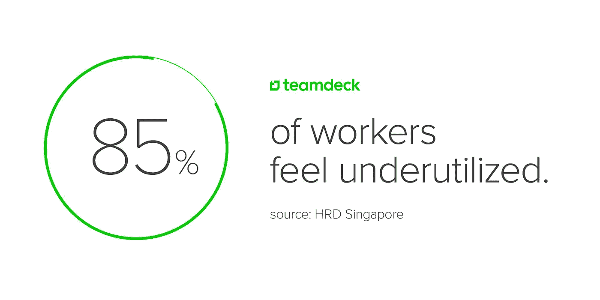
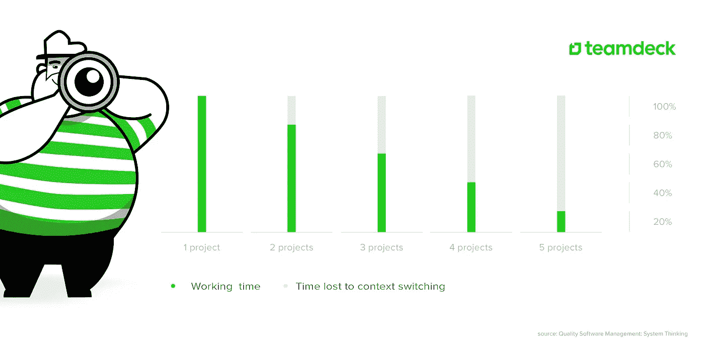

# 无事可做会让人不开心

> 原文：<https://medium.com/hackernoon/having-too-little-to-do-makes-people-unhappy-8afa21ea098e>

当你想到是什么让人们对自己的工作感到愤怒时，第一大原因可能是过度工作。或者没有得到足够的报酬。

但是事情是这样的:

*当人们被工作压得喘不过气来时，他们往往会因为没有足够的事情做而感到沮丧。*

大学毕业后，我一直在 T4 软件开发公司工作。

我认识许多网络和移动开发者。我了解了他们在工作中的挣扎，他们的项目，工作习惯等等。

有一个故事让我印象特别深刻:

我的一个同事被一家大公司聘为高级开发人员。他们给了他一个组长的职位。他得到了一系列典型的初创公司的好处，就像大多数软件公司所包含的文化一样。在头 14 天的工作中没有一个项目。

我的意思是:

雇佣一个非常有经验的员工有什么意义，他前两周都在玩 Xbox？

事情是这样的——这让他很不开心。他想展示他的技能，证明他的经验，并把他的手放在新的，惊人的项目，他认为他会做。

# 报道称，这很常见

无事可做已经成为人们对工作不满意的原因之一:

> "由此产生的厌倦感和工作成就感就像过度工作一样有害。"

85%的员工认为他们可以做得更多，但是公司没有充分发挥他们的潜力。生产力损失相当于每位员工 23，600 美元，一年损失数千亿美元。

为什么会这样？

当露西·科拉威问[为什么工作让我们痛苦？她认为我们的期望超过了不断变化的办公室环境。我们期望太多了。](https://www.ft.com/content/98d74346-de67-11e6-9d7c-be108f1c1dce)

我是千禧一代，我已经听说过了。

但也许我们只是想证明我们可以成为有价值的员工。正如《今日心理学》所说，未被充分利用的感觉尤其会影响年轻人:

> “年轻员工觉得自己没有被充分利用——他们所做的低级工作没有让他们充分参与进来，或者没有充分发挥他们的技能。”

与此同时，一半的美国人对他们的工作生活不满意。 [CIPD 发现](http://www.independent.co.uk/news/business/news/uk-workers-job-satisfaction-at-two-year-low-as-employers-fail-to-engage-staff-cipd-finds-a7016091.html)英国工人两年来对工作最不满意。缺乏参与是原因之一:

> “超过四分之一的受访者表示，他们对在当前职位上发展技能的机会不满意。”

那么我们真的期望太高了吗？

# 这就是人们退出的原因

公司面临的问题是，无事可做不仅会让人们不开心。这会让他们放弃。

因此，如果你经营一家公司或者你是一名项目经理，请记住这一点:

> *没有发挥员工的全部潜力会让他们离开。*

在像软件开发这样竞争激烈的市场中，失去一名优秀员工的成本要高得多。这部分与软件开发基于团队的性质有关:

> “由于劳动力市场紧张和工作越来越具有协作性，失去优秀员工的成本正在上升。”— [哈佛商业评论](https://hbr.org/2016/09/why-people-quit-their-jobs)

也许我们都应该听听斯蒂夫·约翰森的话，他说[不利用员工的才能是一种浪费](http://healthsciences.utah.edu/accelerate/blog/2017/01/steves-dojo-2-why-dont-we-teach-the-eighth-waste.php)。

# 糟糕的计划正在扼杀你的公司

造成这种情况的主要原因之一是管理不善。不是缺乏善意。

很容易失去对员工时间的完全控制，尤其是在较大的团队或跨越不同时区的公司。我们也可以把自由职业者和兼职者加入到这个等式中。

管理团队是一项艰巨的任务，需要灵活性和大量的控制。

一个好的领导者或项目经理应该意识到资源管理的危险。实施适当的项目跟踪和员工管理流程对于有效使用劳动力至关重要。

# 停机时间怎么办？

停工期——每个软件开发公司都会遇到。你能对他们做些什么？

有三个简单的解决方案。它们不仅可以帮助你解决员工利用不足的问题，而且从长远来看，实际上还会让你的公司受益。

**R & D** 、**副业**和**黑客马拉松**都是保持员工积极性和参与度的好例子。

这样做可能有助于在许多方面使您的公司受益:

学习新技术会让你的员工走在前沿。最终，这将有利于你的公司，因为你将有更多有经验的员工来完成接下来的项目。

**另一方面，辅助项目**可能最终成为你可能想要进一步开发的某些功能或工具，供内部使用或出售给新客户。

有许多受欢迎的产品，如 Gmail 或 Instagram，最初只是简单的辅助项目，最终变成了数百万用户使用的工具，为公司带来了稳定的收入流。

黑客马拉松的好处主要是学习新技能，包括技术和软技能，比如团队合作。他们也给你的团队一种成就感、灵感、乐趣，并成为编码社区的一员。

只有一条重要的规则:

你必须像对待常规项目一样对待 R&D 项目，让你的开发人员完成他们已经开始的工作。

首先，你会避免未完成的项目。其次，上下文切换对开发人员来说也是危险的，会给公司带来更多的时间损失或项目延迟。

# 资源管理是关键

为了实现所有这些，并且不让人们不高兴，你应该考虑在你的组织中实施资源管理。

这有助于在加班和员工利用不足之间找到平衡。

[资源调度工具](https://teamdeck.io)可以帮助监控您的员工在给定任务上花费的时间，以及跟踪他们在其他项目中的预订，从而更好地规划他们的时间。

当你这样做的时候，你不仅可以节省大量的时间和金钱，否则你会因缺乏生产力而损失。

你可以发现未被充分利用的员工，给他们新的任务，分配 R&D 项目或副业。

最终，我的朋友不再整天浪费时间在办公室玩 Xbox。

*你有类似的经历吗？在评论里分享吧，我很想听听你的想法！*

> [黑客中午](http://bit.ly/Hackernoon)是黑客如何开始他们的下午。我们是 T21 家庭的一员。我们现在[接受投稿](http://bit.ly/hackernoonsubmission)并乐意[讨论广告&赞助](mailto:partners@amipublications.com)机会。
> 
> 如果你喜欢这个故事，我们推荐你阅读我们的[最新科技故事](http://bit.ly/hackernoonlatestt)和[趋势科技故事](https://hackernoon.com/trending)。直到下一次，不要把世界的现实想当然！

