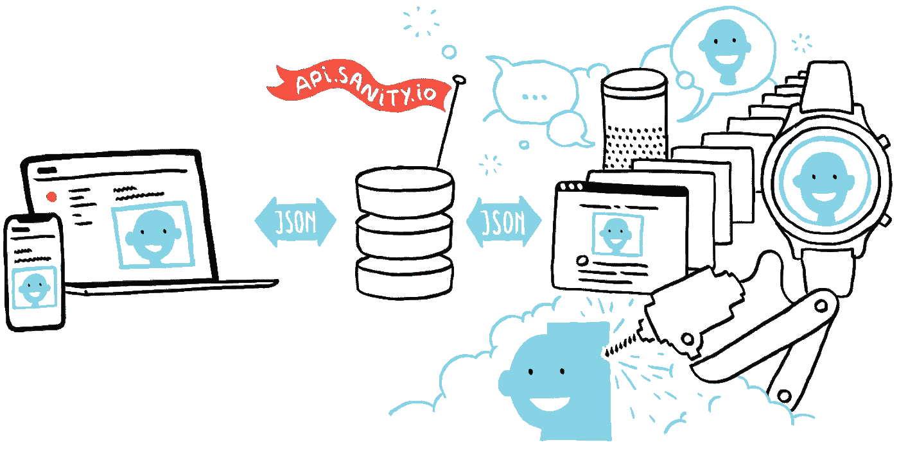
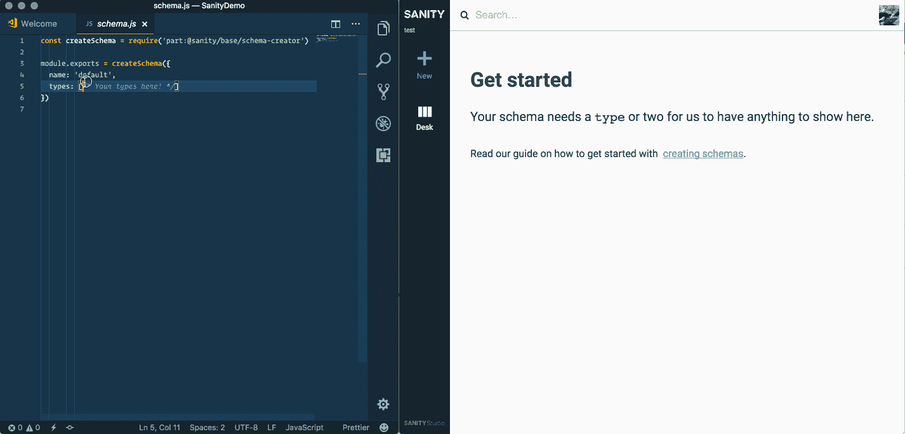
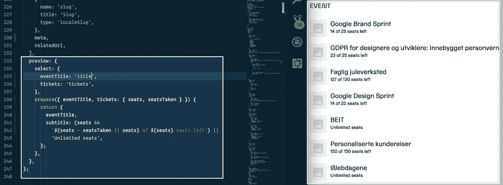
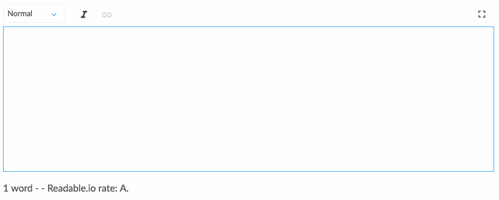
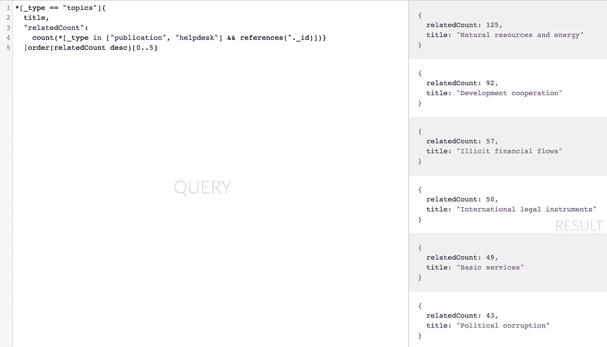
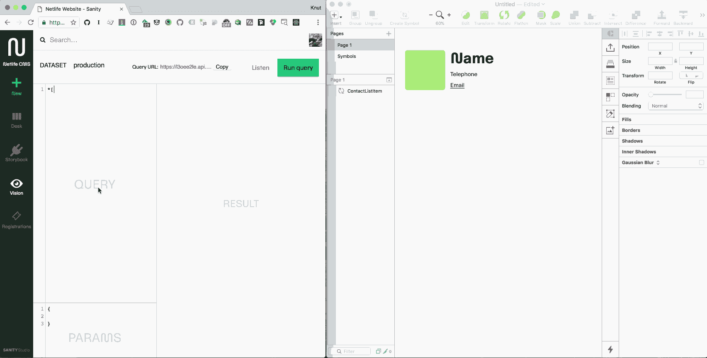

# 无头的爱与理智

> 原文：<https://medium.com/hackernoon/headless-in-love-with-sanity-689960571dc>



Illustration from [sanity.io](https://sanity.io)

## *你应该尝试无头 CMS 理智的 5 个理由*

当 [Netlife](https://www.netlife.com) 决定重塑品牌时，我们不仅使用了[一个包括我们自己字体](https://www.underconsideration.com/brandnew/archives/new_logo_and_identity_for_and_by_netlife.php)的新视觉标识，而且我们还决定探索新的技术前沿。我们非常满意我们之前的[网站](https://retro.netliferesearch.com)建立在[多功能的 Craft CMS](https://hackernoon.com/20-principles-for-craft-cms-ae08d80c17de) 之上，但是我们决定探索一下在网络上具有独立前端的无头 CMS 是否像宣传的那样(剧透:它们确实如此)。

当来自 [Bengler](https://bengler.no) 的朋友带着 [Sanity](https://sanity.io) 出现时，我们已经开始在另一个解决方案中点击鼠标来实现基本的信息架构，这是他们过去三年一直在开发的 CMS，并为其成立了一家新公司。我尝试了一下，很快就被说服了，只用了不到一天的时间，就通过编写简单的 JavaScript 对象，从零开始重新创建了我们刚刚花了几个星期的东西。尽管它还处于测试阶段，我们还是决定把它作为我们新网站的后端，并且从未回头。

## 如果你正在考虑变得没头没脑，以下是你应该考虑让理智旋转一下的 5 个理由:

# 1.两分钟后你就可以开始工作了。🏃

启动你的终端，写下`npm install -g @sanity/cli && sanity init`，遵循一些指令，你就可以开始了。如果您是第一次，我建议您从“电影数据库模式”开始。通过遵循[模式指令](https://www.sanity.io/docs/reference/schema-types)，数据类型和内容字段在简单的 JavaScript 中定义。一旦你掌握了窍门(例如，记住了大部分数据类型)，你就可以和你的编辑同事坐下来，快速地构建、测试和调整 Content Studio，使之对他们有意义。它有热模块重装，这意味着你可以立即看到你的变化。又瘦又贱！

```
$ npm install -g @sanity/cli && sanity init
updated 1 package in 14.462s
This utility walks you through creating a Sanity installation.
Press ^C at any time to quit.
Looks like you already have a Sanity-account. Sweet!
? **Select project to use** Create new project
? **Informal name for your project** test-project
? **Name of your first data set:** production
? **Output path:** ~/Sites/SanityDemo
? **Select project template** Clean, minimal project
✔ Bootstrapping files from template
✔ Resolving latest module versions
✔ Creating default project files
✔ Fetching packages      ▪▪▪▪▪▪▪▪▪▪▪▪▪▪▪▪▪▪▪▪ 100% (0.68s)
✔ Linking dependencies   ▪▪▪▪▪▪▪▪▪▪▪▪▪▪▪▪▪▪▪▪ 100% (14.26s)
● Linking dependencies   ▫▫▫▫▫▫▫▫▫▫▫▫▫▫▫▫▫▫▫▫ 0% (0.00s)
● Linking dependencies   ▫▫▫▫▫▫▫▫▫▫▫▫▫▫▫▫▫▫▫▫ 0% (0.00s)
✔ Saved lockfileSuccess! You can now run "sanity start"
```

虽然其他 headless CMSes 提供了用于编辑内容模型和字段的控制面板，但我更喜欢用代码来完成。这意味着跨项目重用模式更容易。虽然明智的做法是保持这段代码相当冗长和简单，但是您也可以通过迭代数组等来[生成字段集。您还可以模块化常见的可疑内容，例如标题字段。挺俏皮的！](https://www.sanity.io/docs/content-studio/localization)



Starting from scratch is easy. If you put a [`block` type in an `array`](https://www.sanity.io/docs/schema-types/block-type) type you’ll get the rich text editor. Adding other types to the array gets available in the ‘insert’ menu. Yes, rich text is just an array where one of the types happens to be block text.

# 2.你可以编辑编辑🖋🔧

让 Sanity 脱颖而出的是，它的编辑器，即[*Content Studio*](https://www.sanity.io/docs/content-studio)*，*可以根据您的需要进行调整、扩展和定制。第一步是配置内容的预览。这是通过将一个`preview`对象附加到您想要在预览中显示的类型来完成的。您还可以通过`prepare`功能发送您选择的任何内容，进行更多定制。



We use Sanity for handling registrations to workshops and other events. Here we can preview how many seats there are left on each event.

我们已经开始对客户工作使用理智。在我们与 [U4 反腐败资源中心](https://beta.u4.no)的项目中(仍在开发中！)他们希望将富文本域与文本分析服务相集成，以帮助他们跟踪文本质量。我不是 React 专家，但我设法扩展了富文本编辑器，使其包含一行由 [readable.io 的 API](https://readable.io) 提供的许多数据点中的一小部分。你可以在下面看到概念证明。我们还制作了一个类似于电子表格的输入字段，用于创建和编辑表格数据，并且有传言说存在一个用于实时 3D 渲染蛋白质分子的输入字段。).



I set the editor to check the text every five seconds of writing. It’s also interesting to have the running estimated reading time while you write. Hopefully it will encourage brevity.

# 3.GROQ 给你 API 超能力🚀

选择无头[CMS](https://hackernoon.com/tagged/cms)的全部原因是内容可以通过 API 访问。通常这是 RESTful APIs，管理起来有点麻烦。虽然这通常是有意义，但是在这样的 API 上构建一个稍微高级一点的网站或者任何应用程序也可能是一件麻烦的事情。特别是当您需要多次查询 API 以获得必要的 id 来获得您想要的数据时。这也是脸书制造 GraphQL 的部分原因，graph QL 现在似乎是未来无头 CMSes 和“后端即服务”的首选武器。

[graph QL](https://www.sanity.io/docs/front-ends/what-about-graphql)还没有带来理智，但可以说是更好的东西: [GROQ](https://www.sanity.io/docs/front-ends/query-cheat-sheet) 。我看到它的第一个想法是，它感觉像“GraphQL 的降价”。语法也是你必须习惯的东西，但是一旦你习惯了:🚀。如果你想查询我在上面的例子中写的文章，只需输入`*[_type == 'article']`就可以了，但是你也可以疯狂地使用它:



We use a version of this query to generate [the topic list on U4](https://beta.u4.no/topics). It is way easier to write than to read: “Fetch documents with the type ‘topics’ and return the title in addition to the number of documents of the types ‘publication’ and ’helpdesk’ that references each ‘topics’-document and place them under the key ‘relatedCount’, sort this array after this count descending from the largest, and give only the five most referenced topics-document”.

# 4.底层技术超级无聊💤

尽管您在本地配置数据模式和 content studio，但 Sanity CMS 是云托管的，所有的*数据*都是即时同步的，这意味着 studio 也是*实时的*。让其他人可以使用您的 Content Studio 配置是终端中的一个简单的`$ sanity deploy`。有了能够托管无数文档的承诺，令人欣慰的是，在理智之下，你会发现诸如 PostgreSQL、ElasticSearch 和 JavaScript 这样的成熟和超级无聊的技术(好吧，这里有*也有*一些令人兴奋的技术，它们也是使理智如此快速的秘方)。我们还感到安全的是，React 不会很快消失。没有 HTML 或 XML 保存在数据库中，甚至没有富文本，一切都在合理的对象结构中:例如，你不希望为了让 Alexa 从你的文本字段中读取而必须解析 HTML。有了 Sanity，你甚至可以制作一个编辑器，让你标记文本的节奏等等，当语音界面支持的时候。

Sanity 有自己维护和维护的 JavaScript、HTML 和 PHP 客户端，因此您也可以快速启动和运行任何您想要连接的前端。通过 API 编写和更新数据也很容易，即使是事务(是的，它有事务！).你希望这些东西无聊，尤其是当你的内容和数据对你很重要的时候。健全性是为了让您更难丢失或损坏数据而构建的。

在撰写本文时，托管和 SLA 的定价尚未公布，但我们非常肯定，无论是从费用还是功能上来说，这都是明智的。它还将用于学术领域[为在线研究出版物](https://vegapublish.com/)提供解决方案。

# 5.对每个人来说，使用无头内容模型终于变得容易了🙇‍♀🙇



With the [Craft by Invision plugin](https://www.invisionapp.com/craft) we can also use Sanity to provide real content when designing new interfaces.

为了开始使用 Sanity，你暂时依赖于对 JavaScript 有初步了解的人。然而，作为网络上最流行的编程语言，这样的人应该不难找到。我们真正喜欢这个 CMS 的地方是，它邀请了技术专家、视觉/交互设计师和内容编辑更紧密地合作，来创建一个对它的用途有意义的信息架构。

## 我们在热恋中昏了头！💚

能够在会议或研讨会期间调整和调整内容模型、输入字段甚至预览，只是为了测试这些建议，这是非常强大的。事实上，新的内容字段一旦生成，就可以通过 API 立即到达，这为前端用户消除了很多摩擦。我们以前从未能够如此轻松地构建一个信息架构，以便前端人员和内容编辑人员可以立即进行试验。魔鬼也存在于所有的小细节中，这些细节太多了，在这篇文章中无法探究，但要强调其中的一些:理智分析你的图像的配色方案(对图像上的文字对比问题说再见吧！)，处理来自 Microsoft Word 的粘贴，让多个用户同时编辑相同的文档，用一个终端命令导出和导入整个数据集，有 CDNs，有预览 OpenGraph-tags 的插件，让您用一个简单的`sanity init plugin`向工作室编写自己的插件，让您在富文本中制作自己的标记和注释，让您要求您想要的任何大小、裁剪或旋转的图像。这个名单每周都在增加。

也从来没有这么容易定制的编辑器，这一切都发生在-它有助于新的和令人兴奋的冒险！

*应该注意的是，我们与理智没有经济联系，除了用理智来帮助我们的客户，我们按小时收费。如果你对尝试理智感兴趣，你可以通过阅读它的* [*文档*](https://sanity.io/docs) *来了解更多。我们相信理智的人们会感谢反馈，关于*[*gitter*](https://gitter.im/sanity-io/sanity?utm_source=badge&utm_medium=badge&utm_campaign=pr-badge&utm_content=badge)*或各种*[*github-repos*](https://github.com/sanity-io/sanity)*的问题。*

***如果你有兴趣与 Netlife 合作一个理智的项目，只需给我们发一封老式的电子邮件****[***，我们会想出办法的！***](mailto:hei@netlife.com)*

**

*Knit your content together with Sanity. Illustration from [sanity.io](https://sanity.io)*