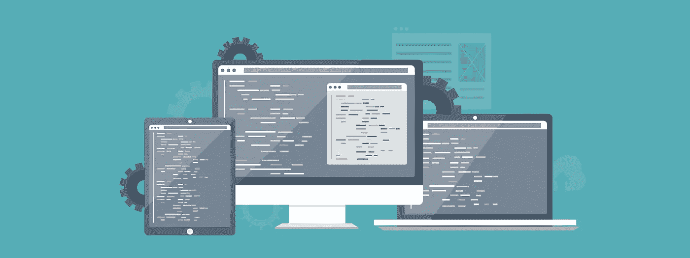
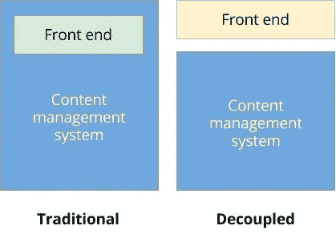
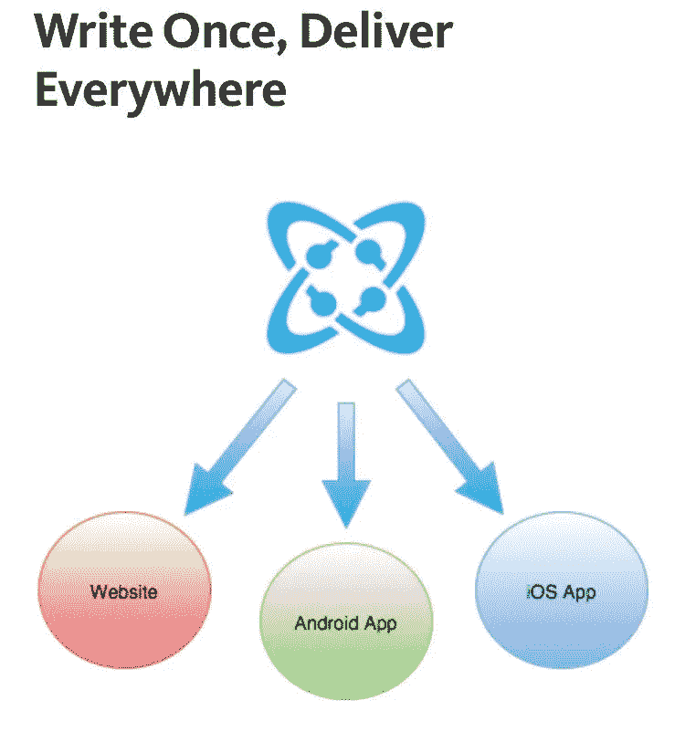

# 无头与去耦 CMS 架构

> 原文：<https://medium.com/hackernoon/headless-vs-decoupled-cms-architecture-e240838fbc99>

在我的上一篇博客中，我谈到了解耦 CMS 架构的好处。回顾一下，解耦 CMS 架构是前端应用程序和内容管理系统解耦并相互独立运行的架构。

开发人员更容易理解，他们可以在没有本地安装的内容管理系统的情况下构建 slicks 应用程序和网站，相反，他们可以通过 API-first 向更多的应用程序目的地提供内容。在[内容管理 API](https://cosmicjs.com/) 领域，您会注意到一些在应用和使用方面有显著差异的流行词汇:**解耦与无头。**

虽然这两个术语暗示 CMS 与管理环境分离，并且内容通过 API endpoint 提供，但所述内容的管理和交付因术语而异。

# 无头与去耦

一个无头的 CMS 是反应式的——它管理内容，然后只是坐着等待某个进程来请求它。

一个**解耦的** CMS 是主动的，准备好要呈现的内容，并把它推到应用程序的指定交付环境中。一个解耦的系统关心交付环境中发生的事情。它通常有一些带有编辑工具的模板系统的概念。

> **无头 CMS** 通过 API 端点
> 提供的内容被动地假设内容交付在其他地方处理
> 
> **解耦 CMS** 通过 API 端点
> 可用的内容直观地关注交付和表示层本身

虽然 headless 和 decoupled CMS 系统都通过 API endpoint 提供内容，但像 [Cosmic JS](https://cosmicjs.com/) 这样的解耦系统在所述内容的表示层上更进了一步。Cosmic JS 可以管理内容和用户，同时存储媒体并通过 API endpoint 使其随时可用，但更进一步的是提供“宽容交付”,以便内容编辑可以计划、管理和部署内容，因为他们知道 Cosmic JS 将作为 [JSON](https://cosmicjs.com/) 交付内容，并将被任何互联网连接的设备全球吞噬。

[Cosmic JS](https://cosmicjs.com/) 是一个 [API 优先的 CMS](https://cosmicjs.com/) ，它使得管理和构建网站和应用程序更加快速和直观。通过[将内容与代码](https://cosmicjs.com/)分离，Cosmic JS 增强了开发者的灵活性，同时确保内容编辑能够以最适合他们的方式规划和部署内容。如果你还没有，那就从[注册](https://cosmicjs.com/signup)开始吧。如果你有关于 [Cosmic JS API](https://cosmicjs.com/) 的问题，请在 [Twitter](https://twitter.com/cosmic_js) 或 [Slack](https://cosmicjs.com/community) 上联系创始人。

[卡森·吉本斯](https://twitter.com/carsoncgibbons)是 [Cosmic JS](https://cosmicjs.com/) 的联合创始人& CMO，这是一个 API 第一的基于云的[内容管理平台](https://cosmicjs.com/)，它将内容与代码分离，允许开发人员用他们想要的任何编程语言构建流畅的应用程序和网站。

> 黑客中午是黑客如何开始他们的下午。我们是这个家庭的一员。我们现在[接受投稿](http://bit.ly/hackernoonsubmission)并乐意[讨论广告&赞助](mailto:partners@amipublications.com)机会。
> 
> 如果你喜欢这个故事，我们推荐你阅读我们的[最新科技故事](http://bit.ly/hackernoonlatestt)和[趋势科技故事](https://hackernoon.com/trending)。直到下一次，不要把世界的现实想当然！

