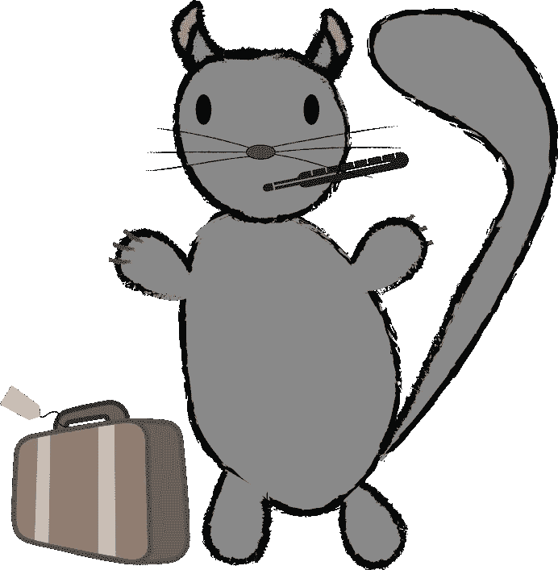

# 健康旅行、在路上工作和旅行的低效率

> 原文：<https://medium.com/hackernoon/healthy-travel-working-on-the-road-and-the-inefficiency-of-travel-ab40e43c9298>

我为每周吱吱声的延迟道歉，在过去的几周里，我让各种各样的事情占据了我的上风，对此我很恼火。首先是一系列疯狂的活动、会议和旅行，然后我被严重的感冒困扰，这让我连完成工作都很困难，更不用说我想做的事情了。我有一个我想在这篇文章中讨论的话题，但我想我会把它留到将来，而不是谈论过去几周出现的一些问题。

其中很多都是打着我不久前开始的一个项目的旗号，但从未完全完成，我的“精益旅行者”项目。这应该是一个博客帖子，提示，如何生活和建议的选择，作为一个游牧者，一个经常旅行的人，或者你可以贴上“不太安定的生活”的标签。

An Unhealthy Travelling Chinchilla

## 旅行时保持健康

这是我经常纠结的事情。在家的时候，我有我吃的食物，我遵循的惯例，我做的和不做的事情，试图保持自己的健康。在旅途中，这并不总是可能的，因为时间、空间和便利的限制经常与你理想的生活方式相冲突。

事实上，许多参加会议和野营的人都处于“假日”状态，很容易养成饮食、饮酒和熬夜的坏习惯。这些在适度的情况下是好的，但是如果你每周都参加不同的活动，它们会让你付出代价。

旅行本身就不健康，经常被挤在房间里或移动陌生人的集装箱里，到处都是咳嗽喷溅的细菌“善良”。当谈到细菌时，我不想听起来像一个假正经，因为我不是，而且发现现代清洁产品广告传播关于“细菌”的偏执宣传令人反感。如果你的免疫系统已经很差或很弱，那么这些都不是好的环境。过去我一直对那些不握手而“碰拳头”的人持怀疑态度，但我开始理解他们的动机。

最后，当你生病时，有一个很大的两难问题。你回家了吗？你一直向前推吗？在旅途中整天呆在床上有多实际？这不是我第一次在旅行中生病，相对而言，我并没有病得那么重。一个朋友向我提到，他住在一家青年招待所时染上了水痘。那太糟糕了。

## 旅行时工作

理论上，现代技术、工作和公司使得随时随地工作成为可能。有全球网络的共同工作空间，工作友好的咖啡馆和带 wifi 的住宿，使你有可能拿着你的笔记本电脑在任何地方工作。但事实上，我发现在旅途中工作永远不会像一个更持久的环境那样有效或高效。这可能更多的只是我，我是一个矛盾的混合体。我喜欢我的屏幕、像样的办公椅和图形输入板，但也喜欢在工作日四处走动。但是对我来说，在路上工作有两个主要问题。一个人在一个地方感觉足够舒适，可以花几个小时专注于一项任务。在咖啡馆里，你会觉得自己不得不不停地买东西(我就是这样)，而且这里的环境并不总是最适合工作。合作空间更有益，但对于一次性访问来说可能很昂贵，尽管许多人有试用期，但当他们问“你愿意成为会员吗？”时，你会觉得有点虚伪。对我来说，图书馆一直是一个受欢迎的工作选择，但如果他们允许非本地人使用图书馆，国家是不一致的，wifi 可能是粗略的。如果你住在有 wifi 的 Airbnb 或公寓里，你可以两全其美，但这导致了我在路上工作的第二个问题。当我在一个陌生的城市时，我觉得我应该以某种方式体验它，而不只是呆在室内工作，我不知道我是否会回来。这些当然都是我自己的观点和烦恼，但是，嘿，这是我的博客。

## 旅行效率低下

作为一个不会开车的人，一个对这种旅行方式没有直接经验的人(也就是说，当我完全发号施令的时候)，对我来说，这似乎是最灵活的出行方式。它不是最快或最便宜的，但你可以在你喜欢的时候离开，以你想要的速度旅行(在法律限制内)，在你想要的时间和地点停留等等。飞机是一种快速而廉价的出行方式，但是你往返机场会浪费很多时间，等待去任何地方，而且你会被航空公司的时间表所束缚。我发现这些延误的时间从来没有足够的时间来完成那么多工作，而半天的时间可能会浪费在 90 分钟的飞行中。正是因为这些原因，我开始更喜欢火车(甚至巴士旅行)，它需要更长的时间，但在实际旅程中浪费的时间更少，它们有点像移动办公室。如果欧洲的火车旅行更便宜，从东到西的连接更好，我会更多地使用它。

具有讽刺意味的是，我在上次旅行中为了享受坐火车去伦敦的新奇感，在布鲁塞尔等了两天，从中我学到了一个教训，那就是不要挤得太多。如果有时间回家至少一天，那么这样做可能是值得的，也更便宜。没有特别的理由(假期是一个合理的理由)在一个城市闲逛很快就会变得乏味和孤独。

## 播客

所有每周的微博都附有一个播客，我可以在这里更深入地了解这个话题，在这里订阅**或者听左边的单集。**

**温度计图标由* [*龙猫*](http://www.freepik.com) *由*[*www.flaticon.com*](http://www.flaticon.com</a)*和* [*CC 由 3.0*](http://”http://creativecommons.org/licenses/by/3.0/) *组成。行李箱是公共领域。**

******

> *[黑客中午](http://bit.ly/Hackernoon)是黑客如何开始他们的下午。我们是 [@AMI](http://bit.ly/atAMIatAMI) 家庭的一员。我们现在[接受投稿](http://bit.ly/hackernoonsubmission)并乐意[讨论广告&赞助](mailto:partners@amipublications.com)机会。*
> 
> *如果你喜欢这个故事，我们推荐你阅读我们的[最新科技故事](http://bit.ly/hackernoonlatestt)和[趋势科技故事](https://hackernoon.com/trending)。直到下一次，不要把世界的现实想当然！*

**