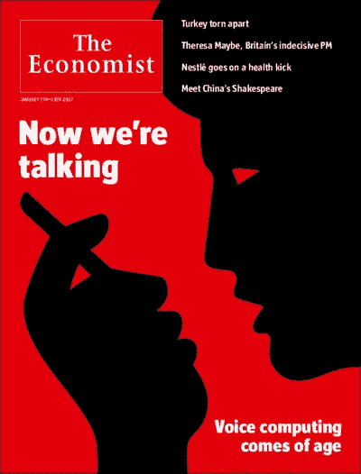

# 听不到邪恶

> 原文：<https://medium.com/hackernoon/hear-no-evil-d3ac3688c2d3>

*声控 AI 助手先进到危险*

有用的语音[识别](https://hackernoon.com/tagged/recognition)，结合能够解析特定短语和句子的 AI，终于来了。亚马逊的 Alexa，苹果的 Siri，谷歌的 Assistant 都在向我们展示未来会是什么样子。

Even the Economist is on board

然而，安全措施落后于能力，正如最近一个[电视主播订购玩具屋](http://www.cw6sandiego.com/news-anchor-sets-off-alexa-devices-around-san-diego-ordering-unwanted-dollhouses/)的例子所示。该系统从电视上接收声音并将其解释为命令的事实听起来很滑稽，但对于任何对计算机安全稍感兴趣的人来说，这应该是很可怕的。这听起来像好莱坞改编的经典远程代码执行 bug——但这不再是幻想。

我们很高兴我们有能听我们说话的机器，以至于在我们急于使用/购买/创造它们的时候，我们没有停下来确保它们只听我们说话。这就是为什么一个孩子可以在父母睡觉或外出时订购一个玩具屋，对此进行报道的电视主播可以订购数百个，我们可以在拜访朋友时进行有趣的恶作剧，在他们不注意的时候订购大量的卫生纸:-)

意外地在网上订购东西可能会非常不方便，并且会让你损失一大笔钱，但是随着这些助手控制了我们家里和生活中更多的设备(有人知道吗？)，我们就开始看到*真正的*问题。这里有一个愚蠢的技巧，可能在一年左右的时间里奏效: [*Alexa，打开前门！*](https://ifttt.com/applets/342970p-alexa-tells-smartthings-to-unlock-front-door-i-use-the-phrase-unlatch-front-door-lock-updated)

手机语音助手展示了一种处理方式:要求手机解锁才能执行(大多数)命令。然而，虽然这对于手机来说可能有意义(并且只会给用户带来些许不便)，但对于家庭自动化系统来说却是行不通的。如果我必须走过去按下一个按钮，我也可以自己完成整个动作(比如关灯，或者开门)。

另一种可能是[说话人识别](https://en.wikipedia.org/wiki/Speaker_recognition)。通过分析单词是如何发出的，而不仅仅是它们是什么，这样的系统可以区分授权用户的声音。然而，像许多其他生物识别系统一样，它很容易被用户的传真所欺骗——在这种情况下，只是一个简单的记录。因此，任何有手机的人都可以“黑掉”这种安全措施。

更有效，也只是稍微不方便的是，要求用户亲自出现在房间里(例如，通过感应他们的手机、智能手表或其他大多数时间随身携带的个人物品)和说话人识别相结合。在这种情况下，即使黑客企图入侵，用户自己也会阻止它。

所以好消息是，建造更安全的语音控制系统不应该是*难以做到的。坏消息是，正如我们在[看到的由受损物联网设备](https://en.wikipedia.org/wiki/Mirai_(malware))组成的巨大僵尸网络，家庭自动化领域的许多公司目前没有经验或动力来更加关注安全。*

*语音控制的人工智能助手已经存在，这是一件好事——它们非常方便。但是在未来的几年里，期待更多有趣的轶事和恐怖的故事。*

******

> *[黑客中午](http://bit.ly/Hackernoon)是黑客如何开始他们的下午。我们是 [@AMI](http://bit.ly/atAMIatAMI) 家庭的一员。我们现在[接受投稿](http://bit.ly/hackernoonsubmission)并乐意[讨论广告&赞助](mailto:partners@amipublications.com)机会。*
> 
> *如果你喜欢这个故事，我们推荐你阅读我们的[最新科技故事](http://bit.ly/hackernoonlatestt)和[趋势科技故事](https://hackernoon.com/trending)。直到下一次，不要把世界的现实想当然！*

**