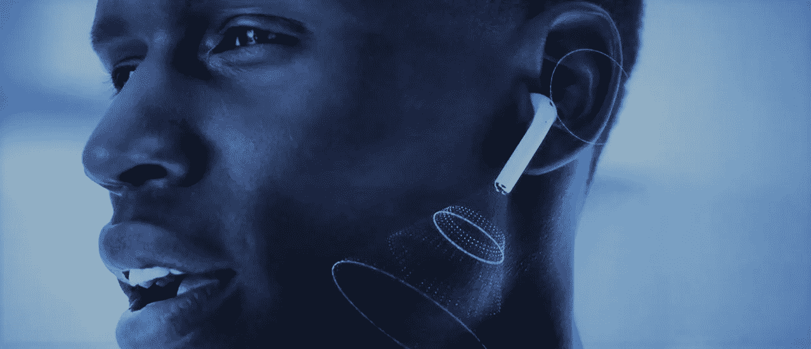
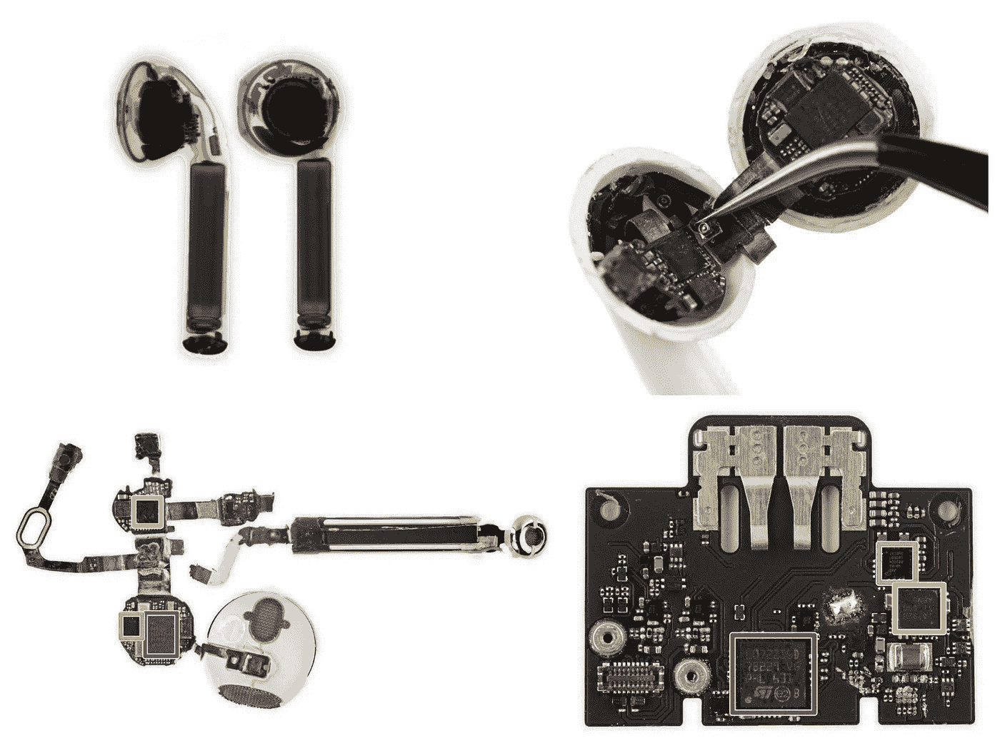
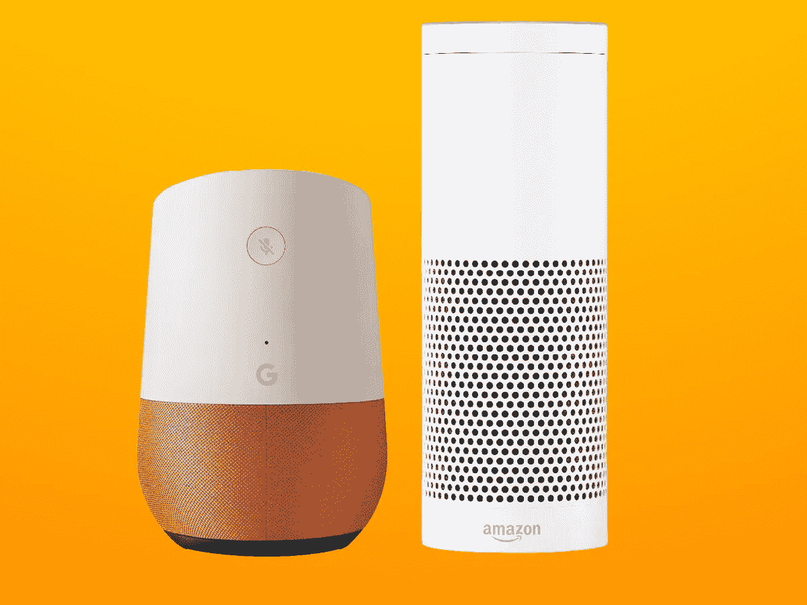
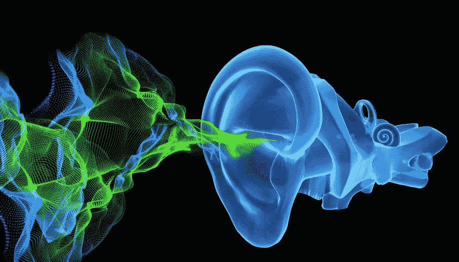

# AirPods“听得见”——物联网计算的未来

> 原文：<https://medium.com/hackernoon/hearables-a7c6dc616bff>

AirPods — a new category of Wearables — Hearables ([Source](http://www.gettyimages.com/))

> 苹果 AirPods 可能重要得多
> 
> 不仅仅是替换旧耳机
> 
> 就未来物联网计算而言。

## 苹果 AirPods 全球售罄。

这是一款被一些最初的评论者视为失败的产品，主要是因为高昂的价格标签(159 美元)和可笑的外观(嘿，你耳朵上伸出来的东西)。然而，如果你现在去任何一家苹果商店，你都不会看到它们，因为它们已经[售罄](https://hackernoon.com/airpods-isinstock-e86d39817e15) *。

**有一个博客词条“* [*你如何不用等 6 周*](https://hackernoon.com/airpods-isinstock-e86d39817e15)*”*

## 差不多十年前。

2007 年 6 月 28 日，诺基亚是全球销量最高的手机公司，那时安卓手机还不存在，黑莓也有自己的市场。第二天，[苹果第一款 iPhone 上市](http://money.cnn.com/2007/06/29/technology/iphone/index.htm)。我们现在都知道 iPhone 对我们的生活产生了多大的影响。

## 这个产品还不太完美。

第一代 iPhone 推出的时候，产品有很多限制(不能复制粘贴，记得吗？)而且它每年都经历多次迭代改进。
第一代 AirPods 也有一些限制(事实上，对于“ [Hearables](https://www.everydayhearing.com/hearing-technology/articles/hearables/) ”)非常有限，就像其他任何第一次一样。然而，AirPods 显然是苹果[未来](https://hackernoon.com/tagged/future)产品类别中非常重要的一部分——实现**“声控个人助理”**。

## ***iPhone 在你耳边？***

*耐人寻味的事实是* ***AirPods 的计算能力比第一代 iPhone 的*** *(据*[@ BrianRoemmele](https://twitter.com/BrianRoemmele))*——*相当于 *3* Cortex SoCs *，都在这么小的外壳里。*

1 Cortex SoCs in each ear piece and 1 in the base ([Source](https://twitter.com/BrianRoemmele/status/819929819152465920))

## 人工智能入口点之战

我们都知道，亚马逊和谷歌正在为语音识别打一场关键的战斗，尽管产品像亚马逊 Echo 和谷歌 Home。

Google Home vs Amazon Echo ([Source](https://www.stuff.tv/features/amazon-echo-vs-google-home-uk-which-one-right-you))

为什么？因为这些产品作为**入口点**将更多数据收集到各自的人工智能(“AI”)服务中。苹果在 AppleTV 上启用了“Siri”进入这个战场——客厅，但迄今为止“Siri”还没有“Alexa”被调用得多。

## 它叫得越多，就变得越好

这归结为通过构建正确的模型和输入更多数据来构建**最智能的人工智能**引擎。使用的人越多，服务(人工智能)就变得越好。因此，他们正在为成为市场领导者而战——亚马逊的‘Alexa’，谷歌的‘assistant’(还没有名字)，苹果的‘Siri’，或者微软的‘Cortana’(是的，微软也有)。

## 成为听众

AirPods 有它的位置和优势，是一个“**听觉系统**”，与其他入口点相比，有点**最接近操作者**(人类)——可能为 AI 提供了最无缝(自然)的入口点。
苹果明白这一点的重要性，并在这方面投入巨资。

Hearables — a potential to be the most natural UX for human interacting AIs ([Source](http://www.sarinsight.com/hearables-smart-wearable-audio-devices-coming-ear-near/))

> “我们正处于一个真正的无线未来的开端，我们已经为此奋斗了多年。在这里，技术可以实现您和您的设备之间的无缝自动连接。”
> 
> — Jony Ive，苹果公司在 AirPods 发布会上

## 人工智能——成为现实

这个思路，让我想起了一部电影——[**她(2013)**](http://www.imdb.com/title/tt1798709/) 。这部电影的未来，“Siri”就像语音操作的人工智能“个人助理”——“萨曼莎”。这是其中一部让我深深思考人类和人工智能之间交流的“不太遥远”的未来的电影，人工智能是一种真正智能、有自我意识和创造力的智能。

Trailer — Her (2013) ([Source](https://www.youtube.com/watch?v=6QRvTv_tpw0))

*对于任何和我一样的科幻迷来说，我强烈推荐这部电影，还有*[*Ex Macina*](http://www.imdb.com/title/tt0470752/)*。*

## 它只需要一个云连接。

不是以 AirPods 目前的能力来判断，而是用想象力来评估它的潜力，知道所有设备需要的，是连接到云端(无限计算资源的来源)，

## AirPods 可能是最接近**外形的**设备，它开启了物联网计算的未来

## 你同意吗？

感谢您的反馈。

如果您希望启动物联网(“IoT”)解决方案，当前的连接选项有问题，希望安全地连接到云，或者需要对您的网络有更多的控制…请查看来自 [**SORACOM**](https://blog.soracom.io/) 的博客帖子！！

**<一个值得你花时间的故事>**
[物联网 101:搭建在 SORACOM 平台上](https://blog.soracom.io/iot-101-building-on-the-soracom-platform-36d17700829a)

请加入硅谷物联网会议小组，参加您附近的物联网黑客和物联网制造商研讨会，免费了解更多信息！！

 [## 硅谷物联网(IoT)研讨会

### 3 小时的物联网研讨会—了解如何安全地连接到云。

www.meetup.com](https://www.meetup.com/SV-IoT/) 

> [黑客中午](http://bit.ly/Hackernoon)是黑客们下午的开始。我们是 [@AMI](http://bit.ly/atAMIatAMI) 家庭的一员。我们现在[接受投稿](http://bit.ly/hackernoonsubmission)并乐意[讨论广告&赞助](mailto:partners@amipublications.com)机会。
> 
> 如果你喜欢这个故事，我们推荐你阅读我们的[最新科技故事](http://bit.ly/hackernoonlatestt)和[趋势科技故事](https://hackernoon.com/trending)。直到下一次，不要把世界的现实想当然！

