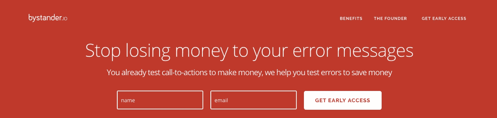

# [第 8 天]30 天内从零到 MVP 请把我的登陆页面撕成碎片

> 原文：<https://medium.com/hackernoon/hello-all-e902e4dfb147>

大家好！如果这是你第一次来这里，你可能会对我制定基本规则的第[天](https://hackernoon.com/day-0-zero-to-mvp-in-30-days-31c83db6aadf)和描述我当前想法的第[天](https://hackernoon.com/day-1-zero-to-mvp-in-30-days-idea-number-1-18536868e282)感兴趣。

**就在今晚！**你们都将看到 1.0 版本的[旁观者. io](https://bystander.io/) 登陆页面。*一个注意事项:* [NGINX](https://hackernoon.com/tagged/nginx) 和 droplet 一般来说都是非常不优化的。明天我会在这上面花点时间。

The tippy-top of Bystander’s shiny new landing page

当然，就内容而言，我们缺乏社会证明和推荐。但是这些关键部分将会在我和一些快乐的人们使用这个应用程序的时候被添加进去。

我在标题上花了太多时间，我知道我应该花更多的时间，但是那是一个很深的兔子洞。如果你想看我疯狂头脑风暴的选项列表，[你可以在这里查看](https://docs.google.com/document/d/1WLfEVh5JQdJbvhYVw0hHB1cGEjpQuljI4SZrVsOz-Lg/edit?usp=sharing)。

来自大卫·奥格威:

> 平均而言，阅读标题的人数是阅读正文的五倍。当你写好标题时，你已经花掉了你一美元中的 80 美分。

所以花 80%的时间写这两个标题似乎是公平的。由于我没有 A/B 测试标题所需的流量，我可能会使用社交广告技巧，在脸书和 LinkedIn 购买一些便宜的 CPM 来测试其他可能适合的标题。

**对于我的主要标题**，我想要第二时态标题，介绍“是什么”,促进紧迫感&阴谋，而不是指责(我希望！)

对于副标题，我想暗示“如何”培养这种阴谋。但是由于这是一个*式的*新市场，衍生自企业已经在工作流程的其他部分使用的解决方案，我希望这个标题能够引起共鸣。"*你已经为 XYZ 这么做了，为什么不也为这个做呢？*“我*希望*这种格式是一种有效的方法，可以传播 a/b 测试错误消息的理念，从而降低成本，提高客户满意度。

我觉得我需要添加更多的内容，但我不想在我的另一个副本如此深思熟虑后强行推出一堆绒毛。

相反，我优先列出我的功能，但从好处的角度来描述它们。接下来，我试图讲述一个故事，讲述一个破碎的代价高昂的错误可能带给旁观者的旅程。

这就是今天的全部内容，我花了相当多的时间在这个登录页面上进行探索和收尾工作。旁观者的 Ghost 博客已安装，但未被改动。而且(可以预见！)我已经没有时间在 UX 博客上向旁观者的读者推广客座博文了。

# 明天，第九天

*   考虑到您在登录页面上可能得到的任何严厉反馈(该页面将于周一发给潜在客户！)
*   微调一些服务器的东西
*   为旁观者博客选择一个基本主题，并清理由 Ghost 安装证明的填充/开始内容
*   越来越多的潜在客户

长期目标，我希望在第 2 周结束时有一个预购选项。预购可能会为所选的预购长度节省 50%的费用。

如果您在登录页面看一下[并有任何反馈，请告诉我！你可以在我的主页上发表评论或者发邮件给我。](https://bystander.io/)

干杯！

[前进到第 9 天:烧掉一些钱](/@modette/day-9-zero-to-mvp-in-30-days-torching-some-cash-97c655b46fed)
[回到第 7 天](https://hackernoon.com/day-6-zero-to-mvp-in-30-days-on-landing-pages-and-prospecting-453a00cd1f9b)