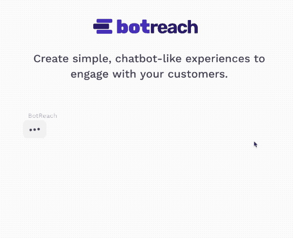

# 你好，我是僵尸网络

> 原文：<https://medium.com/hackernoon/hello-from-botreach-44a7a2e51b7d>

这是我自己第一个产品的开始。很长一段时间，我认为我失去了真正制作东西的动力，比如网站和应用程序。出于某种原因，出乎我自己的意料，我迷上了一个简单的想法。在这篇文章中，我想分享这个想法背后的故事，直到今天。

# 发生了什么事？

三个月前，和很多人一样，我会把自己描述成 indiehackers.com 的一个沉默的潜伏者。我阅读了所有的采访，听了每一个播客，并且通读了论坛中的讨论。那是在我辞去在一家销售 t 恤的科技公司的旧工作后不久。令人遗憾的是，在一家试图开发创新技术的公司中，作为唯一的一名开发人员，对该开发人员来说不会有好结果(🔥🖥🔥).

因此，在阅读了所有在 indiehackers 社区发生的事情，阅读了《每周工作四小时》和《开发商的营销》之类的书后，我认为我应该自己做点什么。一些我独自负责的事情。

> *“好吧”，我想，“处于这种独立灵感的情绪中，应该不会太难”。*

我开始建立一个简单的客户关系管理系统，但令人惊讶的是，我的动机很快就消失了。我开始为自己构建一个简单得多的预算应用程序，但两周后我的动力就消失了。然后，我开始做一个小项目，简单地设置交互式图表，但是…你可以猜到，我的动机逐渐消失了。

除了其他一些问题(比如首先验证我的想法)，动力是继续我的想法的一大障碍。

大约一个月前，我在一个论坛上发现了一个家伙的帖子，他想得到对他的应用程序的反馈。这是一个名为【T4 相识】的调查工具，使用类似聊天机器人的体验来吸引参与调查的用户。每个问题之后，我可以在多个答案中进行选择，聊天机器人会再次用一条单独的信息来回答这个问题。这实际上感觉像是一次真正的对话，我立刻被它打动了。

# 它解决了什么问题？

熟悉的项目(这个词真的很难正确键入)让我想到了整个聊天机器人行业。不久前，到处都出现了信使机器人。因为至少脸书发布了他们的机器人应用编程接口，所以创建和使用聊天机器人对每一个企业来说都是正常的。但是想想聊天机器人，为什么没人使用它？这里没有提到大公司，但是小公司似乎根本没有想到他们。我想这只是需要太多的时间来正确地设置和训练它，以证明它的价值。这可能是我个人认为聊天机器人不多的原因之一，尤其是在网站上。我在这里的结论是:能够在几分钟内为我自己的用例创建一个聊天机器人，可能是一个需要解决的有价值的问题。

事情是，熟人向我证明，没有必要真正的聊天机器人。我不需要键入我自己的话，并期望机器人猜出我的意思。在一组给定的回答中进行选择是完全没问题的，这提供了足够的对话经验来让某人沉迷于聊天。

除了调查之外，我认为一个易于设置的、对话式的、类似聊天机器人的体验可以用于更多的领域。通过与积极从事活动业务的人交谈，我得出的结论是，像这样的产品可以用于贸易展览、会议、办公室大厅或商店。当然不仅仅是为了调查，一般来说也是为了与客户交流。在对话中，传递公司的语言要容易得多。感觉更私人，即使当客户知道他在和一个机器人说话。也许点击回复会感觉更舒服，而不是被迫写下一些东西。

# 最有价值球员

现在，我仍然在弄清楚所有需要的特性，使我的项目适用于事件(或者让它只是“离线”)用例。11 月中旬，我计划参加一个小型的本地会议，在那里我将测试我的聊天机器人的第一个版本。到那时，我会进一步更新进度，并告诉你更多关于计划中的功能。

如果你想先睹为快，你可以登陆[botreach.co](https://botreach.co/)网站。如果你喜欢的话，你可以在那里注册订阅时事通讯，我会在那里发送任何关于该产品的未来更新。

最重要的是，我会尽我所能，向第一个顾客和以后的顾客发布我旅途中的每一件事，或者我认为我失败的地方。

非常感谢积极和消极的反馈。

*原载于 2017 年 10 月 25 日*[*Philipp reinking . de*](https://philippreinking.de/hello-from-botreach)*。*