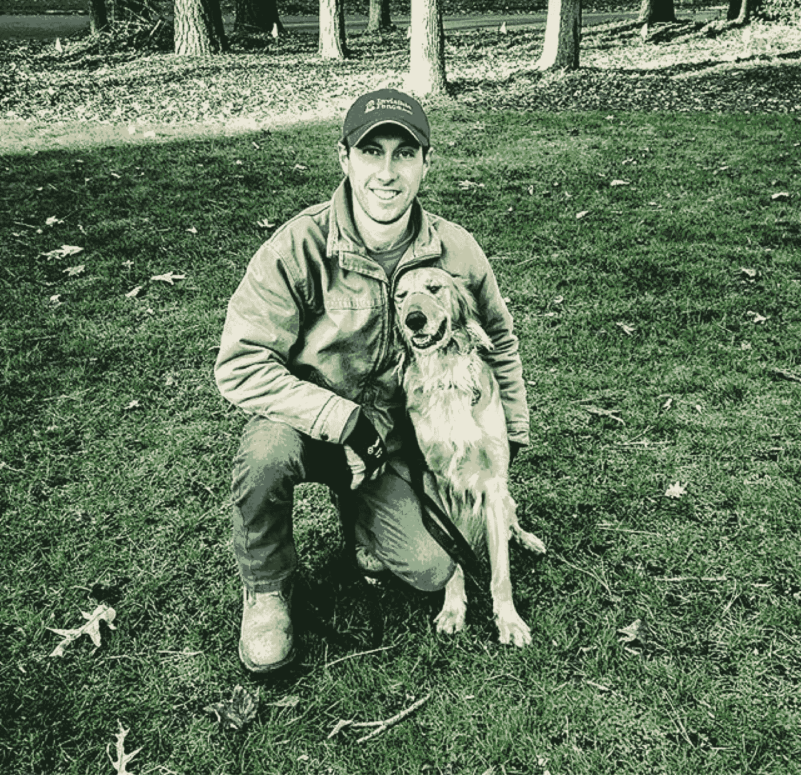

# 我每天的例行公事是阅读 Entrepreneur.com 公司和商业内幕，不仅是为了学习，也是为了拓展我的思想，并对新思想保持开放。我的名字是贾斯汀·沃德，我和我的家人经营隐形栅栏品牌已经超过 15 年了。我们是无线电系统公司的一部分，该公司是 Sportdog、Premier 和 Petsafe 等猫狗品牌的领导者。隐形围栏品牌通过设计解决方案来保护您的宠物免受其好奇心和可能对自己、他人、宠物或财产有害的行为的影响，从而帮助您发现和平拥有宠物的生活方式。我们的顾问、安装人员和培训师专业团队将向您展示如何享受您的宠物，并让它们永远待在自己的家里。隐形栅栏品牌(从商业角度来看)不是我的热情所在，从第一天起我就在寻找出路！我父亲最初是在 2000 年开始特许经营的，当时他在寻找一种从砖石行业退休的方式，随着他在 2010 年生病，我决定做日常运营或出售他已经开始的东西！这点燃了我成为一名企业家的热情，不仅让我负责隐形围栏品牌的日常运营，还负责我今天运营的其他商业投资！那个时候，我从没想过这个词，但随着我的生意开始蒸蒸日上，我接触过的每个人都会说，“这就是企业家”，所以这个词就被记住了！现在 23 岁的我仍然负责日常运营，我的区域包括马里兰州和特拉华州的大部分地区。当我们购买特许经营权时，该地区一直在失败和不成功，但实施 5 年扭亏计划改变了一切！这有点像翻房子，你把预算、营销、时间表等放在一起，这样我们就可以做 x。当涉及到特许经营时，有很多规则、期望、中间人和指导方针，这些真的会伤害你的底线，但也有助于保护品牌！我所学到的是看看你的公司之外，如财富 500 强公司，并获得新的营销理念，扩张理念，以及如何超越预期。你必须相信你所做的，并意识到天空是无限的，一旦你这样做了，你就必须在一定程度上与你的特许经营规则和准则作斗争，才能成长！24/7 的忙碌使这个特许经营取得了成功，去当地活动，兽医，广告比你认为你应该做的更多，在当地企业的传单和笔，以及家庭表演！除了你的基本产品之外，在家里卖东西不仅能为你的进入买单，还能扩大进一步的经营。例如，我们在展会上销售猫狗玩具，同时推出我们的终极解决方案，即隐形围栏品牌围栏解决方案。我看着麦当劳和汉堡王，那些赚钱的家伙和女孩拥有 100 家或更多的商店，所以最终的目标就是继续购买看不见的围栏经销商！随着弟弟们的加入，我学到了一件事，也是最关键的一点，那就是所有的成就都是因为家庭，因为团队成员是这个家庭的一部分，每个人都是平等的，没有人被蒙在鼓里，每个人都知道发生了什么，也知道我们的客户是如何被对待的！

> 原文：<https://medium.com/hackernoon/hello-my-daily-ritual-is-reading-entrepreneur-inc-and-business-insider-not-only-to-learn-but-to-8f02c6d289e6>

贾斯汀·沃德

# http://delmarva.invisiblefence.com

> [黑客中午](http://bit.ly/Hackernoon)是黑客如何开始他们的下午。我们是 [@AMI](http://bit.ly/atAMIatAMI) 家庭的一员。我们现在[接受投稿](http://bit.ly/hackernoonsubmission)并乐意[讨论广告&赞助](mailto:partners@amipublications.com)机会。
> 
> 如果你喜欢这个故事，我们推荐你阅读我们的[最新科技故事](http://bit.ly/hackernoonlatestt)和[趋势科技故事](https://hackernoon.com/trending)。直到下一次，不要把世界的现实想当然！

