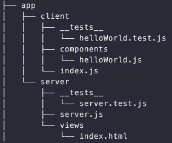
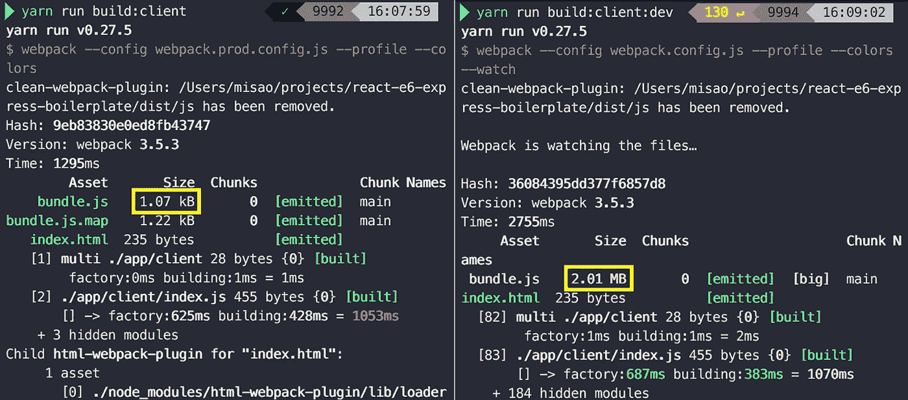

# 你好，世界，再一次

> 原文：<https://medium.com/hackernoon/hello-world-once-more-4d262286f138>

## React + Express with Docker 的终极样板

所以我创建了*又一个* [**样板**](https://github.com/MisaOgura/react-express-docker-boilerplate) 和**反应和表达**。

原因如下。

## 我们还需要另一个样板文件吗？

答案是肯定的！

让我们面对现实吧——从头开始建立一个 React 项目是一件痛苦的事情。

在[学习](https://hackernoon.com/tagged/learning) [反应](https://hackernoon.com/tagged/react)的同时，我遇到了这么多问题，仅仅是为了让一个 hello world 应用程序在浏览器上运行。试图编译和捆绑前端感觉像永远。Webpack 配置看起来神秘而令人生畏。如此多的巴别塔预置可供选择…然后这里是后端。我应该如何构建应用程序？我应该选择客户端渲染还是服务器端渲染？使用哪个测试转轮？分离开发和生产工作流的最佳方式是什么？

选择的丰富性是压倒性的。

尽管有大量的教程和样板文件，但其中很多都已经过时了。他们中很少有人解释这些决定背后的基本原理。是时候把我学到的东西付诸实践了，所以我们可以专注于学习和使用 React。

## 它有额外津贴

整个堆栈都兼容**ES6**。一个测试环境与 **Jest** 连接在一起。而且是 **Docker-ready** 。该存储库包含关于如何使用它的详细自述文件。

在这篇文章中，我将谈谈创建样板文件的想法。

## 应用程序结构

在考虑应用程序结构时，我特别强调了简单性和灵活性。

1.  我喜欢在顶层有一个单独的目录`app`来包含所有的源代码，然后这些源代码被分成`client`和`server`。
2.  我想让我的测试文件靠近被测试的东西，因为我不喜欢在心里沿着文件树上下移动到`import myModule from '../../../src/server/helper/myModule’`。因此，我为`client`和`server`分别放置了一个`__tests__`目录，而不是在顶层有一个单独的测试目录。
3.  默认情况下，应用程序使用**服务器端渲染**。因此，`index.html`文件位于`server`下的`view`目录中。如果您愿意，可以很容易地切换到客户端渲染。

## 无压力的工作流程

我非常喜欢快速反馈的无压力开发工作流程。

1.  开发模式带有**手表功能**。对客户端和服务器所做的更改会立即被检测到，应用程序会自动重新绑定/重新启动。
2.  使用 [**Jest**](https://facebook.github.io/jest/) 运行测试。它带有一些有用的特性，比如**并行测试**、**智能测试监视**(只重新运行受变更影响的测试)，以及覆盖报告。

## 易于部署

所以你在你的机器上创建了一个应用程序。但是*接下来的*是什么？这个问题经常被忽略。我想创造一些无需额外努力就可以部署的东西。

1.  除了开发的默认配置之外，我还创建了一个为生产优化的 Webpack 配置。生产模式下文件捆绑文件的大小为 1kB。这是开发模式中捆绑内容的 *0.0005%* 。随着应用程序的增长，最小化包的大小变得至关重要。

2.app 运行在 [**Docker**](https://www.docker.com/what-docker) 中，所以可以直接部署到另一台机器或者云服务器上，不用担心依赖兼容性问题。

## 代码风格

我将 [**标准**](https://standardjs.com/) 作为代码风格和 linter 引入，因为我几乎完全遵循这种风格。它有健壮的规则允许你使用分号。它倾向于使用单引号而不是双引号。我喜欢！代码看起来干净多了。

实施不需要配置，这是额外的好处。只需运行`$ npm/yarn run standard`来检查任何林挺错误。我进行了配置，所以它也运行在`$ npm/yarn test`的末尾。如果你不喜欢这种风格，就把它从脚本中删除。

## 最新包

最后，没有什么比找到一份好的样板文件，却发现软件包已经过时更令人沮丧的了。所以我尽力确保 npm 包是最新的。比如我用了 [**Webpack 版本 3**](https://webpack.js.org/configuration/) 结合 babel-preset-react 和 [**babel-preset-env**](https://babeljs.io/docs/plugins/preset-env/) ，替代 babel-preset-2015、2016、2017 和最新。

## 包裹

样板文件本质上是固执己见的。这并不意味着我认为没有更好的方法。关于你认为什么更好，为什么，我想了解不同的观点。所以请分享你的想法！我一如既往地感谢您的反馈。

我希望你喜欢使用样板文件。如果你喜欢，就开始吧，和你的伙伴们分享吧:)

谢谢，祝编码愉快！