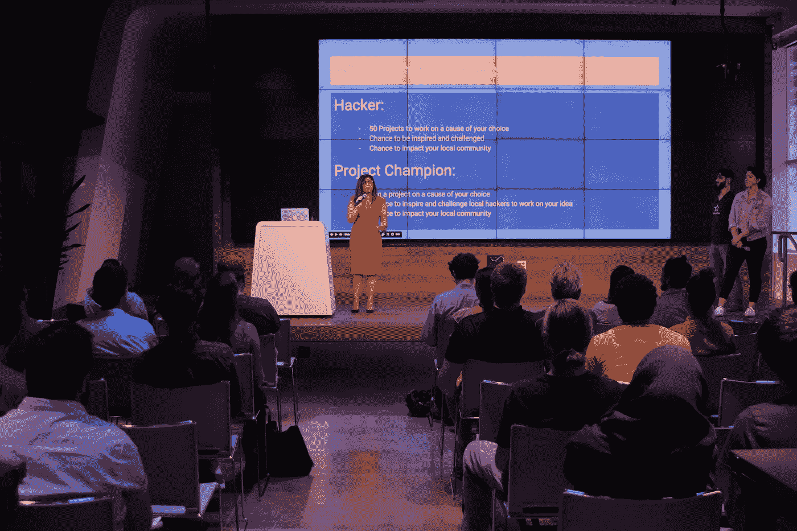
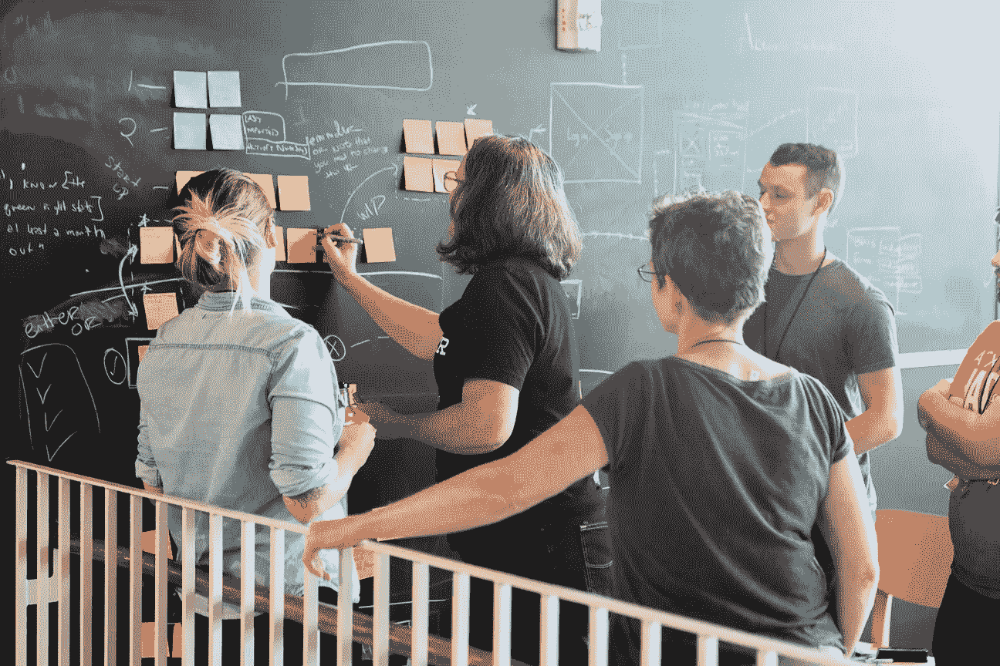
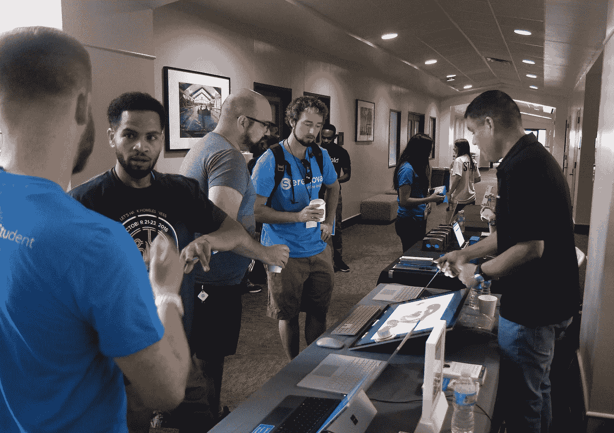
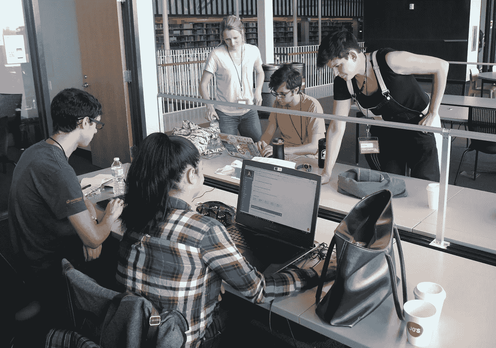

# 救命啊！我要去参加黑客马拉松！黑客入门指南

> 原文：<https://medium.com/hackernoon/help-im-going-to-a-hackathon-db269b2022c1>

你刚刚注册了一个黑客马拉松，或者一个朋友给了你一张票。现在怎么办？

首先，不要慌。我知道这可能很伤脑筋，但是让我们为你定义一些术语，并讨论为什么大多数人去，以及一般情况下会发生什么。

什么是黑客马拉松？

每个人都有自己对黑客马拉松的具体定义，但这是我的版本:黑客马拉松本质上是一场持续几小时到几周的设计冲刺。目标基本上是创新和创造有趣的问题解决方案。

Hackathon 101 Workshop | Photo Credit: Ben Carneiro

我指导公民黑客马拉松，这是一项小众活动，我们专注于解决具体的社区问题。还有更一般的企业和技术黑客马拉松，让参与者能够识别问题，并围绕特定的产品或商业想法提出解决方案。

**为什么要举办或参加黑客马拉松？**

不管你参加黑客马拉松的原因是什么，承认你不知道你在做什么，或者这是一个糟糕的第一次约会想法是很好的。大多数人去是因为他们喜欢“黑客”的刺激。他们喜欢挑战。

ATX Hack for Change 2016 | Photo Credit: ATX Hack for Change

对于公民黑客马拉松，我的目标是通过公民冠军(你的邻居约翰；你的老师，吉尔；基本上任何人)并被成员黑。

我的目标是让参与者能够发挥他们的想法，如何改善他们的当地环境，并重新设计它，使其变得更具包容性和功能性。大多数参与者参加是因为我们的事业对他们的生活有影响，或者因为他们希望成为有趣的社区游乐场的一部分。

**黑客马拉松会发生什么？**

这可能是显而易见的，但是每个事件都有完全不同的时间表。你真正需要的是你的技术和想法。我还建议提前通读这些挑战，看看是什么激起了你的兴趣。

黑客马拉松的第一部分通常是与其他黑客和潜在的公民冠军领袖交流的好机会。了解他们不同的项目，想办法结识更多对你的想法感兴趣的人。

ATX Hack for Change 2017 | Photo Credit: ATX Hack for Change Volunteer

除了最初的介绍之外，通常在开头附近有一个部分讨论不同的挑战。在一些活动中，比如我主持的公民黑客马拉松，实际上有一个项目冠军谈论他们不同的项目想法的地方。我倾向于让事情变得非常开放和无组织，以便黑客可以决定他们更喜欢做什么。

从这个意义上说，黑客本质上是利用你的技能来帮助团队解决问题。不管你有什么独特的技能，你都要作为一个团队来构建项目的不同方面。这可能是一个高度技术性的倡议，也可能只是一个战略上的头脑风暴，这取决于手头的问题。

ATX Hack for Change 2017 | Photo Credit: ATX Hack for Change Volunteers

我还需要知道什么？

休息一下，与导师或组织者联系以获得你可能需要的帮助，并与你的黑客伙伴一起玩得开心，这很重要。我可以充满信心地说，你会遇到很多有趣的人，他们有很多不同的技能，有些人对你的项目有同样的动力，或者对你的事业有同样的热情。享受和你的人类伙伴在一起的时刻，创造解决难题的方法。

这基本上就是你需要的所有介绍了。随波逐流，享受发生的互动。黑客马拉松是能量和创造力的巨大爆发，许多不同的人群聚集在同一个地方。它们是有趣的解决问题的温床，旨在推动社区内的对话和行动。

**快乐黑客！**

想要举办一场黑客马拉松或者了解更多，通过: [experimentalcivics.io](https://www.experimentalcivics.io/) 联系我，我们来聊聊。

ATX Hack for Change 2017 | Photo Credit: ATX Hack for Change Volunteers