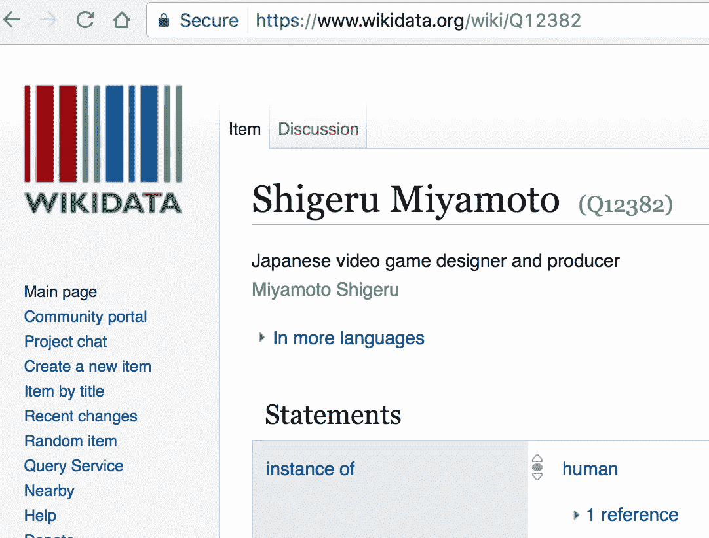
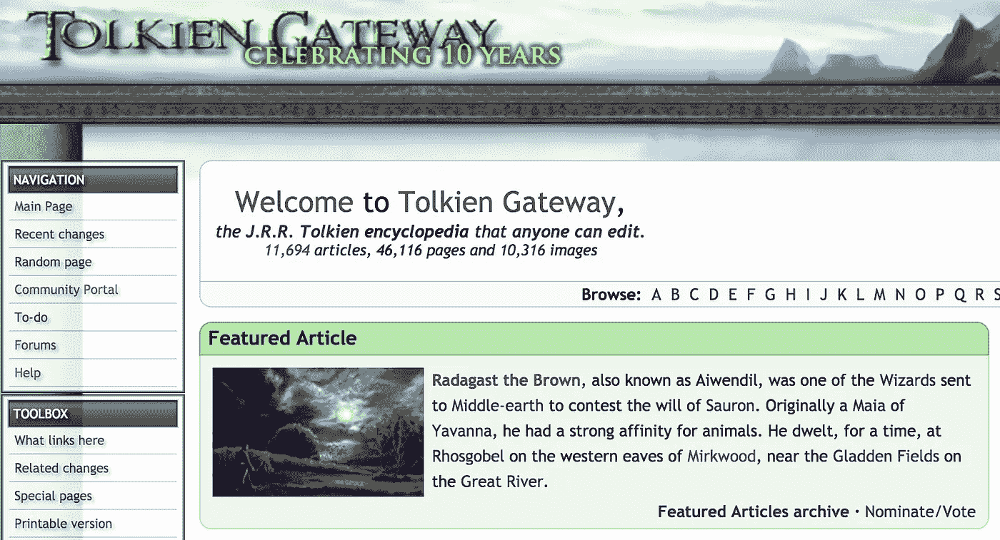
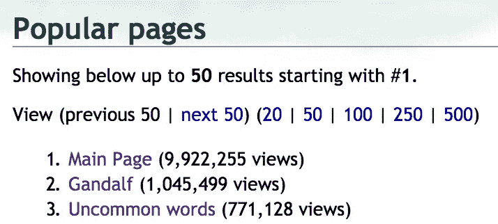
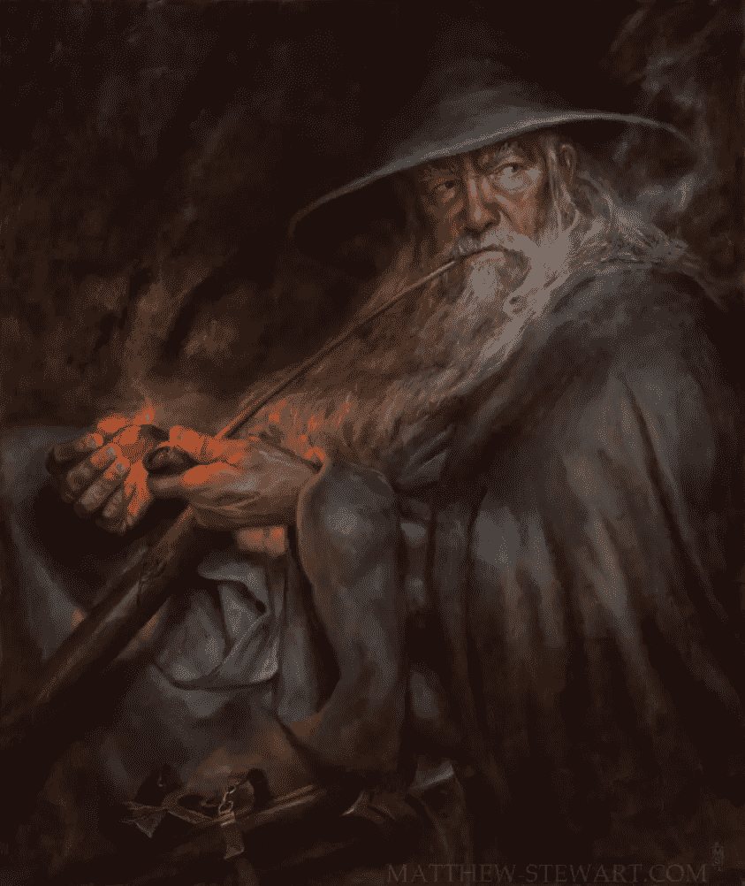
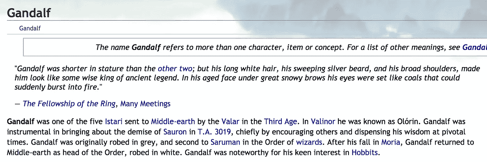
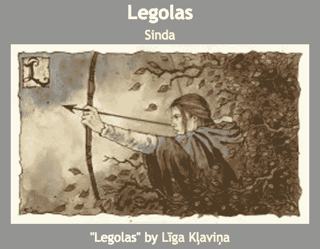
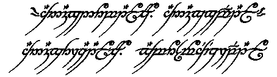
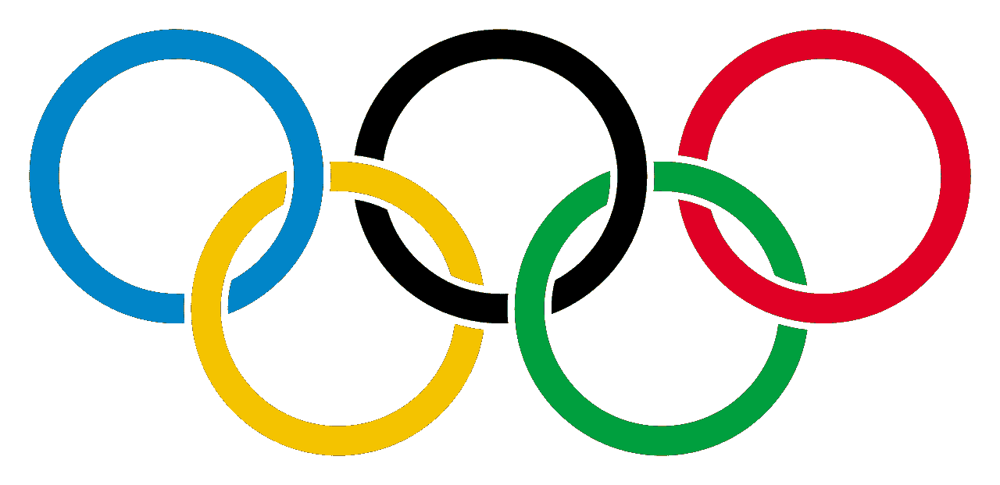
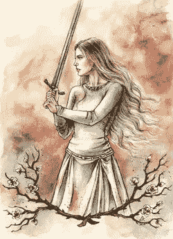

# 救命。我的电脑认为山姆卫斯·詹吉是个毒贩子

> 原文：<https://medium.com/hackernoon/help-my-computer-thinks-samwise-gamgee-is-a-drug-trafficker-59548cc6c16a>

我训练了一个“文档分类器”来猜测百科全书文章的事实，使用:

1.  [来自谷歌的新数据集](/@atroche/an-initial-exploration-of-wikireading-googles-huge-new-nlp-dataset-c17d859db9d0#.3s93nkcqf)，将 470 万篇维基百科文章与来自[维基百科](https://hackernoon.com/tagged/wikidata)的 1858 万条事实链接起来
2.  [脸书的快速文本分类工具 FastText](https://research.fb.com/projects/fasttext/)

然后我在最大的魔戒维基网站 Tolkien Gateway 的文章上搜索了一下，得到了令人惊讶的结果。让我们潜水吧！

首先，我所说的维基数据是什么意思？[维基百科](http://wikidata.org/)类似于维基百科，但是其知识结构使得[计算机](https://hackernoon.com/tagged/computers)能够很好地使用它。下面是一个示例:


You can think of facts as “triplets” of (item, property, value)

这里有一个更有争议的问题，显然需要参考:



几个月前，谷歌将维基百科和维基百科的数据整合到一个地方，并将其放入互联网上的一个庞大的 zip 文件中，并发布了一篇试图用它来猜测维基百科文章事实的论文。如果你有心情，你可以读到我对它的初步探索。

与此同时，脸书有一个叫做 FastText 的工具，它可以学习文档中的短语和关于该文档的事实之间的关联。


所以在上面的例子中，它可以注意到，关于宫本茂的文章使用“他”这个词比它使用“它”这个词要多得多，并且包含短语“出生”而不是“被建造”。所以，下次它看到一篇具有这些特征的文章时，它可能会猜测这篇文章是在谈论一个人，而不是一个保龄球馆。

(它也比许多其他方法更快地做到这一点，这对像我这样无法访问谷歌超级计算机的人来说很有用。)

一旦我在猜测维基百科上看不见的文章的事实方面取得了不错的结果，我决定在托尔金门户的文章上试试，这是我解决关于埃西铎的父亲是名叫[伊兰迪尔](http://tolkiengateway.net/wiki/Elendil)还是[埃伦迪尔](http://tolkiengateway.net/wiki/E%C3%A4rendil)的争论的首选资源。



Arguments plural.

人们似乎真的很喜欢甘道夫:



让我们从这里开始。

# 甘道夫



FastText 说关于甘道夫最可能的事实是什么？

```
instance_of===human
sex_or_gender===male
occupation===judge
country_of_citizenship===United_Kingdom
manner_of_death===natural_causes
convicted_of===murder
movement===Baroque
canonization_status===blessed
religion===Catholic_Church
conflict===World_War_II
position_played_on_team___speciality===defender
```

从表面上看，这些似乎有点傻。但是请记住:

*   托尔金是一个参加过世界大战的英国人，他是一个虔诚的天主教徒。也许甘道夫是下意识的[自我插入](https://en.wikipedia.org/wiki/Self-insertion)？
*   关于。圣徒甘道夫是托尔金·盖特威描述为“天使般的存在”的[之一](http://tolkiengateway.net/wiki/Ainur)
*   甘道夫完全[谋杀了巴洛克](http://tolkiengateway.net/wiki/Battle_of_the_Peak)
*   如果有人想找一个博士课题，“甘道夫当守门员，索隆当罗纳尔多:中土世界的后殖民主义”肯定是赢家。
*   巴洛克，嗯？你知道《魔戒》部分是基于一部歌剧吗？

# 莱戈拉斯



Rare holiday snap of Orlando Bloom

```
sex_or_gender===male
instance_of===human
instance_of===mythical_character
country_of_citizenship===Ancient_Rome
manner_of_death===capital_punishment
period===Roman_Republic
occupation===military
position_held===Ancient_Roman_senator
canonization_status===saint
religion===Islam
instance_of===Eunuch
```

我们走吧:

*   勒苟拉斯是 **2931** 岁(*有争议，见* [*此处*](http://tolkiengateway.net/wiki/Legolas/Disputes#Age) )。罗马元老院最初成立于 2771 年前。巧合吗？
*   他没有孩子，有一副好嗓子。他是太监吗？你告诉我。
*   对于读者来说，伊斯兰问题是一个极其困难的问题。

# 夏尔


Describe by Tolkien as [“more or less a Warwickshire village of about the period of [Queen Victoria’s] Diamond Jubilee” in 1897”](http://www.bbc.com/news/uk-england-29787528)

```
country===United_Kingdom
instance_of===former_country
heritage_status===scheduled_monument
from_fictional_universe===Tolkien_s_legendarium
described_by_source===Nordisk_familjebok
located_in_time_zone===UTC______
IUCN_conservation_status===vulnerable
```

*   如果你接受中土世界只是我们很久以前的世界的理论，那么夏尔肯定是英国境内的一个前国家
*   夏尔是自然美、和平与和谐的堡垒，被贪婪的人包围着。如果没有明星球员甘道夫(以及几十年后的阿拉贡国王)的保护，它早就被亵渎了。它绝对值得保护。

# 至尊魔戒



The next target for Google Translate

```
conflict===World_War_II
military_branch===British_Army
described_by_source===Dictionary_of_National_Biography
country_of_citizenship===United_Kingdom
sport===association_football
position_played_on_team___speciality===midfielder
manner_of_death===natural_causes
participant_of===_____Summer_Olympics
```

虽然魔戒显然是中土世界最重要的冲突的参与者，但他站在甘道夫等人的对立面。但我们真的能责怪我新生的人工智能被愚弄吗？就连德内瑟的儿子博罗米尔最后也搞不清到底是哪边的。

人们对五环在夏季奥运会上的表现知之甚少，只知道它让五个奥运五环都服从了自己的意志。



# 萨姆（男子名）


Cropped from a Gondor’s most wanted poster

```
sex_or_gender===male
instance_of===fictional_character
instance_of===human
country_of_origin===United_States_of_America
from_fictional_universe===Marvel_Universe
occupation===drug_trafficker
convicted_of===murder
manner_of_death===natural_causes
member_of_political_party===Democratic_Party
```

我觉得很有趣的是，山姆是整个传说中唯一被贴上美国标签的人之一(欧文是另一个)。请告诉我你的理论。

至于毒贩的事情:

*   戒指超级上瘾。还记得比尔博在瑞文戴尔再次见到它时的表情吗？
*   山姆帮助它以危险的方式跨越国际边界
*   他是一个园丁，有广泛的草药知识，喜欢南方最好的杂草

# 埃维恩



```
instance_of===human
instance_of===fictional_character
sex_or_gender===female
from_fictional_universe===Marvel_Universe
country_of_citizenship===United_States_of_America
occupation===sovereign
occupation===lady_in_waiting
member_of_political_party===Republican_Party
```

*   我的王国献给任何能提出令人信服的理论的人，解释为什么欧文是共和党人，而萨姆是民主党人，以及为什么他们是仅有的两个美国变种人。

# 吉姆利

```
instance_of===human
sex_or_gender===male
country_of_citizenship===Japan
occupation===Australian_rules_footballer
cause_of_death===heart_attack
instance_of===mutant
native_language===French
```

我放弃了。

# 结论

需要进一步研究。

*(如果你想尝试复制我的结果，请告诉我，我会为你把 FastText 模型放到 torrent 中。)*

[](http://bit.ly/HackernoonFB)[](https://goo.gl/k7XYbx)[](https://goo.gl/4ofytp)

> [黑客中午](http://bit.ly/Hackernoon)是黑客如何开始他们的下午。我们是 [@AMI](http://bit.ly/atAMIatAMI) 家庭的一员。我们现在[接受投稿](http://bit.ly/hackernoonsubmission)并乐意[讨论广告&赞助](mailto:partners@amipublications.com)机会。
> 
> 如果你喜欢这个故事，我们推荐你阅读我们的[最新科技故事](http://bit.ly/hackernoonlatestt)和[趋势科技故事](https://hackernoon.com/trending)。直到下一次，不要把世界的现实想当然！

