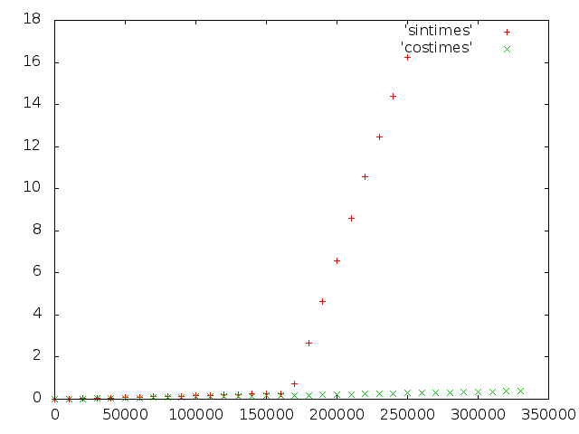
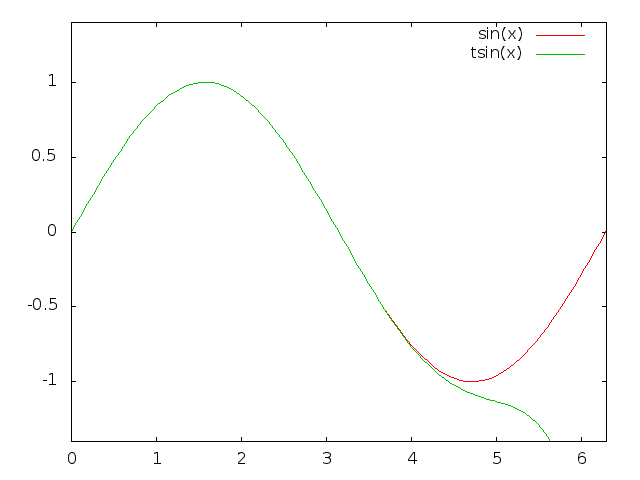

# 救命，我的 sin()慢，FPU 不准！

> 原文：<https://medium.com/hackernoon/help-my-sin-is-slow-and-my-fpu-is-inaccurate-a2c751106102>

几年前我开始写代码做一个生物系统的模拟，写了 20 行就卡住了。我的测试代码试图完成一百万个时间步骤，但基本上什么都没做，而且只花了一分钟。然而，如果我把它减少到只有 100，000 个时间步，它就会向前移动。



Number of steps versus running time for sin() and cos()

所以我检查了一些常见的事情——是不是有一个 [CPU](https://hackernoon.com/tagged/cpu) 频率缩放问题，是不是我的 CPU 过热了，等等，但是都不是这样。然后，我将对 sin()的调用改为对 cos()的调用..一切又变得很快。

经过一些进一步的测试，我还发现将 M_PI 改为 3.141 也可以使速度再次加快。把我弄糊涂了！

所以，我深入研究了汇编输出，在那里我发现当我把 M_PI 或 sin()改为 cos()时，我的代码并没有真正发生变化。我注意到的是，实际调用了 C 库中的一个 sin()函数。

在网上搜索发现了各种关于 sin()和 cos()的错误报告，它们有时既不准确又很慢。这让我震惊。20 世纪 80 年代末，我第一次接触到带有浮点运算单元的计算机。在过去的三十年里，我一直(正确地)假设一个 [FPU](https://hackernoon.com/tagged/fpu) 会附带一个专用的 SINCOS 指令。我还假设(不正确！)既然它是 CPU 自带的，那么它将会是正确的&快，人们将会使用它！

事实证明，FPU 提供的既不正确，也不快速。事实上，似乎没有人使用 FPU 的三角学指令。那么是什么原因呢？

# 范围缩小

射程的缩小。使用简单的近似公式，例如[泰勒级数](http://en.wikipedia.org/wiki/Taylor_series)，完全有可能非常快速地计算出小 x 的 sin(x)。也可以使用表格，对于硬件来说，有一种合适的算法称为 [CORDIC](http://en.wikipedia.org/wiki/CORDIC) (用于坐标旋转数字计算机)。

虽然这种近似只适用于小输入，但由于 sin()和 cos()是周期性的，因此完全有可能将大输入角映射到小输入角。



Actual sin(x) versus 11th order Taylor series, tsin(x)

假设我们试图计算 sin(1 + 600π)，我们可以将其映射为试图计算 sin(1)，答案将是相同的。

要做到这一点，计算机程序必须采用提供的输入值，并去掉足够多的π的偶数倍，以使结果值足够小，从而使我们的近似足够精确。

困难就在这里。如果我们的输入可以是通过双精度浮点数可获得的所有值，那么天真地执行这种范围缩小需要知道π达到惊人的精度，**这是浮点硬件本身无法达到的精度**！

很容易看出这是如何工作的——即使π值的微小误差累加起来，在我们的 sin(1 + 600π)示例中，1/1000 的误差仍会导致 0.6！

当然，CPU 可以做得比 1/1000 的错误更好，但它仍然无法将(比如说)10^22 降低到正确的值。要在实践中看到这一点，sin(9*10^18 的正确值是-0.48200764357448050434，但如果我们问我的英特尔 FPU，它返回-0.47182360331267464426，相差超过 2%。值得称赞的是，如果我们要求 FPU 计算更大数字的正弦，它会拒绝。

因此..这解释了为什么编程语言不能依靠 FPU 来计算正确的值。但是它仍然没有解释高级语言如何解决这个问题。

# 追溯到 1982 年

众所周知，缩小范围的问题非常困难，以至于程序员被敦促不要试图计算非常大的角度的正弦值！“你做范围缩小”。然而，这是淡酱，使生活变得不必要的艰难。例如，如果对系统对 f Hz 正弦波输入的响应进行建模，则通常需要长时间计算 F(x) = sin(2π * f * t)。如果我们只能用精心选择的时间步长或频率来运行模拟，以便我们能够轻松地将我们的范围调整回个位数，那将是非常不方便的。

然后，在多年来告诉程序员要清理他们的行为之后，突然两个独立的小组取得了突破。数字设备公司的玛丽·h·佩恩(Mary H. Payne)和罗伯特·n·哈内克(Robert N. Hanek)发表了开创性的论文《三角函数的弧度简化》， [paywalled 至今](http://dl.acm.org/citation.cfm?id=1057602)。与此同时，加州大学伯克利分校的鲍勃·科比特没有写论文，但是[在 BSD 中独立实现了](http://ftp.netbsd.org/pub/NetBSD/NetBSD-current/src/lib/libm/arch/vax/n_sincos.S)相同的技术。

我很想解释它是如何工作的，但我不能解释让我很痛苦。虽然它非常聪明！很明显，我们不得不感谢佩恩、哈内克和科比特发明了“无限精度范围缩减”！它似乎被普遍使用，而且令人震惊的是，在 1982 年之前，在现有的硬件上很难对非常大的数字进行三角运算！

# 那么为什么我的原始代码这么慢呢？

我们现在知道，计算机使用实际代码来计算 sin(x)，而不是将其留给专用的 FPU 指令。但为什么快到 17 万步呢？事实证明，在我的 C 库中找到的 sin(x)包含计算正确答案的各种策略，并且它确实使用了 Payne-Hanek-Corbett 技术，正如 IBM 在其精确数学库中实现的那样。

如果一切顺利，就会使用一些非常快速的代码。但是如果这个库检测到它不能保证所需精度的情况，它会返回到一个名为“slow()”的函数。他们名副其实。这应该是罕见的，为什么会发生在我身上呢？

即测试代码:

```
int main(int argc, char **argv)
{
 double t;
 double stepsizeMS=0.1;
 double Hz=1000;
 double val=0;
 unsigned int limit = argc > 1 ? atoi(argv[1]) : 200000; for(unsigned int steps = 0; steps < limit; ++steps) {
    t = steps * stepsizeMS;
    val = sin(2.0*M_PI*Hz*t);
    printf(“%f %f\n”, t, val);
 }
}
```

看看你是否能发现它。我没有，但最优秀的尼古拉斯·米尔做到了。这段代码有效地计算了π 的整数倍**的正弦值，因为 Hz*stepsizeMS 等于 100.0000，而 steps 是一个整数。显然，在大约 100，000 步之后，这将触发 glibc libm 实现返回到“slow()”函数之一。**

这也解释了为什么通过将 sin()改为 cos()，或者我只从 M_PI 中去掉一点点精度，问题就消失了——我们不再总是走在慢路上。

现在，我并不高兴 system C 库表现出如此缓慢的速度(其他人已经注意到了这一点，参见参考文献 2)，但在这种情况下，我的模拟在任何情况下都是无用的——无论如何，我只会施加 0 的力，而永远不会实现任何东西！

事实证明，确实有一些库提供了卓越的性能，比如:

*   [英特尔 MKL](http://software.intel.com/en-us/intel-mkl/) (不免费，既不是啤酒，也不是演讲)
*   [AMD ACML](http://developer.amd.com/tools-and-sdks/cpu-development/amd-core-math-library-acml/) (免费，但无源码，CPU 支持有限)
*   [简单的 SSE 和 SSE2(以及现在的 NEON)优化了 sin、cos、log 和 exp](http://gruntthepeon.free.fr/ssemath/) (zlib 许可，非常快，但不缩小范围)

# 总结

计算(co)正弦是“手动”完成的，可能会根据您的输入以不同的速度进行。你的 FPU 的输出可能是错误的，许多 FPU 拒绝处理非常大的输入。如果您确实需要高性能，可能需要比标准系统库更好的库。

# 参考

1.  巨大论点的论点简化:好到最后一点作者:吴国昌和 SunPro 的 FP 小组成员—[http://www.validlab.com/arg.txt](http://www.validlab.com/arg.txt)
2.  glibc libm 的状态(dire)——[http://gcc.gnu.org/ml/gcc/2012-02/msg00469.html](http://gcc.gnu.org/ml/gcc/2012-02/msg00469.html)
3.  英特尔夸大了 FPU 的准确性—[http://notabs.org/fpuaccuracy/](http://notabs.org/fpuaccuracy/)
4.  一种新的距离缩减算法——http://www.imada.sdu.dk/~kornerup/papers/RR2.pdf

[](http://bit.ly/HackernoonFB)[](https://goo.gl/k7XYbx)[](https://goo.gl/4ofytp)

> [黑客中午](http://bit.ly/Hackernoon)是黑客如何开始他们的下午。我们是 [@AMI](http://bit.ly/atAMIatAMI) 家庭的一员。我们现在[接受投稿](http://bit.ly/hackernoonsubmission)并乐意[讨论广告&赞助](mailto:partners@amipublications.com)机会。
> 
> 如果你喜欢这个故事，我们推荐你阅读我们的[最新科技故事](http://bit.ly/hackernoonlatestt)和[趋势科技故事](https://hackernoon.com/trending)。直到下一次，不要把世界的现实想当然！

