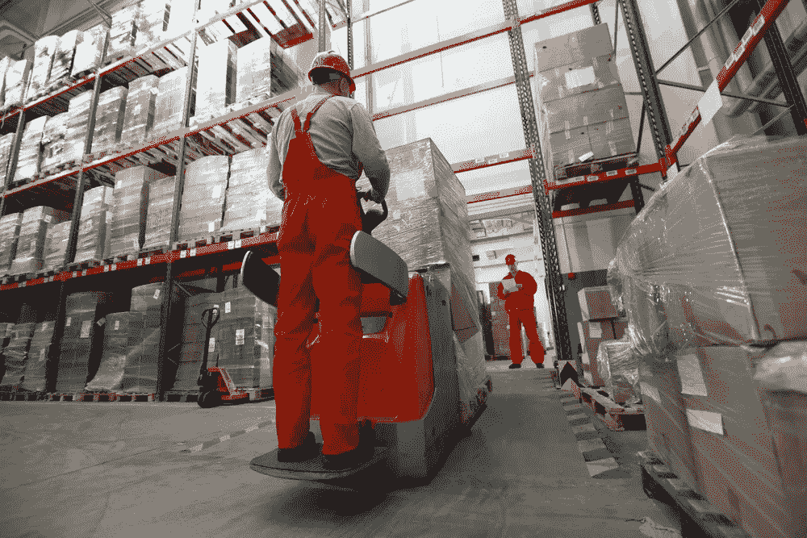

# 以下是区块链和物联网将如何影响医药冷链

> 原文：<https://medium.com/hackernoon/heres-how-blockchain-and-iot-are-going-to-impact-the-pharmaceutical-cold-chain-4ed923e83b6a>

术语“冷链”或温控物流是指对温度敏感的供应链，也就是说，在供应链中，运输的产品必须保持在特定的温度范围内。并且该温度需要被监控。

例如，[沃尔玛和一些食品公司最近与 IBM](http://fortune.com/2017/08/22/walmart-blockchain-ibm-food-nestle-unilever-tyson-dole/) 合作，使用[区块链](https://hackernoon.com/tagged/blockchain)技术来解决他们易腐供应链面临的一些挑战。作为消费者，我们容易忘记的是，我们在商店购买的肉类和其他易腐食品必须经过严格的过程，才能在全国范围内供应而不变质。尽管我们不愿意去想它，但事实是食源性疾病和腐败在易腐食品领域非常普遍。

这个食品公司联盟希望与区块链合作，提高他们监控肉类和农产品温度条件的能力，以确保质量控制。虽然这不一定是我们在[冷链项目方面的主要关注点，但它显然与](http://chronicled.com/)[我们在制药领域面临的挑战](https://www.chronicled.com/temperature-logger.html)相似。在制药行业，需要密切监控药物的保存温度，而需要密切监控的药物的价值和数量在未来五年内只会增加。

> 当这种情况发生时，由于温度管理不当，价值数百万的货物可能会丢失，或者更糟糕的是，患者的安全可能会受到威胁。

当药品在供应商和经销商之间运输时，必须将温度控制在许可的范围内。如果在运输过程中，温度超出这些范围，药物的质量就会受到影响。当这种情况发生时，价值数百万的货物可能会被延迟甚至丢失，因为短途旅行正在被调查。这可能导致供应中断、对客户的负面影响以及对患者安全和结果的担忧，尤其是在个性化药物和有限供应的情况下。

这些都是区块链技术可以解决的非常明确的问题，也是我们关注的重点。

**解决方案**

制药行业监控冷链的当前市场标准是 Sensitech 的 TempTale。该产品比智能手机略小(可以像路由器一样大)，他们通常使用 USB 连接来下载货物的数据。然后，它被附在一个托盘或箱子上，通过整个供应链发送。记录器也会占用宝贵的有效载荷空间。一旦货物到达目的地，仓库中的一个人负责将所有模板记录器从箱子中取出，插入计算机，下载数据，然后生成报告以供审查并发送回公司。

这可能是一个极其繁琐的过程。

为了简化这一过程，我们专门开发的产品之一是 NFC 温度记录器(这意味着近场通信)和 BLE 温度记录器，它使用蓝牙和手机来配置温度参数并读取相关数据。这些伐木机是信用卡大小，不会取代宝贵的制药有效载荷。

**工作原理**

不用用电脑下载数据，你只需用智能手机点击一下，就能立即获得所有信息——以及下载数据者的签名，然后该事件被记录并注册到区块链。

有了这项技术，就有了完整的数据记录，因此记录器是一个加密的微芯片，而不仅仅是一个物联网设备。

还有一些额外的好处:能源部温度记录器可以利用蓝牙下载所有设备的数据一次。例如，当一批包裹到达仓库时，门口可能会有一个路由器或触发器，它会知道所有其他传感器何时在范围内，然后自动下载数据。BLE 温度记录器可以留在盒子里，所有数据可以同时上传到区块链，而不是由人从每个托盘上取下记录器，打开盒子，然后下载所有数据。

**大转变**

虽然这些创新确实令人兴奋(我们很高兴能站在这一切的最前沿)，但正在发生的大转变是从硬件到软件的转变。

目前，制药业是一个非常相似的领域。它充满了硬件公司，这些公司采用模拟方法解决问题，创造出带有 led 显示屏的大型盒式记录器，可以捕捉和读取数据。这项技术多年来一直没有重大突破，随着对安全数据的需求越来越迫切，该行业已经做好了变革的准备。

作为一家软件公司，这是我们第一次既创新硬件来生产更小更有效的组件，又创造软件解决方案来打开新的机会之门。

把传感器放在产品上，让硬件更小、更快、更有效是一回事。但我们最兴奋的是自动收集所有数据，分析这些数据，然后根据这些信息做出决策的前景。

## 让我们看一个例子:

今天的制药领域的一个很好的例子是复杂的药物运输路线，由于多次移交、连接点的意外延迟、培训不足、海关障碍等原因，物流风险可能很高。这既是挑战一直存在的地方，也是一个非常明显的机会正在出现的地方。温控药品供应链中温度和其他数据的可靠性和安全性不仅是一个目标，也是患者安全的必要条件。

假设两家制药公司运输相同的药物，但流程略有不同。公司 A 说，如果一种药物的运输容器温度下降到一定温度以下，它需要被送回工厂进行质量测试。然而，B 公司有一个协议，规定如果药物只是“超出温度范围”五分钟，它仍然是没问题的，应该被送到供应链的下一步。

有了区块链技术，您可以在整个过程中自动完成这些过程，因此当药物接近“超出界限”的温度区时，会有触发器提醒人员。如果触发器设置在送货卡车内，你可以设置后面的空调单元立即打开，或者你至少可以提醒司机停下来解决这种情况。

这些听起来像是简单的解决办法，事实也的确如此，但在大型制药公司的大计划中，这些微小的调整最终会产生持久的影响。这些从一个仓库运送到另一个仓库的药物需要保持在一定的温度范围内，否则会被认为是温度漂移，从而破坏药物。

因此，区块链技术不仅可以帮助验证这些货物的来源并确认其真实性，还可以帮助将这些产品从一个目的地高效地运送到下一个目的地。

最后，由于所有这些流程和检查点都在区块链上被跟踪，因此可以筛选大量数据来做出更好的业务决策，并找出流程中有问题的部分。

今天[让我们开始一场讨论](http://airmail.calendar/2017-10-14%2012:00:00%20GMT)打破你目前的做法，创建一个安全可靠的冷链。