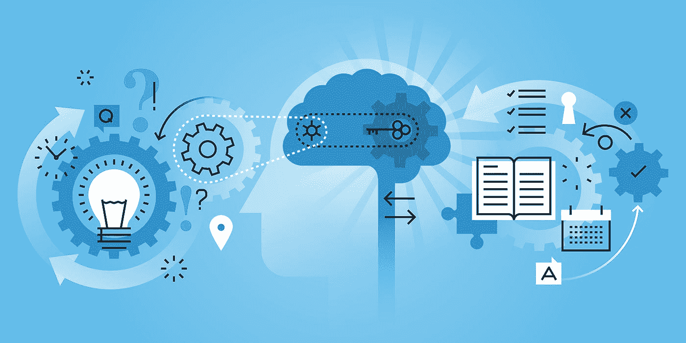

# 以下是物联网、区块链和机器学习如何合作，认真创新供应链管理

> 原文：<https://medium.com/hackernoon/heres-how-iot-blockchain-and-machine-learning-are-working-together-to-seriously-innovate-supply-e11ae76f9e8f>

每一代人的成长都伴随着定义它的技术。对于千禧一代来说，互联网已经从我们小时候模糊知道的东西变成了我们日常生活中必不可少的一部分。

新技术的采用是慢慢开始的。那些关注此事的人开始谈论它的潜在破坏性。接下来是最初的实现。普通大众开始注意到这些好处，然后随着采用的急剧增加，变化迅速发生。

突然间，它融入了我们所做的一切。

# **区块链是我们的下一个突破口**

[区块链](https://hackernoon.com/tagged/blockchain)是将改变和改善许多行业，特别是供应链领域的定义性技术之一。它将进入快速实施的阶段。就在我们说话的时候，它已经发生了，其影响是巨大的。

但是为什么供应链首先需要改进呢？区块链可以解决我们当前供应链中的三个主要问题。

# **1。数据可见性**

我们的第一个主要问题是数据可见性。你可能听说过大数据以及收集和分析产品供应链产生的大量数据的好处。但是现在，这些数据被孤立在私有云数据库中。当数据被分段时，拥有它的好处就减少了。但是区块链将数据存储在单一的联邦数据表上。

以空气质量监测器为例。这些环境数据传感器跟踪特定区域的空气质量，我们在世界各地都使用它们。目前，来自这些传感器的数据被政府和其他组织分割、控制甚至操纵。将这些数据放到区块链上，将为我们呈现一幅完整而透明的全球空气质量图，而不仅仅是不同地区的快照。

# **2。流程优化**

构成我们当前供应链的流程并没有达到应有的效率。解决方案在于区块链及其运用智能合约的能力。智能合约本质上是以一种安全的方式自动化现有流程。它们允许您编写一组条件规则— *如果满足*条件，*则*付款被释放。但不仅仅是付款。它可以是促进更快、更高效供应链的任何后续步骤。而且合同是公开记录的，不能篡改，所以比第三方调解员靠谱多了。区块链将允许我们跳过那些第三方，并优化供应链中的流程，以充分发挥其潜力。

# **3。需求管理**

我们需要解决的第三个问题是需求管理。这又与数据可见性有关。当我们的数据被分割时，我们无法利用大数据和机器[学习](https://hackernoon.com/tagged/learning)的真正力量。相反，我们最终会做出预测并编写算法，以一种被动的方式来决定需求。我们使用过去的数据和假设来计算需求，这是没有效率的。

每家公司都是靠自己做到这一点的，只使用了一小部分可用数据，因为这是他们所能看到的全部。区块链的单一联邦数据表不仅仅存储数据，它还允许公司在其基础上进行分析和优化需求管理。它消除了需求管理中的猜测，因此公司可以生产客户需要的准确数量的产品。

您可能已经注意到，区块链技术有可能同时解决我们三个主要的供应链问题。当这一切最终发生时，我们将会看到供应链中的一次重大范式转变。

# **需求链**

事实上，我们可以从供应链转移到麻省理工学院数字货币项目高级顾问迈克尔·凯西所说的*需求链*。需求链是一个客户驱动的模型，具有快速周转、较低成本和较高的效率。在这种模式下，生产商对顾客的需求做出反应，产品由众多供应商共同生产。

> 这一转变将对我们的世界产生巨大影响。

我们可能很快就会看到大规模的循环经济，材料在当地采购，产品在当地的中心生产和回收。这意味着真正零浪费的生产潜力。机器学习将能够根据位置、可用性和可用于生产的材料来确定对特定产品或零件的需求。本质上，我们可以创建一个完全全球化、去中心化的生产平台，一个基于跟踪行为和需求的机器学习算法进行优化的平台。

我知道，这听起来很超前，也有点乐观。但真的不是。我们已经开始将区块链技术应用到我们的供应链中，并且大规模采用的速度比你想象的要快。