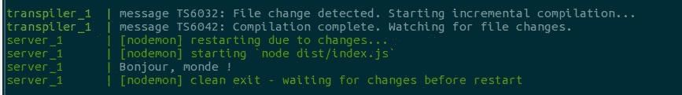
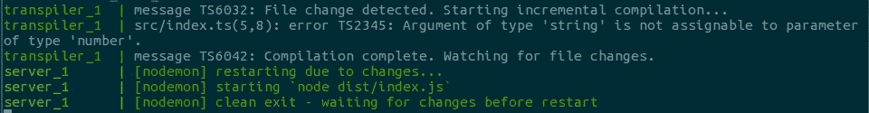

# 下面是我编写一段类型脚本代码的最小设置

> 原文：<https://medium.com/hackernoon/heres-my-minimal-setup-to-write-a-piece-of-typescript-code-510cd6cb1861>

写 10 行[的打字稿](https://hackernoon.com/tagged/typescript)应该不需要高深的 devOps 知识。这里有一个最小的构建来编写和调试任何一段类型脚本代码，而不需要了解 gulp 或 webpack。

别误会，webpack 很牛逼。但有时我只想写 10 行代码，让它尽可能快地运行。有些人能熟练使用 gulp 或 webpack，几秒钟内就能完成安装。我不是，所以这是我经常想到的最小“构建”。

## 我们想要什么？

*   让我们编写并运行一小段代码。现在我已经习惯了 typescript，写普通的 js 简直让我害怕。因此我想写一段并运行一小段*类型脚本*代码。
*   即使是 10 分钟的项目，*保存- >编译- >运行*也只是一个繁琐的工作流程。我们至少应该实现自动化。
*   在电脑上安装东西很无聊。我已经安装了 docker。这足以让一切正常运转。

## 我们什么时候想要它？

很明显，不到一分钟的时间就可以设置好一些有用的东西。

## 设置

*整个【项目】* [*可以在 github*](https://github.com/aherve/docker-nodemon) 上找到

不得不说我喜欢 nodemon。在我看来，它提供了有史以来最简单的工作流程:观察某个东西，如果它在移动，就运行某个东西。我倾向于记住的事情。

首先，让我们构建一个 docker 映像，在其中安装 typescript 和 nodemon:

我基本上采用一个节点映像，并在其上安装 nodemon 和 typescript。然后它会安装您的`package.json`依赖项，如果您有一些的话。这里我们用纱，因为我们完全属于酷小孩。

我们需要的第二件也是最后一件事是自动化`save -> compile -> run`工作流。这就是 docker-compose 派上用场的地方:

如您所见，我们使用了 3 个容器:

*   数据负责文件的逻辑。我们告诉它与容器共享我们自己的 src 目录，并拥有自己的`dist`和`node_modules`目录。其他容器将共享卷，因此它们共享相同的`src, dist`和`node_modules`目录。
*   transpiler 将监视`src`目录(其中的*。ts 文件 live)，并将类型脚本代码转换到`dist`
*   服务器将使用 nodemon 来监视`dist`目录，并在`index.js`发生变化时运行`index.js`。

这将顺利工作，无论你是写一个服务器，还是一个简单的脚本启动后退出。

现在，一个简单的`docker-compose up`命令将运行服务器，我们已经准备好开始我们令人敬畏的`ts`脚本了。在更改了 typescript 文件后，会发生以下情况:

About exactly what we would expect: the script is transpiled, then launched

不用说，如果我们写一些虚构的东西，比如

然后，我们的控制台输出一个奇特的错误，正如所料:

希望你喜欢！

[*喜欢就下载项目*](https://github.com/aherve/docker-nodemon)

> [黑客中午](http://bit.ly/Hackernoon)是黑客如何开始他们的下午。我们是这个家庭的一员。我们现在[接受投稿](http://bit.ly/hackernoonsubmission)并乐意[讨论广告&赞助](mailto:partners@amipublications.com)机会。
> 
> 如果你喜欢这个故事，我们推荐你阅读我们的[最新科技故事](http://bit.ly/hackernoonlatestt)和[趋势科技故事](https://hackernoon.com/trending)。直到下一次，不要把世界的现实想当然！

